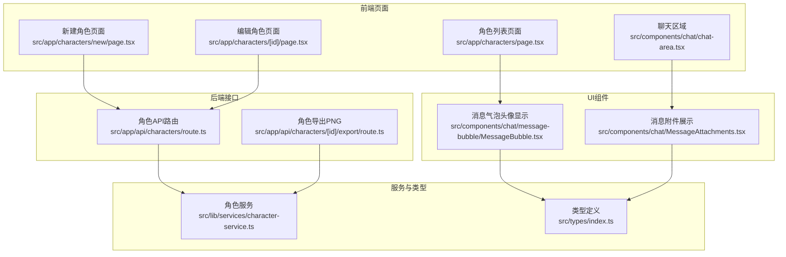
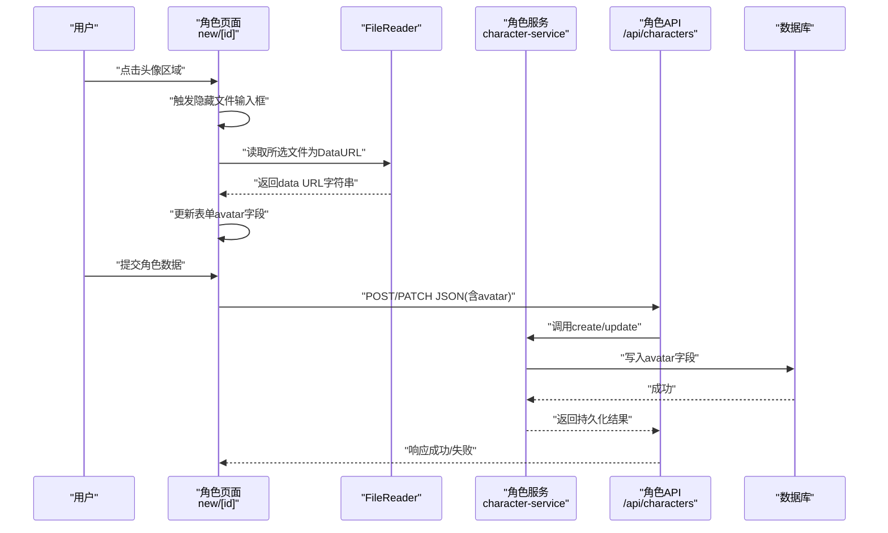
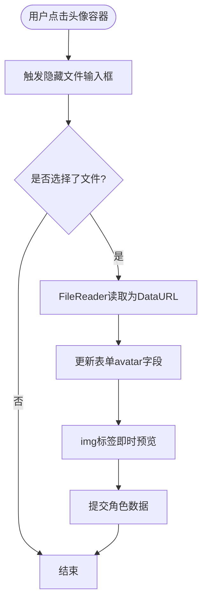
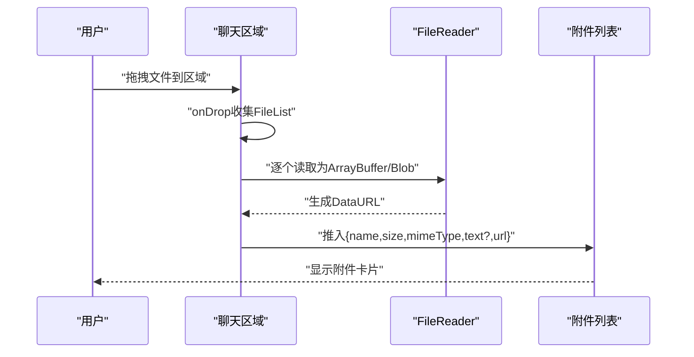
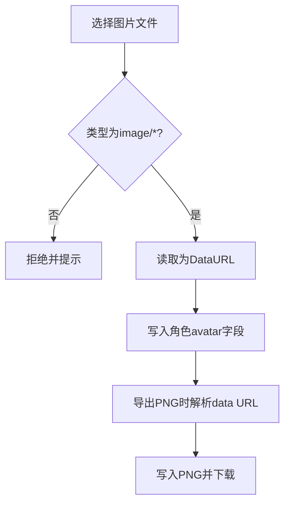
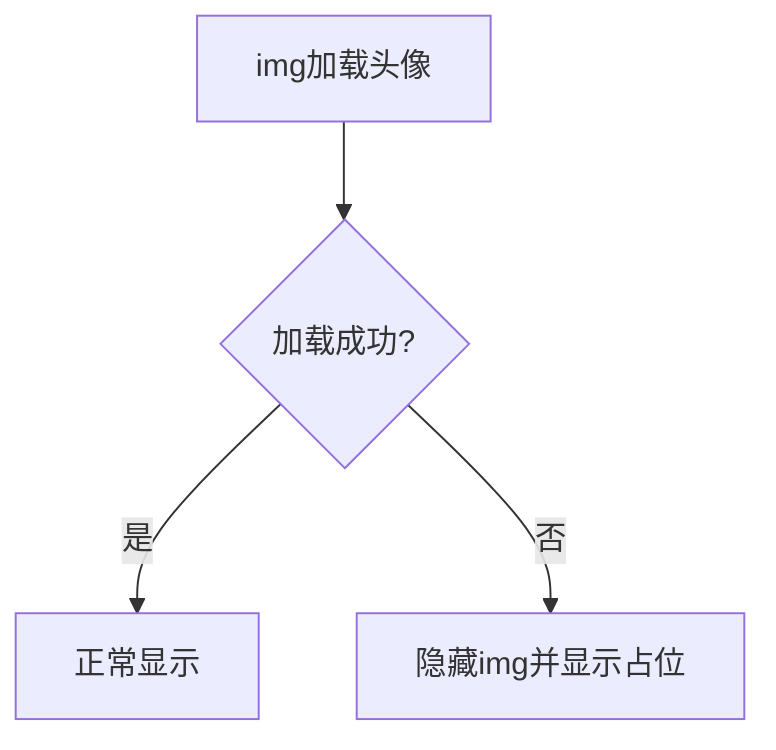
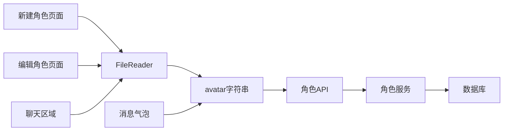

# 角色头像上传

<cite>
**本文档引用的文件**
- [src/app/characters/new/page.tsx](file://src/app/characters/new/page.tsx)
- [src/app/characters/[id]/page.tsx](file://src/app/characters/[id]/page.tsx)
- [src/app/characters/page.tsx](file://src/app/characters/page.tsx)
- [src/app/api/characters/route.ts](file://src/app/api/characters/route.ts)
- [src/app/api/characters/[id]/export/route.ts](file://src/app/api/characters/[id]/export/route.ts)
- [src/lib/services/character-service.ts](file://src/lib/services/character-service.ts)
- [src/components/chat/message-bubble/MessageBubble.tsx](file://src/components/chat/message-bubble/MessageBubble.tsx)
- [src/components/chat/chat-area.tsx](file://src/components/chat/chat-area.tsx)
- [src/components/chat/MessageAttachments.tsx](file://src/components/chat/MessageAttachments.tsx)
- [src/types/index.ts](file://src/types/index.ts)
</cite>

## 目录
1. [简介](#简介)
2. [项目结构](#项目结构)
3. [核心组件](#核心组件)
4. [架构总览](#架构总览)
5. [详细组件分析](#详细组件分析)
6. [依赖关系分析](#依赖关系分析)
7. [性能考虑](#性能考虑)
8. [故障排除指南](#故障排除指南)
9. [结论](#结论)
10. [附录](#附录)

## 简介
本文件围绕角色头像上传功能进行系统性说明，涵盖用户界面设计、拖拽上传与文件选择机制、图片文件处理流程（类型验证、尺寸限制、格式转换）、Base64 编码存储方案、内存管理与性能优化策略、头像预览显示、上传进度指示与错误处理机制，并提供文件大小限制、安全检查与最佳实践建议。

## 项目结构
角色头像上传涉及以下关键模块：
- 前端页面：新建角色与编辑角色页面负责触发文件选择与预览渲染
- 文件拖拽：聊天区域支持拖拽上传，复用统一的数据URL生成流程
- 后端接口：角色 API 负责接收与持久化头像数据
- 服务层：角色服务负责数据校验与入库
- 类型定义：统一的头像字段类型与数据结构
- 头像显示：消息气泡组件兼容 data URL 与后端代理路径

**图表来源**
- [src/app/characters/new/page.tsx:94-111](file://src/app/characters/new/page.tsx#L94-L111)
- [src/app/characters/[id]/page.tsx](file://src/app/characters/[id]/page.tsx#L135-L151)
- [src/app/characters/page.tsx:206-208](file://src/app/characters/page.tsx#L206-L208)
- [src/components/chat/chat-area.tsx:1118-1138](file://src/components/chat/chat-area.tsx#L1118-L1138)
- [src/components/chat/message-bubble/MessageBubble.tsx:235-279](file://src/components/chat/message-bubble/MessageBubble.tsx#L235-L279)
- [src/app/api/characters/route.ts:19-41](file://src/app/api/characters/route.ts#L19-L41)
- [src/app/api/characters/[id]/export/route.ts](file://src/app/api/characters/[id]/export/route.ts#L116-L134)
- [src/lib/services/character-service.ts:115-251](file://src/lib/services/character-service.ts#L115-L251)
- [src/types/index.ts:190-209](file://src/types/index.ts#L190-L209)

**章节来源**
- [src/app/characters/new/page.tsx:94-111](file://src/app/characters/new/page.tsx#L94-L111)
- [src/app/characters/[id]/page.tsx](file://src/app/characters/[id]/page.tsx#L135-L151)
- [src/app/characters/page.tsx:206-208](file://src/app/characters/page.tsx#L206-L208)
- [src/components/chat/chat-area.tsx:1118-1138](file://src/components/chat/chat-area.tsx#L1118-L1138)
- [src/components/chat/message-bubble/MessageBubble.tsx:235-279](file://src/components/chat/message-bubble/MessageBubble.tsx#L235-L279)
- [src/app/api/characters/route.ts:19-41](file://src/app/api/characters/route.ts#L19-L41)
- [src/app/api/characters/[id]/export/route.ts](file://src/app/api/characters/[id]/export/route.ts#L116-L134)
- [src/lib/services/character-service.ts:115-251](file://src/lib/services/character-service.ts#L115-L251)
- [src/types/index.ts:190-209](file://src/types/index.ts#L190-L209)

## 核心组件
- 头像上传触发与预览
  - 新建角色页面与编辑角色页面均提供头像容器与隐藏文件输入框，点击头像区域触发文件选择；选择后通过 FileReader 读取为 data URL 并更新表单字段，实现即时预览。
- 拖拽上传
  - 聊天区域支持拖拽文件，内部将每个文件读取为 ArrayBuffer，再封装为 Blob 并生成 data URL，随后加入附件列表，便于统一处理与预览。
- 后端接口
  - 角色创建与更新接口接收包含 avatar 字段的 JSON；服务层使用 Zod schema 校验，入库时将字符串写入数据库。
- 头像显示
  - 消息气泡组件支持 data URL、绝对路径与相对路径三种形式；当 avatar 非 data URL 时，通过后端代理路径访问，确保跨域与权限控制。
- 类型定义
  - CharacterFormData 与 Character 字段均包含 avatar: string | null，保证前后端一致的数据契约。

**章节来源**
- [src/app/characters/new/page.tsx:44-51](file://src/app/characters/new/page.tsx#L44-L51)
- [src/app/characters/[id]/page.tsx](file://src/app/characters/[id]/page.tsx#L72-L79)
- [src/components/chat/chat-area.tsx:1118-1138](file://src/components/chat/chat-area.tsx#L1118-L1138)
- [src/app/api/characters/route.ts:19-41](file://src/app/api/characters/route.ts#L19-L41)
- [src/lib/services/character-service.ts:11-31](file://src/lib/services/character-service.ts#L11-L31)
- [src/components/chat/message-bubble/MessageBubble.tsx:235-279](file://src/components/chat/message-bubble/MessageBubble.tsx#L235-L279)
- [src/types/index.ts:190-209](file://src/types/index.ts#L190-L209)

## 架构总览
角色头像上传从用户交互到数据持久化的整体流程如下：

**图表来源**
- [src/app/characters/new/page.tsx:44-51](file://src/app/characters/new/page.tsx#L44-L51)
- [src/app/characters/[id]/page.tsx](file://src/app/characters/[id]/page.tsx#L72-L79)
- [src/app/api/characters/route.ts:19-41](file://src/app/api/characters/route.ts#L19-L41)
- [src/lib/services/character-service.ts:139-174](file://src/lib/services/character-service.ts#L139-L174)

## 详细组件分析

### 头像上传与预览（新建/编辑页面）
- 交互设计
  - 头像容器采用 aspect[3/4] 的比例，悬停显示“更换头像/上传头像”遮罩，提升可用性。
  - 点击容器触发隐藏的文件输入框，仅接受 image/* 类型。
- 文件读取与预览
  - 使用 FileReader 将所选文件读取为 data URL，回调中更新 avatar 字段，立即在 img 标签中渲染。
  - 重置 input.value，避免同名文件无法二次选择的问题。
- 表单提交
  - 提交时将包含 avatar 的 JSON 发送到后端；后端通过 Zod 校验并入库。

**图表来源**
- [src/app/characters/new/page.tsx:94-111](file://src/app/characters/new/page.tsx#L94-L111)
- [src/app/characters/[id]/page.tsx](file://src/app/characters/[id]/page.tsx#L135-L151)
- [src/app/characters/new/page.tsx:44-51](file://src/app/characters/new/page.tsx#L44-L51)
- [src/app/characters/[id]/page.tsx](file://src/app/characters/[id]/page.tsx#L72-L79)

**章节来源**
- [src/app/characters/new/page.tsx:94-111](file://src/app/characters/new/page.tsx#L94-L111)
- [src/app/characters/[id]/page.tsx](file://src/app/characters/[id]/page.tsx#L135-L151)
- [src/app/characters/new/page.tsx:44-51](file://src/app/characters/new/page.tsx#L44-L51)
- [src/app/characters/[id]/page.tsx](file://src/app/characters/[id]/page.tsx#L72-L79)

### 拖拽上传与文件选择机制（聊天区域）
- 拖拽处理
  - 监听 dragover/dragleave/drop 事件，drop 时将 FileList 转为数组，逐个读取为 ArrayBuffer，再封装为 Blob 并生成 data URL。
  - 若文件类型为文本类，同时读取其文本内容，便于后续展示与处理。
- 文件选择
  - 隐藏的文件输入框支持多选，读取方式与拖拽一致，读取完成后清空 input.value，防止重复触发。
- 附件列表
  - 生成的文件对象包含 name、size、mimeType、text（可选）与 url（data URL），追加到附件列表，用于消息发送或预览。

**图表来源**
- [src/components/chat/chat-area.tsx:1118-1138](file://src/components/chat/chat-area.tsx#L1118-L1138)
- [src/components/chat/chat-area.tsx:1484-1519](file://src/components/chat/chat-area.tsx#L1484-L1519)
- [src/components/chat/MessageAttachments.tsx:116-130](file://src/components/chat/MessageAttachments.tsx#L116-L130)

**章节来源**
- [src/components/chat/chat-area.tsx:1118-1138](file://src/components/chat/chat-area.tsx#L1118-L1138)
- [src/components/chat/chat-area.tsx:1484-1519](file://src/components/chat/chat-area.tsx#L1484-L1519)
- [src/components/chat/MessageAttachments.tsx:116-130](file://src/components/chat/MessageAttachments.tsx#L116-L130)

### 图片文件处理流程（类型验证、尺寸限制、格式转换）
- 类型验证
  - 页面侧通过 input accept="image/*" 限制文件类型，降低无效文件进入处理链的概率。
- 尺寸限制
  - 当前代码未显式设置最大文件大小或宽高限制；如需增加，可在 FileReader 回调前进行校验（例如基于文件大小与 MIME 类型）。
- 格式转换
  - 统一转换为 data URL 字符串，便于前端即时渲染与后端直接存储；导出 PNG 时可从 data URL 中提取 base64 并写入 PNG。
- 导出 PNG
  - 导出接口根据角色 avatar 是否为 data URL 选择源 PNG；非 data URL 时使用最小有效 PNG 作为底图，再写入角色 JSON 到 PNG Chunk。

**图表来源**
- [src/app/characters/new/page.tsx:110-111](file://src/app/characters/new/page.tsx#L110-L111)
- [src/app/characters/[id]/page.tsx](file://src/app/characters/[id]/page.tsx#L150-L151)
- [src/app/api/characters/[id]/export/route.ts](file://src/app/api/characters/[id]/export/route.ts#L116-L134)

**章节来源**
- [src/app/characters/new/page.tsx:110-111](file://src/app/characters/new/page.tsx#L110-L111)
- [src/app/characters/[id]/page.tsx](file://src/app/characters/[id]/page.tsx#L150-L151)
- [src/app/api/characters/[id]/export/route.ts](file://src/app/api/characters/[id]/export/route.ts#L116-L134)

### Base64 编码存储方案、内存管理与性能优化
- 存储方案
  - avatar 以字符串形式存储，前端使用 data URL，后端入库为普通字符串；导出时可从 data URL 中提取 base64。
- 内存管理
  - FileReader 读取大文件可能导致内存峰值升高；建议：
    - 限制最大文件大小（例如 5MB），在读取前进行判断。
    - 对超大文件显示警告并阻止读取。
    - 使用对象 URL URL.createObjectURL 替代 data URL，减少主线程压力（注意及时释放）。
- 性能优化
  - 预览缩略图：在读取后生成小尺寸缩略图，降低渲染开销。
  - 上传进度：当前未实现进度指示；可结合 FormData 与 AbortController 实现分块上传与进度反馈。
  - 渲染优化：头像容器使用 object-cover，避免重排；列表页直接渲染 data URL，减少额外请求。

**章节来源**
- [src/lib/services/character-service.ts:139-174](file://src/lib/services/character-service.ts#L139-L174)
- [src/app/api/characters/[id]/export/route.ts](file://src/app/api/characters/[id]/export/route.ts#L116-L134)

### 头像预览显示与错误处理
- 预览显示
  - 新建/编辑页面与列表页均直接使用 img 标签渲染 data URL；无 avatar 时显示首字母占位。
- 错误处理
  - 消息气泡组件在头像加载失败时隐藏该元素，避免空白或错误图标影响布局。
  - 页面侧在上传失败或保存失败时弹出提示；建议增加更细粒度的错误信息与重试机制。

**图表来源**
- [src/components/chat/message-bubble/MessageBubble.tsx:244-256](file://src/components/chat/message-bubble/MessageBubble.tsx#L244-L256)
- [src/app/characters/page.tsx:206-208](file://src/app/characters/page.tsx#L206-L208)

**章节来源**
- [src/components/chat/message-bubble/MessageBubble.tsx:244-256](file://src/components/chat/message-bubble/MessageBubble.tsx#L244-L256)
- [src/app/characters/page.tsx:206-208](file://src/app/characters/page.tsx#L206-L208)

## 依赖关系分析
- 前端页面依赖 FileReader 与 React 状态管理，将 avatar 作为字符串字段参与表单提交。
- 后端接口依赖角色服务与 Zod 校验，入库时将字符串写入数据库。
- 头像显示依赖类型定义与消息气泡组件，支持 data URL、绝对路径与相对路径。
- 拖拽上传与文件选择复用相同的 data URL 生成逻辑，保持一致性。

**图表来源**
- [src/app/characters/new/page.tsx:44-51](file://src/app/characters/new/page.tsx#L44-L51)
- [src/app/characters/[id]/page.tsx](file://src/app/characters/[id]/page.tsx#L72-L79)
- [src/components/chat/chat-area.tsx:1118-1138](file://src/components/chat/chat-area.tsx#L1118-L1138)
- [src/app/api/characters/route.ts:19-41](file://src/app/api/characters/route.ts#L19-L41)
- [src/lib/services/character-service.ts:139-174](file://src/lib/services/character-service.ts#L139-L174)
- [src/components/chat/message-bubble/MessageBubble.tsx:235-279](file://src/components/chat/message-bubble/MessageBubble.tsx#L235-L279)

**章节来源**
- [src/app/characters/new/page.tsx:44-51](file://src/app/characters/new/page.tsx#L44-L51)
- [src/app/characters/[id]/page.tsx](file://src/app/characters/[id]/page.tsx#L72-L79)
- [src/components/chat/chat-area.tsx:1118-1138](file://src/components/chat/chat-area.tsx#L1118-L1138)
- [src/app/api/characters/route.ts:19-41](file://src/app/api/characters/route.ts#L19-L41)
- [src/lib/services/character-service.ts:139-174](file://src/lib/services/character-service.ts#L139-L174)
- [src/components/chat/message-bubble/MessageBubble.tsx:235-279](file://src/components/chat/message-bubble/MessageBubble.tsx#L235-L279)

## 性能考虑
- 文件大小限制
  - 建议在前端读取前校验文件大小（如 5MB），超过阈值提示用户选择较小文件。
- 内存与渲染
  - 大图直接 data URL 会占用较多内存；可考虑生成缩略图或使用对象 URL。
  - 列表页与消息页直接渲染 data URL，避免额外网络请求，但需注意内存峰值。
- 上传进度
  - 当前未实现进度指示；可引入 FormData 与 AbortController，结合分块上传或服务端进度上报。
- 导出性能
  - 导出 PNG 时解析 base64，建议在服务端异步处理并提供下载链接，避免阻塞主线程。

[本节为通用指导，无需具体文件分析]

## 故障排除指南
- 无法选择文件
  - 检查 input accept 属性是否正确；确认未被其他元素遮挡。
- 无法预览
  - 确认 FileReader 成功回调；检查 avatar 字段是否更新；查看浏览器控制台是否有异常。
- 保存失败
  - 查看后端返回的错误信息；确认 Zod 校验是否通过；检查会话与鉴权状态。
- 导出 PNG 异常
  - 确认 avatar 是否为 data URL；非 data URL 时将使用最小 PNG 作为底图；检查服务端日志。
- 头像不显示
  - 消息气泡组件会在加载失败时隐藏头像；检查 URL 是否有效、是否跨域、是否被 CSP 阻止。

**章节来源**
- [src/app/api/characters/route.ts:25-28](file://src/app/api/characters/route.ts#L25-L28)
- [src/app/api/characters/[id]/export/route.ts](file://src/app/api/characters/[id]/export/route.ts#L116-L134)
- [src/components/chat/message-bubble/MessageBubble.tsx:244-256](file://src/components/chat/message-bubble/MessageBubble.tsx#L244-L256)

## 结论
角色头像上传功能以 data URL 为核心，实现了从文件选择、预览渲染到后端持久化的完整闭环。当前实现简洁高效，但在文件大小限制、上传进度与内存管理方面仍有优化空间。建议增加前端校验与进度反馈，并在服务端导出流程中引入异步处理，以进一步提升用户体验与系统稳定性。

[本节为总结性内容，无需具体文件分析]

## 附录

### 最佳实践建议
- 文件大小限制：建议限制为 5MB 左右，超出则提示用户。
- 安全检查：严格校验 MIME 类型与文件扩展名，避免恶意文件；服务端同样进行二次校验。
- 内存优化：对大图生成缩略图；必要时使用对象 URL 并及时释放。
- 错误处理：提供明确的错误提示与重试机制；记录关键日志以便排查。
- 导出策略：导出 PNG 改为异步任务，完成后提供下载链接，避免阻塞 UI。

[本节为通用指导，无需具体文件分析]