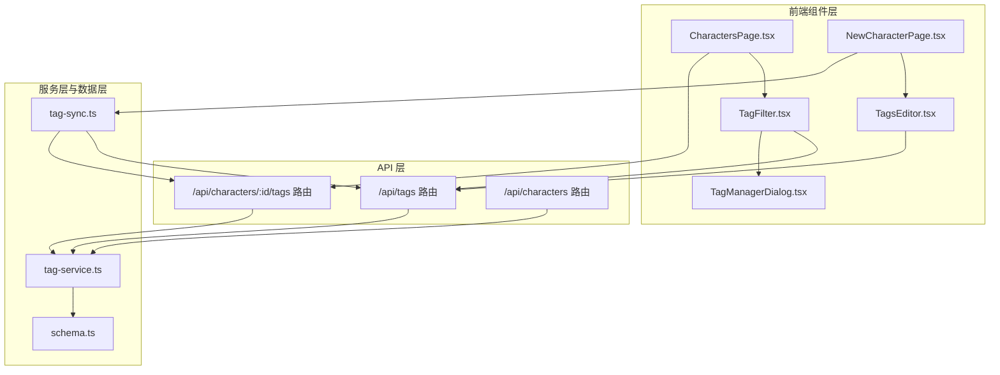
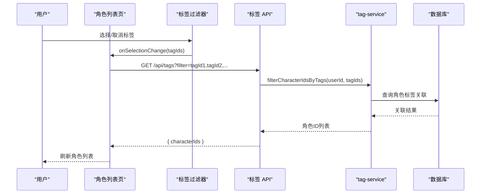
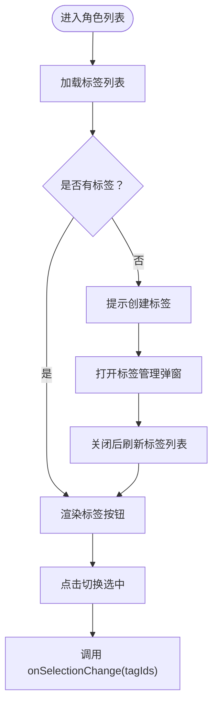
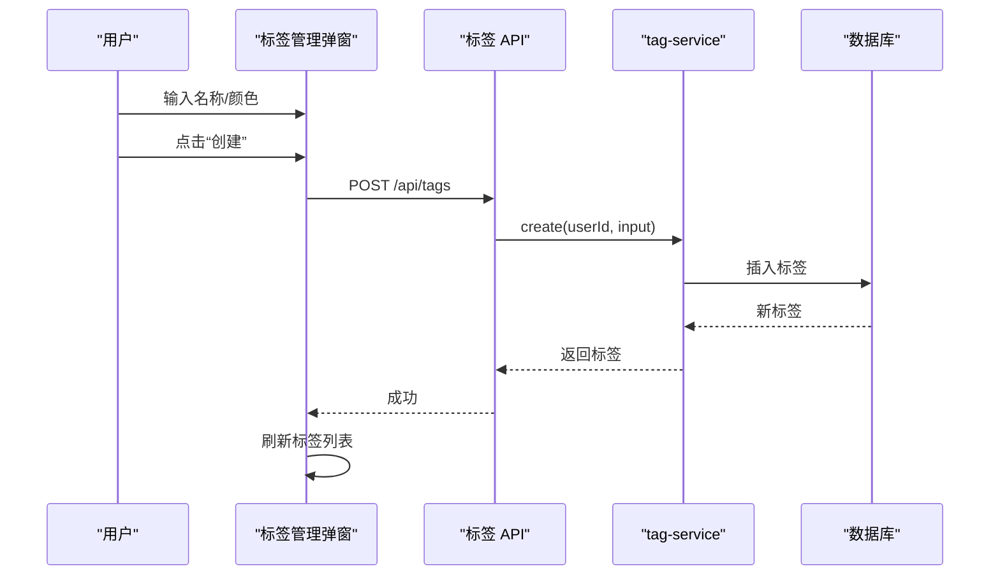
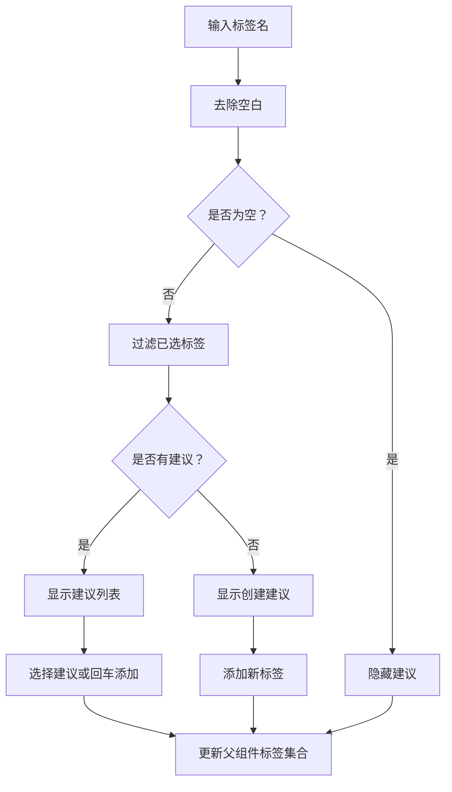
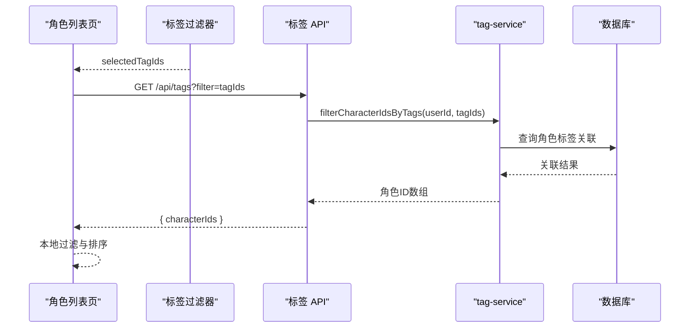
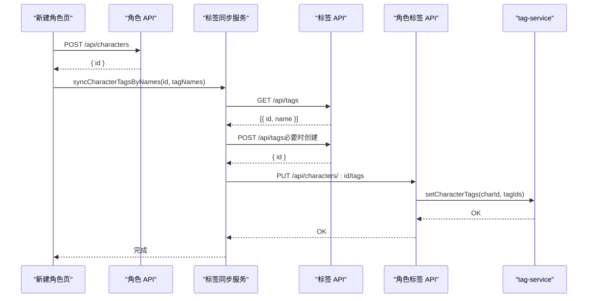
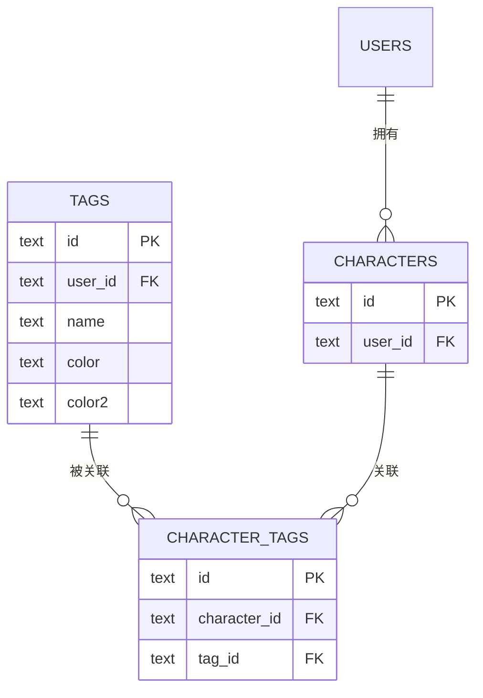
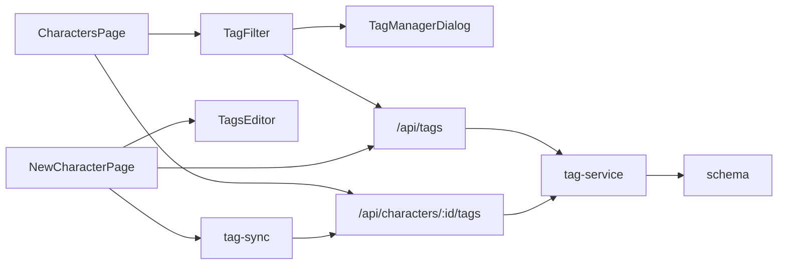

# 角色标签管理

<cite>
**本文档引用的文件**
- [TagFilter.tsx](file://src/components/characters/TagFilter.tsx)
- [TagManagerDialog.tsx](file://src/components/characters/TagManagerDialog.tsx)
- [TagsEditor.tsx](file://src/components/characters/TagsEditor.tsx)
- [CharactersPage.tsx](file://src/app/characters/page.tsx)
- [NewCharacterPage.tsx](file://src/app/characters/new/page.tsx)
- [route.ts（标签 API）](file://src/app/api/tags/route.ts)
- [route.ts（角色标签 API）](file://src/app/api/characters/[id]/tags/route.ts)
- [route.ts（角色 API）](file://src/app/api/characters/route.ts)
- [tag-service.ts](file://src/lib/services/tag-service.ts)
- [tag-sync.ts](file://src/lib/services/tag-sync.ts)
- [schema.ts](file://src/lib/db/schema.ts)
- [ui.ts](file://src/lib/constants/ui.ts)
</cite>

## 目录
1. [简介](#简介)
2. [项目结构](#项目结构)
3. [核心组件](#核心组件)
4. [架构总览](#架构总览)
5. [详细组件分析](#详细组件分析)
6. [依赖分析](#依赖分析)
7. [性能考虑](#性能考虑)
8. [故障排查指南](#故障排查指南)
9. [结论](#结论)
10. [附录](#附录)

## 简介
本文件系统性阐述“角色标签管理”子系统的设计与实现，涵盖标签的创建、编辑、删除与分类管理；标签与角色之间的多对多关系与查询机制；标签过滤器的实现原理、搜索算法与显示逻辑；标签同步机制、自动完成与重复标签处理策略；以及标签使用场景、组织策略与最佳实践。

## 项目结构
该子系统由三层构成：
- 前端组件层：负责标签的展示、交互与输入，包括标签过滤器、标签管理弹窗、标签编辑器。
- API 层：提供标签与角色标签的 REST 接口，负责鉴权与参数校验。
- 服务层与数据层：封装标签与角色标签的业务逻辑，执行数据库读写与聚合统计。

**图表来源**
- [TagFilter.tsx:30-131](file://src/components/characters/TagFilter.tsx#L30-L131)
- [TagManagerDialog.tsx:29-201](file://src/components/characters/TagManagerDialog.tsx#L29-L201)
- [TagsEditor.tsx:15-88](file://src/components/characters/TagsEditor.tsx#L15-L88)
- [CharactersPage.tsx:51-258](file://src/app/characters/page.tsx#L51-L258)
- [NewCharacterPage.tsx:33-155](file://src/app/characters/new/page.tsx#L33-L155)
- [route.ts（标签 API）:5-45](file://src/app/api/tags/route.ts#L5-L45)
- [route.ts（角色标签 API）:13-42](file://src/app/api/characters/[id]/tags/route.ts#L13-L42)
- [route.ts（角色 API）:5-42](file://src/app/api/characters/route.ts#L5-L42)
- [tag-service.ts:57-209](file://src/lib/services/tag-service.ts#L57-L209)
- [tag-sync.ts:6-36](file://src/lib/services/tag-sync.ts#L6-L36)
- [schema.ts:58-74](file://src/lib/db/schema.ts#L58-L74)

**章节来源**
- [TagFilter.tsx:30-131](file://src/components/characters/TagFilter.tsx#L30-L131)
- [TagManagerDialog.tsx:29-201](file://src/components/characters/TagManagerDialog.tsx#L29-L201)
- [TagsEditor.tsx:15-88](file://src/components/characters/TagsEditor.tsx#L15-L88)
- [CharactersPage.tsx:51-258](file://src/app/characters/page.tsx#L51-L258)
- [NewCharacterPage.tsx:33-155](file://src/app/characters/new/page.tsx#L33-L155)
- [route.ts（标签 API）:5-45](file://src/app/api/tags/route.ts#L5-L45)
- [route.ts（角色标签 API）:13-42](file://src/app/api/characters/[id]/tags/route.ts#L13-L42)
- [route.ts（角色 API）:5-42](file://src/app/api/characters/route.ts#L5-L42)
- [tag-service.ts:57-209](file://src/lib/services/tag-service.ts#L57-L209)
- [tag-sync.ts:6-36](file://src/lib/services/tag-sync.ts#L6-L36)
- [schema.ts:58-74](file://src/lib/db/schema.ts#L58-L74)

## 核心组件
- 标签过滤器（TagFilter）：展示用户可用标签，支持多选筛选与清空；未创建标签时引导进入标签管理。
- 标签管理弹窗（TagManagerDialog）：提供标签的创建、编辑、删除与颜色选择，支持刷新列表。
- 标签编辑器（TagsEditor）：在角色新建/编辑页支持搜索与创建标签，提供自动完成与去重。
- 角色列表页（CharactersPage）：集成标签过滤器，按标签组合筛选角色并排序展示。
- 角色新建页（NewCharacterPage）：通过标签同步服务将表单中的标签名同步为系统内标签并建立关联。
- 标签 API（/api/tags）：提供标签的增删改查与按标签过滤角色的能力。
- 角色标签 API（/api/characters/:id/tags）：提供角色标签的读取与覆盖式设置。
- 服务层（tag-service）：封装标签与角色标签的业务逻辑，含过滤与计数。
- 同步服务（tag-sync）：在创建角色时将标签名同步为系统标签并设置角色标签。

**章节来源**
- [TagFilter.tsx:30-131](file://src/components/characters/TagFilter.tsx#L30-L131)
- [TagManagerDialog.tsx:29-201](file://src/components/characters/TagManagerDialog.tsx#L29-L201)
- [TagsEditor.tsx:15-88](file://src/components/characters/TagsEditor.tsx#L15-L88)
- [CharactersPage.tsx:51-258](file://src/app/characters/page.tsx#L51-L258)
- [NewCharacterPage.tsx:33-155](file://src/app/characters/new/page.tsx#L33-L155)
- [route.ts（标签 API）:5-45](file://src/app/api/tags/route.ts#L5-L45)
- [route.ts（角色标签 API）:13-42](file://src/app/api/characters/[id]/tags/route.ts#L13-L42)
- [tag-service.ts:57-209](file://src/lib/services/tag-service.ts#L57-L209)
- [tag-sync.ts:6-36](file://src/lib/services/tag-sync.ts#L6-L36)

## 架构总览
标签系统采用“前端组件 + API + 服务层 + 数据库”的分层设计。标签与角色通过中间表 character_tags 实现多对多关联。前端通过 API 获取标签与角色标签，服务层负责数据一致性与聚合统计，数据库层提供持久化存储。

**图表来源**
- [CharactersPage.tsx:81-91](file://src/app/characters/page.tsx#L81-L91)
- [route.ts（标签 API）:11-19](file://src/app/api/tags/route.ts#L11-L19)
- [tag-service.ts:168-207](file://src/lib/services/tag-service.ts#L168-L207)

**章节来源**
- [CharactersPage.tsx:81-91](file://src/app/characters/page.tsx#L81-L91)
- [route.ts（标签 API）:11-19](file://src/app/api/tags/route.ts#L11-L19)
- [tag-service.ts:168-207](file://src/lib/services/tag-service.ts#L168-L207)

## 详细组件分析

### 标签过滤器（TagFilter）
- 功能要点
  - 初始化加载标签列表，若为空则提示创建。
  - 支持多选标签，切换选中状态并通过回调更新父组件状态。
  - 显示标签颜色与关联角色数量，便于识别与筛选。
  - 提供“清除筛选”按钮一键清空选中。
  - 点击“管理”打开标签管理弹窗，关闭后刷新标签列表。
- 交互细节
  - 使用防抖与延迟隐藏策略避免焦点切换导致的闪烁。
  - 选中态样式高亮，未选中态柔和显示，提升可读性。

**图表来源**
- [TagFilter.tsx:30-131](file://src/components/characters/TagFilter.tsx#L30-L131)
- [ui.ts:5-12](file://src/lib/constants/ui.ts#L5-L12)

**章节来源**
- [TagFilter.tsx:30-131](file://src/components/characters/TagFilter.tsx#L30-L131)
- [ui.ts:5-12](file://src/lib/constants/ui.ts#L5-L12)

### 标签管理弹窗（TagManagerDialog）
- 功能要点
  - 创建：输入名称与颜色，提交后刷新列表。
  - 编辑：双击进入编辑态，支持修改名称与颜色。
  - 删除：确认后删除标签并移除关联。
  - 颜色选择：内置预设色盘，支持清空颜色。
- 同步机制
  - 所有变更通过 API 调用后统一刷新本地状态，保证 UI 与后端一致。

**图表来源**
- [TagManagerDialog.tsx:45-76](file://src/components/characters/TagManagerDialog.tsx#L45-L76)
- [route.ts（标签 API）:25-44](file://src/app/api/tags/route.ts#L25-L44)
- [tag-service.ts:73-91](file://src/lib/services/tag-service.ts#L73-L91)

**章节来源**
- [TagManagerDialog.tsx:45-76](file://src/components/characters/TagManagerDialog.tsx#L45-L76)
- [route.ts（标签 API）:25-44](file://src/app/api/tags/route.ts#L25-L44)
- [tag-service.ts:73-91](file://src/lib/services/tag-service.ts#L73-L91)

### 标签编辑器（TagsEditor）
- 功能要点
  - 搜索已有标签：输入即过滤，排除已选标签，最多展示前若干条建议。
  - 创建新标签：当输入不在现有标签中时，显示“创建”建议。
  - 自动完成：支持键盘导航与鼠标选择，失焦后延迟隐藏建议面板。
  - 去重：已选标签不会再次出现在建议中。
- 性能与体验
  - 建议数量限制与大小写不敏感匹配，兼顾性能与易用性。
  - 延迟隐藏避免误触，提升交互稳定性。

**图表来源**
- [TagsEditor.tsx:20-37](file://src/components/characters/TagsEditor.tsx#L20-L37)
- [ui.ts:5-12](file://src/lib/constants/ui.ts#L5-L12)

**章节来源**
- [TagsEditor.tsx:20-37](file://src/components/characters/TagsEditor.tsx#L20-L37)
- [ui.ts:5-12](file://src/lib/constants/ui.ts#L5-L12)

### 角色列表页（CharactersPage）
- 功能要点
  - 集成标签过滤器，接收选中标签 ID 列表。
  - 当选中多个标签时，通过标签 API 的 filter 参数获取满足所有标签的角色 ID 列表。
  - 支持搜索框防抖、排序与视图切换。
- 数据流
  - 选中标签变化触发 API 请求，返回角色 ID 列表，再在本地进行过滤与排序。

**图表来源**
- [CharactersPage.tsx:81-91](file://src/app/characters/page.tsx#L81-L91)
- [route.ts（标签 API）:11-19](file://src/app/api/tags/route.ts#L11-L19)
- [tag-service.ts:168-207](file://src/lib/services/tag-service.ts#L168-L207)

**章节来源**
- [CharactersPage.tsx:81-91](file://src/app/characters/page.tsx#L81-L91)
- [route.ts（标签 API）:11-19](file://src/app/api/tags/route.ts#L11-L19)
- [tag-service.ts:168-207](file://src/lib/services/tag-service.ts#L168-L207)

### 角色新建页（NewCharacterPage）
- 功能要点
  - 在保存角色后，通过标签同步服务将表单中的标签名同步为系统标签并设置角色标签。
  - 若标签不存在则自动创建，若已存在则复用其 ID。
- 流程
  - 保存角色 → 获取新角色 ID → 同步标签 → 设置角色标签 → 跳转详情。

**图表来源**
- [NewCharacterPage.tsx:53-69](file://src/app/characters/new/page.tsx#L53-L69)
- [tag-sync.ts:6-36](file://src/lib/services/tag-sync.ts#L6-L36)
- [route.ts（标签 API）:5-45](file://src/app/api/tags/route.ts#L5-L45)
- [route.ts（角色标签 API）:22-41](file://src/app/api/characters/[id]/tags/route.ts#L22-L41)
- [tag-service.ts:140-156](file://src/lib/services/tag-service.ts#L140-L156)

**章节来源**
- [NewCharacterPage.tsx:53-69](file://src/app/characters/new/page.tsx#L53-L69)
- [tag-sync.ts:6-36](file://src/lib/services/tag-sync.ts#L6-L36)
- [route.ts（标签 API）:5-45](file://src/app/api/tags/route.ts#L5-L45)
- [route.ts（角色标签 API）:22-41](file://src/app/api/characters/[id]/tags/route.ts#L22-L41)
- [tag-service.ts:140-156](file://src/lib/services/tag-service.ts#L140-L156)

### 数据模型与查询机制
- 数据模型
  - 标签表（tags）：包含标签 ID、所属用户、名称与颜色等。
  - 角色表（characters）：包含角色基础信息与扩展字段。
  - 角色-标签关联表（character_tags）：多对多中间表，维护角色与标签的关联。
- 查询机制
  - 标签列表：按用户过滤，计算每个标签关联的角色数量。
  - 角色标签设置：覆盖式更新（先删后插），确保一致性。
  - 标签过滤角色：返回同时满足所有选中标签的角色 ID 列表。

**图表来源**
- [schema.ts:58-74](file://src/lib/db/schema.ts#L58-L74)

**章节来源**
- [schema.ts:58-74](file://src/lib/db/schema.ts#L58-L74)
- [tag-service.ts:59-70](file://src/lib/services/tag-service.ts#L59-L70)
- [tag-service.ts:140-156](file://src/lib/services/tag-service.ts#L140-L156)
- [tag-service.ts:168-207](file://src/lib/services/tag-service.ts#L168-L207)

## 依赖分析
- 组件间依赖
  - CharactersPage 依赖 TagFilter；TagFilter 可打开 TagManagerDialog。
  - NewCharacterPage 依赖 TagsEditor 与标签同步服务。
- API 依赖
  - 标签过滤器依赖 /api/tags；角色标签设置依赖 /api/characters/:id/tags。
- 服务层依赖
  - tag-service 依赖数据库 schema 与 drizzle ORM；tag-sync 依赖标签 API 与角色标签 API。
- 外部依赖
  - UI 常量（如下拉延迟）集中管理，减少魔法数字。

**图表来源**
- [CharactersPage.tsx:188-188](file://src/app/characters/page.tsx#L188-L188)
- [TagFilter.tsx:62-66](file://src/components/characters/TagFilter.tsx#L62-L66)
- [TagManagerDialog.tsx:39-43](file://src/components/characters/TagManagerDialog.tsx#L39-L43)
- [NewCharacterPage.tsx:11-11](file://src/app/characters/new/page.tsx#L11-L11)
- [TagsEditor.tsx:20-25](file://src/components/characters/TagsEditor.tsx#L20-L25)
- [route.ts（标签 API）:5-45](file://src/app/api/tags/route.ts#L5-L45)
- [route.ts（角色标签 API）:13-42](file://src/app/api/characters/[id]/tags/route.ts#L13-L42)
- [tag-service.ts:57-209](file://src/lib/services/tag-service.ts#L57-L209)
- [tag-sync.ts:6-36](file://src/lib/services/tag-sync.ts#L6-L36)
- [schema.ts:58-74](file://src/lib/db/schema.ts#L58-L74)

**章节来源**
- [CharactersPage.tsx:188-188](file://src/app/characters/page.tsx#L188-L188)
- [TagFilter.tsx:62-66](file://src/components/characters/TagFilter.tsx#L62-L66)
- [TagManagerDialog.tsx:39-43](file://src/components/characters/TagManagerDialog.tsx#L39-L43)
- [NewCharacterPage.tsx:11-11](file://src/app/characters/new/page.tsx#L11-L11)
- [TagsEditor.tsx:20-25](file://src/components/characters/TagsEditor.tsx#L20-L25)
- [route.ts（标签 API）:5-45](file://src/app/api/tags/route.ts#L5-L45)
- [route.ts（角色标签 API）:13-42](file://src/app/api/characters/[id]/tags/route.ts#L13-L42)
- [tag-service.ts:57-209](file://src/lib/services/tag-service.ts#L57-L209)
- [tag-sync.ts:6-36](file://src/lib/services/tag-sync.ts#L6-L36)
- [schema.ts:58-74](file://src/lib/db/schema.ts#L58-L74)

## 性能考虑
- 前端
  - 标签过滤器与标签编辑器均采用轻量状态管理与防抖策略，降低频繁请求与重渲染开销。
  - 建议数量限制与大小写不敏感匹配，避免大列表带来的渲染压力。
- 服务层
  - 标签计数通过一次全量关联扫描聚合，复杂度 O(N)，N 为关联总数；在标签规模较大时可考虑缓存或索引优化。
  - 角色标签设置采用覆盖式更新，先删后插，保证一致性但可能产生额外写入；可评估批量插入优化。
- API 层
  - 标签过滤接口按“同时满足所有标签”进行筛选，适合精确匹配场景；若需“任一匹配”，可在服务层扩展。

[本节为通用性能讨论，无需具体文件引用]

## 故障排查指南
- 未登录访问
  - 现象：返回 401 Unauthorized。
  - 排查：确认鉴权中间件与会话有效性。
  - 参考路径：[route.ts（标签 API）:6-8](file://src/app/api/tags/route.ts#L6-L8)、[route.ts（角色标签 API）:14-16](file://src/app/api/characters/[id]/tags/route.ts#L14-L16)
- 输入校验失败
  - 现象：返回 400 Invalid input。
  - 排查：检查标签名称长度、颜色格式等约束。
  - 参考路径：[route.ts（标签 API）:31-34](file://src/app/api/tags/route.ts#L31-L34)、[tag-service.ts:11-21](file://src/lib/services/tag-service.ts#L11-L21)
- 删除标签后关联未清理
  - 现象：标签仍显示关联数量。
  - 排查：确认删除标签的事务与级联删除配置。
  - 参考路径：[tag-service.ts:128-134](file://src/lib/services/tag-service.ts#L128-L134)、[schema.ts:70-74](file://src/lib/db/schema.ts#L70-L74)
- 同步失败
  - 现象：新建角色后标签未生效。
  - 排查：检查标签同步服务的网络请求与错误日志。
  - 参考路径：[tag-sync.ts:6-36](file://src/lib/services/tag-sync.ts#L6-L36)、[NewCharacterPage.tsx:64-65](file://src/app/characters/new/page.tsx#L64-L65)

**章节来源**
- [route.ts（标签 API）:6-8](file://src/app/api/tags/route.ts#L6-L8)
- [route.ts（角色标签 API）:14-16](file://src/app/api/characters/[id]/tags/route.ts#L14-L16)
- [route.ts（标签 API）:31-34](file://src/app/api/tags/route.ts#L31-L34)
- [tag-service.ts:11-21](file://src/lib/services/tag-service.ts#L11-L21)
- [tag-service.ts:128-134](file://src/lib/services/tag-service.ts#L128-L134)
- [schema.ts:70-74](file://src/lib/db/schema.ts#L70-L74)
- [tag-sync.ts:6-36](file://src/lib/services/tag-sync.ts#L6-L36)
- [NewCharacterPage.tsx:64-65](file://src/app/characters/new/page.tsx#L64-L65)

## 结论
该标签系统通过清晰的分层设计实现了标签的全生命周期管理与高效查询。前端组件提供良好的交互体验，API 与服务层保障数据一致性与可扩展性，数据库模型支持灵活的多对多关系。结合标签同步机制与自动完成，系统在易用性与性能之间取得良好平衡。

[本节为总结性内容，无需具体文件引用]

## 附录

### 标签过滤器实现原理
- 多选策略：选中即加入集合，取消即移除。
- 过滤策略：GET /api/tags?filter=tagId1,tagId2,... 返回同时满足所有标签的角色 ID 列表。
- 显示策略：标签按钮包含颜色与计数，选中态高亮。

**章节来源**
- [CharactersPage.tsx:81-91](file://src/app/characters/page.tsx#L81-L91)
- [route.ts（标签 API）:11-19](file://src/app/api/tags/route.ts#L11-L19)
- [TagFilter.tsx:45-51](file://src/components/characters/TagFilter.tsx#L45-L51)

### 搜索算法与显示逻辑
- 搜索算法：大小写不敏感包含匹配，排除已选标签，建议数量上限控制。
- 显示逻辑：建议面板延迟隐藏，支持键盘与鼠标选择，创建新标签的显式建议。

**章节来源**
- [TagsEditor.tsx:27-37](file://src/components/characters/TagsEditor.tsx#L27-L37)
- [ui.ts:5-12](file://src/lib/constants/ui.ts#L5-L12)

### 标签同步机制与重复标签处理
- 同步流程：获取全部标签 → 匹配或创建 → 设置角色标签。
- 重复处理：按名称大小写不敏感匹配，避免重复创建。

**章节来源**
- [tag-sync.ts:6-36](file://src/lib/services/tag-sync.ts#L6-L36)
- [NewCharacterPage.tsx:64-65](file://src/app/characters/new/page.tsx#L64-L65)

### 使用场景与组织策略
- 使用场景
  - 角色分类：如“高冷”“温柔”“反派”等。
  - 场景标签：如“校园”“科幻”“日常”等。
  - 角色属性：如“男性”“女性”“年龄范围”等。
- 组织策略
  - 建议采用层级化的命名规范（如“类型/子类”）以提升搜索效率。
  - 控制标签数量与粒度，避免过细导致维护成本上升。
  - 定期清理无关联标签，保持列表整洁。

[本节为概念性内容，无需具体文件引用]