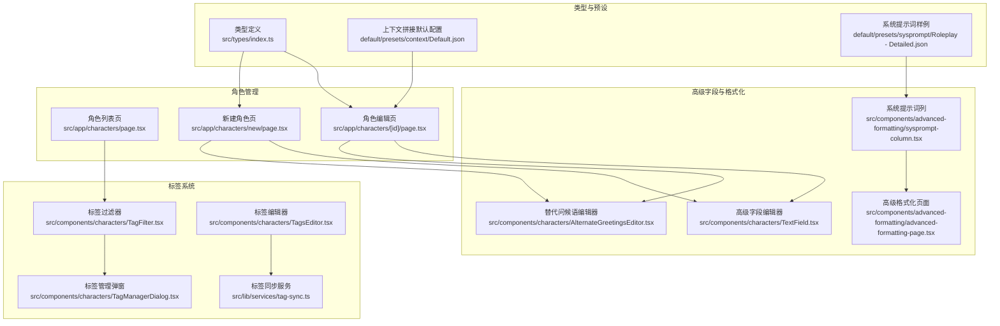
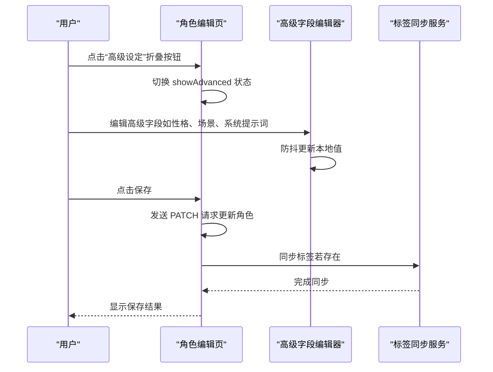
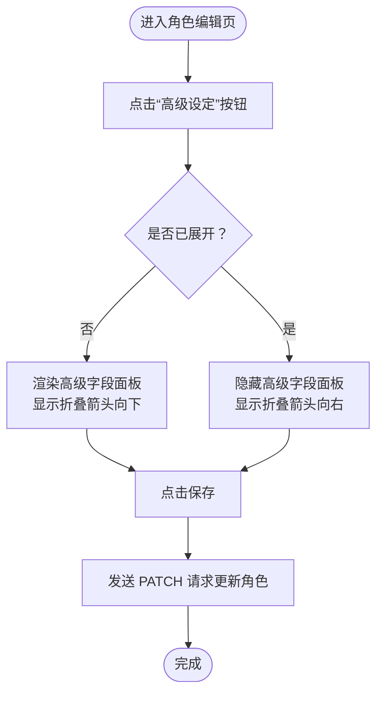
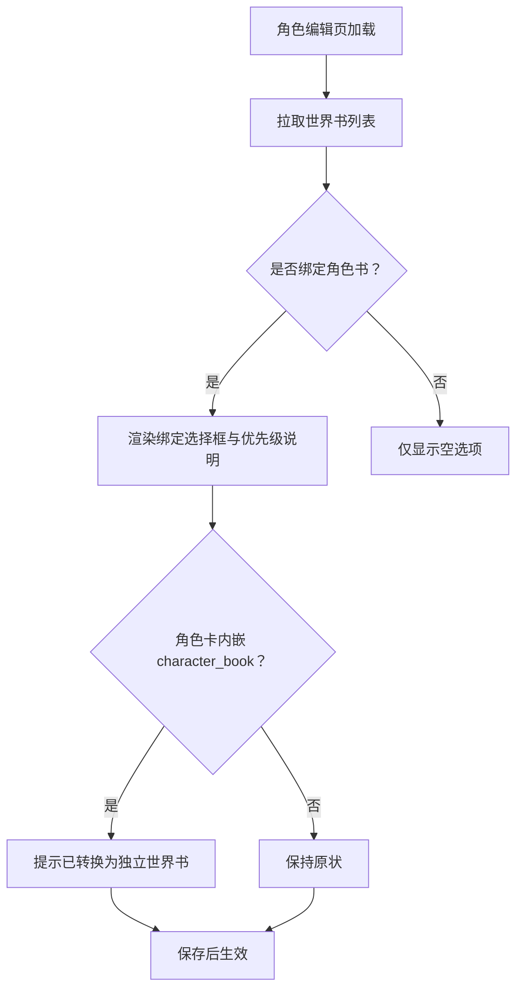
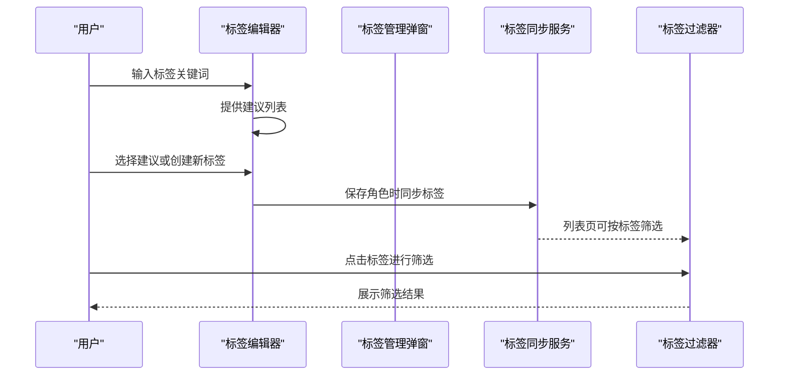
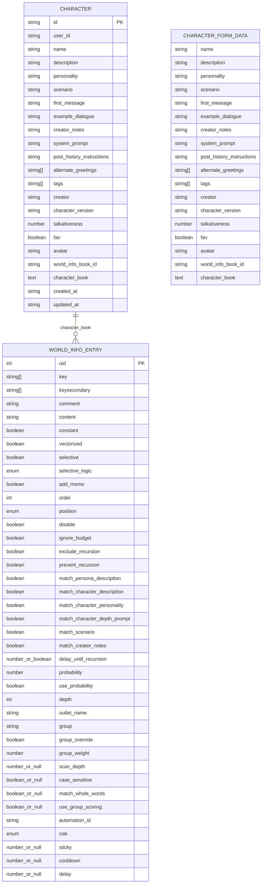
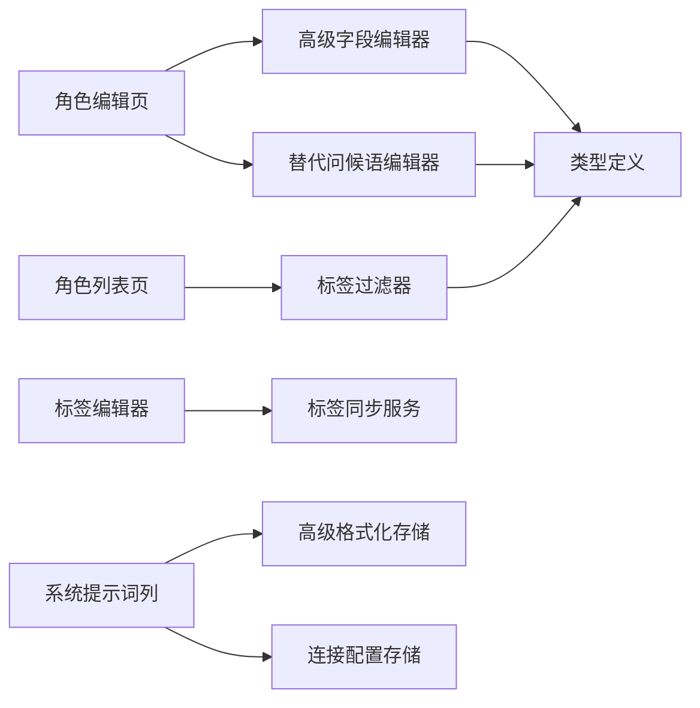

# 高级角色设定

<cite>
**本文引用的文件**
- [src/app/characters/page.tsx](file://src/app/characters/page.tsx)
- [src/app/characters/[id]/page.tsx](file://src/app/characters/[id]/page.tsx)
- [src/app/characters/new/page.tsx](file://src/app/characters/new/page.tsx)
- [src/components/characters/AlternateGreetingsEditor.tsx](file://src/components/characters/AlternateGreetingsEditor.tsx)
- [src/components/characters/TagFilter.tsx](file://src/components/characters/TagFilter.tsx)
- [src/components/characters/TagManagerDialog.tsx](file://src/components/characters/TagManagerDialog.tsx)
- [src/components/characters/TagsEditor.tsx](file://src/components/characters/TagsEditor.tsx)
- [src/components/characters/TextField.tsx](file://src/components/characters/TextField.tsx)
- [src/lib/services/tag-sync.ts](file://src/lib/services/tag-sync.ts)
- [src/types/index.ts](file://src/types/index.ts)
- [default/presets/context/Default.json](file://default/presets/context/Default.json)
- [default/presets/sysprompt/Roleplay - Detailed.json](file://default/presets/sysprompt/Roleplay - Detailed.json)
- [drizzle/0001_world_info_links.sql](file://drizzle/0001_world_info_links.sql)
- [src/components/advanced-formatting/sysprompt-column.tsx](file://src/components/advanced-formatting/sysprompt-column.tsx)
- [src/components/advanced-formatting/advanced-formatting-page.tsx](file://src/components/advanced-formatting/advanced-formatting-page.tsx)
- [src/components/chat/chat-area.tsx](file://src/components/chat/chat-area.tsx)
</cite>

## 目录
1. [简介](#简介)
2. [项目结构](#项目结构)
3. [核心组件](#核心组件)
4. [架构总览](#架构总览)
5. [详细组件分析](#详细组件分析)
6. [依赖关系分析](#依赖关系分析)
7. [性能考量](#性能考量)
8. [故障排查指南](#故障排查指南)
9. [结论](#结论)
10. [附录](#附录)

## 简介
本文件聚焦“高级角色设定”功能，系统性说明以下方面：
- 高级字段的展开/收起机制与交互设计
- 高级字段的条件显示逻辑与可见性控制
- 性格描述、场景设定、对话示例等高级字段的作用与配置方法
- 系统提示词与历史后指令的专业用途、使用场景与最佳实践
- 字段内容的格式要求、占位符说明与示例模板
- 高级设定对AI行为的影响原理与调优建议

## 项目结构
围绕“高级角色设定”的前端实现主要分布在以下区域：
- 角色列表页：角色检索、排序、视图切换、批量操作、标签筛选
- 角色编辑页与新建页：基础字段与高级字段的编辑入口、展开/收起控制
- 标签体系：标签创建、编辑、删除、筛选与同步
- 高级格式化页面：系统提示词模板的启用/禁用与字段渲染
- 类型定义：Character、CharacterFormData、WorldInfo 等核心数据模型
- 默认预设：上下文拼接顺序与系统提示词模板样例

图表来源
- [src/app/characters/page.tsx:1-258](file://src/app/characters/page.tsx#L1-L258)
- [src/app/characters/[id]/page.tsx:1-230](file://src/app/characters/[id]/page.tsx#L1-L230)
- [src/app/characters/new/page.tsx:1-155](file://src/app/characters/new/page.tsx#L1-L155)
- [src/components/characters/TagFilter.tsx:1-131](file://src/components/characters/TagFilter.tsx#L1-L131)
- [src/components/characters/TagManagerDialog.tsx:1-201](file://src/components/characters/TagManagerDialog.tsx#L1-L201)
- [src/components/characters/TagsEditor.tsx:1-88](file://src/components/characters/TagsEditor.tsx#L1-L88)
- [src/components/characters/TextField.tsx:1-51](file://src/components/characters/TextField.tsx#L1-L51)
- [src/components/characters/AlternateGreetingsEditor.tsx:1-38](file://src/components/characters/AlternateGreetingsEditor.tsx#L1-L38)
- [src/components/advanced-formatting/sysprompt-column.tsx:1-53](file://src/components/advanced-formatting/sysprompt-column.tsx#L1-L53)
- [src/components/advanced-formatting/advanced-formatting-page.tsx:1-38](file://src/components/advanced-formatting/advanced-formatting-page.tsx#L1-L38)
- [src/types/index.ts:154-209](file://src/types/index.ts#L154-L209)
- [default/presets/context/Default.json:1-15](file://default/presets/context/Default.json#L1-L15)
- [default/presets/sysprompt/Roleplay - Detailed.json:1-6](file://default/presets/sysprompt/Roleplay - Detailed.json#L1-L6)

章节来源
- [src/app/characters/page.tsx:1-258](file://src/app/characters/page.tsx#L1-L258)
- [src/app/characters/[id]/page.tsx:1-230](file://src/app/characters/[id]/page.tsx#L1-L230)
- [src/app/characters/new/page.tsx:1-155](file://src/app/characters/new/page.tsx#L1-L155)
- [src/components/characters/TagFilter.tsx:1-131](file://src/components/characters/TagFilter.tsx#L1-L131)
- [src/components/characters/TagManagerDialog.tsx:1-201](file://src/components/characters/TagManagerDialog.tsx#L1-L201)
- [src/components/characters/TagsEditor.tsx:1-88](file://src/components/characters/TagsEditor.tsx#L1-L88)
- [src/components/characters/TextField.tsx:1-51](file://src/components/characters/TextField.tsx#L1-L51)
- [src/components/characters/AlternateGreetingsEditor.tsx:1-38](file://src/components/characters/AlternateGreetingsEditor.tsx#L1-L38)
- [src/components/advanced-formatting/sysprompt-column.tsx:1-53](file://src/components/advanced-formatting/sysprompt-column.tsx#L1-L53)
- [src/components/advanced-formatting/advanced-formatting-page.tsx:1-38](file://src/components/advanced-formatting/advanced-formatting-page.tsx#L1-L38)
- [src/types/index.ts:154-209](file://src/types/index.ts#L154-L209)
- [default/presets/context/Default.json:1-15](file://default/presets/context/Default.json#L1-L15)
- [default/presets/sysprompt/Roleplay - Detailed.json:1-6](file://default/presets/sysprompt/Roleplay - Detailed.json#L1-L6)

## 核心组件
- 高级字段编辑器：提供防抖输入、多行文本域、帮助链接等能力，统一高级字段的编辑体验。
- 替代问候语编辑器：支持多条问候语的增删与编辑，适用于角色首次进入或重启会话时的多样化开场。
- 标签系统：包括标签过滤器、标签管理弹窗与标签编辑器，支撑角色的分类与筛选。
- 角色编辑页/新建页：集中展示基础字段与高级字段，通过“高级设定”折叠面板实现信息密度控制。

章节来源
- [src/components/characters/TextField.tsx:1-51](file://src/components/characters/TextField.tsx#L1-L51)
- [src/components/characters/AlternateGreetingsEditor.tsx:1-38](file://src/components/characters/AlternateGreetingsEditor.tsx#L1-L38)
- [src/components/characters/TagFilter.tsx:1-131](file://src/components/characters/TagFilter.tsx#L1-L131)
- [src/components/characters/TagManagerDialog.tsx:1-201](file://src/components/characters/TagManagerDialog.tsx#L1-L201)
- [src/components/characters/TagsEditor.tsx:1-88](file://src/components/characters/TagsEditor.tsx#L1-L88)
- [src/app/characters/[id]/page.tsx:185-223](file://src/app/characters/[id]/page.tsx#L185-L223)
- [src/app/characters/new/page.tsx:136-148](file://src/app/characters/new/page.tsx#L136-L148)

## 架构总览
“高级角色设定”在前端采用“页面 + 组件 + 类型 + 预设”的协作模式：
- 页面负责字段布局与交互控制（如展开/收起、保存、导出）。
- 组件负责具体字段的渲染与编辑（如 TextField、AlternateGreetingsEditor）。
- 类型定义确保前后端字段一致性与可维护性。
- 默认预设提供上下文拼接顺序与系统提示词模板样例，便于快速上手。

图表来源
- [src/app/characters/[id]/page.tsx:54-70](file://src/app/characters/[id]/page.tsx#L54-L70)
- [src/lib/services/tag-sync.ts:6-35](file://src/lib/services/tag-sync.ts#L6-L35)
- [src/components/characters/TextField.tsx:23-27](file://src/components/characters/TextField.tsx#L23-L27)

章节来源
- [src/app/characters/[id]/page.tsx:54-70](file://src/app/characters/[id]/page.tsx#L54-L70)
- [src/lib/services/tag-sync.ts:6-35](file://src/lib/services/tag-sync.ts#L6-L35)
- [src/components/characters/TextField.tsx:23-27](file://src/components/characters/TextField.tsx#L23-L27)

## 详细组件分析

### 高级字段展开/收起机制与交互设计
- 展开/收起控制：通过“高级设定”按钮切换 showAdvanced 状态，仅在需要时渲染高级字段区域，降低初始信息密度。
- 折叠面板样式：左侧有强调色竖线，提升视觉层级；标题使用可折叠箭头指示方向。
- 交互细节：点击保存时仅提交可见字段；角色书绑定项在高级面板内，便于一次性配置。

图表来源
- [src/app/characters/[id]/page.tsx:185-187](file://src/app/characters/[id]/page.tsx#L185-L187)
- [src/app/characters/[id]/page.tsx:189-223](file://src/app/characters/[id]/page.tsx#L189-L223)
- [src/app/characters/new/page.tsx:136-138](file://src/app/characters/new/page.tsx#L136-L138)
- [src/app/characters/new/page.tsx:140-148](file://src/app/characters/new/page.tsx#L140-L148)

章节来源
- [src/app/characters/[id]/page.tsx:185-223](file://src/app/characters/[id]/page.tsx#L185-L223)
- [src/app/characters/new/page.tsx:136-148](file://src/app/characters/new/page.tsx#L136-L148)

### 高级字段：条件显示逻辑
- 条件显示：角色书绑定项在高级面板内，且当角色卡内嵌 character_book 时，页面会提示已转换为独立世界书，避免重复配置。
- 优先级提示：角色书绑定后，进入聊天时会自动激活该世界书，优先级为“聊天书 > 角色书 > 全局书”，页面明确提示。
- 世界书联动：聊天区会根据全局、角色、聊天级别的世界书集合进行可视化提示，便于确认生效范围。

图表来源
- [src/app/characters/[id]/page.tsx:39-48](file://src/app/characters/[id]/page.tsx#L39-L48)
- [src/app/characters/[id]/page.tsx:203-221](file://src/app/characters/[id]/page.tsx#L203-L221)
- [src/components/chat/chat-area.tsx:1203-1214](file://src/components/chat/chat-area.tsx#L1203-L1214)

章节来源
- [src/app/characters/[id]/page.tsx:39-48](file://src/app/characters/[id]/page.tsx#L39-L48)
- [src/app/characters/[id]/page.tsx:203-221](file://src/app/characters/[id]/page.tsx#L203-L221)
- [src/components/chat/chat-area.tsx:1203-1214](file://src/components/chat/chat-area.tsx#L1203-L1214)

### 高级字段：作用与配置方法
- 性格（Personality）：角色的核心性格特征概述，建议简洁明确、可执行。
- 场景（Scenario）：角色所处的世界观背景、地点、时代等，有助于AI维持一致性。
- 对话示例（Example Dialogue）：提供标准对话格式与语气范例，建议包含起始标记与角色动作描述。
- 系统提示词（System Prompt）：覆盖默认系统提示词，适合高级用户定制AI行为边界与风格。
- 历史后指令（Post-History Instructions）：插入在聊天历史之后、AI回复之前的指令，用于临时调整AI行为。

字段配置要点
- 使用多行文本域以容纳长段落与示例。
- 为每个字段提供占位符与帮助链接，引导正确格式。
- 保存时采用防抖策略，减少频繁网络请求。

章节来源
- [src/app/characters/[id]/page.tsx:189-223](file://src/app/characters/[id]/page.tsx#L189-L223)
- [src/app/characters/new/page.tsx:140-148](file://src/app/characters/new/page.tsx#L140-L148)
- [src/components/characters/TextField.tsx:16-50](file://src/components/characters/TextField.tsx#L16-L50)

### 替代问候语（Alternate Greetings）
- 功能：支持多条问候语，便于角色在不同情境下的多样化开场。
- 交互：添加/删除单项，支持多行编辑与占位符提示。
- 应用：与“第一条消息”配合，形成更自然的会话入口。

章节来源
- [src/components/characters/AlternateGreetingsEditor.tsx:11-37](file://src/components/characters/AlternateGreetingsEditor.tsx#L11-L37)
- [src/app/characters/[id]/page.tsx:183](file://src/app/characters/[id]/page.tsx#L183)
- [src/app/characters/new/page.tsx:134](file://src/app/characters/new/page.tsx#L134)

### 标签系统与筛选
- 标签过滤器：支持多标签组合筛选，点击标签切换选中状态，清除按钮一键清空。
- 标签管理弹窗：支持创建、编辑、删除标签，内置预设色盘，便于视觉区分。
- 标签编辑器：支持搜索已有标签或创建新标签，自动去重与延迟隐藏建议列表。
- 标签同步：保存角色时将标签名同步至标签表并建立关联，保证列表页筛选可用。

图表来源
- [src/components/characters/TagsEditor.tsx:20-37](file://src/components/characters/TagsEditor.tsx#L20-L37)
- [src/components/characters/TagManagerDialog.tsx:45-76](file://src/components/characters/TagManagerDialog.tsx#L45-L76)
- [src/lib/services/tag-sync.ts:6-35](file://src/lib/services/tag-sync.ts#L6-L35)
- [src/components/characters/TagFilter.tsx:41-51](file://src/components/characters/TagFilter.tsx#L41-L51)

章节来源
- [src/components/characters/TagsEditor.tsx:14-87](file://src/components/characters/TagsEditor.tsx#L14-L87)
- [src/components/characters/TagManagerDialog.tsx:28-200](file://src/components/characters/TagManagerDialog.tsx#L28-L200)
- [src/lib/services/tag-sync.ts:6-35](file://src/lib/services/tag-sync.ts#L6-L35)
- [src/components/characters/TagFilter.tsx:30-130](file://src/components/characters/TagFilter.tsx#L30-L130)

### 数据模型与字段映射
- 角色数据模型：包含基础字段与高级字段，以及世界书绑定、扩展字段等。
- 表单数据模型：与角色模型对齐，但去除服务端字段，便于前端编辑与提交。
- 世界书字段：数据库层面新增 character_book 与 world_info_book_id 字段，支持角色内嵌世界书与角色级绑定。

图表来源
- [src/types/index.ts:154-209](file://src/types/index.ts#L154-L209)
- [src/types/index.ts:368-416](file://src/types/index.ts#L368-L416)
- [drizzle/0001_world_info_links.sql:1-2](file://drizzle/0001_world_info_links.sql#L1-L2)

章节来源
- [src/types/index.ts:154-209](file://src/types/index.ts#L154-L209)
- [src/types/index.ts:368-416](file://src/types/index.ts#L368-L416)
- [drizzle/0001_world_info_links.sql:1-2](file://drizzle/0001_world_info_links.sql#L1-L2)

### 系统提示词与历史后指令：专业用途与最佳实践
- 系统提示词（System Prompt）：用于覆盖默认系统提示词，适合高级用户定制AI行为边界与风格。建议明确角色身份、语气、知识范围与限制。
- 历史后指令（Post-History Instructions）：插入在聊天历史之后、AI回复之前的指令，适合临时调整AI行为，例如要求输出结构化格式或特定风格。
- 最佳实践：
  - 保持系统提示词简洁明确，避免过度冗长导致模型困惑。
  - 历史后指令尽量短小精悍，仅在必要时使用。
  - 结合上下文拼接顺序（context story_string）与世界书权重，综合控制AI输出。

章节来源
- [src/app/characters/[id]/page.tsx:194-195](file://src/app/characters/[id]/page.tsx#L194-L195)
- [src/app/characters/[id]/page.tsx:195](file://src/app/characters/[id]/page.tsx#L195)
- [default/presets/context/Default.json:1-15](file://default/presets/context/Default.json#L1-L15)
- [default/presets/sysprompt/Roleplay - Detailed.json:1-6](file://default/presets/sysprompt/Roleplay - Detailed.json#L1-L6)

### 字段内容格式要求与占位符说明
- 多行文本域：高级字段普遍采用多行文本域，支持长段落与示例。
- 占位符与帮助链接：为每个字段提供占位符与帮助链接，指导正确格式与用途。
- 示例模板：对话示例建议包含起始标记与角色动作描述，便于模型学习。

章节来源
- [src/components/characters/TextField.tsx:37-47](file://src/components/characters/TextField.tsx#L37-L47)
- [src/app/characters/[id]/page.tsx:193](file://src/app/characters/[id]/page.tsx#L193)
- [src/app/characters/new/page.tsx:144](file://src/app/characters/new/page.tsx#L144)

### 高级设定对AI行为的影响与调优建议
- 影响原理：高级设定通过系统提示词、上下文拼接顺序与世界书权重共同影响AI输出。系统提示词决定行为边界，上下文拼接顺序决定信息呈现方式，世界书权重决定触发频率与深度。
- 调优建议：
  - 逐步增量调整：先从系统提示词入手，再微调上下文顺序与世界书权重。
  - A/B 测试：对比不同设定下的输出质量与稳定性，记录差异。
  - 保持一致性：角色性格与场景设定需贯穿始终，避免前后矛盾。

章节来源
- [default/presets/context/Default.json:1-15](file://default/presets/context/Default.json#L1-L15)
- [src/types/index.ts:325-366](file://src/types/index.ts#L325-L366)

## 依赖关系分析
- 页面依赖组件：角色编辑页依赖高级字段编辑器与替代问候语编辑器；列表页依赖标签过滤器。
- 组件依赖服务：标签编辑器依赖标签同步服务；系统提示词列依赖高级格式化存储与连接配置。
- 类型驱动：类型定义贯穿页面、组件与服务层，确保字段一致性与可维护性。

图表来源
- [src/app/characters/[id]/page.tsx:189-223](file://src/app/characters/[id]/page.tsx#L189-L223)
- [src/app/characters/page.tsx:188](file://src/app/characters/page.tsx#L188)
- [src/components/characters/TextField.tsx:16-50](file://src/components/characters/TextField.tsx#L16-L50)
- [src/components/characters/AlternateGreetingsEditor.tsx:11-37](file://src/components/characters/AlternateGreetingsEditor.tsx#L11-L37)
- [src/components/characters/TagsEditor.tsx:14-87](file://src/components/characters/TagsEditor.tsx#L14-L87)
- [src/lib/services/tag-sync.ts:6-35](file://src/lib/services/tag-sync.ts#L6-L35)
- [src/components/advanced-formatting/sysprompt-column.tsx:9-52](file://src/components/advanced-formatting/sysprompt-column.tsx#L9-L52)
- [src/types/index.ts:154-209](file://src/types/index.ts#L154-L209)

章节来源
- [src/app/characters/[id]/page.tsx:189-223](file://src/app/characters/[id]/page.tsx#L189-L223)
- [src/app/characters/page.tsx:188](file://src/app/characters/page.tsx#L188)
- [src/components/characters/TextField.tsx:16-50](file://src/components/characters/TextField.tsx#L16-L50)
- [src/components/characters/AlternateGreetingsEditor.tsx:11-37](file://src/components/characters/AlternateGreetingsEditor.tsx#L11-L37)
- [src/components/characters/TagsEditor.tsx:14-87](file://src/components/characters/TagsEditor.tsx#L14-L87)
- [src/lib/services/tag-sync.ts:6-35](file://src/lib/services/tag-sync.ts#L6-L35)
- [src/components/advanced-formatting/sysprompt-column.tsx:9-52](file://src/components/advanced-formatting/sysprompt-column.tsx#L9-L52)
- [src/types/index.ts:154-209](file://src/types/index.ts#L154-L209)

## 性能考量
- 防抖输入：高级字段编辑器对输入事件进行防抖处理，降低频繁更新带来的性能压力。
- 懒加载与条件渲染：高级字段面板仅在展开时渲染，减少初始渲染负担。
- 标签同步：保存角色时异步同步标签，避免阻塞主流程。
- 列表筛选：标签过滤器基于字符集合并查询，建议在标签数量较多时优化后端索引与查询。

章节来源
- [src/components/characters/TextField.tsx:23-27](file://src/components/characters/TextField.tsx#L23-L27)
- [src/app/characters/[id]/page.tsx:189-223](file://src/app/characters/[id]/page.tsx#L189-L223)
- [src/lib/services/tag-sync.ts:6-35](file://src/lib/services/tag-sync.ts#L6-L35)

## 故障排查指南
- 高级字段未保存：检查保存按钮状态与网络响应；确认字段值是否为空或过长。
- 标签筛选无效：确认标签同步是否成功；检查标签名称大小写与重复。
- 角色书绑定不生效：确认世界书优先级与聊天级别绑定；检查角色卡内嵌 character_book 是否已转换为独立世界书。
- 系统提示词不生效：检查系统提示词启用状态与连接配置；核对上下文拼接顺序与世界书权重。

章节来源
- [src/app/characters/[id]/page.tsx:54-70](file://src/app/characters/[id]/page.tsx#L54-L70)
- [src/lib/services/tag-sync.ts:6-35](file://src/lib/services/tag-sync.ts#L6-L35)
- [src/app/characters/[id]/page.tsx:203-221](file://src/app/characters/[id]/page.tsx#L203-L221)
- [src/components/advanced-formatting/sysprompt-column.tsx:19-29](file://src/components/advanced-formatting/sysprompt-column.tsx#L19-L29)

## 结论
“高级角色设定”通过折叠面板、防抖输入与标签体系，提供了高效、可控的角色定制体验。结合系统提示词、上下文拼接顺序与世界书权重，可显著提升AI行为的一致性与可预期性。建议以渐进式调优与A/B测试的方式持续优化设定，确保在复杂场景下仍能稳定输出高质量内容。

## 附录
- 默认上下文拼接顺序参考：[default/presets/context/Default.json:1-15](file://default/presets/context/Default.json#L1-L15)
- 系统提示词模板样例：[default/presets/sysprompt/Roleplay - Detailed.json:1-6](file://default/presets/sysprompt/Roleplay - Detailed.json#L1-L6)
- 数据库迁移脚本（角色书字段）：[drizzle/0001_world_info_links.sql:1-2](file://drizzle/0001_world_info_links.sql#L1-L2)