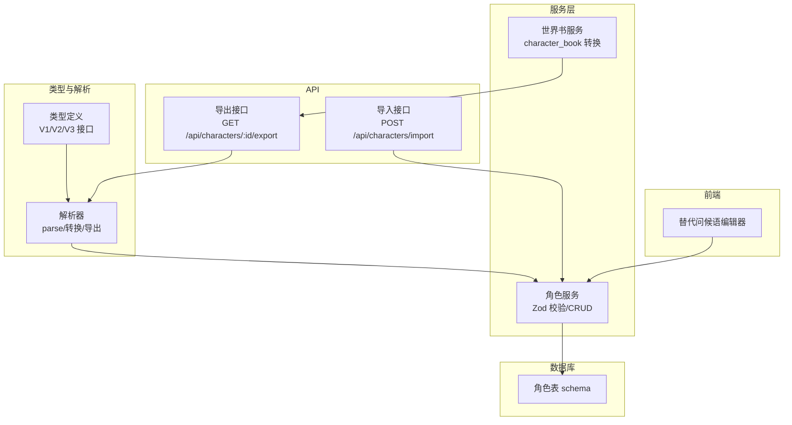
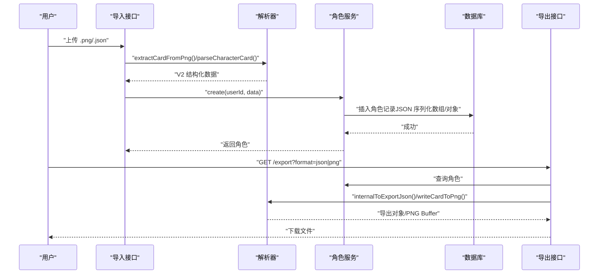
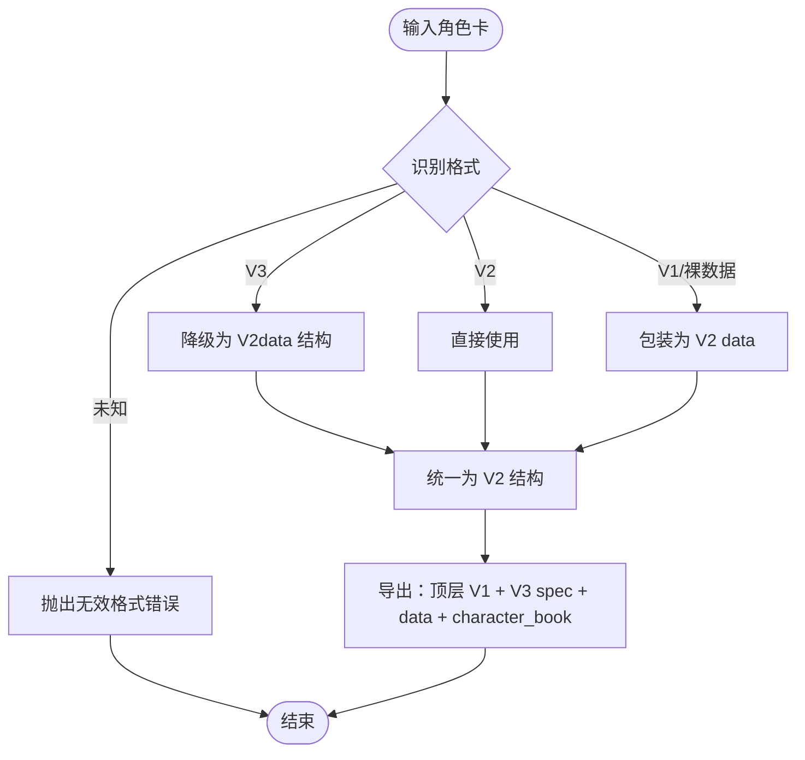
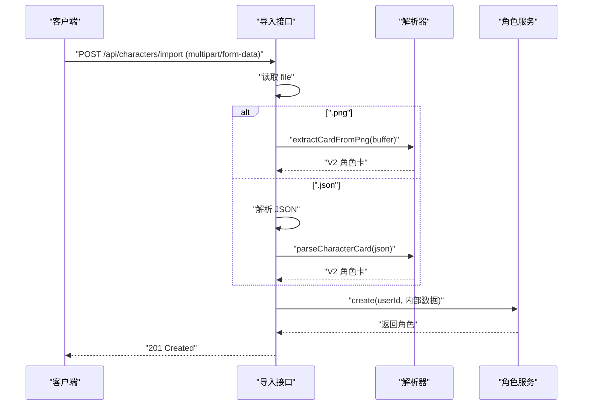
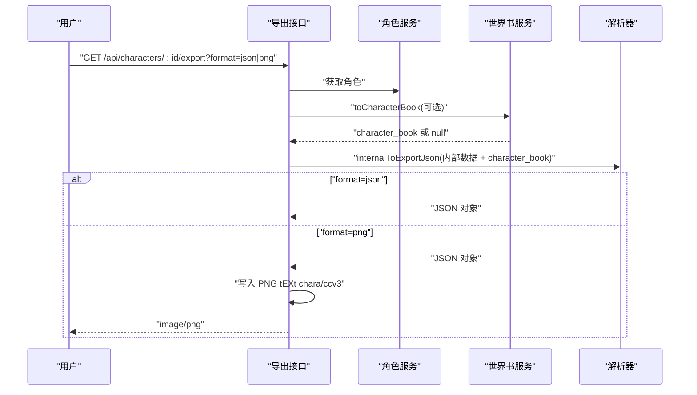
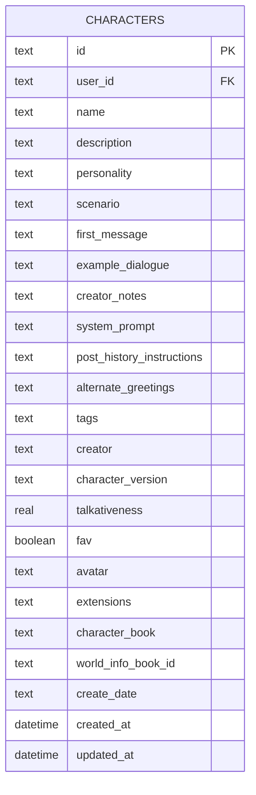
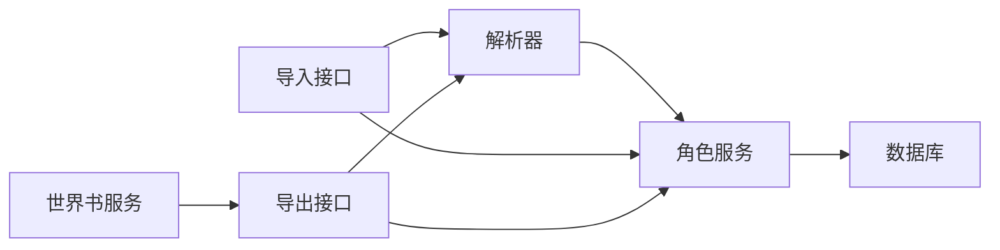

# 角色卡规范

<cite>
**本文档引用的文件**
- [README.md](file://README.md)
- [character-card-parser.ts](file://src/lib/parsers/character-card-parser.ts)
- [character-service.ts](file://src/lib/services/character-service.ts)
- [schema.ts](file://src/lib/db/schema.ts)
- [route.ts（导入）](file://src/app/api/characters/import/route.ts)
- [route.ts（导出）](file://src/app/api/characters/[id]/export/route.ts)
- [route.ts（角色列表）](file://src/app/api/characters/route.ts)
- [worldinfo-service.ts](file://src/lib/services/worldinfo-service.ts)
- [AlternateGreetingsEditor.tsx](file://src/components/characters/AlternateGreetingsEditor.tsx)
</cite>

## 目录
1. [简介](#简介)
2. [项目结构](#项目结构)
3. [核心组件](#核心组件)
4. [架构总览](#架构总览)
5. [详细组件分析](#详细组件分析)
6. [依赖关系分析](#依赖关系分析)
7. [性能考量](#性能考量)
8. [故障排查指南](#故障排查指南)
9. [结论](#结论)
10. [附录](#附录)

## 简介
本文件系统化梳理并发布 SillyTavern Next 的角色卡规范，覆盖 TavernCard V2/V3 格式、字段定义、数据类型、验证规则、版本兼容与迁移策略、最佳实践、常见错误与调试技巧，并提供完整示例与字段说明表格。项目特性明确支持“兼容 TavernCard V2/V3 规范，支持 PNG/JSON 双向导入导出”。

**章节来源**
- [README.md:11](file://README.md#L11)

## 项目结构
围绕角色卡的关键模块包括：
- 类型与解析：定义 V1/V2/V3 角色卡接口、解析与转换逻辑
- 服务层：Zod 校验、数据库持久化、导入/导出 API
- 数据库：角色表结构与字段映射
- 导入/导出 API：支持 PNG 与 JSON
- 世界书服务：character_book 的生成与嵌入
- 前端组件：替代问候语编辑器等

**图表来源**
- [character-card-parser.ts:13-65](file://src/lib/parsers/character-card-parser.ts#L13-L65)
- [character-service.ts:11-31](file://src/lib/services/character-service.ts#L11-L31)
- [schema.ts:21-53](file://src/lib/db/schema.ts#L21-L53)
- [route.ts（导入）:12-89](file://src/app/api/characters/import/route.ts#L12-L89)
- [route.ts（导出）:15-145](file://src/app/api/characters/[id]/export/route.ts#L15-L145)
- [worldinfo-service.ts:289-300](file://src/lib/services/worldinfo-service.ts#L289-L300)
- [AlternateGreetingsEditor.tsx:12](file://src/components/characters/AlternateGreetingsEditor.tsx#L12)

**章节来源**
- [character-card-parser.ts:13-65](file://src/lib/parsers/character-card-parser.ts#L13-L65)
- [character-service.ts:11-31](file://src/lib/services/character-service.ts#L11-L31)
- [schema.ts:21-53](file://src/lib/db/schema.ts#L21-L53)
- [route.ts（导入）:12-89](file://src/app/api/characters/import/route.ts#L12-L89)
- [route.ts（导出）:15-145](file://src/app/api/characters/[id]/export/route.ts#L15-L145)
- [worldinfo-service.ts:289-300](file://src/lib/services/worldinfo-service.ts#L289-L300)
- [AlternateGreetingsEditor.tsx:12](file://src/components/characters/AlternateGreetingsEditor.tsx#L12)

## 核心组件
- 角色卡类型与解析
  - V1：基础字段集合
  - V2：spec/spec_version + data 结构，扩展 creator_notes、system_prompt、post_history_instructions、alternate_greetings、tags、creator、character_version、extensions 等
  - V3：在 V2 基础上将 spec 升级为 “chara_card_v3” / “3.0”
- 服务层校验与持久化
  - Zod 输入/更新校验，支持 passthrough 以兼容未知字段
  - 数据库存储映射至角色表字段，含 JSON 序列化数组与对象
- 导入/导出 API
  - 导入：PNG（tEXt ccv3/chara）、JSON（V2/V3/裸数据）
  - 导出：JSON（顶层 V1 兼容字段 + V3 spec + data + character_book）与 PNG（同时写入 chara/ccv3）

**章节来源**
- [character-card-parser.ts:13-65](file://src/lib/parsers/character-card-parser.ts#L13-L65)
- [character-service.ts:11-31](file://src/lib/services/character-service.ts#L11-L31)
- [schema.ts:21-53](file://src/lib/db/schema.ts#L21-L53)
- [route.ts（导入）:12-89](file://src/app/api/characters/import/route.ts#L12-L89)
- [route.ts（导出）:15-145](file://src/app/api/characters/[id]/export/route.ts#L15-L145)

## 架构总览
角色卡在系统中的流转路径如下：

**图表来源**
- [route.ts（导入）:12-89](file://src/app/api/characters/import/route.ts#L12-L89)
- [route.ts（导出）:15-145](file://src/app/api/characters/[id]/export/route.ts#L15-L145)
- [character-card-parser.ts:104-129](file://src/lib/parsers/character-card-parser.ts#L104-L129)
- [character-service.ts:139-174](file://src/lib/services/character-service.ts#L139-L174)
- [schema.ts:21-53](file://src/lib/db/schema.ts#L21-L53)

## 详细组件分析

### 角色卡字段定义与验证规则
- 字段清单与类型
  - 基础字段：name、description、personality、scenario、firstMessage、exampleDialogue
  - 扩展字段：creatorNotes、systemPrompt、postHistoryInstructions、alternateGreetings（字符串数组）、tags（字符串数组）、creator、characterVersion
  - ST 扩展：talkativeness（数值 0~1）、fav（布尔）、avatar（字符串或 null）
  - 通用：extensions（Record<string, unknown>）、characterBook（V2 character_book，导出时由世界书转换而来）
  - 元数据：createDate（ISO 字符串，兼容原格式）
- 验证规则（Zod）
  - 字段长度限制与可选性
  - talkativeness 范围校验
  - JSON 字段（数组/对象）序列化存储
- 字段别名与映射
  - V1 first_mes ↔ V2 data.first_mes
  - V1 mes_example ↔ V2 data.mes_example
  - V1 creatorcomment ↔ V2 data.creator_notes（导出时顶层字段名）
  - talkativeness/fav 仅放入 extensions（与原项目导出一致）

**章节来源**
- [character-service.ts:11-31](file://src/lib/services/character-service.ts#L11-L31)
- [character-card-parser.ts:30-56](file://src/lib/parsers/character-card-parser.ts#L30-L56)
- [schema.ts:21-53](file://src/lib/db/schema.ts#L21-L53)

### 角色卡版本与兼容性
- V1 → V2：自动包装为 V2 data 结构
- V3 → V2：降级为 V2（data 结构相同）
- 导出策略：同时输出顶层 V1 兼容字段 + V3 spec + data + character_book，确保旧版与新版解析器均可用
- PNG 内嵌：优先读取 ccv3（V3），回退 chara（V2/V1），写入时同时写入 chara（占位）+ ccv3（主体）

**图表来源**
- [character-card-parser.ts:104-129](file://src/lib/parsers/character-card-parser.ts#L104-L129)
- [character-card-parser.ts:209-258](file://src/lib/parsers/character-card-parser.ts#L209-L258)

**章节来源**
- [character-card-parser.ts:67-85](file://src/lib/parsers/character-card-parser.ts#L67-L85)
- [character-card-parser.ts:104-129](file://src/lib/parsers/character-card-parser.ts#L104-L129)
- [character-card-parser.ts:209-258](file://src/lib/parsers/character-card-parser.ts#L209-L258)

### 导入流程（PNG/JSON）
- PNG
  - 从 tEXt chunk 读取 ccv3（优先）或 chara（回退）
  - 解析为结构化数据并转换为内部格式
  - 将 PNG 本身作为 base64 data URL 写入 avatar
- JSON
  - 支持 V2/V3 外壳 + data、裸 V2 数据、裸 V1 数据
  - 不支持的格式返回错误

**图表来源**
- [route.ts（导入）:12-89](file://src/app/api/characters/import/route.ts#L12-L89)
- [character-card-parser.ts:337-354](file://src/lib/parsers/character-card-parser.ts#L337-L354)

**章节来源**
- [route.ts（导入）:12-89](file://src/app/api/characters/import/route.ts#L12-L89)
- [character-card-parser.ts:266-293](file://src/lib/parsers/character-card-parser.ts#L266-L293)

### 导出流程（JSON/PNG）
- 推断 character_book 优先级：角色自带 characterBook → 绑定的全局世界书 → null
- 导出对象包含：顶层 V1 兼容字段 + V3 spec + data + optional character_book
- PNG 导出：同时写入 chara（V2 占位）+ ccv3（V3 主体）两份 tEXt chunk

**图表来源**
- [route.ts（导出）:15-145](file://src/app/api/characters/[id]/export/route.ts#L15-L145)
- [worldinfo-service.ts:289-300](file://src/lib/services/worldinfo-service.ts#L289-L300)
- [character-card-parser.ts:209-258](file://src/lib/parsers/character-card-parser.ts#L209-L258)
- [character-card-parser.ts:299-334](file://src/lib/parsers/character-card-parser.ts#L299-L334)

**章节来源**
- [route.ts（导出）:15-145](file://src/app/api/characters/[id]/export/route.ts#L15-L145)
- [worldinfo-service.ts:289-300](file://src/lib/services/worldinfo-service.ts#L289-L300)
- [character-card-parser.ts:209-258](file://src/lib/parsers/character-card-parser.ts#L209-L258)

### 数据模型与持久化
- 角色表字段映射
  - V1 基础字段：name、description、personality、scenario、firstMessage、exampleDialogue
  - V2 扩展字段：creatorNotes、systemPrompt、postHistoryInstructions、alternateGreetings（JSON）、tags（JSON）、creator、characterVersion
  - ST 扩展：talkativeness、fav、avatar、extensions（JSON）、characterBook（JSON）
  - 关联：worldInfoBookId（可选）
- 服务层序列化/反序列化
  - JSON 字段统一以字符串形式存储，读取时解析
  - talkativeness 默认 0.5，fav 默认 false

**图表来源**
- [schema.ts:21-53](file://src/lib/db/schema.ts#L21-L53)

**章节来源**
- [schema.ts:21-53](file://src/lib/db/schema.ts#L21-L53)
- [character-service.ts:86-113](file://src/lib/services/character-service.ts#L86-L113)

### 前端交互与最佳实践
- 替代问候语编辑器
  - 支持动态增删行，逐行编辑
  - 与服务层 alternateGreetings 字段双向绑定
- 最佳实践
  - 导出时如需携带头像，请使用 PNG 格式（JSON 导出不内嵌 base64 头像）
  - talkativeness 与 fav 仅放入 extensions（与原项目导出一致）
  - character_book 优先使用绑定的全局世界书实时生成，避免冗余
  - 使用 V3 spec（chara_card_v3 / 3.0）以提升兼容性

**章节来源**
- [AlternateGreetingsEditor.tsx:12](file://src/components/characters/AlternateGreetingsEditor.tsx#L12)
- [character-card-parser.ts:209-258](file://src/lib/parsers/character-card-parser.ts#L209-L258)

## 依赖关系分析
- 组件耦合
  - 解析器与服务层解耦：解析器负责格式识别与转换，服务层负责校验与持久化
  - 导入/导出 API 仅依赖解析器与服务层，降低复杂度
- 外部依赖
  - PNG tEXt chunk 读写：png-chunks-extract/encode + png-chunk-text
  - 校验：Zod
  - 存储：Drizzle ORM + SQLite

**图表来源**
- [character-card-parser.ts:104-129](file://src/lib/parsers/character-card-parser.ts#L104-L129)
- [character-service.ts:139-174](file://src/lib/services/character-service.ts#L139-L174)
- [route.ts（导入）:12-89](file://src/app/api/characters/import/route.ts#L12-L89)
- [route.ts（导出）:15-145](file://src/app/api/characters/[id]/export/route.ts#L15-L145)
- [worldinfo-service.ts:289-300](file://src/lib/services/worldinfo-service.ts#L289-L300)

**章节来源**
- [character-card-parser.ts:104-129](file://src/lib/parsers/character-card-parser.ts#L104-L129)
- [character-service.ts:139-174](file://src/lib/services/character-service.ts#L139-L174)
- [route.ts（导入）:12-89](file://src/app/api/characters/import/route.ts#L12-L89)
- [route.ts（导出）:15-145](file://src/app/api/characters/[id]/export/route.ts#L15-L145)
- [worldinfo-service.ts:289-300](file://src/lib/services/worldinfo-service.ts#L289-L300)

## 性能考量
- JSON 导出不内嵌 base64 头像，避免体积膨胀
- character_book 优先使用实时转换，减少重复存储
- PNG 导出时仅写入必要 tEXt chunk，避免多余操作
- 服务层批量序列化/反序列化 JSON 字段，注意大对象的内存占用

[本节为通用指导，无需具体文件分析]

## 故障排查指南
- 导入失败
  - 确认文件扩展名为 .png 或 .json
  - PNG 必须包含 ccv3 或 chara tEXt chunk；否则返回“未找到角色数据”
  - JSON 必须符合 V2/V3 外壳或 V1/V2 裸数据格式
- 导出失败
  - 确认角色存在且当前用户拥有权限
  - format 参数仅接受 json 或 png
- 字段异常
  - talkativeness 超出范围 0~1 将被拒绝
  - JSON 数组/对象字段需正确序列化
  - avatar 仅在 PNG 导出时内嵌 base64，JSON 导出仅保留文件名引用

**章节来源**
- [route.ts（导入）:23-75](file://src/app/api/characters/import/route.ts#L23-L75)
- [route.ts（导出）:126-139](file://src/app/api/characters/[id]/export/route.ts#L126-L139)
- [character-service.ts:11-31](file://src/lib/services/character-service.ts#L11-L31)

## 结论
本规范明确了 SillyTavern Next 的角色卡格式、字段定义、验证规则与版本兼容策略。通过统一的解析与导出流程，既保证了与 TavernCard V2/V3 的完全兼容，又兼顾了与原项目的导出一致性。建议在实际使用中遵循最佳实践，优先采用 V3 规范与 PNG 导出以获得更佳的兼容性与可移植性。

[本节为总结，无需具体文件分析]

## 附录

### 字段说明表
- 基础字段
  - name：字符串，必填，长度限制
  - description：字符串，可选
  - personality：字符串，可选
  - scenario：字符串，可选
  - firstMessage：字符串，可选
  - exampleDialogue：字符串，可选
- 扩展字段
  - creatorNotes：字符串，可选
  - systemPrompt：字符串，可选
  - postHistoryInstructions：字符串，可选
  - alternateGreetings：字符串数组，可选
  - tags：字符串数组，可选
  - creator：字符串，可选
  - characterVersion：字符串，可选
- ST 扩展
  - talkativeness：数值（0~1），可选
  - fav：布尔，可选
  - avatar：字符串或 null，可选
- 通用
  - extensions：对象，可选
  - characterBook：V2 character_book，可选
  - createDate：ISO 字符串，可选

**章节来源**
- [character-service.ts:11-31](file://src/lib/services/character-service.ts#L11-L31)
- [character-card-parser.ts:30-56](file://src/lib/parsers/character-card-parser.ts#L30-L56)
- [schema.ts:21-53](file://src/lib/db/schema.ts#L21-L53)

### 示例与迁移指南
- 从 V1 迁移到 V2
  - 将 V1 字段包装进 data 对象，设置 spec 为 “chara_card_v2”，spec_version 为 “2.0”
- 从 V2 迁移到 V3
  - 保持 data 结构不变，将 spec 升级为 “chara_card_v3”，spec_version 升级为 “3.0”
- 导入/导出
  - 导入：支持 PNG（ccv3/chara）与 JSON（V2/V3/裸数据）
  - 导出：JSON（顶层 V1 + V3 spec + data + character_book）与 PNG（chara/ccv3）

**章节来源**
- [character-card-parser.ts:87-101](file://src/lib/parsers/character-card-parser.ts#L87-L101)
- [character-card-parser.ts:104-129](file://src/lib/parsers/character-card-parser.ts#L104-L129)
- [character-card-parser.ts:209-258](file://src/lib/parsers/character-card-parser.ts#L209-L258)
- [route.ts（导入）:12-89](file://src/app/api/characters/import/route.ts#L12-L89)
- [route.ts（导出）:15-145](file://src/app/api/characters/[id]/export/route.ts#L15-L145)