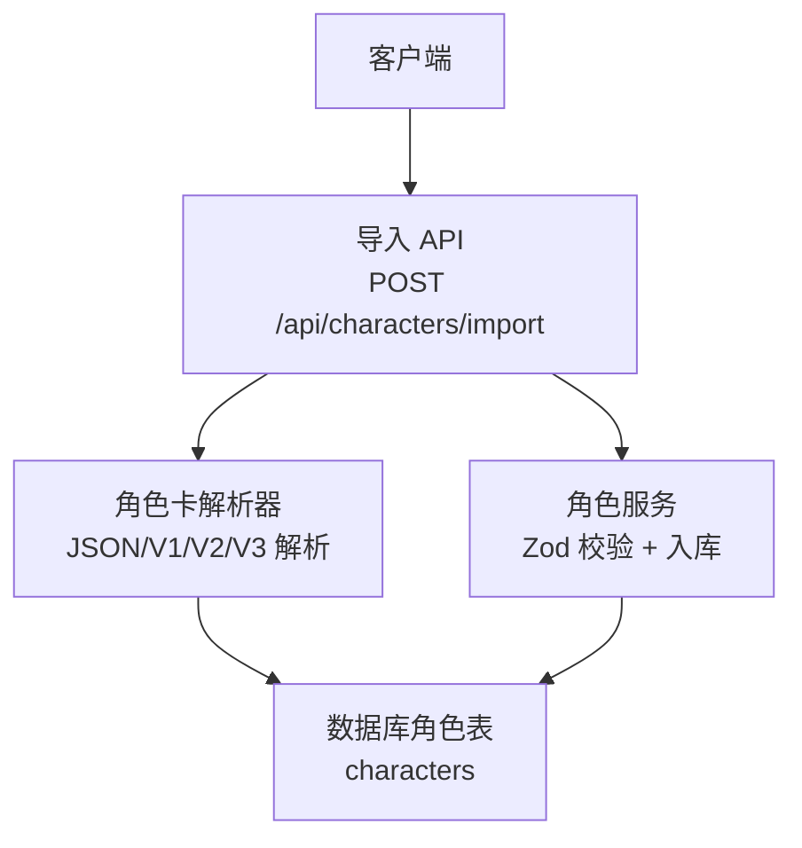
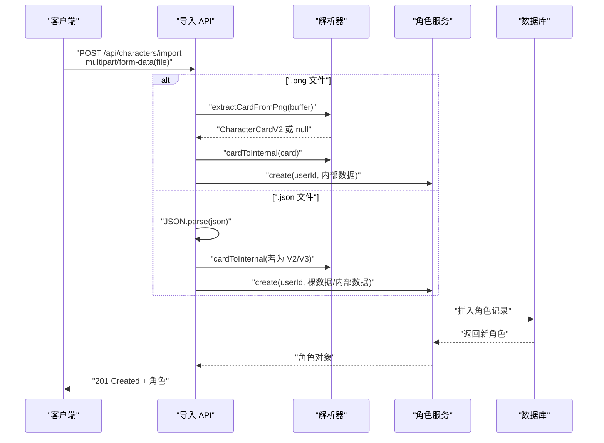
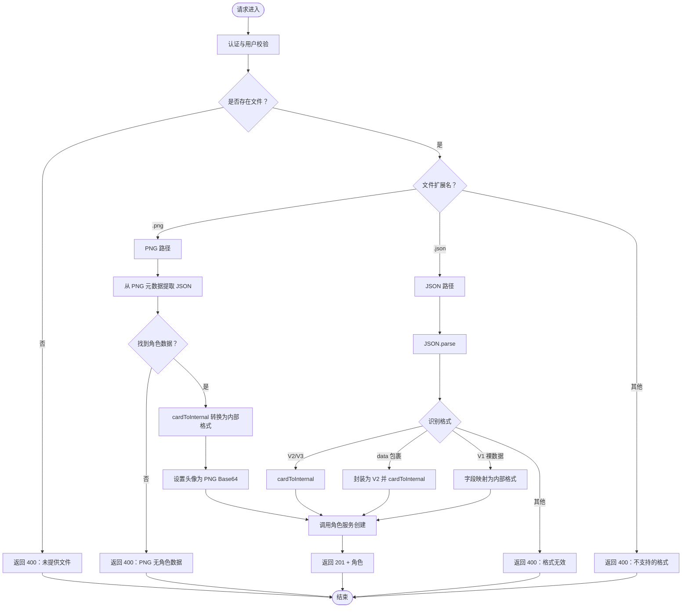
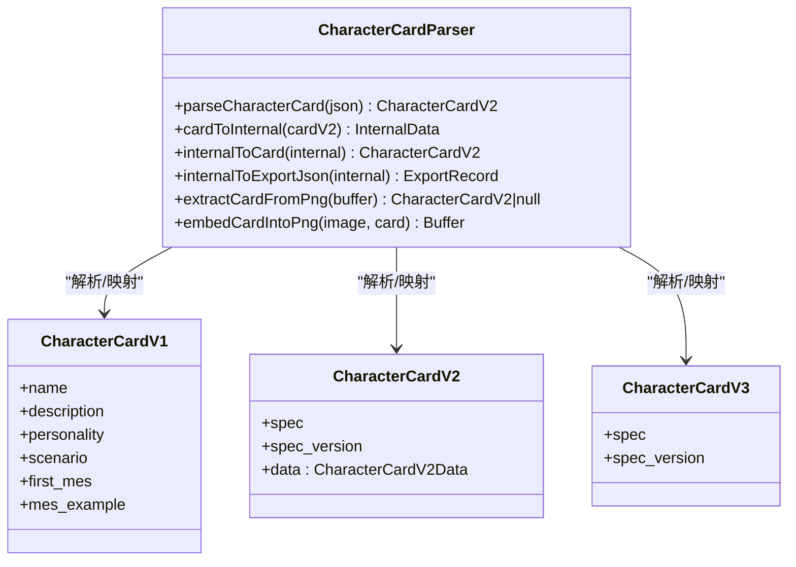
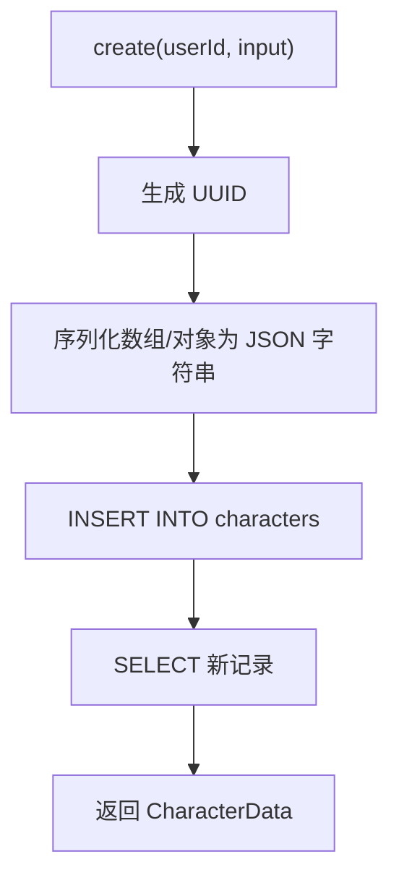
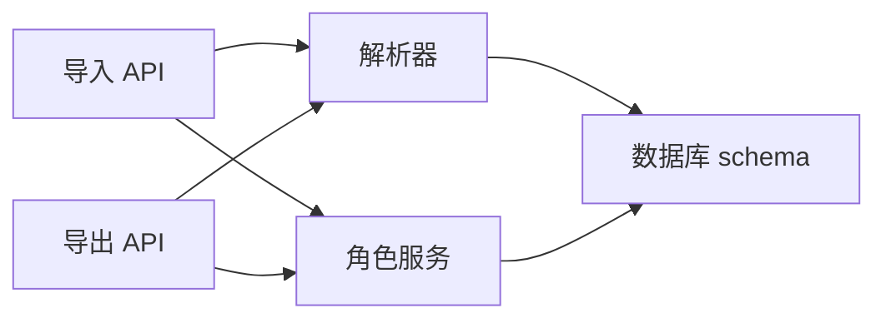

# JSON 角色卡导入

<cite>
**本文档引用的文件**
- [src/app/api/characters/import/route.ts](file://src/app/api/characters/import/route.ts)
- [src/lib/parsers/character-card-parser.ts](file://src/lib/parsers/character-card-parser.ts)
- [src/lib/services/character-service.ts](file://src/lib/services/character-service.ts)
- [src/lib/db/schema.ts](file://src/lib/db/schema.ts)
- [src/types/index.ts](file://src/types/index.ts)
- [src/app/api/characters/[id]/export/route.ts](file://src/app/api/characters/[id]/export/route.ts)
</cite>

## 目录
1. [简介](#简介)
2. [项目结构](#项目结构)
3. [核心组件](#核心组件)
4. [架构总览](#架构总览)
5. [详细组件分析](#详细组件分析)
6. [依赖关系分析](#依赖关系分析)
7. [性能考量](#性能考量)
8. [故障排查指南](#故障排查指南)
9. [结论](#结论)
10. [附录](#附录)

## 简介
本文件系统性阐述本项目中“JSON 角色卡导入”的实现与使用方法，覆盖以下要点：
- 多种 JSON 格式的兼容处理：Tavern V1、Tavern V2（chara_card_v2）、Tavern V3（chara_card_v3）以及“裸数据”格式。
- JSON 数据结构解析流程、字段映射规则与数据转换机制。
- 不同版本角色卡的差异处理、向后兼容性与数据完整性验证。
- JSON 校验规则、错误处理策略与导入进度反馈建议。
- 各类 JSON 格式的示例与导入最佳实践。

## 项目结构
围绕角色卡导入的关键模块与职责如下：
- API 层：接收上传文件，识别类型并调用解析器与服务层。
- 解析器层：负责 JSON/V1/V2/V3 的统一解析、降级与 PNG 元数据读写。
- 服务层：对输入进行严格校验与入库。
- 数据层：角色表结构与字段映射。
- 类型层：统一的数据模型与接口定义。

图表来源
- [src/app/api/characters/import/route.ts:12-88](file://src/app/api/characters/import/route.ts#L12-L88)
- [src/lib/parsers/character-card-parser.ts:104-129](file://src/lib/parsers/character-card-parser.ts#L104-L129)
- [src/lib/services/character-service.ts:11-31](file://src/lib/services/character-service.ts#L11-L31)
- [src/lib/db/schema.ts:21-53](file://src/lib/db/schema.ts#L21-L53)

章节来源
- [src/app/api/characters/import/route.ts:12-88](file://src/app/api/characters/import/route.ts#L12-L88)
- [src/lib/parsers/character-card-parser.ts:104-129](file://src/lib/parsers/character-card-parser.ts#L104-L129)
- [src/lib/services/character-service.ts:11-31](file://src/lib/services/character-service.ts#L11-L31)
- [src/lib/db/schema.ts:21-53](file://src/lib/db/schema.ts#L21-L53)

## 核心组件
- 导入 API：支持 .json 与 .png 文件，自动识别格式并解析。
- 角色卡解析器：统一解析 V1/V2/V3，提供 PNG 元数据读写能力。
- 角色服务：基于 Zod 的输入校验与入库。
- 数据库表：完全兼容 Tavern V2 规范，字段齐全且可扩展。

章节来源
- [src/app/api/characters/import/route.ts:12-88](file://src/app/api/characters/import/route.ts#L12-L88)
- [src/lib/parsers/character-card-parser.ts:132-154](file://src/lib/parsers/character-card-parser.ts#L132-L154)
- [src/lib/services/character-service.ts:11-31](file://src/lib/services/character-service.ts#L11-L31)
- [src/lib/db/schema.ts:21-53](file://src/lib/db/schema.ts#L21-L53)

## 架构总览
导入流程从 API 接收文件开始，根据文件扩展名选择解析路径：PNG 走 PNG 元数据提取，JSON 走多格式识别与降级；随后统一转换为内部格式并写入数据库。

图表来源
- [src/app/api/characters/import/route.ts:23-83](file://src/app/api/characters/import/route.ts#L23-L83)
- [src/lib/parsers/character-card-parser.ts:337-353](file://src/lib/parsers/character-card-parser.ts#L337-L353)
- [src/lib/services/character-service.ts:139-174](file://src/lib/services/character-service.ts#L139-L174)

## 详细组件分析

### 组件一：导入 API（支持 JSON 与 PNG）
- 功能概述
  - 认证校验与用户 ID 获取。
  - 读取 multipart 文件，按扩展名分流。
  - PNG：从 PNG 元数据中提取角色卡 JSON，再统一转换为内部格式。
  - JSON：识别 V2/V3、裸 V1 数据或“data 包裹”格式，统一转换为内部格式。
  - 调用角色服务创建角色，并返回 201。
- 错误处理
  - 未登录、无文件、不支持的文件类型、PNG 无角色数据、JSON 格式无效、服务器异常等均返回相应状态码与错误信息。

图表来源
- [src/app/api/characters/import/route.ts:12-88](file://src/app/api/characters/import/route.ts#L12-L88)

章节来源
- [src/app/api/characters/import/route.ts:12-88](file://src/app/api/characters/import/route.ts#L12-L88)

### 组件二：角色卡解析器（JSON/V1/V2/V3 与 PNG 元数据）
- JSON 解析与降级
  - V3：直接降级为 V2（data 结构一致）。
  - V2：直接使用。
  - V1 或裸数据：通过 v1ToV2 与 cardToInternal 统一转换。
  - 无法识别则抛错。
- 字段映射与转换
  - cardToInternal 将 V2 data 映射到内部格式，处理可选字段、数组与布尔值。
  - internalToCard 将内部格式还原为 V2 JSON，保证导出一致性。
- PNG 元数据读写
  - 读取优先级：ccv3（V3）> chara（V2/V1）。
  - 写入同时保留 chara 与 ccv3，确保向后兼容。
- 导出辅助
  - internalToExportJson 输出兼容旧版的顶层字段与 V3 spec，便于跨版本互通。

图表来源
- [src/lib/parsers/character-card-parser.ts:14-65](file://src/lib/parsers/character-card-parser.ts#L14-L65)
- [src/lib/parsers/character-card-parser.ts:104-154](file://src/lib/parsers/character-card-parser.ts#L104-L154)
- [src/lib/parsers/character-card-parser.ts:209-258](file://src/lib/parsers/character-card-parser.ts#L209-L258)

章节来源
- [src/lib/parsers/character-card-parser.ts:104-129](file://src/lib/parsers/character-card-parser.ts#L104-L129)
- [src/lib/parsers/character-card-parser.ts:132-154](file://src/lib/parsers/character-card-parser.ts#L132-L154)
- [src/lib/parsers/character-card-parser.ts:209-258](file://src/lib/parsers/character-card-parser.ts#L209-L258)
- [src/lib/parsers/character-card-parser.ts:266-293](file://src/lib/parsers/character-card-parser.ts#L266-L293)
- [src/lib/parsers/character-card-parser.ts:299-334](file://src/lib/parsers/character-card-parser.ts#L299-L334)

### 组件三：角色服务（Zod 校验与入库）
- 输入校验
  - 使用 Zod schema 对传入字段进行最小长度、范围与类型校验，允许未知字段通过（passthrough）。
- 入库流程
  - 自动生成 UUID、时间戳。
  - 数组与对象字段统一序列化为 JSON 字符串存储。
  - 返回完整序列化后的角色数据。

图表来源
- [src/lib/services/character-service.ts:139-174](file://src/lib/services/character-service.ts#L139-L174)
- [src/lib/db/schema.ts:21-53](file://src/lib/db/schema.ts#L21-L53)

章节来源
- [src/lib/services/character-service.ts:11-31](file://src/lib/services/character-service.ts#L11-L31)
- [src/lib/services/character-service.ts:139-174](file://src/lib/services/character-service.ts#L139-L174)
- [src/lib/db/schema.ts:21-53](file://src/lib/db/schema.ts#L21-L53)

### 组件四：数据库表（角色表）
- 字段设计
  - 兼容 Tavern V2 规范，包含基础字段与扩展字段。
  - 数组与对象字段以 JSON 文本形式存储，便于灵活扩展。
- 关系与约束
  - 外键约束保证用户与角色的关系。
  - 时间戳字段用于排序与审计。

章节来源
- [src/lib/db/schema.ts:21-53](file://src/lib/db/schema.ts#L21-L53)

### 组件五：类型定义（接口与规范）
- 角色表单数据接口：与数据库字段对齐，去除服务端专有字段。
- TavernCard V1/V2 接口：明确字段名称与类型，便于前后端一致性。

章节来源
- [src/types/index.ts:190-243](file://src/types/index.ts#L190-L243)

## 依赖关系分析
- 导入 API 依赖解析器与服务层。
- 解析器依赖 PNG 元数据读写库与内部转换函数。
- 服务层依赖数据库 schema 与 Zod 校验。
- 导出 API 依赖解析器与服务层，用于生成 PNG/JSON。

图表来源
- [src/app/api/characters/import/route.ts:1-7](file://src/app/api/characters/import/route.ts#L1-L7)
- [src/app/api/characters/[id]/export/route.ts](file://src/app/api/characters/[id]/export/route.ts#L1-L31)
- [src/lib/parsers/character-card-parser.ts:1-12](file://src/lib/parsers/character-card-parser.ts#L1-L12)
- [src/lib/db/schema.ts:21-53](file://src/lib/db/schema.ts#L21-L53)

章节来源
- [src/app/api/characters/import/route.ts:1-7](file://src/app/api/characters/import/route.ts#L1-L7)
- [src/app/api/characters/[id]/export/route.ts](file://src/app/api/characters/[id]/export/route.ts#L1-L31)
- [src/lib/parsers/character-card-parser.ts:1-12](file://src/lib/parsers/character-card-parser.ts#L1-L12)
- [src/lib/db/schema.ts:21-53](file://src/lib/db/schema.ts#L21-L53)

## 性能考量
- JSON 解析与字段映射为纯内存操作，复杂度近似 O(n)（n 为字段数量）。
- PNG 元数据读写涉及二进制与 base64 编解码，I/O 成本主要取决于图片大小。
- 数据库写入采用批量序列化与单条插入，建议在高并发场景下控制请求速率与连接池配置。
- 建议对大尺寸头像采用外部存储并在 JSON 中仅保存引用，而非内嵌 base64。

## 故障排查指南
- 常见错误与处理
  - 未登录或用户 ID 缺失：返回 401，检查鉴权中间件与会话。
  - 未提供文件：返回 400，确认 multipart 表单与字段名。
  - PNG 无角色数据：返回 400，确认 PNG 是否包含 ccv3/chara 文本块。
  - JSON 格式无效：返回 400，检查 spec、data 或顶层字段是否符合预期。
  - 服务器异常：返回 500，查看日志定位具体异常。
- 建议的日志与反馈
  - 在导入 API 中记录文件名、格式、解析阶段与错误堆栈。
  - 对于大文件导入，可在前端显示进度条或分片上传策略（当前实现为一次性读取）。

章节来源
- [src/app/api/characters/import/route.ts:12-88](file://src/app/api/characters/import/route.ts#L12-L88)

## 结论
本项目的 JSON 角色卡导入功能通过“多格式识别 + 统一降级 + 内部格式转换 + 严格校验 + 数据库入库”的链路，实现了对 Tavern V1/V2/V3 的全面兼容与向后兼容。配合 PNG 元数据读写，既满足 JSON 导入需求，也保留了传统 PNG 内嵌角色卡的能力。建议在生产环境中结合日志与限流策略，确保导入过程的稳定性与可观测性。

## 附录

### JSON 格式与字段映射规则
- Tavern V1（裸数据）
  - 顶层字段：name、description、personality、scenario、first_mes、mes_example。
  - 映射至内部格式：name、description、personality、scenario、firstMessage、exampleDialogue。
- Tavern V2（chara_card_v2）
  - 顶层字段：spec、spec_version、data。
  - data 字段：name、description、personality、scenario、first_mes、mes_example、creator_notes、system_prompt、post_history_instructions、alternate_greetings、tags、creator、character_version、extensions、talkativeness、fav、create_date、character_book、group_only_greetings。
  - 映射至内部格式：同上，数组与布尔值按需处理。
- Tavern V3（chara_card_v3）
  - 顶层字段：spec、spec_version、data。
  - 降级策略：直接视为 V2，保持 data 结构一致。
- “data 包裹”格式
  - 顶层无 spec，但包含 data 字段，自动封装为 V2 并解析。
- 导出兼容
  - internalToExportJson 输出顶层兼容字段与 V3 spec，便于跨版本互通。

章节来源
- [src/lib/parsers/character-card-parser.ts:14-65](file://src/lib/parsers/character-card-parser.ts#L14-L65)
- [src/lib/parsers/character-card-parser.ts:132-154](file://src/lib/parsers/character-card-parser.ts#L132-L154)
- [src/lib/parsers/character-card-parser.ts:209-258](file://src/lib/parsers/character-card-parser.ts#L209-L258)
- [src/types/index.ts:214-243](file://src/types/index.ts#L214-L243)

### 导入最佳实践
- 文件命名与扩展
  - .json：推荐使用 V2/V3 或“data 包裹”格式，便于统一处理。
  - .png：确保 PNG 包含 ccv3/chara 文本块，避免导入失败。
- 字段完整性
  - 至少提供 name；first_mes 或 description 至少一个，以识别 V1/V2。
  - V2/V3 的 data 字段应包含必要字段，避免空字符串或空数组导致的语义偏差。
- 头像与体积
  - JSON 导出不内嵌 base64 头像，建议使用 PNG 导出或外部存储。
- 错误恢复
  - 对于失败的导入，建议保留原始文件以便二次尝试或人工核对。
- 批量导入
  - 当前 API 逐个文件处理，建议前端分批上传并记录进度与错误明细。

### 导出与回流
- 导出 API 支持 format=png|json，导出时会将绑定的世界书嵌入到 data.character_book，并输出顶层兼容字段与 V3 spec，确保与旧版应用兼容。

章节来源
- [src/app/api/characters/[id]/export/route.ts](file://src/app/api/characters/[id]/export/route.ts#L15-L31)
- [src/lib/parsers/character-card-parser.ts:209-258](file://src/lib/parsers/character-card-parser.ts#L209-L258)