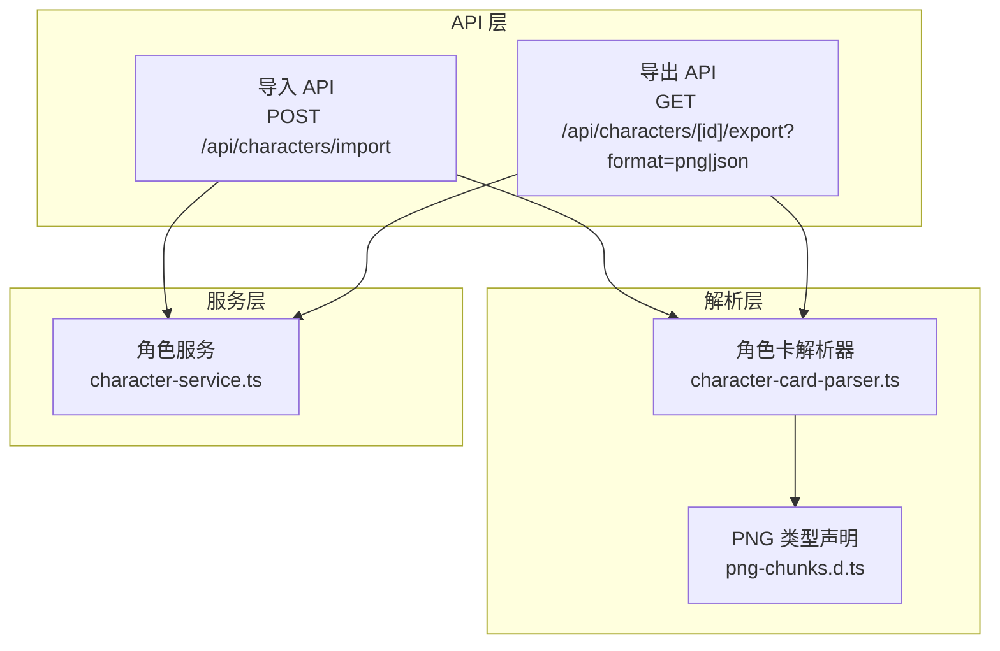
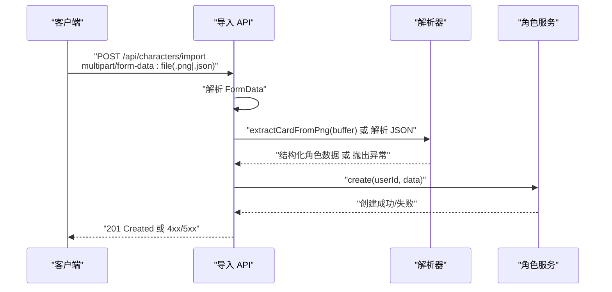
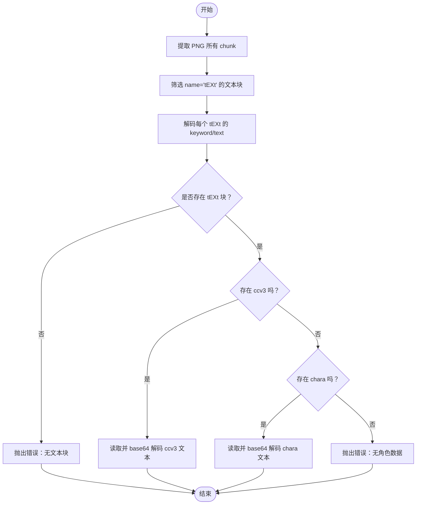
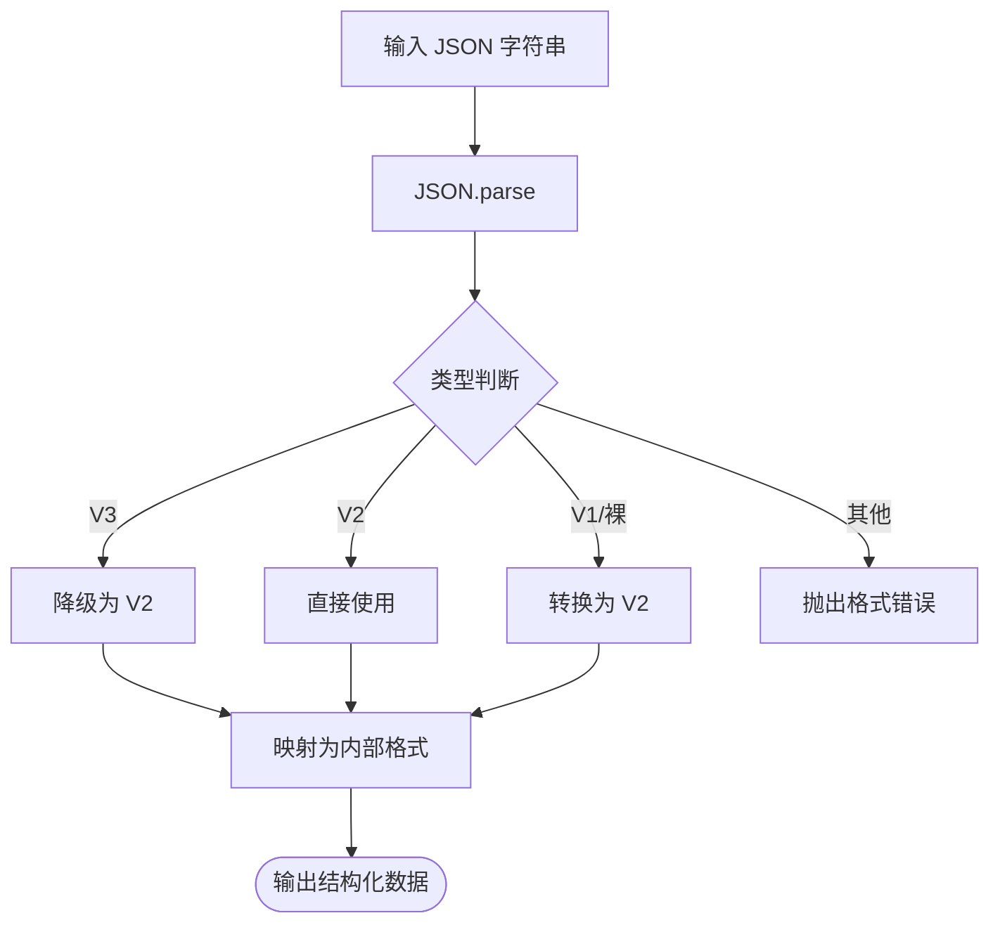
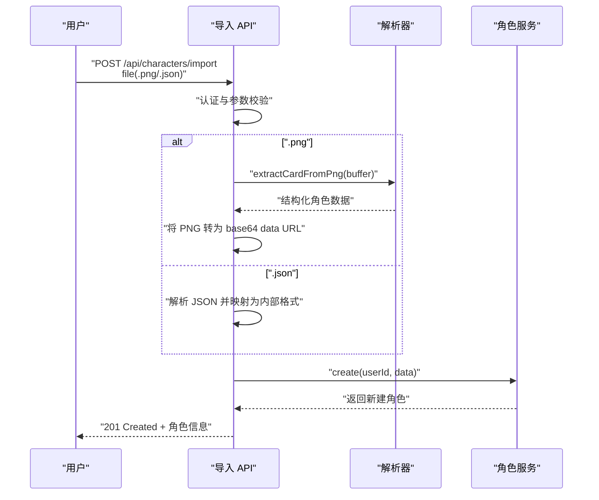
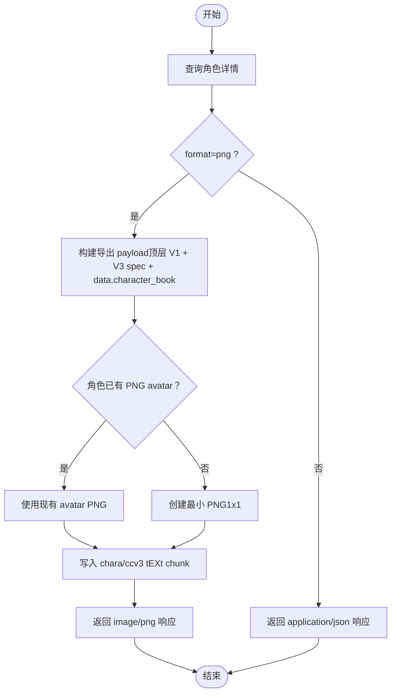
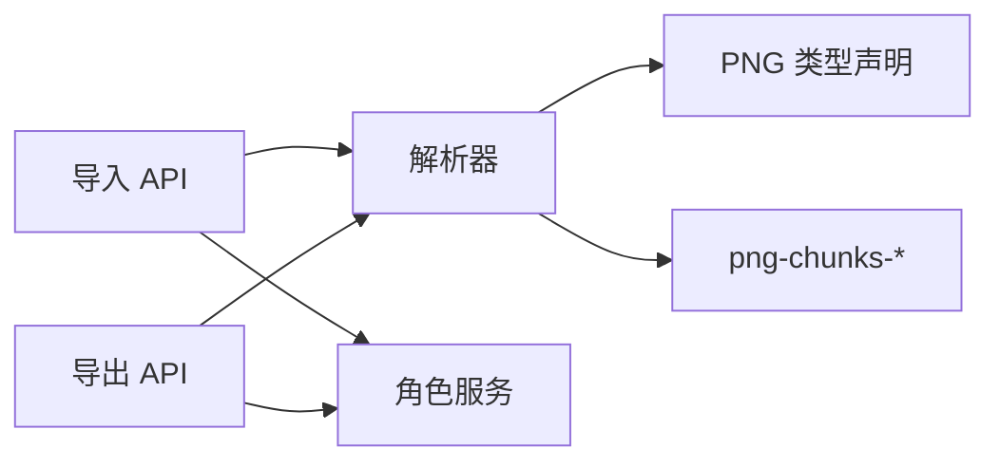

# PNG 角色卡导入

<cite>
**本文档引用的文件**
- [character-card-parser.ts](file://src/lib/parsers/character-card-parser.ts)
- [route.ts（导入）](file://src/app/api/characters/import/route.ts)
- [route.ts（导出）](file://src/app/api/characters/[id]/export/route.ts)
- [character-service.ts](file://src/lib/services/character-service.ts)
- [png-chunks.d.ts](file://src/types/png-chunks.d.ts)
- [package.json](file://package.json)
</cite>

## 目录
1. [简介](#简介)
2. [项目结构](#项目结构)
3. [核心组件](#核心组件)
4. [架构总览](#架构总览)
5. [详细组件分析](#详细组件分析)
6. [依赖关系分析](#依赖关系分析)
7. [性能考量](#性能考量)
8. [故障排除指南](#故障排除指南)
9. [结论](#结论)
10. [附录](#附录)

## 简介
本文件系统性阐述 PNG 角色卡导入功能的设计与实现，覆盖以下关键点：
- PNG tEXt chunk 的提取机制与优先级策略
- 角色卡数据的读取、解析与转换流程
- PNG 角色卡的数据结构规范、编码方式与 avatar 图像的 base64 处理
- 导入流程中的数据验证、错误处理与安全检查
- PNG 角色卡的兼容性、版本支持与格式要求
- 完整的导入 API 使用示例与故障排除指南

## 项目结构
PNG 角色卡导入能力由三层协作完成：
- API 层：接收上传文件，分发到解析器与服务层
- 解析层：负责 PNG tEXt chunk 的读取/写入、角色卡格式解析与转换
- 服务层：负责角色实体的创建与持久化

图表来源
- [route.ts（导入）:12-89](file://src/app/api/characters/import/route.ts#L12-L89)
- [route.ts（导出）:15-144](file://src/app/api/characters/[id]/export/route.ts#L15-L144)
- [character-card-parser.ts:1-353](file://src/lib/parsers/character-card-parser.ts#L1-L353)
- [character-service.ts:115-174](file://src/lib/services/character-service.ts#L115-L174)

章节来源
- [route.ts（导入）:1-90](file://src/app/api/characters/import/route.ts#L1-L90)
- [route.ts（导出）:1-162](file://src/app/api/characters/[id]/export/route.ts#L1-L162)
- [character-card-parser.ts:1-353](file://src/lib/parsers/character-card-parser.ts#L1-L353)
- [character-service.ts:1-252](file://src/lib/services/character-service.ts#L1-L252)

## 核心组件
- 角色卡解析器：负责 PNG tEXt chunk 的读取与写入、V1/V2/V3 格式解析与转换、内部格式映射
- 导入 API：接收 .png/.json 文件，调用解析器与服务层完成导入
- 导出 API：将角色数据导出为 JSON 或 PNG，PNG 导出会同时写入 chara/ccv3 两份 tEXt chunk
- 角色服务：对角色实体进行创建、查询、更新、删除等操作，并执行输入校验

章节来源
- [character-card-parser.ts:13-154](file://src/lib/parsers/character-card-parser.ts#L13-L154)
- [route.ts（导入）:12-89](file://src/app/api/characters/import/route.ts#L12-L89)
- [route.ts（导出）:15-144](file://src/app/api/characters/[id]/export/route.ts#L15-L144)
- [character-service.ts:11-53](file://src/lib/services/character-service.ts#L11-L53)

## 架构总览
PNG 角色卡导入的关键流程如下：
- 客户端上传 .png/.json 文件
- 导入 API 识别文件类型并分流处理
- 若为 .png：解析 tEXt chunk，优先读取 ccv3，其次读取 chara；若均无则报错
- 若为 .json：根据 spec 或裸数据结构进行解析与转换
- 将解析结果映射为内部格式并调用角色服务创建角色
- 成功返回新角色信息

图表来源
- [route.ts（导入）:12-89](file://src/app/api/characters/import/route.ts#L12-L89)
- [character-card-parser.ts:337-344](file://src/lib/parsers/character-card-parser.ts#L337-L344)
- [character-service.ts:139-174](file://src/lib/services/character-service.ts#L139-L174)

## 详细组件分析

### 组件一：PNG tEXt chunk 提取与写入
- 提取机制
  - 使用 png-chunks-extract 解析 PNG 的所有 chunk
  - 过滤出 name 为 "tEXt" 的文本块
  - 使用 png-chunk-text.decode 解码关键字与文本内容
- 读取优先级
  - 优先查找关键字为 "ccv3" 的 tEXt chunk（V3）
  - 若不存在，回退到关键字为 "chara" 的 tEXt chunk（V2/V1）
  - 若均不存在，抛出错误
- 写入策略
  - 导出时同时写入 chara（V2 占位）与 ccv3（V3 主体）两个 tEXt chunk，确保兼容
  - 写入前先移除已有同名 tEXt chunk，避免重复
  - 文本内容采用 base64 编码存储

图表来源
- [character-card-parser.ts:266-293](file://src/lib/parsers/character-card-parser.ts#L266-L293)

章节来源
- [character-card-parser.ts:266-334](file://src/lib/parsers/character-card-parser.ts#L266-L334)
- [png-chunks.d.ts:1-16](file://src/types/png-chunks.d.ts#L1-L16)

### 组件二：角色卡数据读取与解析
- 输入来源
  - PNG：从 tEXt chunk 中读取 base64 文本并解码为 UTF-8 JSON
  - JSON：直接解析 JSON 字符串
- 解析规则
  - V3：直接降级为 V2（data 结构一致）
  - V2：直接使用
  - V1 或裸数据：转换为 V2
  - 其他格式：抛出错误
- 输出映射
  - 统一映射为内部格式（如 firstMessage、exampleDialogue、alternateGreetings 等）

图表来源
- [character-card-parser.ts:104-129](file://src/lib/parsers/character-card-parser.ts#L104-L129)
- [character-card-parser.ts:132-154](file://src/lib/parsers/character-card-parser.ts#L132-L154)

章节来源
- [character-card-parser.ts:104-154](file://src/lib/parsers/character-card-parser.ts#L104-L154)

### 组件三：导入 API 工作流
- 请求处理
  - 认证：需要登录态
  - 读取 multipart/form-data 中的 file 字段
  - 根据文件扩展名选择处理路径
- PNG 路径
  - 调用 extractCardFromPng 读取并解析
  - 将 PNG 本身转换为 data:image/png;base64 的字符串作为 avatar
- JSON 路径
  - 支持 V2/V3、V1 裸数据等多种格式
  - 自动映射为内部格式
- 创建角色
  - 调用 characterService.create 完成入库
  - 返回 201 与新建角色信息

图表来源
- [route.ts（导入）:12-89](file://src/app/api/characters/import/route.ts#L12-L89)
- [character-card-parser.ts:337-344](file://src/lib/parsers/character-card-parser.ts#L337-L344)
- [character-service.ts:139-174](file://src/lib/services/character-service.ts#L139-L174)

章节来源
- [route.ts（导入）:12-89](file://src/app/api/characters/import/route.ts#L12-L89)

### 组件四：导出 API 与 PNG 嵌入
- 导出格式
  - JSON：输出顶层 V1 兼容字段 + V3 spec + data.character_book
  - PNG：输出与 JSON 相同的 payload，同时写入 chara（V2 占位）+ ccv3（V3 主体）两份 tEXt chunk
- 底图选择
  - 若角色已有 data:image/png;base64 的 avatar，则复用该图像
  - 否则创建最小有效 PNG（1x1 白色像素）
- 响应头
  - PNG 导出设置 Content-Type 为 image/png，并附带合适的下载文件名

图表来源
- [route.ts（导出）:15-144](file://src/app/api/characters/[id]/export/route.ts#L15-L144)
- [character-card-parser.ts:299-334](file://src/lib/parsers/character-card-parser.ts#L299-L334)

章节来源
- [route.ts（导出）:15-162](file://src/app/api/characters/[id]/export/route.ts#L15-L162)
- [character-card-parser.ts:299-334](file://src/lib/parsers/character-card-parser.ts#L299-L334)

### 组件五：数据验证与安全检查
- 输入验证
  - 导入 API：校验文件存在性、扩展名、JSON 语法与结构
  - 角色服务：使用 Zod schema 对输入字段进行严格校验（长度、类型、范围等）
- 错误处理
  - 导入 API：捕获异常并返回 400/500
  - 导出 API：捕获异常并返回 500
  - PNG 读取：当无 tEXt 或无角色数据时抛出明确错误
- 安全建议
  - 限制文件大小（可在网关或中间件层增加）
  - 对上传文件进行 MIME/签名校验（可选增强）
  - 对 JSON 内容进行白名单字段控制（当前解析器使用 passthrough，建议在业务层补充）

章节来源
- [route.ts（导入）:12-89](file://src/app/api/characters/import/route.ts#L12-L89)
- [route.ts（导出）:15-144](file://src/app/api/characters/[id]/export/route.ts#L15-L144)
- [character-service.ts:11-53](file://src/lib/services/character-service.ts#L11-L53)

## 依赖关系分析
- 外部依赖
  - png-chunks-extract/png-chunks-encode/png-chunk-text：用于 PNG chunk 的读取/写入与解码/编码
- 内部依赖
  - 导入 API 依赖解析器与角色服务
  - 导出 API 依赖解析器与角色服务
  - 解析器内部依赖 PNG 类型声明

图表来源
- [route.ts（导入）:1-90](file://src/app/api/characters/import/route.ts#L1-L90)
- [route.ts（导出）:1-162](file://src/app/api/characters/[id]/export/route.ts#L1-L162)
- [character-card-parser.ts:1-11](file://src/lib/parsers/character-card-parser.ts#L1-L11)
- [png-chunks.d.ts:1-16](file://src/types/png-chunks.d.ts#L1-L16)
- [package.json:31-33](file://package.json#L31-L33)

章节来源
- [package.json:18-46](file://package.json#L18-L46)

## 性能考量
- PNG 解析复杂度
  - 读取/写入 PNG 的时间复杂度主要取决于 PNG 文件大小与 chunk 数量，通常为 O(n)
- base64 编解码
  - 写入时一次性进行 UTF-8 -> base64 编码，读取时一次性 base64 -> UTF-8 解码
- I/O 优化建议
  - 对于大文件，建议在网关层限制上传大小
  - 导出 PNG 时尽量复用角色已有 avatar，减少额外压缩开销

## 故障排除指南
- 常见错误与原因
  - "PNG metadata does not contain any text chunks."：PNG 不包含 tEXt 文本块
  - "PNG metadata does not contain character data."：PNG 包含 tEXt 但关键字既非 ccv3 也非 chara
  - "No character data found in PNG"：PNG 读取失败或未找到角色数据
  - "Unsupported file format. Use .png or .json"：文件扩展名不被支持
  - "Invalid character card format"：JSON 格式不符合预期
- 排查步骤
  - 确认 PNG 是否包含 ccv3 或 chara tEXt chunk
  - 确认 JSON 是否符合 V1/V2/V3 规范
  - 检查 avatar 字段是否为 data:image/png;base64 形式（导入时会自动转换）
  - 检查网络请求是否携带正确的 Content-Type 与 multipart/form-data
- 建议的日志与错误响应
  - 导入/导出 API 已包含基本错误处理与状态码返回，便于前端定位问题

章节来源
- [character-card-parser.ts:272-293](file://src/lib/parsers/character-card-parser.ts#L272-L293)
- [route.ts（导入）:33-75](file://src/app/api/characters/import/route.ts#L33-L75)
- [route.ts（导出）:136-139](file://src/app/api/characters/[id]/export/route.ts#L136-L139)

## 结论
本功能完整实现了 PNG 角色卡的导入与导出，具备以下特点：
- 兼容 V1/V2/V3 格式，优先读取 V3，回退至 V2/V1
- 通过 tEXt chunk 存储角色卡元数据，同时写入 chara 与 ccv3 保证兼容
- 导入时自动将 PNG 转换为 base64 data URL 作为 avatar
- 提供完善的错误处理与安全检查
- 导出时支持 JSON 与 PNG 两种格式，PNG 导出与原项目一致

## 附录

### PNG 角色卡结构规范与编码方式
- 结构规范
  - V3：顶层包含 spec 与 spec_version，data 中包含角色核心字段
  - V2：顶层包含 spec 与 spec_version，data 中包含角色核心字段
  - V1：顶层为裸字段（name/description/personality/first_mes/scenario/mes_example 等）
- 编码方式
  - PNG 内部以 tEXt chunk 存储，文本内容为 base64 编码的 UTF-8 JSON
  - 读取时先按关键字 ccv3 -> chara 的顺序查找，再进行 base64 解码与 JSON 解析
- avatar 图像处理
  - 导入时：将 PNG 二进制转换为 data:image/png;base64 字符串
  - 导出时：PNG 导出会嵌入角色卡元数据；JSON 导出不内嵌头像，仅保留头像引用

章节来源
- [character-card-parser.ts:266-334](file://src/lib/parsers/character-card-parser.ts#L266-L334)
- [route.ts（导入）:44-46](file://src/app/api/characters/import/route.ts#L44-L46)
- [route.ts（导出）:242-243](file://src/app/api/characters/[id]/export/route.ts#L242-L243)

### 兼容性说明与版本支持
- 版本支持
  - 读取：优先 V3（ccv3），回退 V2/V1（chara）
  - 写入：同时写入 V2（chara）与 V3（ccv3），确保向后兼容
- 格式要求
  - PNG：必须包含至少一个 tEXt 文本块（ccv3 或 chara）
  - JSON：需满足 V1/V2/V3 规范或裸数据结构
- 与原项目的对齐
  - PNG 导出与 SillyTavern 原项目 default_Seraphina_1.png 内嵌的 chara/ccv3 chunk 一致
  - JSON 导出顶层字段与 V3 spec + data.character_book 结构保持一致

章节来源
- [route.ts（导出）:90-94](file://src/app/api/characters/[id]/export/route.ts#L90-L94)
- [character-card-parser.ts:299-334](file://src/lib/parsers/character-card-parser.ts#L299-L334)

### 导入 API 使用示例
- 请求
  - 方法：POST
  - 地址：/api/characters/import
  - 表单字段：file（必填，.png 或 .json）
- 成功响应
  - 状态码：201
  - 返回：新建角色的完整信息（包含 name、description、avatar 等）
- 错误响应
  - 400：缺少文件、格式不支持、JSON 无效、PNG 无角色数据
  - 401：未授权
  - 500：服务器内部错误

章节来源
- [route.ts（导入）:12-89](file://src/app/api/characters/import/route.ts#L12-L89)