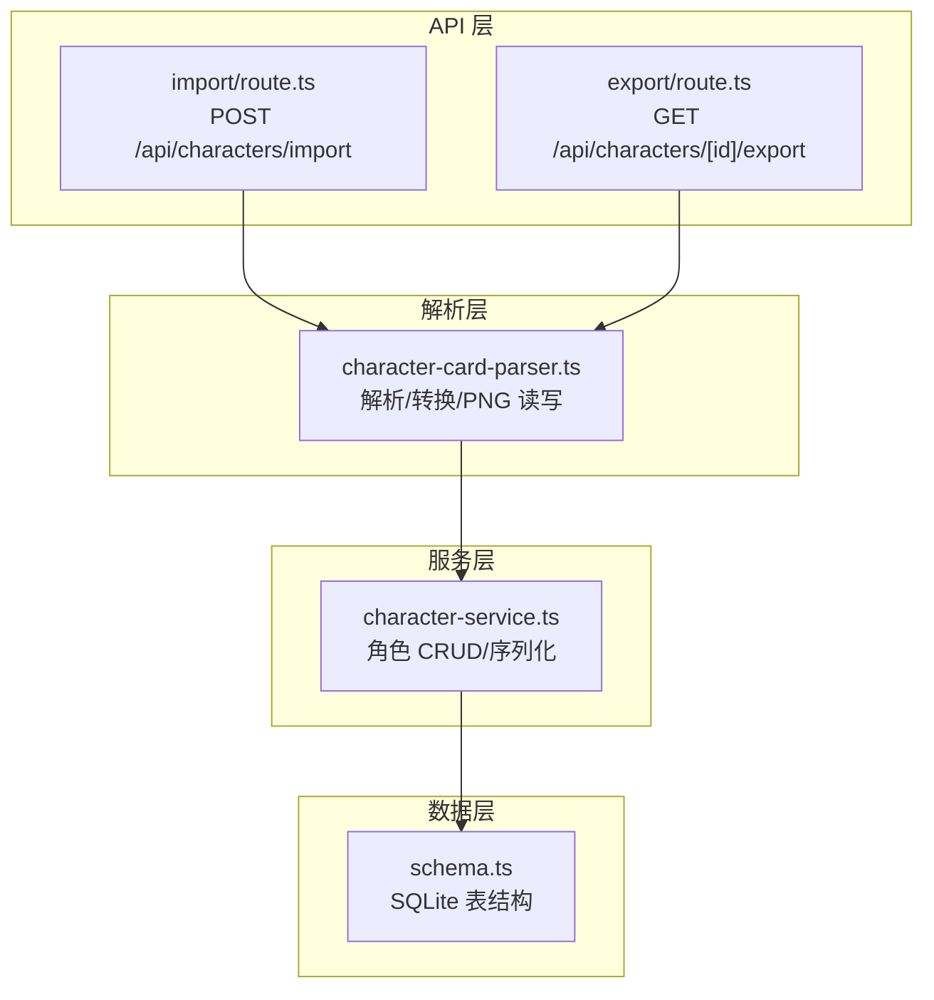
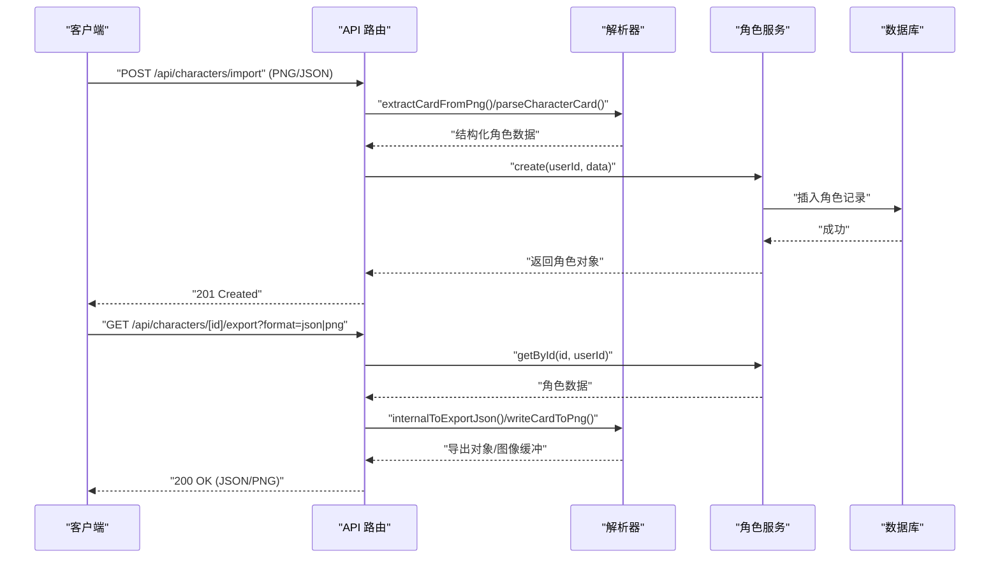
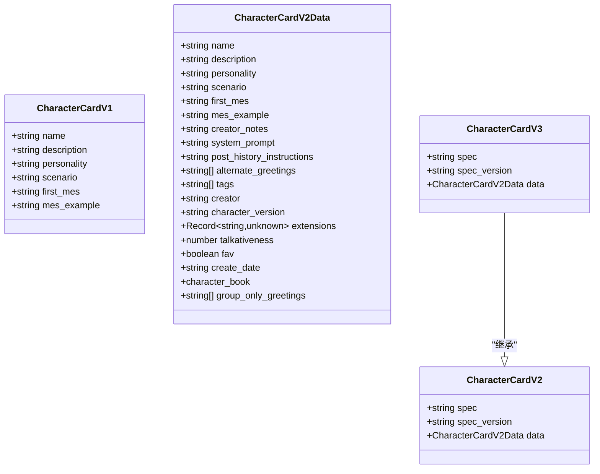
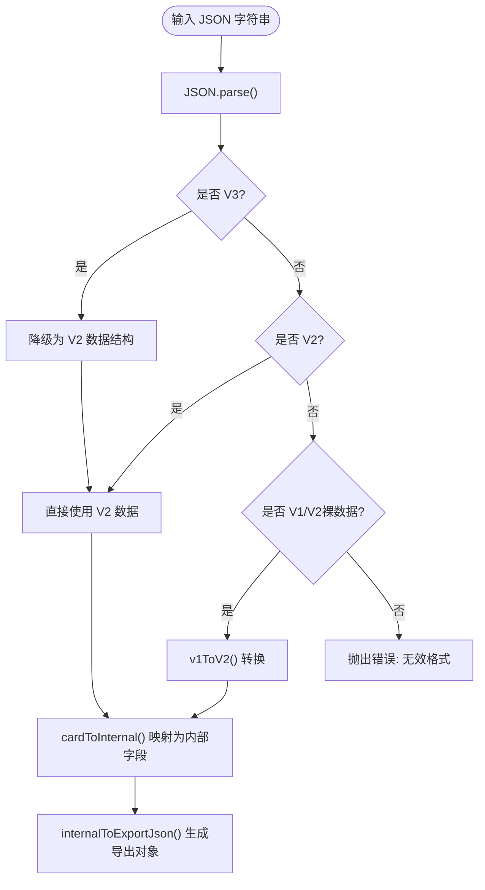
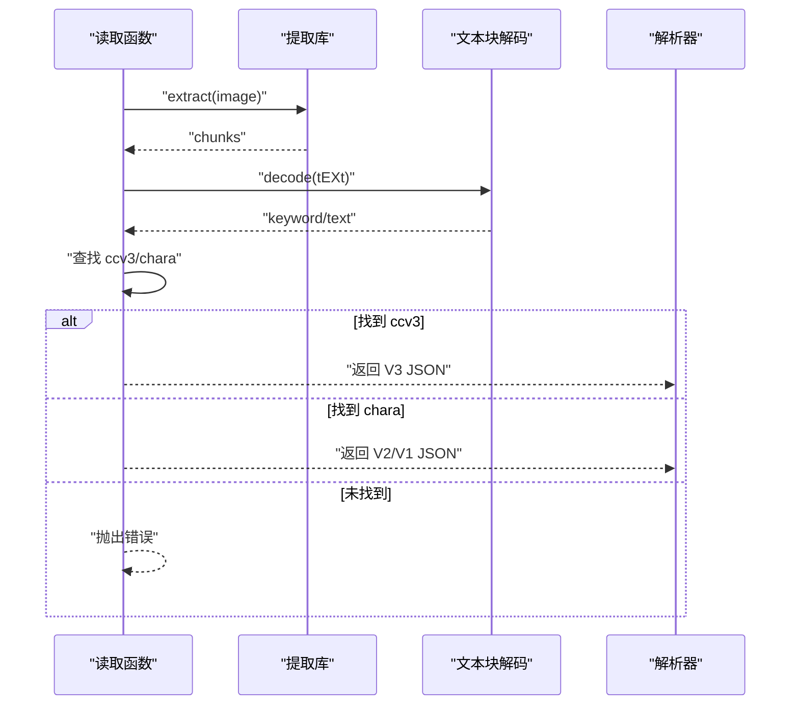
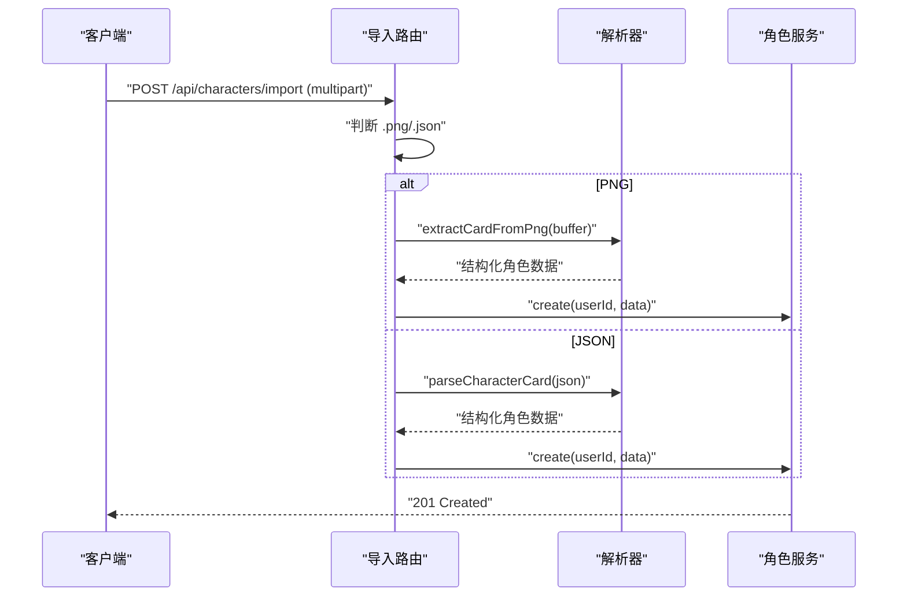
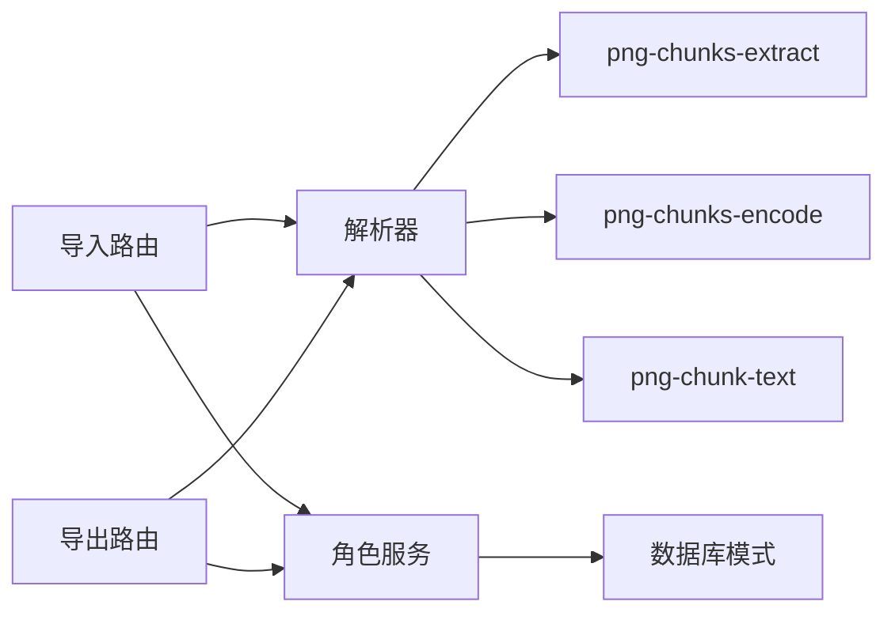

# 角色卡解析引擎

<cite>
**本文档引用的文件**
- [character-card-parser.ts](file://src/lib/parsers/character-card-parser.ts)
- [import/route.ts](file://src/app/api/characters/import/route.ts)
- [export/route.ts](file://src/app/api/characters/[id]/export/route.ts)
- [character-service.ts](file://src/lib/services/character-service.ts)
- [schema.ts](file://src/lib/db/schema.ts)
- [index.ts](file://src/types/index.ts)
- [package.json](file://package.json)
</cite>

## 目录
1. [简介](#简介)
2. [项目结构](#项目结构)
3. [核心组件](#核心组件)
4. [架构总览](#架构总览)
5. [详细组件分析](#详细组件分析)
6. [依赖分析](#依赖分析)
7. [性能考虑](#性能考虑)
8. [故障排除指南](#故障排除指南)
9. [结论](#结论)
10. [附录](#附录)

## 简介
本文件系统性阐述角色卡解析引擎的设计与实现，涵盖角色卡格式支持（V1/V2/V3）、PNG 内嵌元数据读写、数据转换与映射、扩展性与兼容性保障、错误处理与性能优化，并提供使用示例、自定义扩展与调试方法。该引擎完全兼容 TavernCard V2/V3 规范，支持 JSON 与 PNG 双向导入导出，确保与 SillyTavern 的向后兼容。

## 项目结构
角色卡解析引擎位于 lib/parsers 目录，配合 API 路由、服务层与数据库模式共同构成完整的导入/导出链路。

图表来源
- [character-card-parser.ts:1-354](file://src/lib/parsers/character-card-parser.ts#L1-L354)
- [import/route.ts:1-90](file://src/app/api/characters/import/route.ts#L1-L90)
- [export/route.ts:1-161](file://src/app/api/characters/[id]/export/route.ts#L1-L161)
- [character-service.ts:1-252](file://src/lib/services/character-service.ts#L1-L252)
- [schema.ts:18-53](file://src/lib/db/schema.ts#L18-L53)

章节来源
- [character-card-parser.ts:1-354](file://src/lib/parsers/character-card-parser.ts#L1-L354)
- [import/route.ts:1-90](file://src/app/api/characters/import/route.ts#L1-L90)
- [export/route.ts:1-161](file://src/app/api/characters/[id]/export/route.ts#L1-L161)
- [character-service.ts:1-252](file://src/lib/services/character-service.ts#L1-L252)
- [schema.ts:18-53](file://src/lib/db/schema.ts#L18-L53)

## 核心组件
- 角色卡解析器：负责识别并统一解析 V1/V2/V3 格式，提供 JSON 与 PNG 的双向转换。
- API 路由：导入（PNG/JSON）与导出（PNG/JSON）接口，调用解析器与服务层。
- 服务层：角色数据的增删改查、序列化/反序列化、Zod 校验。
- 数据库模式：SQLite 表结构，字段与 TavernCard V2 规范对齐。

章节来源
- [character-card-parser.ts:13-65](file://src/lib/parsers/character-card-parser.ts#L13-L65)
- [character-service.ts:11-56](file://src/lib/services/character-service.ts#L11-L56)
- [schema.ts:18-53](file://src/lib/db/schema.ts#L18-L53)

## 架构总览
角色卡解析引擎的控制流从 API 路由进入，经解析器进行格式识别与转换，再交由服务层持久化到数据库。

图表来源
- [import/route.ts:12-89](file://src/app/api/characters/import/route.ts#L12-L89)
- [export/route.ts:15-145](file://src/app/api/characters/[id]/export/route.ts#L15-L145)
- [character-card-parser.ts:104-154](file://src/lib/parsers/character-card-parser.ts#L104-L154)
- [character-service.ts:139-174](file://src/lib/services/character-service.ts#L139-L174)

## 详细组件分析

### 数据模型与格式映射
- 角色卡接口定义了 V1/V2/V3 的类型别名与数据结构，确保统一处理入口。
- 内部数据库模型与 TavernCard V2 规范完全对齐，便于跨版本兼容与迁移。

图表来源
- [character-card-parser.ts:14-65](file://src/lib/parsers/character-card-parser.ts#L14-L65)

章节来源
- [character-card-parser.ts:14-65](file://src/lib/parsers/character-card-parser.ts#L14-L65)
- [schema.ts:18-53](file://src/lib/db/schema.ts#L18-L53)
- [index.ts:214-243](file://src/types/index.ts#L214-L243)

### 解析流程与数据转换
- JSON 解析：统一识别 V3 → V2 → V1/V2裸数据，无法识别时抛出错误。
- 内部转换：将角色卡映射为内部数据库字段，处理可选字段与数组。
- 导出转换：生成顶层 V1 兼容字段与 V3 规范，同时保留 character_book。

图表来源
- [character-card-parser.ts:104-154](file://src/lib/parsers/character-card-parser.ts#L104-L154)

章节来源
- [character-card-parser.ts:104-154](file://src/lib/parsers/character-card-parser.ts#L104-L154)

### PNG 元数据读写
- 读取：优先读取 ccv3（V3），否则回退 chara（V2/V1）。若均不存在则报错。
- 写入：同时写入 chara（V2 占位）与 ccv3（V3 主体），保证向后兼容。
- 错误处理：读取失败返回空，写入失败忽略 V3 写入。

图表来源
- [character-card-parser.ts:266-293](file://src/lib/parsers/character-card-parser.ts#L266-L293)

章节来源
- [character-card-parser.ts:266-353](file://src/lib/parsers/character-card-parser.ts#L266-L353)

### API 集成与使用示例
- 导入接口：支持 .png/.json，自动识别格式并调用解析器。
- 导出接口：支持 .json/.png，导出时嵌入 character_book 并写入 PNG tEXt 块。

图表来源
- [import/route.ts:12-89](file://src/app/api/characters/import/route.ts#L12-L89)
- [character-card-parser.ts:337-353](file://src/lib/parsers/character-card-parser.ts#L337-L353)

章节来源
- [import/route.ts:12-89](file://src/app/api/characters/import/route.ts#L12-L89)
- [export/route.ts:15-145](file://src/app/api/characters/[id]/export/route.ts#L15-L145)

### 字段映射表与转换规则
- JSON → 内部字段映射：名称、描述、个性、场景、首条消息、示例对话、创作者注释、系统提示、历史后指令、备用问候、标签、创作者、版本、健谈度、收藏、扩展、嵌入式世界书。
- 导出规则：顶层保留 V1 兼容字段（如 name/description/personality/first_mes/scenario/mes_example/avatar/create_date/talkativeness/fav/creatorcomment/tags），同时输出 V3 规范的 spec/spec_version 与 data.character_book。
- PNG 写入：同时写入 chara（V2）与 ccv3（V3）两个 tEXt 文本块，确保兼容。

章节来源
- [character-card-parser.ts:132-154](file://src/lib/parsers/character-card-parser.ts#L132-L154)
- [character-card-parser.ts:209-258](file://src/lib/parsers/character-card-parser.ts#L209-L258)
- [character-card-parser.ts:299-334](file://src/lib/parsers/character-card-parser.ts#L299-L334)

### 扩展性设计与向后兼容
- 版本降级：V3 自动降级为 V2 数据结构，保持内部一致性。
- 多格式识别：V1/V2/V3 与裸数据统一入口，增强兼容性。
- PNG 双写：同时写入 chara 与 ccv3，确保旧版与新版解析器均可读取。
- 数据库对齐：SQLite 表字段与 TavernCard V2 规范一致，便于未来扩展。

章节来源
- [character-card-parser.ts:104-129](file://src/lib/parsers/character-card-parser.ts#L104-L129)
- [character-card-parser.ts:299-334](file://src/lib/parsers/character-card-parser.ts#L299-L334)
- [schema.ts:18-53](file://src/lib/db/schema.ts#L18-L53)

## 依赖分析
- 外部依赖：png-chunks-extract/png-chunks-encode/png-chunk-text 用于 PNG tEXt 块读写。
- 内部依赖：API 路由依赖解析器与服务层；服务层依赖数据库模式与 Zod 校验。

图表来源
- [package.json:31-33](file://package.json#L31-L33)
- [import/route.ts:4-7](file://src/app/api/characters/import/route.ts#L4-L7)
- [export/route.ts:5-8](file://src/app/api/characters/[id]/export/route.ts#L5-L8)
- [character-service.ts:1-3](file://src/lib/services/character-service.ts#L1-L3)

章节来源
- [package.json:18-46](file://package.json#L18-L46)
- [import/route.ts:4-7](file://src/app/api/characters/import/route.ts#L4-L7)
- [export/route.ts:5-8](file://src/app/api/characters/[id]/export/route.ts#L5-L8)
- [character-service.ts:1-3](file://src/lib/services/character-service.ts#L1-L3)

## 性能考虑
- 解析复杂度：JSON 解析与对象属性访问为 O(n)（n 为字段数量），整体线性。
- PNG 处理：tEXt 块遍历与 base64 编解码为 O(m)（m 为文本块数量），通常很小。
- 数据库存储：字符串字段与 JSON 文本字段，索引建议：name、userId、createdAt/updatedAt。
- 导出优化：PNG 写入同时写入两份 tEXt 块，避免重复解析；最小 PNG 生成仅在无头像时使用。

[本节为通用性能讨论，无需特定文件来源]

## 故障排除指南
- 无效格式：当 JSON 不符合 V1/V2/V3 规范时抛出错误。检查 JSON 结构与必需字段。
- PNG 无元数据：若 PNG 未包含 tEXt 文本块或未找到 ccv3/chara 关键字，读取失败。确认 PNG 是否由本系统或兼容工具生成。
- 导入失败：检查文件类型与内容，确保 .png/.json 后缀与内容匹配。
- 导出失败：检查角色是否存在、用户权限与服务异常日志。

章节来源
- [character-card-parser.ts:128-129](file://src/lib/parsers/character-card-parser.ts#L128-L129)
- [character-card-parser.ts:272-293](file://src/lib/parsers/character-card-parser.ts#L272-L293)
- [import/route.ts:36-41](file://src/app/api/characters/import/route.ts#L36-L41)
- [export/route.ts:140-144](file://src/app/api/characters/[id]/export/route.ts#L140-L144)

## 结论
角色卡解析引擎以简洁的类型体系与清晰的转换流程，实现了对 TavernCard V1/V2/V3 的全面支持，并通过 PNG 双写策略确保向后兼容。其模块化设计便于扩展新格式与增强功能，结合数据库模式与服务层的严格约束，为角色卡的导入导出提供了稳定可靠的基础设施。

[本节为总结性内容，无需特定文件来源]

## 附录

### 使用示例
- 导入角色卡
  - 上传 .json：包含 spec 或 data/name 字段即可被识别。
  - 上传 .png：PNG 内嵌 ccv3/chara 文本块，自动读取。
- 导出角色卡
  - JSON：返回顶层 V1 兼容字段与 V3 规范。
  - PNG：同时写入 chara 与 ccv3，便于跨平台兼容。

章节来源
- [import/route.ts:33-75](file://src/app/api/characters/import/route.ts#L33-L75)
- [export/route.ts:90-134](file://src/app/api/characters/[id]/export/route.ts#L90-L134)

### 自定义扩展
- 新格式支持：在解析入口增加格式识别逻辑，返回统一的内部结构。
- 字段扩展：在内部字段映射中新增字段映射，确保导出时正确序列化。
- PNG 扩展：如需写入其他 tEXt 关键字，可在写入函数中追加编码逻辑。

章节来源
- [character-card-parser.ts:104-129](file://src/lib/parsers/character-card-parser.ts#L104-L129)
- [character-card-parser.ts:209-258](file://src/lib/parsers/character-card-parser.ts#L209-L258)
- [character-card-parser.ts:299-334](file://src/lib/parsers/character-card-parser.ts#L299-L334)

### 调试方法
- 日志记录：API 路由捕获错误并输出详细信息，便于定位问题。
- 类型检查：利用 TypeScript 接口与 Zod 校验，提前发现字段不匹配。
- 单元测试：针对 parseCharacterCard、cardToInternal、internalToExportJson、PNG 读写函数编写测试用例。

章节来源
- [import/route.ts:84-88](file://src/app/api/characters/import/route.ts#L84-L88)
- [export/route.ts:140-144](file://src/app/api/characters/[id]/export/route.ts#L140-L144)
- [character-service.ts:11-31](file://src/lib/services/character-service.ts#L11-L31)