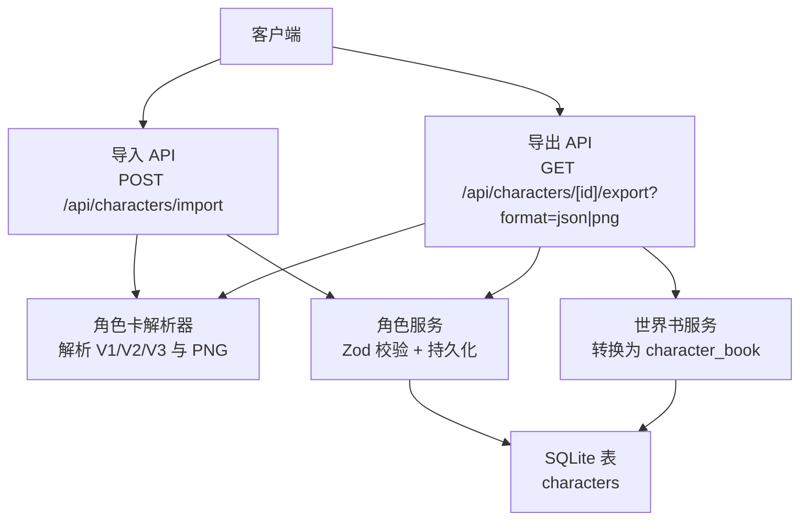
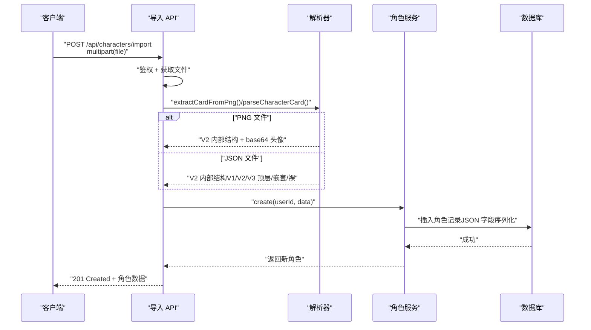
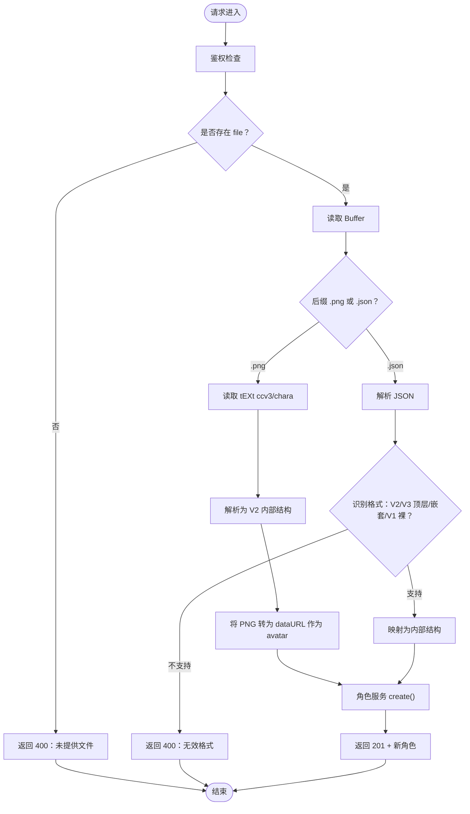
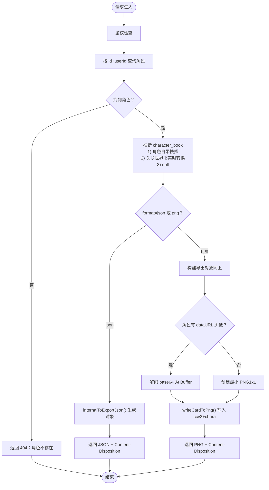
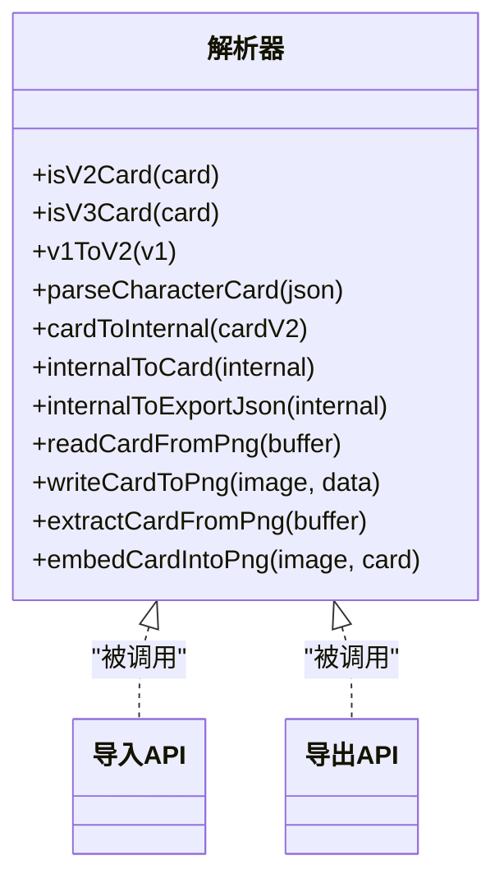
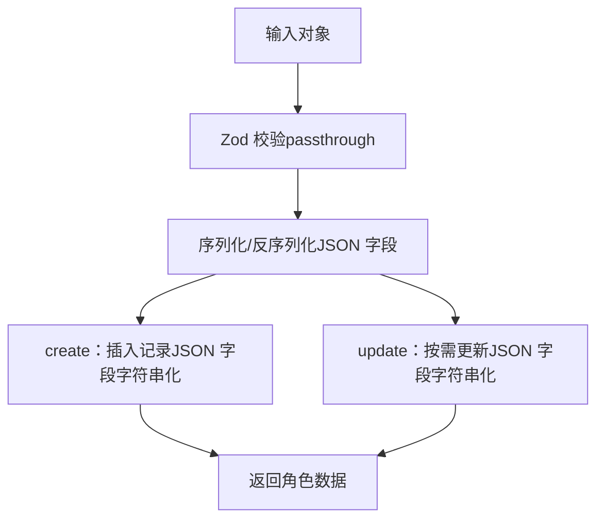
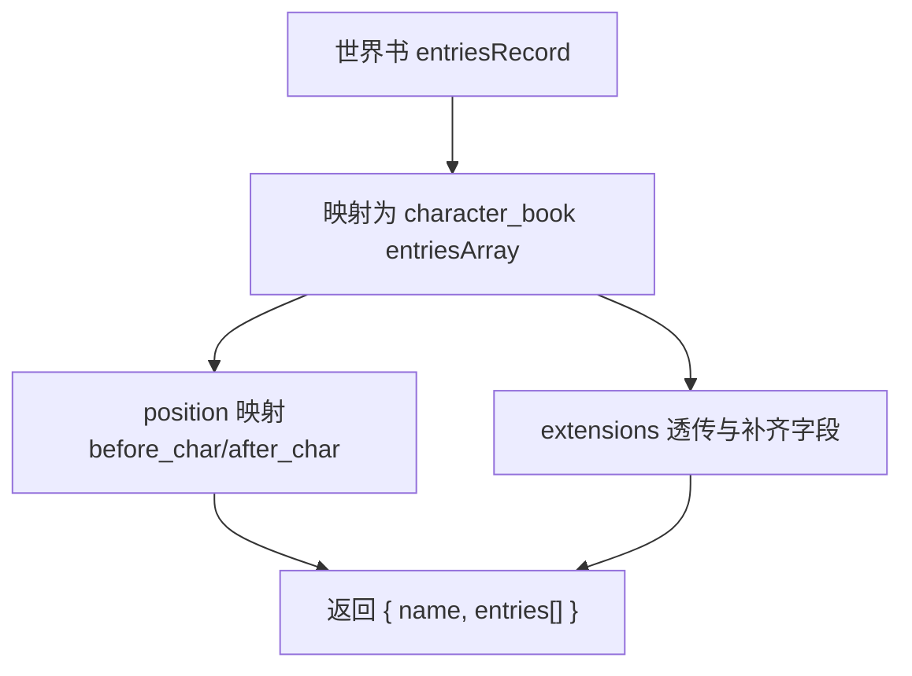
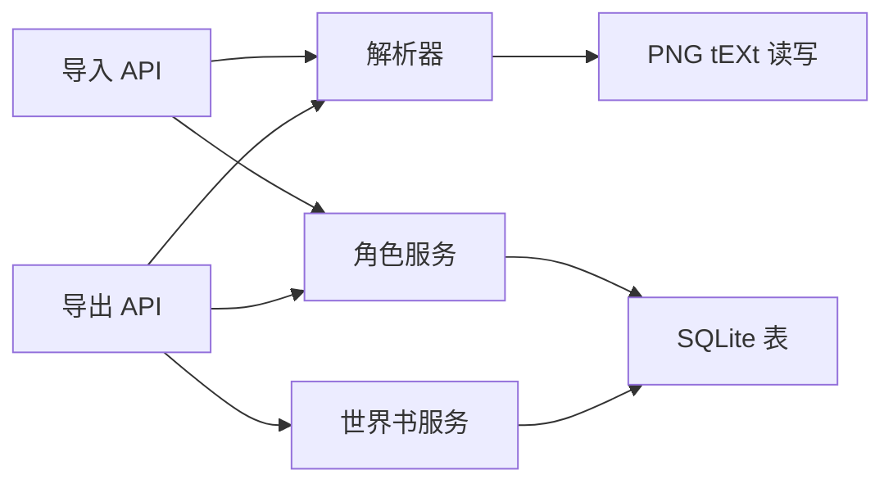

# 角色导入导出

<cite>
**本文档引用的文件**
- [src/app/api/characters/import/route.ts](file://src/app/api/characters/import/route.ts)
- [src/app/api/characters/[id]/export/route.ts](file://src/app/api/characters/[id]/export/route.ts)
- [src/lib/parsers/character-card-parser.ts](file://src/lib/parsers/character-card-parser.ts)
- [src/lib/services/character-service.ts](file://src/lib/services/character-service.ts)
- [src/lib/services/worldinfo-service.ts](file://src/lib/services/worldinfo-service.ts)
- [src/lib/db/schema.ts](file://src/lib/db/schema.ts)
- [src/types/index.ts](file://src/types/index.ts)
</cite>

## 目录
1. [简介](#简介)
2. [项目结构](#项目结构)
3. [核心组件](#核心组件)
4. [架构总览](#架构总览)
5. [详细组件分析](#详细组件分析)
6. [依赖关系分析](#依赖关系分析)
7. [性能考量](#性能考量)
8. [故障排查指南](#故障排查指南)
9. [结论](#结论)
10. [附录：API 接口与使用示例](#附录api-接口与使用示例)

## 简介
本文件系统性阐述角色导入导出功能，覆盖以下要点：
- 支持的格式：PNG（内嵌 tEXt chunk，兼容 V2/V3）、JSON（TavernCard V1/V2/V3 顶层/嵌套/裸数据）
- 数据转换流程：解析器负责格式识别、字段映射与完整性检查；服务层负责入库校验与持久化
- 导出策略：支持 JSON 与 PNG；PNG 导出同时写入 chara（V2 占位）与 ccv3（V3 主体）两份 tEXt chunk，确保兼容
- 批量导入：当前路由为单文件导入，未见批量导入端点；如需批量，请在客户端循环调用单次导入接口
- 错误处理与安全：鉴权、输入校验、格式校验、异常捕获与统一错误响应
- 数据备份与恢复：建议结合角色与世界书的独立导出/导入能力进行备份与迁移

## 项目结构
角色导入导出涉及的后端模块与职责如下：
- API 层
  - 导入：接收 multipart/form-data，识别 .png/.json，调用解析器与服务层
  - 导出：根据 format 参数返回 JSON 或 PNG，PNG 导出时将角色数据嵌入 PNG
- 解析器层
  - 识别 V1/V2/V3，统一为 V2 内部结构；支持 PNG tEXt chunk 读写
- 服务层
  - 角色服务：Zod 校验、序列化/反序列化、CRUD
  - 世界书服务：将世界书转换为角色卡可用的 character_book 格式
- 数据层
  - SQLite 表结构定义，JSON 字段存储数组/对象等复杂结构

**图表来源**
- [src/app/api/characters/import/route.ts:12-89](file://src/app/api/characters/import/route.ts#L12-L89)
- [src/app/api/characters/[id]/export/route.ts](file://src/app/api/characters/[id]/export/route.ts#L15-L145)
- [src/lib/parsers/character-card-parser.ts:104-129](file://src/lib/parsers/character-card-parser.ts#L104-L129)
- [src/lib/services/character-service.ts:115-174](file://src/lib/services/character-service.ts#L115-L174)
- [src/lib/services/worldinfo-service.ts:289-299](file://src/lib/services/worldinfo-service.ts#L289-L299)
- [src/lib/db/schema.ts:21-53](file://src/lib/db/schema.ts#L21-L53)

**章节来源**
- [src/app/api/characters/import/route.ts:12-89](file://src/app/api/characters/import/route.ts#L12-L89)
- [src/app/api/characters/[id]/export/route.ts](file://src/app/api/characters/[id]/export/route.ts#L15-L145)
- [src/lib/parsers/character-card-parser.ts:104-129](file://src/lib/parsers/character-card-parser.ts#L104-L129)
- [src/lib/services/character-service.ts:115-174](file://src/lib/services/character-service.ts#L115-L174)
- [src/lib/services/worldinfo-service.ts:289-299](file://src/lib/services/worldinfo-service.ts#L289-L299)
- [src/lib/db/schema.ts:21-53](file://src/lib/db/schema.ts#L21-L53)

## 核心组件
- 角色卡解析器
  - 功能：识别 V1/V2/V3，统一为内部 V2 结构；支持 PNG tEXt chunk 读写
  - 关键点：优先读取 ccv3（V3），回退到 chara（V2/V1）；导出时同时写入 chara 与 ccv3
- 角色服务
  - 功能：Zod 输入校验、序列化/反序列化、CRUD、JSON 字段的字符串化/解析
  - 关键点：talkativeness/fav 为数值/布尔；alternateGreetings/tags/extensions 等为 JSON 字段
- 世界书服务
  - 功能：将世界书 entries 转换为角色卡可用的 character_book（数组结构）
  - 关键点：position、probability、group 等字段映射；保留 extensions 透传
- 数据模型
  - 角色表：完全兼容 TavernCard V2 Spec，JSON 字段存储复杂结构
  - 类型定义：Character、TavernCardV1/V2/V3、CharacterFormData 等

**章节来源**
- [src/lib/parsers/character-card-parser.ts:132-154](file://src/lib/parsers/character-card-parser.ts#L132-L154)
- [src/lib/services/character-service.ts:11-31](file://src/lib/services/character-service.ts#L11-L31)
- [src/lib/services/worldinfo-service.ts:289-299](file://src/lib/services/worldinfo-service.ts#L289-L299)
- [src/lib/db/schema.ts:21-53](file://src/lib/db/schema.ts#L21-L53)
- [src/types/index.ts:154-184](file://src/types/index.ts#L154-L184)

## 架构总览
导入/导出的端到端流程如下：

**图表来源**
- [src/app/api/characters/import/route.ts:12-89](file://src/app/api/characters/import/route.ts#L12-L89)
- [src/lib/parsers/character-card-parser.ts:337-344](file://src/lib/parsers/character-card-parser.ts#L337-L344)
- [src/lib/services/character-service.ts:139-174](file://src/lib/services/character-service.ts#L139-L174)

导出流程（PNG）：

```mermaid
sequenceDiagram
participant C as "客户端"
participant APIO as "导出 API"
participant S as "角色服务"
participant W as "世界书服务"
participant P as "解析器"
participant DB as "数据库"
C->>APIO : "GET /api/characters/[id]/export?format=png"
APIO->>S : "按 id+userId 查询角色"
S->>DB : "读取角色记录"
DB-->>S : "角色数据"
APIO->>W : "toCharacterBook(worldInfoBookId)"
W->>DB : "读取世界书并转换为 character_book"
DB-->>W : "entries 数组"
W-->>APIO : "character_book"
APIO->>P : "internalToExportJson() + writeCardToPng()"
P-->>APIO : "PNG Buffer含 ccv3+chara"
APIO-->>C : "200 OK + Content-Disposition : attachment"
```

**图表来源**
- [src/app/api/characters/[id]/export/route.ts](file://src/app/api/characters/[id]/export/route.ts#L15-L145)
- [src/lib/services/worldinfo-service.ts:289-299](file://src/lib/services/worldinfo-service.ts#L289-L299)
- [src/lib/parsers/character-card-parser.ts:209-258](file://src/lib/parsers/character-card-parser.ts#L209-L258)
- [src/lib/parsers/character-card-parser.ts:299-334](file://src/lib/parsers/character-card-parser.ts#L299-L334)

## 详细组件分析

### 导入组件分析（POST /api/characters/import）
- 鉴权与用户上下文
  - 通过 auth() 获取 session，要求存在 user.id
- 文件处理
  - 从 multipart/form-data 中提取 file；校验文件名后缀
- PNG 导入
  - 从 PNG tEXt chunk 读取 ccv3（优先）或 chara（回退）
  - 将 PNG 二进制转为 dataURL 作为 avatar
- JSON 导入
  - 支持 V2/V3 顶层（spec/data）、V2 嵌套（data）、V1 裸数据（name/first_mes/...）
  - 统一映射为内部结构
- 创建角色
  - 使用角色服务的 create，内部进行 Zod 校验与 JSON 字段序列化
- 错误处理
  - 未登录、无文件、格式不支持、JSON 解析失败、导入失败等均返回 4xx/5xx

**图表来源**
- [src/app/api/characters/import/route.ts:12-89](file://src/app/api/characters/import/route.ts#L12-L89)
- [src/lib/parsers/character-card-parser.ts:266-293](file://src/lib/parsers/character-card-parser.ts#L266-L293)
- [src/lib/parsers/character-card-parser.ts:104-129](file://src/lib/parsers/character-card-parser.ts#L104-L129)

**章节来源**
- [src/app/api/characters/import/route.ts:12-89](file://src/app/api/characters/import/route.ts#L12-L89)

### 导出组件分析（GET /api/characters/[id]/export）
- 鉴权与查询
  - 鉴权后按 id+userId 查询角色；不存在返回 404
- character_book 推断优先级
  - 优先使用角色记录内的 characterBook（导入时存的快照）
  - 其次使用 worldInfoBookId 关联的全局世界书，实时转换为 V2 character_book 数组
  - 否则为 null
- 导出 JSON
  - 使用 internalToExportJson 生成顶层 V1 兼容字段 + V3 spec + data + character_book
  - Content-Type: application/json，Content-Disposition 为 .json
- 导出 PNG
  - 与 JSON 导出使用同一份 payload
  - 若角色已有 dataURL 头像则解码，否则使用最小 PNG（1x1）
  - writeCardToPng 同时写入 chara（V2）与 ccv3（V3）两份 tEXt chunk
  - Content-Type: image/png，Content-Disposition 为 .png

**图表来源**
- [src/app/api/characters/[id]/export/route.ts](file://src/app/api/characters/[id]/export/route.ts#L15-L145)
- [src/lib/parsers/character-card-parser.ts:209-258](file://src/lib/parsers/character-card-parser.ts#L209-L258)
- [src/lib/parsers/character-card-parser.ts:299-334](file://src/lib/parsers/character-card-parser.ts#L299-L334)

**章节来源**
- [src/app/api/characters/[id]/export/route.ts](file://src/app/api/characters/[id]/export/route.ts#L15-L145)

### 角色卡解析器（解析/转换/嵌入）
- 格式识别与解析
  - isV2Card/isV3Card/v1ToV2/parseCharacterCard
  - 支持 V3 降级为 V2（data 结构一致）
- 内部结构映射
  - cardToInternal：将 V2/V3 data 映射为内部字段（firstMessage/exampleDialogue/alternateGreetings/tags/...）
  - internalToCard/internalToExportJson：将内部结构转为 V2 JSON 与导出 JSON（顶层 V1 兼容字段 + V3 spec + data.character_book）
- PNG 读写
  - readCardFromPng：优先 ccv3，回退 chara
  - writeCardToPng：同时写入 chara（V2）与 ccv3（V3），并移除旧同名 chunk
  - extractCardFromPng/embedCardIntoPng：便捷封装

**图表来源**
- [src/lib/parsers/character-card-parser.ts:67-85](file://src/lib/parsers/character-card-parser.ts#L67-L85)
- [src/lib/parsers/character-card-parser.ts:104-129](file://src/lib/parsers/character-card-parser.ts#L104-L129)
- [src/lib/parsers/character-card-parser.ts:132-154](file://src/lib/parsers/character-card-parser.ts#L132-L154)
- [src/lib/parsers/character-card-parser.ts:209-258](file://src/lib/parsers/character-card-parser.ts#L209-L258)
- [src/lib/parsers/character-card-parser.ts:266-293](file://src/lib/parsers/character-card-parser.ts#L266-L293)
- [src/lib/parsers/character-card-parser.ts:299-334](file://src/lib/parsers/character-card-parser.ts#L299-L334)

**章节来源**
- [src/lib/parsers/character-card-parser.ts:104-129](file://src/lib/parsers/character-card-parser.ts#L104-L129)
- [src/lib/parsers/character-card-parser.ts:132-154](file://src/lib/parsers/character-card-parser.ts#L132-L154)
- [src/lib/parsers/character-card-parser.ts:209-258](file://src/lib/parsers/character-card-parser.ts#L209-L258)
- [src/lib/parsers/character-card-parser.ts:266-293](file://src/lib/parsers/character-card-parser.ts#L266-L293)
- [src/lib/parsers/character-card-parser.ts:299-334](file://src/lib/parsers/character-card-parser.ts#L299-L334)

### 角色服务（校验/持久化/更新）
- 输入校验
  - characterInputSchema/characterUpdateSchema：Zod 校验，passthrough 允许未知字段
- 序列化/反序列化
  - serializeRow：JSON 字段解析（alternateGreetings/tags/extensions/...）
  - create/update：JSON 字段字符串化；部分字段条件性处理
- CRUD
  - create：生成 id，填充默认值，插入记录
  - update：按需更新字段，JSON 字段字符串化
  - delete：先清理关联聊天，再删除角色

**图表来源**
- [src/lib/services/character-service.ts:11-31](file://src/lib/services/character-service.ts#L11-L31)
- [src/lib/services/character-service.ts:86-113](file://src/lib/services/character-service.ts#L86-L113)
- [src/lib/services/character-service.ts:139-174](file://src/lib/services/character-service.ts#L139-L174)
- [src/lib/services/character-service.ts:176-212](file://src/lib/services/character-service.ts#L176-L212)

**章节来源**
- [src/lib/services/character-service.ts:11-31](file://src/lib/services/character-service.ts#L11-L31)
- [src/lib/services/character-service.ts:86-113](file://src/lib/services/character-service.ts#L86-L113)
- [src/lib/services/character-service.ts:139-174](file://src/lib/services/character-service.ts#L139-L174)
- [src/lib/services/character-service.ts:176-212](file://src/lib/services/character-service.ts#L176-L212)

### 世界书服务（character_book 转换）
- toCharacterBook：将世界书 entries 转为角色卡可用的 character_book（数组结构）
- 字段映射：position、probability、group、extensions 等
- 导出兼容：导出 JSON 时保留 originalData（V2 character_book 格式）

**图表来源**
- [src/lib/services/worldinfo-service.ts:289-299](file://src/lib/services/worldinfo-service.ts#L289-L299)
- [src/lib/services/worldinfo-service.ts:303-352](file://src/lib/services/worldinfo-service.ts#L303-L352)

**章节来源**
- [src/lib/services/worldinfo-service.ts:289-299](file://src/lib/services/worldinfo-service.ts#L289-L299)
- [src/lib/services/worldinfo-service.ts:303-352](file://src/lib/services/worldinfo-service.ts#L303-L352)

## 依赖关系分析
- 组件耦合
  - 导入 API 依赖解析器与角色服务；导出 API 依赖角色服务、世界书服务与解析器
  - 解析器与服务层之间为纯函数/方法调用，低耦合
- 外部依赖
  - PNG tEXt 读写：png-chunks-extract/encode + png-chunk-text
  - 数据库：Drizzle ORM + SQLite
- 潜在风险
  - PNG 导入依赖 tEXt chunk 存在性；若缺失 ccv3/chara，解析会失败
  - JSON 导入依赖字段命名一致性；V1/V2/V3 顶层/嵌套差异较大，需严格识别

**图表来源**
- [src/app/api/characters/import/route.ts:12-89](file://src/app/api/characters/import/route.ts#L12-L89)
- [src/app/api/characters/[id]/export/route.ts](file://src/app/api/characters/[id]/export/route.ts#L15-L145)
- [src/lib/parsers/character-card-parser.ts:266-293](file://src/lib/parsers/character-card-parser.ts#L266-L293)
- [src/lib/services/character-service.ts:115-174](file://src/lib/services/character-service.ts#L115-L174)
- [src/lib/services/worldinfo-service.ts:289-299](file://src/lib/services/worldinfo-service.ts#L289-L299)

**章节来源**
- [src/app/api/characters/import/route.ts:12-89](file://src/app/api/characters/import/route.ts#L12-L89)
- [src/app/api/characters/[id]/export/route.ts](file://src/app/api/characters/[id]/export/route.ts#L15-L145)
- [src/lib/parsers/character-card-parser.ts:266-293](file://src/lib/parsers/character-card-parser.ts#L266-L293)
- [src/lib/services/character-service.ts:115-174](file://src/lib/services/character-service.ts#L115-L174)
- [src/lib/services/worldinfo-service.ts:289-299](file://src/lib/services/worldinfo-service.ts#L289-L299)

## 性能考量
- 导入
  - PNG 导入：读取 tEXt chunk 与 base64 转换；内存占用与 PNG 大小相关
  - JSON 导入：JSON 解析与字段映射；复杂 JSON 会增加 CPU 时间
- 导出
  - PNG 导出：写入两份 tEXt chunk；最小 PNG 体积小，但写入仍有一定开销
  - JSON 导出：字符串化导出对象；字符数与字段数量成正比
- 建议
  - 控制 PNG 头像大小，避免超大 PNG 导致内存压力
  - 批量导出时建议客户端分批下载，避免单次响应过大
  - 对于大量角色，建议使用数据库层面的备份/恢复工具

## 故障排查指南
- 常见错误与定位
  - 401 未授权：确认已登录且 session 包含 user.id
  - 400 缺少文件/格式不支持：检查 multipart 字段名与文件扩展名
  - 400 JSON 无效：检查 JSON 结构是否符合 V1/V2/V3 任一规范
  - 400 PNG 无角色数据：确认 PNG 包含 ccv3 或 chara tEXt chunk
  - 404 角色不存在：确认 id 与当前用户匹配
  - 500 导入/导出失败：查看服务端日志，定位具体异常
- 建议排查步骤
  - 导入前先验证 JSON 结构（可参考类型定义）
  - PNG 导入前使用解析器的 readCardFromPng 验证 tEXt chunk
  - 导出后用解析器的 extractCardFromPng 验证可逆性

**章节来源**
- [src/app/api/characters/import/route.ts:12-89](file://src/app/api/characters/import/route.ts#L12-L89)
- [src/app/api/characters/[id]/export/route.ts](file://src/app/api/characters/[id]/export/route.ts#L15-L145)
- [src/lib/parsers/character-card-parser.ts:266-293](file://src/lib/parsers/character-card-parser.ts#L266-L293)

## 结论
本功能以“解析器 + 服务层 + API 层”的清晰分层实现角色导入导出：
- 支持多格式识别与统一映射，保证跨版本兼容
- 导出 PNG 同时写入 V2/V3 兼容 chunk，确保广泛兼容
- 服务层提供严格的输入校验与 JSON 字段处理，保障数据完整性
- 当前为单文件导入，批量导入可通过客户端循环调用实现
- 建议结合世界书导出/导入进行整体备份与迁移

## 附录：API 接口与使用示例

- 导入角色卡
  - 方法与路径：POST /api/characters/import
  - 请求体：multipart/form-data
    - 字段：file（.png 或 .json）
  - 成功响应：201 Created，返回新建角色对象
  - 错误响应：400/401/500，包含错误信息
  - 示例（curl）
    - PNG：curl -F "file=@角色卡.png" https://your-host/api/characters/import
    - JSON：curl -F "file=@角色卡.json" https://your-host/api/characters/import

- 导出角色卡
  - 方法与路径：GET /api/characters/[id]/export?format=json|png
  - 认证：需要登录
  - 成功响应：
    - format=json：application/json，文件名为 角色名.json
    - format=png：image/png，文件名为 角色名.png
  - 错误响应：400/401/404/500
  - 示例（curl）
    - JSON：curl -H "Cookie: session=..." https://your-host/api/characters/[id]/export?format=json -o 角色名.json
    - PNG：curl -H "Cookie: session=..." https://your-host/api/characters/[id]/export?format=png -o 角色名.png

- 数据模型与字段映射
  - 角色内部结构（节选）
    - name/description/personality/scenario/firstMessage/exampleDialogue
    - creatorNotes/systemPrompt/postHistoryInstructions/alternateGreetings/tags
    - creator/characterVersion/talkativeness/fav/avatar/extensions
    - worldInfoBookId/characterBook/createDate/createdAt/updatedAt
  - 类型定义参考
    - 角色类型：Character
    - 表单类型：CharacterFormData
    - TavernCard V1/V2/V3 接口定义

**章节来源**
- [src/app/api/characters/import/route.ts:12-89](file://src/app/api/characters/import/route.ts#L12-L89)
- [src/app/api/characters/[id]/export/route.ts](file://src/app/api/characters/[id]/export/route.ts#L15-L145)
- [src/types/index.ts:154-184](file://src/types/index.ts#L154-L184)
- [src/types/index.ts:214-243](file://src/types/index.ts#L214-L243)
- [src/lib/db/schema.ts:21-53](file://src/lib/db/schema.ts#L21-L53)