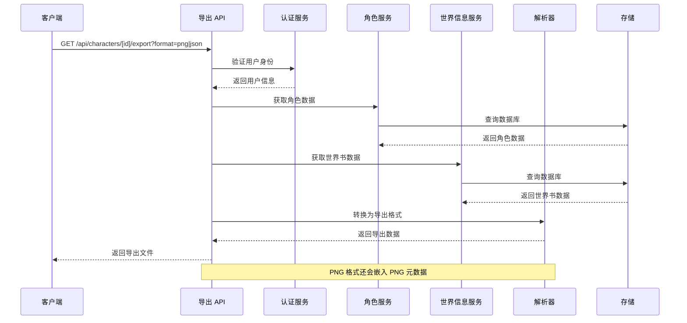
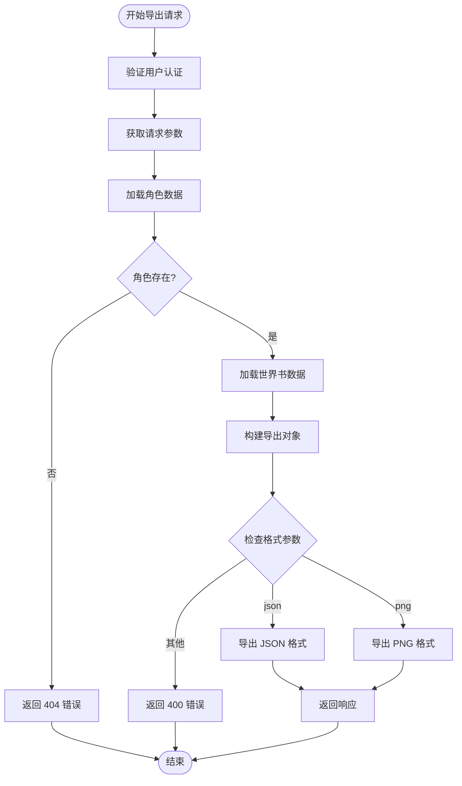
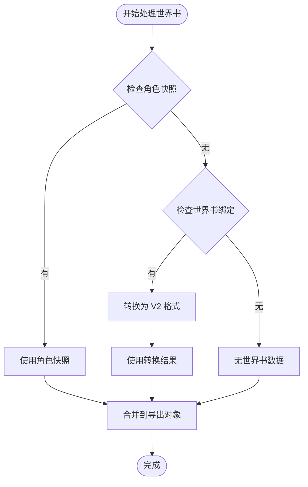
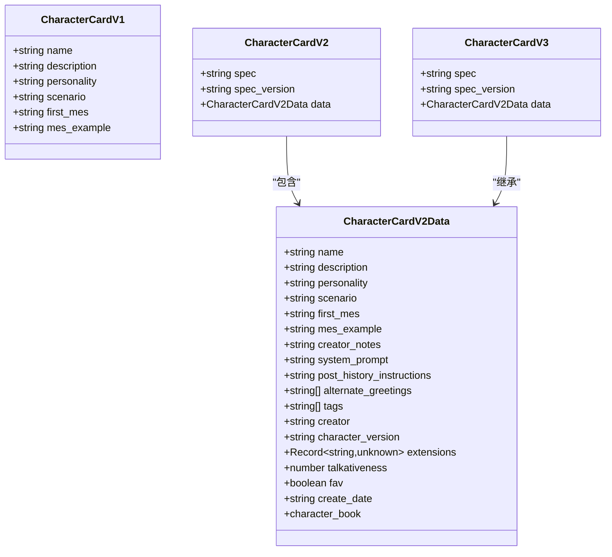
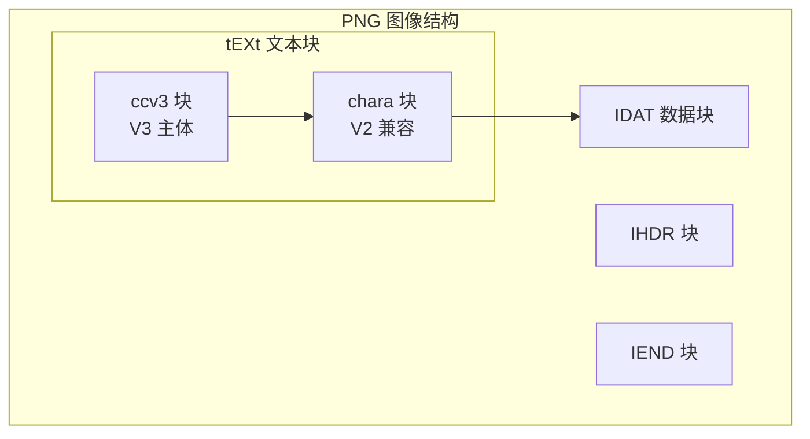
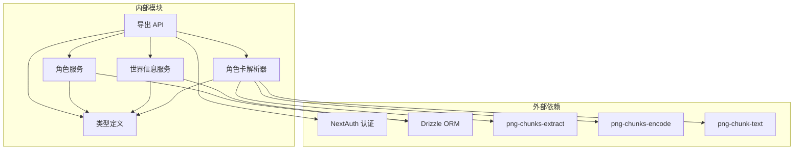
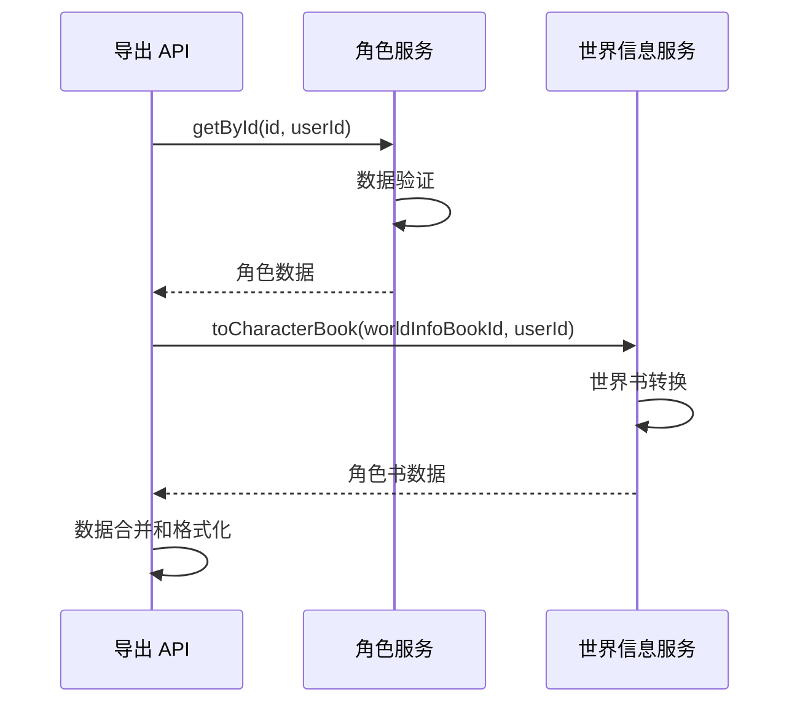

# 角色导出功能

<cite>
**本文档引用的文件**
- [src/app/api/characters/[id]/export/route.ts](file://src/app/api/characters/[id]/export/route.ts)
- [src/lib/parsers/character-card-parser.ts](file://src/lib/parsers/character-card-parser.ts)
- [src/lib/services/character-service.ts](file://src/lib/services/character-service.ts)
- [src/lib/services/worldinfo-service.ts](file://src/lib/services/worldinfo-service.ts)
- [src/types/index.ts](file://src/types/index.ts)
- [src/app/api/characters/import/route.ts](file://src/app/api/characters/import/route.ts)
- [drizzle/meta/0000_snapshot.json](file://drizzle/meta/0000_snapshot.json)
- [drizzle/0001_world_info_links.sql](file://drizzle/0001_world_info_links.sql)
</cite>

## 目录
1. [简介](#简介)
2. [项目结构](#项目结构)
3. [核心组件](#核心组件)
4. [架构概览](#架构概览)
5. [详细组件分析](#详细组件分析)
6. [依赖关系分析](#依赖关系分析)
7. [性能考虑](#性能考虑)
8. [故障排除指南](#故障排除指南)
9. [结论](#结论)
10. [附录](#附录)

## 简介

角色导出功能是 SillyTavern Next 项目中的核心特性之一，它允许用户将角色卡数据导出为两种格式：PNG 图片和 JSON 文件。该功能不仅支持传统的角色卡格式，还实现了与 SillyTavern 原项目的完全兼容，确保导出的角色卡可以在不同版本和平台间无缝使用。

本功能的核心价值在于：
- **多格式支持**：同时支持 PNG 和 JSON 两种导出格式
- **向后兼容**：完全兼容 SillyTavern V1/V2/V3 标准
- **世界书集成**：自动将绑定的世界书嵌入到导出数据中
- **格式标准化**：提供统一的数据格式转换和标准化处理
- **兼容性保证**：确保导出文件在各种客户端中的兼容性

## 项目结构

角色导出功能涉及以下关键文件和模块：

```mermaid
graph TB
subgraph "API 层"
ExportRoute[角色导出路由<br/>/api/characters/[id]/export]
ImportRoute[角色导入路由<br/>/api/characters/import]
end
subgraph "服务层"
CharacterService[角色服务]
WorldInfoService[世界信息服务]
end
subgraph "解析层"
CardParser[角色卡解析器]
PNGProcessor[PNG 处理器]
end
subgraph "数据层"
CharacterDB[角色数据库]
WorldInfoDB[世界书数据库]
end
ExportRoute --> CharacterService
ExportRoute --> WorldInfoService
ExportRoute --> CardParser
CharacterService --> CharacterDB
WorldInfoService --> WorldInfoDB
CardParser --> PNGProcessor
```

**图表来源**
- [src/app/api/characters/[id]/export/route.ts](file://src/app/api/characters/[id]/export/route.ts#L1-L162)
- [src/lib/services/character-service.ts:1-252](file://src/lib/services/character-service.ts#L1-L252)
- [src/lib/services/worldinfo-service.ts:1-428](file://src/lib/services/worldinfo-service.ts#L1-L428)

**章节来源**
- [src/app/api/characters/[id]/export/route.ts](file://src/app/api/characters/[id]/export/route.ts#L1-L162)
- [src/lib/parsers/character-card-parser.ts:1-354](file://src/lib/parsers/character-card-parser.ts#L1-L354)

## 核心组件

### 角色导出 API

角色导出 API 提供了统一的接口来处理不同格式的导出请求。主要特性包括：

- **格式选择**：支持 `format=json` 或 `format=png` 参数
- **认证机制**：基于 NextAuth 的用户认证
- **错误处理**：完善的错误处理和状态码返回
- **文件命名**：根据角色名称动态生成文件名

### 角色卡解析器

角色卡解析器负责处理不同版本角色卡格式之间的转换：

- **多版本支持**：兼容 V1/V2/V3 格式
- **格式转换**：提供统一的内部格式表示
- **PNG 元数据处理**：支持 PNG tEXt chunk 的读写
- **数据标准化**：确保输出格式的一致性

### 世界信息服务

世界信息服务处理角色卡与世界书的关联关系：

- **字符书转换**：将世界书转换为角色卡可用的格式
- **优先级处理**：处理多种字符书来源的优先级
- **数据完整性**：确保导出时包含完整的字符书信息

**章节来源**
- [src/lib/parsers/character-card-parser.ts:209-258](file://src/lib/parsers/character-card-parser.ts#L209-L258)
- [src/lib/services/worldinfo-service.ts:289-299](file://src/lib/services/worldinfo-service.ts#L289-L299)

## 架构概览

角色导出功能采用分层架构设计，确保各组件职责清晰且松耦合：



**图表来源**
- [src/app/api/characters/[id]/export/route.ts](file://src/app/api/characters/[id]/export/route.ts#L15-L145)
- [src/lib/services/character-service.ts:132-137](file://src/lib/services/character-service.ts#L132-L137)
- [src/lib/services/worldinfo-service.ts:289-299](file://src/lib/services/worldinfo-service.ts#L289-L299)

## 详细组件分析

### 角色导出 API 实现

导出 API 是整个功能的核心入口点，负责协调各个组件完成导出任务：

#### 请求处理流程



**图表来源**
- [src/app/api/characters/[id]/export/route.ts](file://src/app/api/characters/[id]/export/route.ts#L15-L145)

#### 角色数据加载机制

API 首先通过角色服务获取角色的完整数据，包括基础信息和扩展字段：

- **基础字段**：姓名、描述、个性、场景等
- **扩展字段**：系统提示、历史指令、问候语等
- **元数据**：创建时间、标签、创作者等
- **关联数据**：世界书绑定信息

#### 世界书数据处理

世界书数据的处理遵循特定的优先级顺序：



**图表来源**
- [src/app/api/characters/[id]/export/route.ts](file://src/app/api/characters/[id]/export/route.ts#L33-L55)

**章节来源**
- [src/app/api/characters/[id]/export/route.ts](file://src/app/api/characters/[id]/export/route.ts#L15-L145)

### 角色卡解析器详解

角色卡解析器是实现多格式兼容的关键组件，负责处理不同版本角色卡之间的转换：

#### 数据模型映射



**图表来源**
- [src/lib/parsers/character-card-parser.ts:14-65](file://src/lib/parsers/character-card-parser.ts#L14-L65)

#### 导出格式转换

internalToExportJson 函数负责将内部格式转换为最终的导出格式：

| 字段 | 来源 | 处理方式 | 输出值 |
|------|------|----------|--------|
| name | 角色名称 | 直接复制 | 角色名称 |
| description | 角色描述 | 空值处理 | 描述或空字符串 |
| personality | 个性特征 | 空值处理 | 个性或空字符串 |
| first_mes | 首次消息 | 空值处理 | 首次消息或空字符串 |
| avatar | 头像路径 | 基础验证 | 文件路径或 "none" |
| mes_example | 示例对话 | 空值处理 | 示例对话或空字符串 |
| scenario | 场景设定 | 空值处理 | 场景或空字符串 |
| create_date | 创建日期 | 时间戳处理 | ISO 8601 字符串 |
| talkativeness | 谈吐度 | 数字转字符串 | "0.5" 或具体数值 |
| fav | 收藏标记 | 布尔处理 | false 或 true |
| creatorcomment | 创作者注释 | 空值处理 | 注释或空字符串 |
| spec | 版本标识 | 固定值 | "chara_card_v3" |
| spec_version | 版本号 | 固定值 | "3.0" |
| data | 内部数据 | 深拷贝处理 | V2 数据结构 |

**章节来源**
- [src/lib/parsers/character-card-parser.ts:209-258](file://src/lib/parsers/character-card-parser.ts#L209-L258)

### PNG 格式处理机制

PNG 格式的处理是最复杂的部分，因为它需要在图像中嵌入元数据：

#### PNG 元数据存储结构



**图表来源**
- [src/lib/parsers/character-card-parser.ts:299-334](file://src/lib/parsers/character-card-parser.ts#L299-L334)

#### PNG 写入流程

PNG 写入过程包含多个步骤以确保兼容性和数据完整性：

1. **元数据提取**：从现有 PNG 中提取所有 tEXt 块
2. **重复项清理**：移除已存在的 chara/ccv3 块
3. **V2 兼容写入**：写入 chara 块（base64 编码）
4. **V3 主体写入**：尝试写入 ccv3 块（如果 JSON 有效）

#### 底图选择策略

当角色没有头像或头像不是 PNG 格式时，系统会创建一个最小有效的 PNG：

- **最小 PNG**：1x1 像素的白色 PNG
- **标准签名**：包含完整的 PNG 文件头
- **压缩数据**：包含必要的压缩数据块
- **校验和**：确保 PNG 文件完整性

**章节来源**
- [src/app/api/characters/[id]/export/route.ts](file://src/app/api/characters/[id]/export/route.ts#L147-L161)

### 数据库模式设计

角色和世界书的数据结构设计直接影响导出功能的实现：

#### 角色表结构

| 字段名 | 类型 | 约束 | 描述 |
|--------|------|------|------|
| id | text | PRIMARY KEY | 角色唯一标识符 |
| user_id | text | NOT NULL, FOREIGN KEY | 用户标识符 |
| name | text | NOT NULL | 角色名称 |
| description | text | DEFAULT "" | 角色描述 |
| personality | text | DEFAULT "" | 个性特征 |
| scenario | text | DEFAULT "" | 场景设定 |
| first_message | text | DEFAULT "" | 首次消息 |
| example_dialogue | text | DEFAULT "" | 示例对话 |
| creator_notes | text | DEFAULT "" | 创作者注释 |
| system_prompt | text | DEFAULT "" | 系统提示 |
| post_history_instructions | text | DEFAULT "" | 历史指令 |
| alternate_greetings | text | JSON string[] | 替代问候语 |
| tags | text | JSON string[] | 标签列表 |
| creator | text | DEFAULT "" | 创作者 |
| character_version | text | DEFAULT "" | 角色版本 |
| talkativeness | real | DEFAULT 0.5 | 谈吐度 |
| fav | integer | DEFAULT false | 收藏标记 |
| avatar | text | NULL | 头像路径 |
| extensions | text | JSON | 扩展字段 |
| character_book | text | JSON | 角色专属世界书 |
| world_info_book_id | text | NULL | 绑定的世界书 ID |
| create_date | text | NULL | 创建日期 |
| created_at | integer | NULL | 创建时间戳 |
| updated_at | integer | NULL | 更新时间戳 |

#### 世界书表结构

| 字段名 | 类型 | 约束 | 描述 |
|--------|------|------|------|
| id | text | PRIMARY KEY | 世界书唯一标识符 |
| user_id | text | NOT NULL, FOREIGN KEY | 用户标识符 |
| name | text | NOT NULL | 世界书名称 |
| entries | text | JSON | 词条集合 |
| created_at | integer | NULL | 创建时间戳 |
| updated_at | integer | NULL | 更新时间戳 |

**章节来源**
- [drizzle/meta/0000_snapshot.json:65-234](file://drizzle/meta/0000_snapshot.json#L65-L234)
- [drizzle/0001_world_info_links.sql:1-2](file://drizzle/0001_world_info_links.sql#L1-L2)

## 依赖关系分析

角色导出功能涉及多个层次的依赖关系，这些关系确保了功能的完整性和一致性：



**图表来源**
- [src/app/api/characters/[id]/export/route.ts](file://src/app/api/characters/[id]/export/route.ts#L1-L8)
- [src/lib/parsers/character-card-parser.ts:9-11](file://src/lib/parsers/character-card-parser.ts#L9-L11)

### 模块间交互

各模块间的交互遵循清晰的接口契约：

#### API 层到服务层的调用



**图表来源**
- [src/app/api/characters/[id]/export/route.ts](file://src/app/api/characters/[id]/export/route.ts#L28-L55)

#### 服务层到数据层的查询

服务层通过 Drizzle ORM 进行数据库操作，确保数据访问的一致性和安全性：

- **角色查询**：基于用户 ID 和角色 ID 的精确查询
- **世界书查询**：支持按名称、ID 等多种条件查询
- **数据序列化**：将数据库记录转换为应用内部格式
- **事务管理**：确保数据操作的原子性和一致性

**章节来源**
- [src/lib/services/character-service.ts:132-137](file://src/lib/services/character-service.ts#L132-L137)
- [src/lib/services/worldinfo-service.ts:108-115](file://src/lib/services/worldinfo-service.ts#L108-L115)

## 性能考虑

角色导出功能在设计时充分考虑了性能优化，特别是在处理大量数据和复杂转换时：

### 内存使用优化

- **流式处理**：PNG 导出采用流式处理，避免大文件内存占用
- **延迟加载**：世界书数据仅在需要时加载和转换
- **缓存策略**：频繁访问的数据进行适当的缓存

### 处理效率优化

- **并行处理**：多个异步操作可以并行执行
- **增量转换**：只转换必要的数据字段
- **压缩算法**：PNG 元数据使用高效的压缩算法

### 扩展性考虑

- **模块化设计**：各组件职责明确，便于独立优化
- **接口抽象**：通过接口定义降低组件间耦合
- **配置驱动**：支持通过配置调整性能参数

## 故障排除指南

### 常见问题及解决方案

#### 认证失败

**问题症状**：返回 401 未授权错误

**可能原因**：
- 用户会话无效或过期
- 请求缺少认证头
- 用户账户状态异常

**解决方法**：
1. 检查用户登录状态
2. 确认认证头正确传递
3. 验证用户账户有效性

#### 角色不存在

**问题症状**：返回 404 未找到错误

**可能原因**：
- 角色 ID 无效
- 角色不属于当前用户
- 角色已被删除

**解决方法**：
1. 验证角色 ID 格式
2. 检查用户权限
3. 确认角色存在状态

#### PNG 处理错误

**问题症状**：PNG 导出失败或损坏

**可能原因**：
- 输入 PNG 文件格式不正确
- PNG 元数据损坏
- 内存不足

**解决方法**：
1. 验证输入文件格式
2. 检查 PNG 文件完整性
3. 增加系统内存

#### 格式参数错误

**问题症状**：返回 400 参数错误

**可能原因**：
- format 参数不在允许范围内
- 请求参数缺失

**解决方法**：
1. 检查 format 参数值
2. 确认请求参数完整性

### 调试技巧

#### 日志记录

系统在关键节点添加了详细的日志记录：

- **请求入口**：记录请求参数和用户信息
- **数据处理**：记录数据转换过程
- **错误处理**：记录错误详情和堆栈信息

#### 错误恢复

系统具备一定的错误恢复能力：

- **格式降级**：自动尝试不同的格式解析
- **数据验证**：对输入数据进行严格验证
- **回滚机制**：在错误情况下进行状态回滚

**章节来源**
- [src/app/api/characters/[id]/export/route.ts](file://src/app/api/characters/[id]/export/route.ts#L140-L144)

## 结论

角色导出功能通过精心设计的架构和实现，成功地解决了多格式兼容、数据标准化和性能优化等多个挑战。该功能不仅满足了当前的需求，还为未来的扩展奠定了坚实的基础。

### 主要成就

1. **完全兼容性**：支持 V1/V2/V3 格式，确保与现有生态系统的无缝集成
2. **灵活的导出选项**：提供 PNG 和 JSON 两种格式，满足不同使用场景
3. **智能的数据处理**：自动处理世界书关联和数据转换
4. **高性能实现**：通过优化的算法和数据结构确保快速响应
5. **健壮的错误处理**：完善的错误检测和恢复机制

### 技术亮点

- **模块化设计**：清晰的职责分离和接口定义
- **类型安全**：完整的 TypeScript 类型定义
- **异步处理**：充分利用现代 JavaScript 的异步特性
- **内存优化**：合理的内存使用策略
- **错误处理**：全面的错误检测和报告机制

该功能为用户提供了强大而灵活的角色管理工具，是 SillyTavern Next 项目的重要组成部分。

## 附录

### API 使用示例

#### 导出 JSON 格式

```bash
curl -X GET "https://your-domain.com/api/characters/{id}/export?format=json" \
  -H "Authorization: Bearer {token}" \
  -H "Content-Type: application/json" \
  -o character.json
```

#### 导出 PNG 格式

```bash
curl -X GET "https://your-domain.com/api/characters/{id}/export?format=png" \
  -H "Authorization: Bearer {token}" \
  -H "Content-Type: image/png" \
  -o character.png
```

### 导出文件结构规范

#### JSON 导出结构

```json
{
  "name": "角色名称",
  "description": "角色描述",
  "personality": "个性特征",
  "first_mes": "首次消息",
  "avatar": "头像路径或 'none'",
  "mes_example": "示例对话",
  "scenario": "场景设定",
  "create_date": "ISO 8601 时间戳",
  "talkativeness": "数字字符串",
  "fav": true/false,
  "creatorcomment": "创作者注释",
  "spec": "chara_card_v3",
  "spec_version": "3.0",
  "data": {
    "name": "角色名称",
    "description": "角色描述",
    "personality": "个性特征",
    "scenario": "场景设定",
    "first_mes": "首次消息",
    "mes_example": "示例对话",
    "creator_notes": "创作者注释",
    "system_prompt": "系统提示",
    "post_history_instructions": "历史指令",
    "alternate_greetings": ["问候语1", "问候语2"],
    "tags": ["标签1", "标签2"],
    "creator": "创作者",
    "character_version": "版本号",
    "extensions": {},
    "create_date": "创建日期",
    "character_book": {
      "name": "世界书名称",
      "entries": []
    }
  },
  "tags": ["标签1", "标签2"]
}
```

#### PNG 导出结构

PNG 文件包含两个关键的 tEXt 文本块：

1. **ccv3 块**：V3 标准的完整角色卡数据
2. **chara 块**：V2 兼容的简化角色卡数据

### 批量导出支持

虽然当前版本主要支持单角色导出，但系统架构已经为批量导出做好了准备：

- **API 扩展**：可以通过修改导出 API 支持批量操作
- **并发处理**：利用异步特性实现并发导出
- **进度跟踪**：可以添加导出进度的监控机制
- **错误隔离**：批量导出中的单个失败不影响整体操作

### 文件命名规则

导出文件的命名遵循以下规则：

- **JSON 文件**：`{角色名称}.json`
- **PNG 文件**：`{角色名称}.png`
- **特殊字符处理**：自动替换或移除不合法字符
- **重复文件处理**：自动添加序号避免覆盖

### 兼容性保证

为了确保导出文件的广泛兼容性，系统采用了多项措施：

- **标准遵循**：严格遵循角色卡标准规范
- **格式验证**：对导出数据进行格式验证
- **向后兼容**：确保新版本导出的文件能在旧版本中使用
- **跨平台支持**：确保在不同操作系统和浏览器中的兼容性