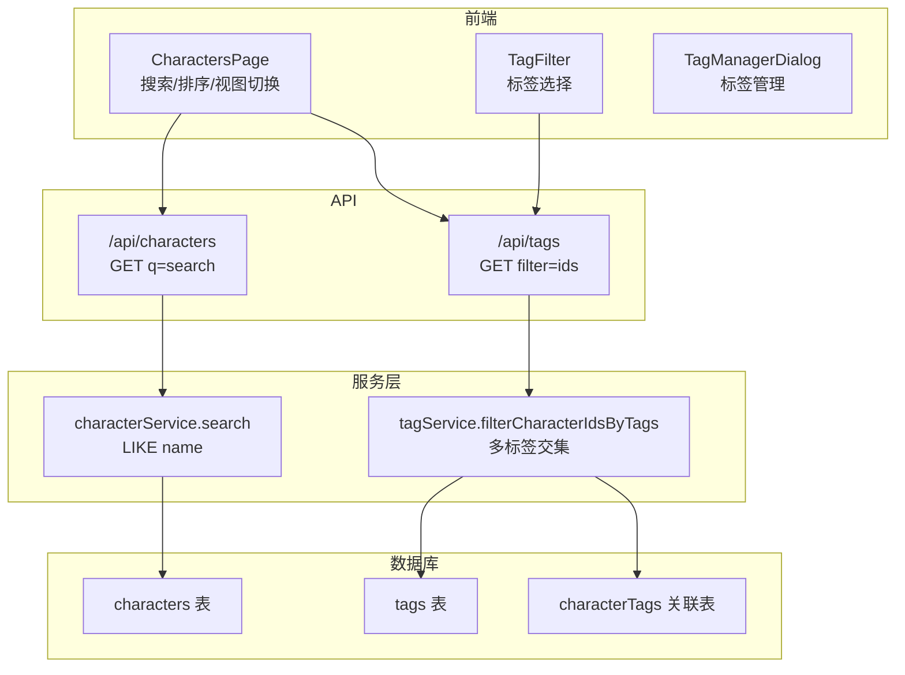
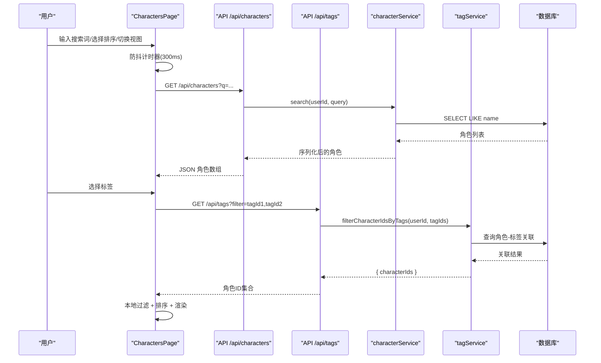
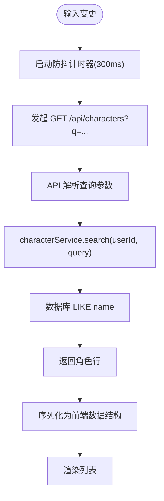
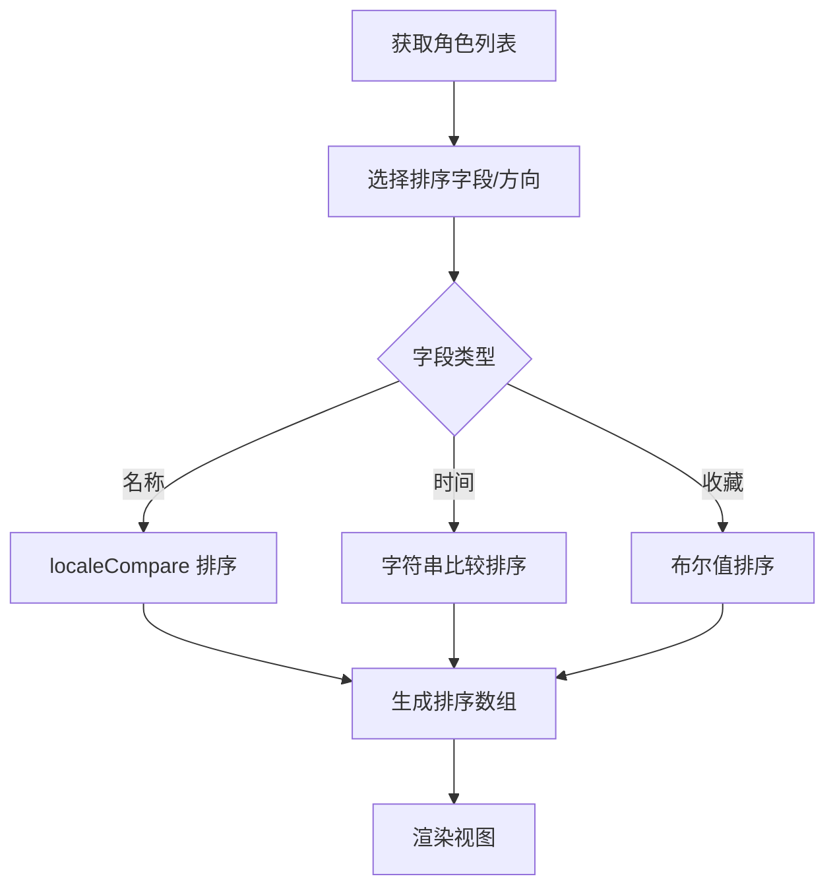
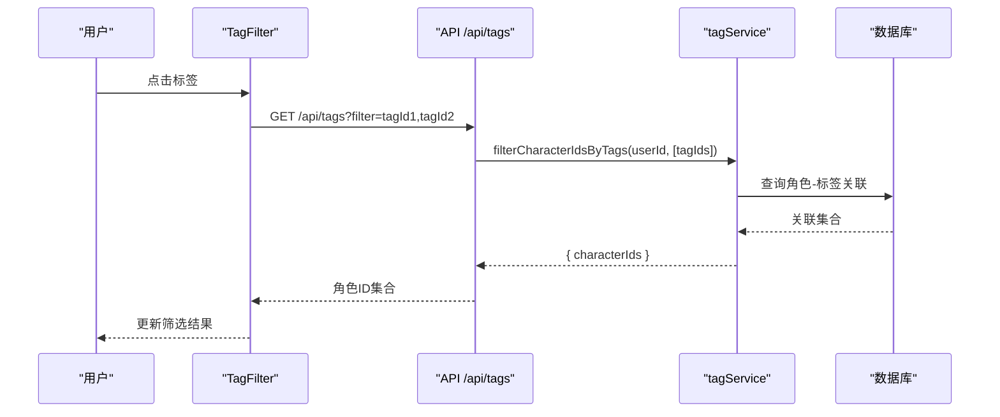
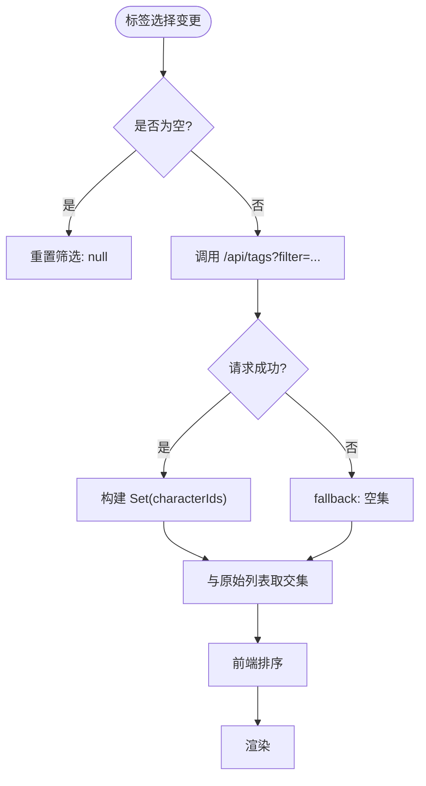
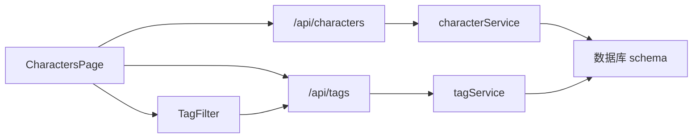
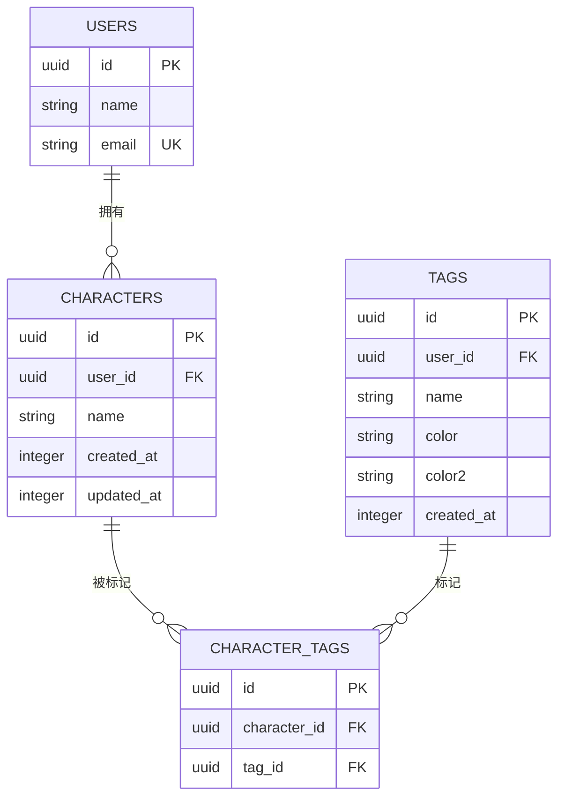

# 角色搜索与筛选

<cite>
**本文档引用的文件**
- [src/app/characters/page.tsx](file://src/app/characters/page.tsx)
- [src/components/characters/TagFilter.tsx](file://src/components/characters/TagFilter.tsx)
- [src/components/characters/TagManagerDialog.tsx](file://src/components/characters/TagManagerDialog.tsx)
- [src/lib/constants/ui.ts](file://src/lib/constants/ui.ts)
- [src/app/api/characters/route.ts](file://src/app/api/characters/route.ts)
- [src/app/api/tags/route.ts](file://src/app/api/tags/route.ts)
- [src/lib/services/character-service.ts](file://src/lib/services/character-service.ts)
- [src/lib/services/tag-service.ts](file://src/lib/services/tag-service.ts)
- [src/lib/db/schema.ts](file://src/lib/db/schema.ts)
- [drizzle/meta/0000_snapshot.json](file://drizzle/meta/0000_snapshot.json)
</cite>

## 目录
1. [简介](#简介)
2. [项目结构](#项目结构)
3. [核心组件](#核心组件)
4. [架构总览](#架构总览)
5. [详细组件分析](#详细组件分析)
6. [依赖关系分析](#依赖关系分析)
7. [性能考量](#性能考量)
8. [故障排查指南](#故障排查指南)
9. [结论](#结论)
10. [附录](#附录)

## 简介
本文件系统性梳理“角色搜索与筛选”功能的前端实现、后端服务与数据库模型，涵盖以下主题：
- 搜索算法与关键词匹配策略
- 排序机制与多字段排序
- 标签筛选器的实现原理、多标签组合筛选与动态筛选更新
- 搜索防抖机制、性能优化与用户体验设计
- 搜索历史记录、热门搜索与智能提示的扩展建议
- 自定义筛选条件的实现方法与扩展开发指南

## 项目结构
角色搜索与筛选功能由三层组成：
- 前端页面与组件：负责用户交互、状态管理、防抖与筛选联动
- API 层：接收查询参数，调用服务层处理业务逻辑
- 服务层与数据库：执行搜索、筛选与标签关联计算

**图表来源**
- [src/app/characters/page.tsx:51-258](file://src/app/characters/page.tsx#L51-L258)
- [src/components/characters/TagFilter.tsx:30-131](file://src/components/characters/TagFilter.tsx#L30-L131)
- [src/app/api/characters/route.ts:5-17](file://src/app/api/characters/route.ts#L5-L17)
- [src/app/api/tags/route.ts:5-23](file://src/app/api/tags/route.ts#L5-L23)
- [src/lib/services/character-service.ts:124-130](file://src/lib/services/character-service.ts#L124-L130)
- [src/lib/services/tag-service.ts:168-207](file://src/lib/services/tag-service.ts#L168-L207)

**章节来源**
- [src/app/characters/page.tsx:51-258](file://src/app/characters/page.tsx#L51-L258)
- [src/components/characters/TagFilter.tsx:30-131](file://src/components/characters/TagFilter.tsx#L30-L131)
- [src/app/api/characters/route.ts:5-17](file://src/app/api/characters/route.ts#L5-L17)
- [src/app/api/tags/route.ts:5-23](file://src/app/api/tags/route.ts#L5-L23)

## 核心组件
- 角色列表页（CharactersPage）
  - 提供搜索输入框、排序选择器、网格/列表视图切换
  - 实现搜索防抖（默认300ms）与标签筛选联动
  - 本地排序（支持多字段）与视图渲染
- 标签筛选器（TagFilter）
  - 加载用户标签，支持多选与清除
  - 触发筛选更新，返回满足条件的角色 ID 集合
- 标签管理弹窗（TagManagerDialog）
  - 创建/编辑/删除标签，支持颜色配置
  - 与 TagFilter 协同刷新标签列表

**章节来源**
- [src/app/characters/page.tsx:51-258](file://src/app/characters/page.tsx#L51-L258)
- [src/components/characters/TagFilter.tsx:30-131](file://src/components/characters/TagFilter.tsx#L30-L131)
- [src/components/characters/TagManagerDialog.tsx:29-201](file://src/components/characters/TagManagerDialog.tsx#L29-L201)

## 架构总览
从前端到数据库的数据流如下：

**图表来源**
- [src/app/characters/page.tsx:74-91](file://src/app/characters/page.tsx#L74-L91)
- [src/app/api/characters/route.ts:10-14](file://src/app/api/characters/route.ts#L10-L14)
- [src/app/api/tags/route.ts:11-19](file://src/app/api/tags/route.ts#L11-L19)
- [src/lib/services/character-service.ts:124-130](file://src/lib/services/character-service.ts#L124-L130)
- [src/lib/services/tag-service.ts:168-207](file://src/lib/services/tag-service.ts#L168-L207)

## 详细组件分析

### 搜索算法与关键词匹配
- 前端行为
  - 搜索输入变更触发防抖（默认300ms），避免频繁请求
  - 将查询参数拼接到 /api/characters?q=... 发起请求
- 后端处理
  - API 解析 q 参数，调用 characterService.search
  - 服务层使用 SQL LIKE 匹配角色名称字段
- 排序
  - 支持按名称、创建时间、更新时间、收藏优先排序
  - 排序在前端完成，保证响应速度与一致性

**图表来源**
- [src/app/characters/page.tsx:74-79](file://src/app/characters/page.tsx#L74-L79)
- [src/app/api/characters/route.ts:10-14](file://src/app/api/characters/route.ts#L10-L14)
- [src/lib/services/character-service.ts:124-130](file://src/lib/services/character-service.ts#L124-L130)

**章节来源**
- [src/app/characters/page.tsx:74-79](file://src/app/characters/page.tsx#L74-L79)
- [src/app/api/characters/route.ts:10-14](file://src/app/api/characters/route.ts#L10-L14)
- [src/lib/services/character-service.ts:124-130](file://src/lib/services/character-service.ts#L124-L130)

### 排序机制
- 字段支持：名称、创建时间、更新时间、收藏优先
- 方式：前端本地排序，避免重复请求
- 顺序：升序/降序可选，UI 提供下拉选择

**图表来源**
- [src/app/characters/page.tsx:38-49](file://src/app/characters/page.tsx#L38-L49)

**章节来源**
- [src/app/characters/page.tsx:38-49](file://src/app/characters/page.tsx#L38-L49)

### 标签筛选器实现原理
- 标签加载：首次进入页面或管理标签后重新获取
- 多标签组合：选择多个标签时，后端返回同时满足所有标签的角色 ID 集合
- 动态更新：选择变化时立即触发筛选，清空选择则取消筛选

**图表来源**
- [src/components/characters/TagFilter.tsx:34-51](file://src/components/characters/TagFilter.tsx#L34-L51)
- [src/app/api/tags/route.ts:11-19](file://src/app/api/tags/route.ts#L11-L19)
- [src/lib/services/tag-service.ts:168-207](file://src/lib/services/tag-service.ts#L168-L207)

**章节来源**
- [src/components/characters/TagFilter.tsx:30-131](file://src/components/characters/TagFilter.tsx#L30-L131)
- [src/app/api/tags/route.ts:11-19](file://src/app/api/tags/route.ts#L11-L19)
- [src/lib/services/tag-service.ts:168-207](file://src/lib/services/tag-service.ts#L168-L207)

### 多标签组合筛选与动态更新
- 组合策略：后端对传入的标签 ID 列表求交集，仅返回同时具备所有标签的角色
- 动态更新：前端维护 filteredCharIds 集合，与原始列表取交集后再排序渲染
- 清除逻辑：当标签集合为空时，恢复完整列表

**图表来源**
- [src/app/characters/page.tsx:81-91](file://src/app/characters/page.tsx#L81-L91)
- [src/app/characters/page.tsx:134-135](file://src/app/characters/page.tsx#L134-L135)

**章节来源**
- [src/app/characters/page.tsx:81-91](file://src/app/characters/page.tsx#L81-L91)
- [src/app/characters/page.tsx:134-135](file://src/app/characters/page.tsx#L134-L135)

### 搜索防抖机制与性能优化
- 防抖间隔：统一常量 DEBOUNCE_INPUT_MS = 300ms
- 作用：减少网络请求次数，提升交互流畅度
- 优化策略：
  - 前端本地排序与筛选，避免重复请求
  - 标签筛选采用后端交集计算，前端只做集合运算
  - 使用 useRef 存储定时器，及时清理

**章节来源**
- [src/lib/constants/ui.ts:8-9](file://src/lib/constants/ui.ts#L8-L9)
- [src/app/characters/page.tsx:74-79](file://src/app/characters/page.tsx#L74-L79)

### 用户体验设计
- 搜索输入框：内置图标与清除按钮，支持一键清空
- 排序选择器：直观选项，快速切换排序方式
- 视图切换：网格/列表双模式，适配不同浏览习惯
- 标签筛选器：高亮选中项，显示角色数量，支持管理标签

**章节来源**
- [src/app/characters/page.tsx:143-175](file://src/app/characters/page.tsx#L143-L175)
- [src/components/characters/TagFilter.tsx:76-109](file://src/components/characters/TagFilter.tsx#L76-L109)

### 搜索历史记录、热门搜索与智能提示（扩展建议）
- 搜索历史记录
  - 建议：在 localStorage 中维护最近N条搜索词；展示为下拉建议列表
  - 注意：需考虑隐私与存储上限
- 热门搜索
  - 建议：统计搜索词频，按频率排序展示；结合用户偏好调整权重
- 智能提示
  - 建议：基于已存在角色名称进行前缀匹配与高亮；支持键盘导航
  - 性能：可采用防抖 + 本地缓存策略，避免频繁请求

[本节为概念性扩展建议，不直接分析具体文件，故无“章节来源”]

## 依赖关系分析

**图表来源**
- [src/app/characters/page.tsx:51-258](file://src/app/characters/page.tsx#L51-L258)
- [src/app/api/characters/route.ts:5-17](file://src/app/api/characters/route.ts#L5-L17)
- [src/app/api/tags/route.ts:5-23](file://src/app/api/tags/route.ts#L5-L23)
- [src/lib/services/character-service.ts:115-130](file://src/lib/services/character-service.ts#L115-L130)
- [src/lib/services/tag-service.ts:57-70](file://src/lib/services/tag-service.ts#L57-L70)

**章节来源**
- [src/app/characters/page.tsx:51-258](file://src/app/characters/page.tsx#L51-L258)
- [src/app/api/characters/route.ts:5-17](file://src/app/api/characters/route.ts#L5-L17)
- [src/app/api/tags/route.ts:5-23](file://src/app/api/tags/route.ts#L5-L23)
- [src/lib/services/character-service.ts:115-130](file://src/lib/services/character-service.ts#L115-L130)
- [src/lib/services/tag-service.ts:57-70](file://src/lib/services/tag-service.ts#L57-L70)

## 性能考量
- 前端层面
  - 防抖与定时器清理，避免内存泄漏
  - 本地排序与集合运算，降低后端压力
- 后端层面
  - 搜索使用 LIKE name，建议在 name 字段建立索引以提升匹配效率
  - 标签筛选采用角色-标签关联表的分组与交集计算，复杂度与用户角色数和标签数相关
- 数据库层面
  - characters 表包含 name、createdAt、updatedAt 等字段，便于排序与检索
  - characterTags 作为多对多关联表，支撑多标签组合筛选

**章节来源**
- [src/lib/constants/ui.ts:8-9](file://src/lib/constants/ui.ts#L8-L9)
- [src/lib/services/character-service.ts:124-130](file://src/lib/services/character-service.ts#L124-L130)
- [src/lib/services/tag-service.ts:168-207](file://src/lib/services/tag-service.ts#L168-L207)
- [drizzle/meta/0000_snapshot.json:190-234](file://drizzle/meta/0000_snapshot.json#L190-L234)

## 故障排查指南
- 搜索无结果
  - 检查 q 参数是否正确传递至 /api/characters
  - 确认 characterService.search 是否命中 name 字段
- 标签筛选无效
  - 确认 /api/tags?filter=... 请求返回的 characterIds 是否为空
  - 检查 tagService.filterCharacterIdsByTags 的交集逻辑与用户角色范围
- 排序异常
  - 检查前端 sortCharacters 的字段映射与 localeCompare 使用
- 性能问题
  - 增加 name 字段索引
  - 评估角色与标签规模，必要时引入分页或更复杂的索引策略

**章节来源**
- [src/app/api/characters/route.ts:10-14](file://src/app/api/characters/route.ts#L10-L14)
- [src/lib/services/character-service.ts:124-130](file://src/lib/services/character-service.ts#L124-L130)
- [src/app/api/tags/route.ts:11-19](file://src/app/api/tags/route.ts#L11-L19)
- [src/lib/services/tag-service.ts:168-207](file://src/lib/services/tag-service.ts#L168-L207)
- [src/app/characters/page.tsx:38-49](file://src/app/characters/page.tsx#L38-L49)

## 结论
该功能以简洁高效的前后端协作实现了“关键词搜索 + 多标签组合筛选 + 多字段排序”的核心能力。前端通过防抖与本地运算优化体验，后端通过服务层封装与数据库查询保障稳定性。建议后续在搜索历史、热门搜索与智能提示方面进行扩展，进一步提升可用性与智能化水平。

## 附录

### 数据模型概览

**图表来源**
- [src/lib/db/schema.ts](file://src/lib/db/schema.ts)
- [drizzle/meta/0000_snapshot.json:190-234](file://drizzle/meta/0000_snapshot.json#L190-L234)

### 扩展开发指南与自定义筛选条件
- 新增筛选维度
  - 在 API 层增加查询参数（如 creator、fav、createdAt 范围）
  - 在服务层添加对应查询方法，返回标准化数据结构
  - 在前端页面合并筛选条件，保持本地过滤与排序流程一致
- 智能提示与热门搜索
  - 前端维护本地历史与热门词，结合后端模糊匹配
  - 控制请求频率与缓存策略，避免过度请求
- 多语言与本地化
  - 对排序与提示文案进行本地化处理
  - 对 LIKE 匹配进行大小写与语言环境适配

[本节为通用扩展指导，不直接分析具体文件，故无“章节来源”]