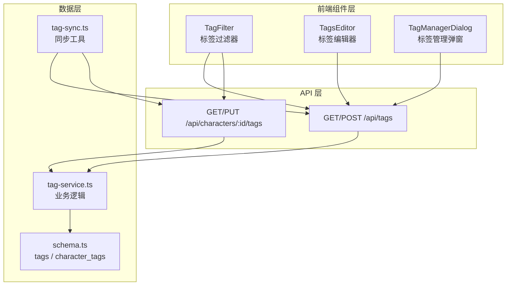
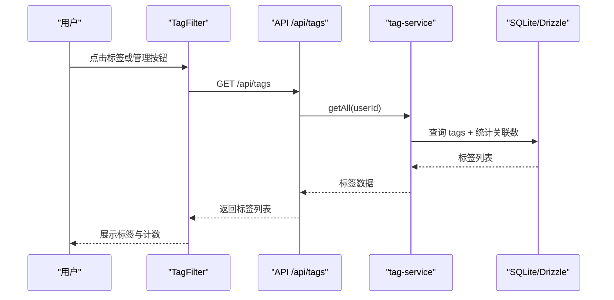
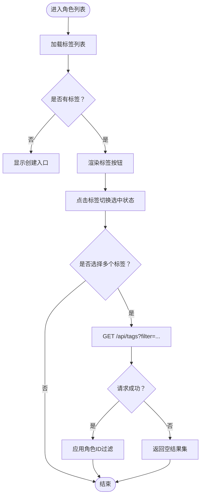
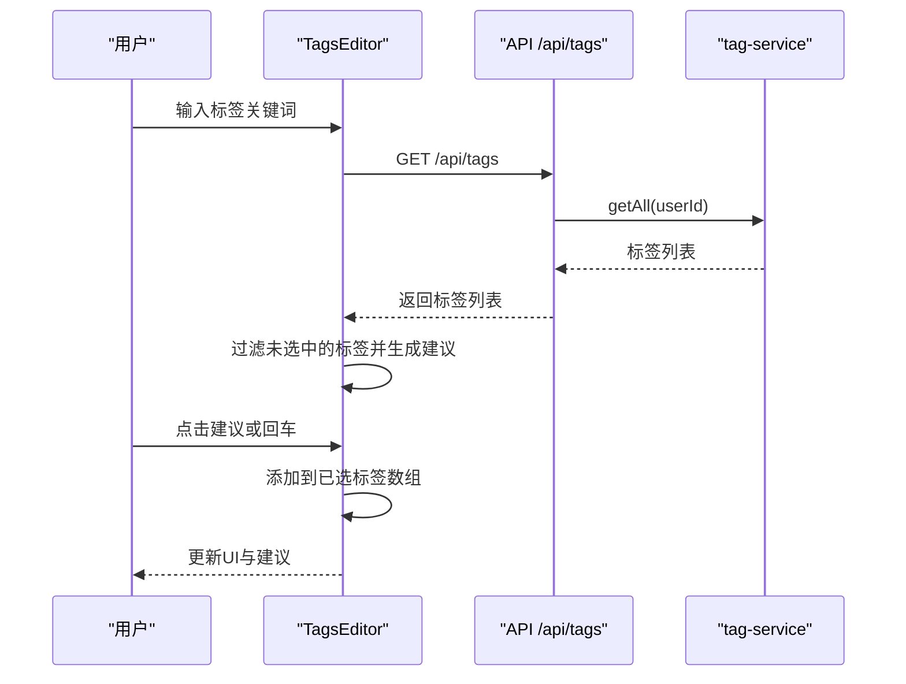
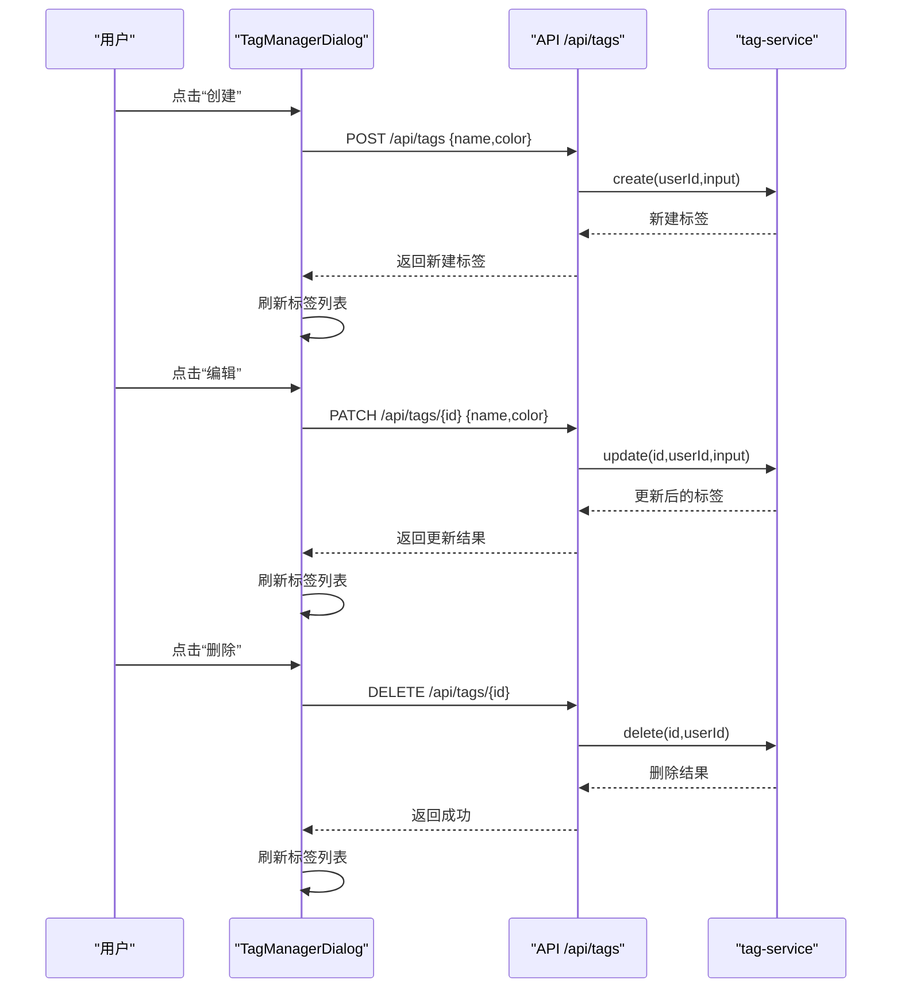
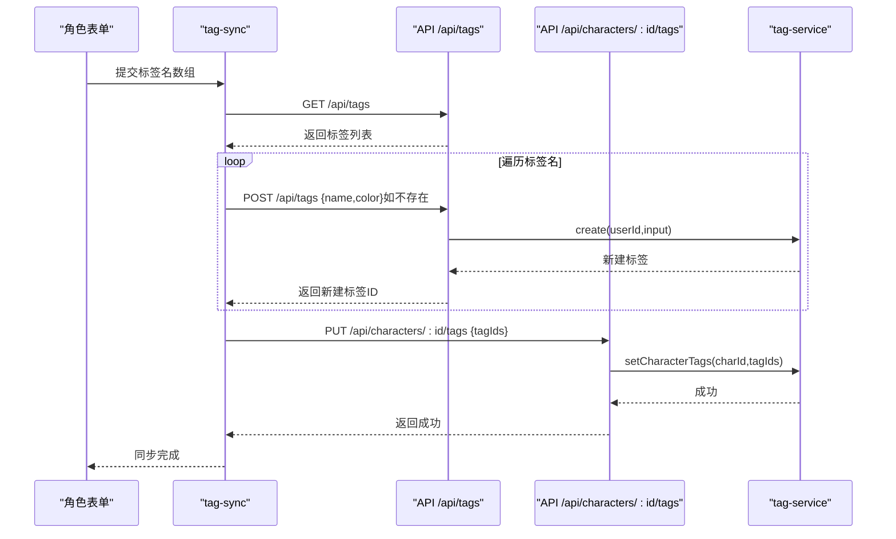
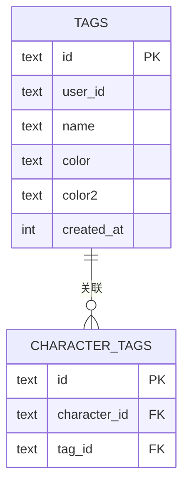
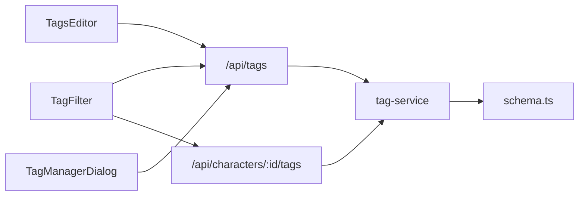

# 角色标签系统

<cite>
**本文档引用的文件**
- [src/components/characters/TagFilter.tsx](file://src/components/characters/TagFilter.tsx)
- [src/components/characters/TagManagerDialog.tsx](file://src/components/characters/TagManagerDialog.tsx)
- [src/components/characters/TagsEditor.tsx](file://src/components/characters/TagsEditor.tsx)
- [src/app/api/tags/route.ts](file://src/app/api/tags/route.ts)
- [src/app/api/characters/[id]/tags/route.ts](file://src/app/api/characters/[id]/tags/route.ts)
- [src/lib/services/tag-service.ts](file://src/lib/services/tag-service.ts)
- [src/lib/services/tag-sync.ts](file://src/lib/services/tag-sync.ts)
- [src/lib/db/schema.ts](file://src/lib/db/schema.ts)
- [src/app/characters/page.tsx](file://src/app/characters/page.tsx)
- [src/components/characters/TextField.tsx](file://src/components/characters/TextField.tsx)
</cite>

## 目录
1. [简介](#简介)
2. [项目结构](#项目结构)
3. [核心组件](#核心组件)
4. [架构总览](#架构总览)
5. [详细组件分析](#详细组件分析)
6. [依赖关系分析](#依赖关系分析)
7. [性能考虑](#性能考虑)
8. [故障排除指南](#故障排除指南)
9. [结论](#结论)
10. [附录](#附录)

## 简介
本文件为“角色标签系统”的综合技术文档，面向开发者与产品使用者，系统性阐述标签的创建、编辑、删除与管理流程；解释标签过滤器的工作原理、标签选择逻辑与搜索匹配机制；详述标签编辑器的用户界面、批量操作与实时更新策略；包含标签管理对话框的功能说明、标签分类与统计展示；并提供最佳实践、性能优化与用户体验改进建议。

## 项目结构
标签系统由三层构成：
- 前端组件层：负责用户交互与状态管理（标签过滤器、标签编辑器、标签管理弹窗）。
- API 层：提供标签的增删改查与角色-标签关联接口。
- 数据层：基于 SQLite 与 Drizzle ORM 的标签与角色-标签关联表。

图表来源
- [src/components/characters/TagFilter.tsx:30-131](file://src/components/characters/TagFilter.tsx#L30-L131)
- [src/components/characters/TagsEditor.tsx:15-88](file://src/components/characters/TagsEditor.tsx#L15-L88)
- [src/components/characters/TagManagerDialog.tsx:29-201](file://src/components/characters/TagManagerDialog.tsx#L29-L201)
- [src/app/api/tags/route.ts:5-44](file://src/app/api/tags/route.ts#L5-L44)
- [src/app/api/characters/[id]/tags/route.ts](file://src/app/api/characters/[id]/tags/route.ts#L13-L41)
- [src/lib/services/tag-service.ts:57-208](file://src/lib/services/tag-service.ts#L57-L208)
- [src/lib/db/schema.ts:58-74](file://src/lib/db/schema.ts#L58-L74)
- [src/lib/services/tag-sync.ts:6-35](file://src/lib/services/tag-sync.ts#L6-L35)

章节来源
- [src/components/characters/TagFilter.tsx:30-131](file://src/components/characters/TagFilter.tsx#L30-L131)
- [src/components/characters/TagsEditor.tsx:15-88](file://src/components/characters/TagsEditor.tsx#L15-L88)
- [src/components/characters/TagManagerDialog.tsx:29-201](file://src/components/characters/TagManagerDialog.tsx#L29-L201)
- [src/app/api/tags/route.ts:5-44](file://src/app/api/tags/route.ts#L5-L44)
- [src/app/api/characters/[id]/tags/route.ts](file://src/app/api/characters/[id]/tags/route.ts#L13-L41)
- [src/lib/services/tag-service.ts:57-208](file://src/lib/services/tag-service.ts#L57-L208)
- [src/lib/db/schema.ts:58-74](file://src/lib/db/schema.ts#L58-L74)
- [src/lib/services/tag-sync.ts:6-35](file://src/lib/services/tag-sync.ts#L6-L35)

## 核心组件
- 标签过滤器（TagFilter）：在角色列表顶部展示可用标签，支持多选筛选、清除筛选、打开管理弹窗。
- 标签编辑器（TagsEditor）：在角色新建/编辑页提供标签搜索与创建能力，支持建议列表与即时添加。
- 标签管理弹窗（TagManagerDialog）：集中管理标签的创建、编辑、删除与颜色配置，并实时刷新列表。

章节来源
- [src/components/characters/TagFilter.tsx:30-131](file://src/components/characters/TagFilter.tsx#L30-L131)
- [src/components/characters/TagsEditor.tsx:15-88](file://src/components/characters/TagsEditor.tsx#L15-L88)
- [src/components/characters/TagManagerDialog.tsx:29-201](file://src/components/characters/TagManagerDialog.tsx#L29-L201)

## 架构总览
标签系统采用前后端分离的分层设计：
- 前端通过 HTTP 请求调用 API，完成标签与角色-标签关联的数据读写。
- 后端使用 Drizzle ORM 访问 SQLite，提供强类型校验与事务安全。
- 同步工具负责将角色表单中的标签名数组转换为标签 ID 并写入关联表，确保列表页过滤器可用。

图表来源
- [src/components/characters/TagFilter.tsx:34-43](file://src/components/characters/TagFilter.tsx#L34-L43)
- [src/app/api/tags/route.ts:21-22](file://src/app/api/tags/route.ts#L21-L22)
- [src/lib/services/tag-service.ts:59-70](file://src/lib/services/tag-service.ts#L59-L70)

## 详细组件分析

### 标签过滤器（TagFilter）
- 功能要点
  - 加载标签：首次渲染或切换管理弹窗后拉取标签列表。
  - 选择逻辑：点击标签切换其在已选集合中的状态，支持多选。
  - 清除筛选：一键清空已选标签。
  - 管理入口：无标签时显示“创建标签”入口，打开管理弹窗。
- 数据与交互
  - 显示标签名称、颜色标记与关联角色数量。
  - 通过回调 onSelectionChange 通知父组件筛选条件变化。
- 过滤机制
  - 当存在已选标签时，向 /api/tags 发送查询参数 filter=tagId1,tagId2,...，后端返回满足“同时拥有所有选中标签”的角色 ID 列表，前端据此过滤角色列表。

图表来源
- [src/components/characters/TagFilter.tsx:30-131](file://src/components/characters/TagFilter.tsx#L30-L131)
- [src/app/characters/page.tsx:81-91](file://src/app/characters/page.tsx#L81-L91)
- [src/app/api/tags/route.ts:11-19](file://src/app/api/tags/route.ts#L11-L19)
- [src/lib/services/tag-service.ts:168-207](file://src/lib/services/tag-service.ts#L168-L207)

章节来源
- [src/components/characters/TagFilter.tsx:30-131](file://src/components/characters/TagFilter.tsx#L30-L131)
- [src/app/characters/page.tsx:81-91](file://src/app/characters/page.tsx#L81-L91)

### 标签编辑器（TagsEditor）
- 功能要点
  - 搜索与建议：根据输入内容从后端标签库中筛选未选中的标签，提供建议列表。
  - 创建新标签：当输入不在现有标签中时，提供“创建”快捷选项。
  - 即时添加与移除：点击建议项或使用回车键添加；点击叉号移除已选标签。
  - 输入体验：支持回车添加、ESC 关闭建议、失焦延时隐藏等交互细节。
- 搜索匹配机制
  - 不区分大小写的包含匹配；过滤掉已选标签；限制建议数量。
  - 输入为空时默认展示部分未选标签作为快速选择。

图表来源
- [src/components/characters/TagsEditor.tsx:15-88](file://src/components/characters/TagsEditor.tsx#L15-L88)
- [src/app/api/tags/route.ts:21-22](file://src/app/api/tags/route.ts#L21-L22)
- [src/lib/services/tag-service.ts:59-70](file://src/lib/services/tag-service.ts#L59-L70)

章节来源
- [src/components/characters/TagsEditor.tsx:15-88](file://src/components/characters/TagsEditor.tsx#L15-L88)

### 标签管理弹窗（TagManagerDialog）
- 功能要点
  - 创建标签：输入名称与颜色，提交后刷新列表。
  - 编辑标签：进入编辑态，允许修改名称与颜色，保存后刷新列表。
  - 删除标签：确认后删除，自动移除相关角色关联。
  - 颜色选择：内置预设色盘，支持清空颜色。
- 实时更新
  - 所有变更后调用统一刷新函数，重新拉取标签列表并计算每个标签的关联角色数量。

图表来源
- [src/components/characters/TagManagerDialog.tsx:29-201](file://src/components/characters/TagManagerDialog.tsx#L29-L201)
- [src/app/api/tags/route.ts:25-44](file://src/app/api/tags/route.ts#L25-L44)
- [src/lib/services/tag-service.ts:73-134](file://src/lib/services/tag-service.ts#L73-L134)

章节来源
- [src/components/characters/TagManagerDialog.tsx:29-201](file://src/components/characters/TagManagerDialog.tsx#L29-L201)

### 角色-标签关联与同步
- 关联设置
  - 通过 PUT /api/characters/:id/tags 覆盖式设置角色的标签 ID 列表。
  - 服务层先删除旧关联，再插入新关联，保证一致性。
- 同步工具
  - 在角色表单保存时，将标签名数组同步为标签 ID 数组：若标签不存在则先创建，再建立关联。
  - 该流程确保列表页 TagFilter 可识别并进行筛选。

图表来源
- [src/lib/services/tag-sync.ts:6-35](file://src/lib/services/tag-sync.ts#L6-L35)
- [src/app/api/characters/[id]/tags/route.ts](file://src/app/api/characters/[id]/tags/route.ts#L23-L41)
- [src/lib/services/tag-service.ts:140-156](file://src/lib/services/tag-service.ts#L140-L156)

章节来源
- [src/lib/services/tag-sync.ts:6-35](file://src/lib/services/tag-sync.ts#L6-L35)
- [src/app/api/characters/[id]/tags/route.ts](file://src/app/api/characters/[id]/tags/route.ts#L23-L41)
- [src/lib/services/tag-service.ts:140-156](file://src/lib/services/tag-service.ts#L140-L156)

### 数据模型与统计
- 数据模型
  - tags：标签主表，包含 id、用户标识、名称与颜色等。
  - character_tags：角色-标签关联表，维护角色与标签的多对多关系。
- 统计信息
  - 标签列表接口返回每个标签的“关联角色数量”，用于过滤器按钮右侧的计数展示。
  - 服务层通过遍历关联表构建映射，计算每个标签的计数。

图表来源
- [src/lib/db/schema.ts:58-74](file://src/lib/db/schema.ts#L58-L74)
- [src/lib/services/tag-service.ts:59-70](file://src/lib/services/tag-service.ts#L59-L70)

章节来源
- [src/lib/db/schema.ts:58-74](file://src/lib/db/schema.ts#L58-L74)
- [src/lib/services/tag-service.ts:59-70](file://src/lib/services/tag-service.ts#L59-L70)

## 依赖关系分析
- 组件耦合
  - TagFilter 依赖 API 层获取标签列表与执行筛选；与角色列表页通过回调通信。
  - TagsEditor 依赖 API 层获取标签建议；与角色表单共享。
  - TagManagerDialog 依赖 API 层进行标签的增删改；依赖刷新函数保持 UI 一致。
- 外部依赖
  - Drizzle ORM：提供类型安全的数据库访问与事务控制。
  - Next.js API Routes：提供认证与路由处理。
- 循环依赖
  - 未发现直接循环依赖；组件间通过 props 与回调传递数据。

图表来源
- [src/components/characters/TagFilter.tsx:34-43](file://src/components/characters/TagFilter.tsx#L34-L43)
- [src/components/characters/TagsEditor.tsx:20-25](file://src/components/characters/TagsEditor.tsx#L20-L25)
- [src/components/characters/TagManagerDialog.tsx:38-43](file://src/components/characters/TagManagerDialog.tsx#L38-L43)
- [src/app/api/tags/route.ts:5-23](file://src/app/api/tags/route.ts#L5-L23)
- [src/app/api/characters/[id]/tags/route.ts](file://src/app/api/characters/[id]/tags/route.ts#L13-L41)
- [src/lib/services/tag-service.ts:57-208](file://src/lib/services/tag-service.ts#L57-L208)
- [src/lib/db/schema.ts:58-74](file://src/lib/db/schema.ts#L58-L74)

章节来源
- [src/components/characters/TagFilter.tsx:34-43](file://src/components/characters/TagFilter.tsx#L34-L43)
- [src/components/characters/TagsEditor.tsx:20-25](file://src/components/characters/TagsEditor.tsx#L20-L25)
- [src/components/characters/TagManagerDialog.tsx:38-43](file://src/components/characters/TagManagerDialog.tsx#L38-L43)
- [src/app/api/tags/route.ts:5-23](file://src/app/api/tags/route.ts#L5-L23)
- [src/app/api/characters/[id]/tags/route.ts](file://src/app/api/characters/[id]/tags/route.ts#L13-L41)
- [src/lib/services/tag-service.ts:57-208](file://src/lib/services/tag-service.ts#L57-L208)
- [src/lib/db/schema.ts:58-74](file://src/lib/db/schema.ts#L58-L74)

## 性能考虑
- 建议列表优化
  - 限制建议数量（当前实现已限制），避免渲染过多节点。
  - 使用防抖与延迟隐藏，减少不必要的请求与重绘。
- 过滤性能
  - 后端按“同时满足所有选中标签”进行筛选，复杂度与角色总数与标签关联数相关；建议在标签数量较多时启用分页或缓存热门筛选组合。
- 实时刷新
  - 管理弹窗与编辑器均通过统一刷新函数拉取最新数据，避免重复请求；可在批量操作场景合并刷新次数。
- 数据库访问
  - 标签统计通过一次遍历关联表完成，复杂度 O(N)；建议在标签与关联量较大时增加索引（如 character_tags.tag_id）以提升查询效率。

## 故障排除指南
- 无法创建/编辑/删除标签
  - 检查认证状态与用户 ID 是否正确传入 API。
  - 查看 API 返回的错误信息，确认输入校验（名称长度、颜色格式）是否符合要求。
- 标签筛选无效
  - 确认已选标签 ID 正确拼接为 filter 参数。
  - 检查后端筛选逻辑是否返回了角色 ID 列表。
- 标签计数不准确
  - 确认关联表数据完整性，检查是否存在孤儿记录或缺失的关联。
- 同步失败
  - 检查同步工具的网络请求链路，确认标签创建与角色关联设置均成功返回。

章节来源
- [src/app/api/tags/route.ts:25-44](file://src/app/api/tags/route.ts#L25-L44)
- [src/app/api/characters/[id]/tags/route.ts](file://src/app/api/characters/[id]/tags/route.ts#L23-L41)
- [src/lib/services/tag-service.ts:168-207](file://src/lib/services/tag-service.ts#L168-L207)
- [src/lib/services/tag-sync.ts:6-35](file://src/lib/services/tag-sync.ts#L6-L35)

## 结论
角色标签系统通过清晰的三层架构实现了标签的全生命周期管理与高效筛选。前端组件提供直观的交互体验，API 层保障数据一致性与安全性，数据层以 SQLite + Drizzle ORM 提供可靠的存储与类型安全。通过合理的建议与同步机制，系统在易用性与性能之间取得平衡。建议后续在高并发与大数据量场景下引入缓存与索引优化，进一步提升响应速度与稳定性。

## 附录
- 最佳实践
  - 标签命名规范：简短、明确、唯一性优先，避免歧义。
  - 颜色策略：为常用标签分配固定颜色，便于视觉识别。
  - 批量操作：在角色列表页使用批量选择与批量删除，结合筛选一次性完成任务。
  - 同步策略：在角色表单保存时使用同步工具，确保标签与角色关联及时生效。
- 用户体验改进建议
  - 增加标签搜索的高亮显示与快捷键支持。
  - 在标签管理弹窗中增加“批量删除”与“重命名”功能。
  - 为标签计数添加排序与分组视图，便于管理大量标签。