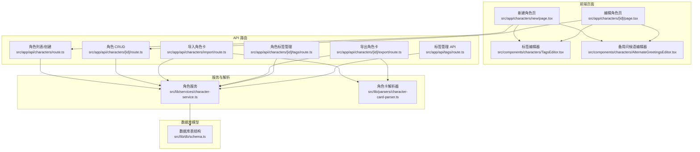
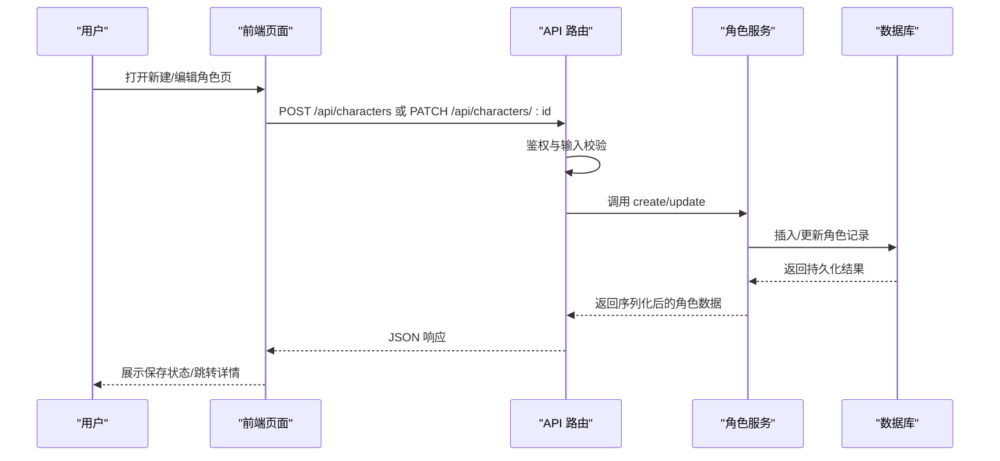
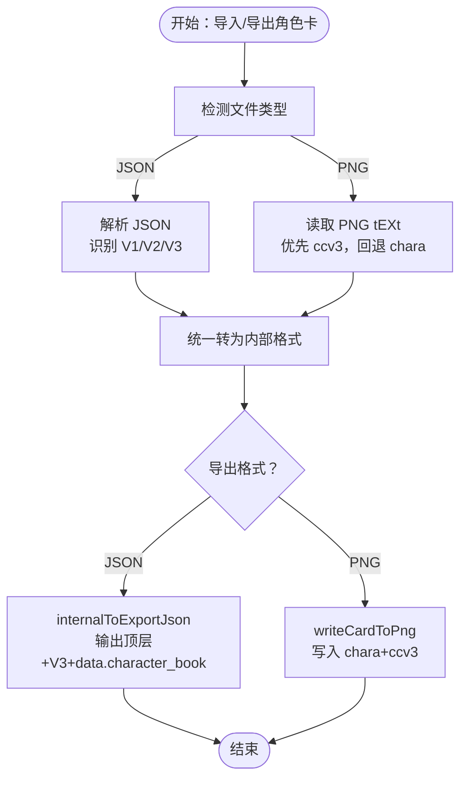
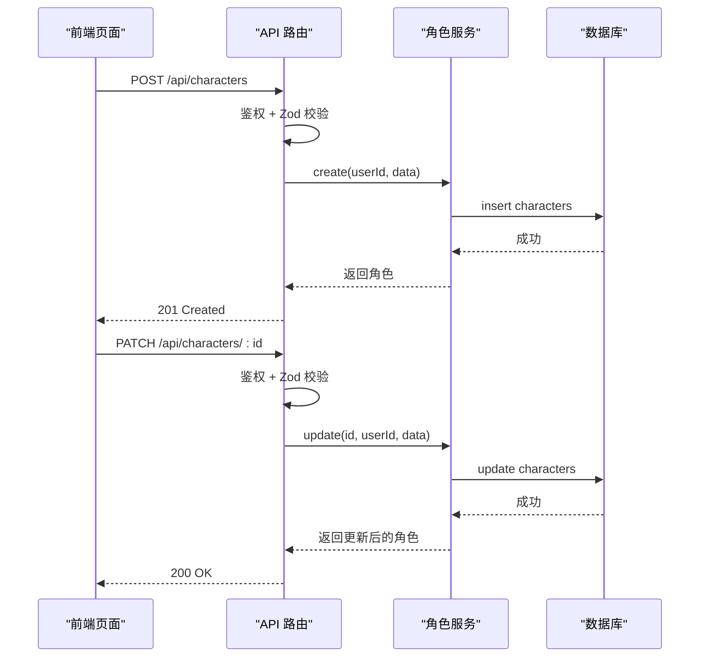
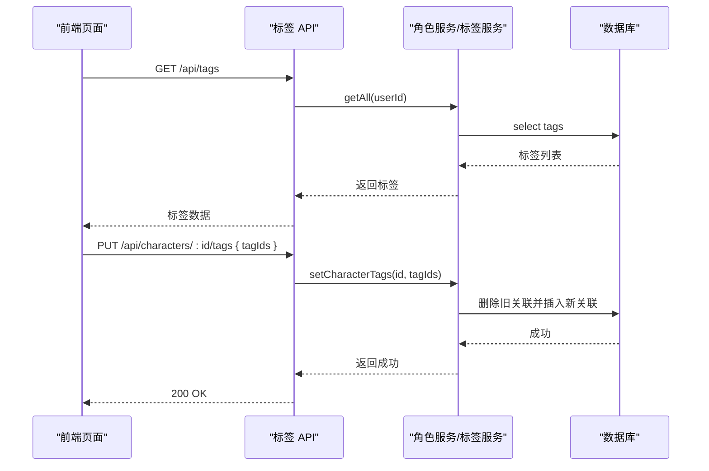
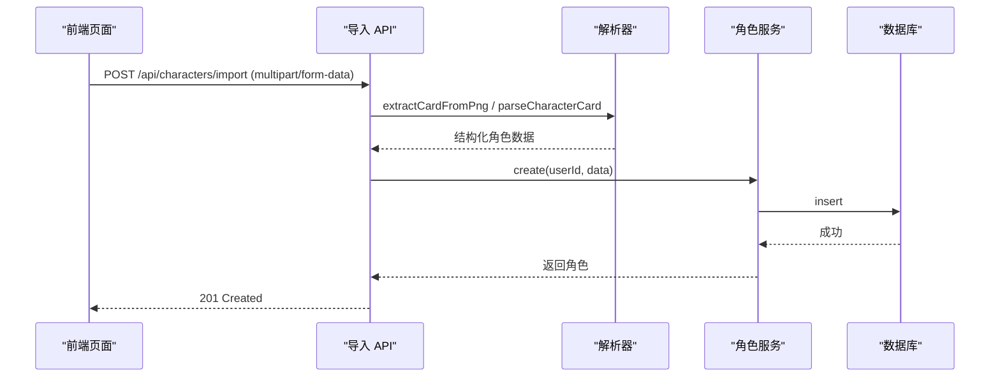
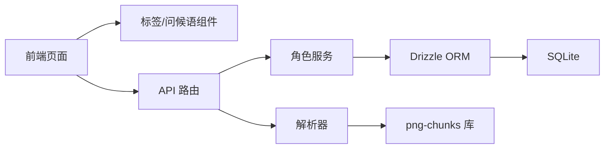

# 角色管理系统

<cite>
**本文引用的文件**
- [src/app/api/characters/route.ts](file://src/app/api/characters/route.ts)
- [src/app/api/characters/[id]/route.ts](file://src/app/api/characters/[id]/route.ts)
- [src/app/api/characters/import/route.ts](file://src/app/api/characters/import/route.ts)
- [src/app/api/characters/[id]/export/route.ts](file://src/app/api/characters/[id]/export/route.ts)
- [src/app/api/characters/[id]/tags/route.ts](file://src/app/api/characters/[id]/tags/route.ts)
- [src/app/api/tags/route.ts](file://src/app/api/tags/route.ts)
- [src/lib/services/character-service.ts](file://src/lib/services/character-service.ts)
- [src/lib/parsers/character-card-parser.ts](file://src/lib/parsers/character-card-parser.ts)
- [src/lib/db/schema.ts](file://src/lib/db/schema.ts)
- [src/components/characters/AlternateGreetingsEditor.tsx](file://src/components/characters/AlternateGreetingsEditor.tsx)
- [src/components/characters/TagsEditor.tsx](file://src/components/characters/TagsEditor.tsx)
- [src/components/characters/TagManagerDialog.tsx](file://src/components/characters/TagManagerDialog.tsx)
- [src/app/characters/new/page.tsx](file://src/app/characters/new/page.tsx)
- [src/app/characters/[id]/page.tsx](file://src/app/characters/[id]/page.tsx)
</cite>

## 目录
1. [简介](#简介)
2. [项目结构](#项目结构)
3. [核心组件](#核心组件)
4. [架构总览](#架构总览)
5. [详细组件分析](#详细组件分析)
6. [依赖关系分析](#依赖关系分析)
7. [性能考量](#性能考量)
8. [故障排查指南](#故障排查指南)
9. [结论](#结论)
10. [附录](#附录)

## 简介
本文件系统性梳理 SillyTavern Next 的角色管理系统，覆盖角色卡规范（TavernCard V2/V3）、角色创建与编辑流程、标签管理、导入导出（PNG/JSON 双向兼容）、数据验证、属性管理、问候语与备用问候语、搜索过滤、批量操作以及数据迁移策略，并提供最佳实践与扩展开发指南。

## 项目结构
角色管理相关代码采用“页面路由 + 服务层 + 解析器 + 数据库模型”的分层组织方式：
- 页面路由：负责鉴权、请求参数解析与响应封装
- 服务层：封装数据库访问、序列化/反序列化、业务规则
- 解析器：实现角色卡 V1/V2/V3 与 PNG 元数据互转
- 数据库模型：定义角色、标签、角色-标签关联等表结构

图表来源
- [src/app/characters/new/page.tsx:1-155](file://src/app/characters/new/page.tsx#L1-L155)
- [src/app/characters/[id]/page.tsx:1-230](file://src/app/characters/[id]/page.tsx#L1-L230)
- [src/app/api/characters/route.ts:1-42](file://src/app/api/characters/route.ts#L1-L42)
- [src/app/api/characters/[id]/route.ts:1-47](file://src/app/api/characters/[id]/route.ts#L1-L47)
- [src/app/api/characters/import/route.ts:1-90](file://src/app/api/characters/import/route.ts#L1-L90)
- [src/app/api/characters/[id]/export/route.ts:1-162](file://src/app/api/characters/[id]/export/route.ts#L1-L162)
- [src/app/api/characters/[id]/tags/route.ts:1-42](file://src/app/api/characters/[id]/tags/route.ts#L1-L42)
- [src/app/api/tags/route.ts:1-45](file://src/app/api/tags/route.ts#L1-L45)
- [src/lib/services/character-service.ts:1-252](file://src/lib/services/character-service.ts#L1-L252)
- [src/lib/parsers/character-card-parser.ts:1-354](file://src/lib/parsers/character-card-parser.ts#L1-L354)
- [src/lib/db/schema.ts:1-240](file://src/lib/db/schema.ts#L1-L240)

章节来源
- [src/app/api/characters/route.ts:1-42](file://src/app/api/characters/route.ts#L1-L42)
- [src/app/api/characters/[id]/route.ts:1-47](file://src/app/api/characters/[id]/route.ts#L1-L47)
- [src/app/api/characters/import/route.ts:1-90](file://src/app/api/characters/import/route.ts#L1-L90)
- [src/app/api/characters/[id]/export/route.ts:1-162](file://src/app/api/characters/[id]/export/route.ts#L1-L162)
- [src/app/api/characters/[id]/tags/route.ts:1-42](file://src/app/api/characters/[id]/tags/route.ts#L1-L42)
- [src/app/api/tags/route.ts:1-45](file://src/app/api/tags/route.ts#L1-L45)
- [src/lib/services/character-service.ts:1-252](file://src/lib/services/character-service.ts#L1-L252)
- [src/lib/parsers/character-card-parser.ts:1-354](file://src/lib/parsers/character-card-parser.ts#L1-L354)
- [src/lib/db/schema.ts:1-240](file://src/lib/db/schema.ts#L1-L240)

## 核心组件
- 角色服务（character-service）：提供角色的增删改查、搜索、克隆、序列化/反序列化，以及与标签、世界书的关联处理。
- 角色卡解析器（character-card-parser）：统一解析 V1/V2/V3 角色卡，支持 JSON 与 PNG 元数据双向转换，兼容 ccv3/chara tEXt chunk。
- 数据库模型（schema）：定义角色、标签、角色-标签关联等表，确保字段类型与业务需求一致。
- 标签系统：标签的创建、编辑、删除与过滤；角色与标签的多对多关联。
- 前端组件：标签编辑器、备用问候语编辑器、角色新建/编辑页面。

章节来源
- [src/lib/services/character-service.ts:115-252](file://src/lib/services/character-service.ts#L115-L252)
- [src/lib/parsers/character-card-parser.ts:131-354](file://src/lib/parsers/character-card-parser.ts#L131-L354)
- [src/lib/db/schema.ts:21-74](file://src/lib/db/schema.ts#L21-L74)
- [src/components/characters/TagsEditor.tsx:1-88](file://src/components/characters/TagsEditor.tsx#L1-L88)
- [src/components/characters/AlternateGreetingsEditor.tsx:1-38](file://src/components/characters/AlternateGreetingsEditor.tsx#L1-L38)

## 架构总览
角色管理采用前后端分离的 API 设计，前端页面通过 fetch 调用后端路由，路由层进行鉴权与输入校验，再委托服务层完成数据库操作与业务逻辑，解析器负责角色卡格式转换。

图表来源
- [src/app/characters/new/page.tsx:53-69](file://src/app/characters/new/page.tsx#L53-L69)
- [src/app/characters/[id]/page.tsx:54-70](file://src/app/characters/[id]/page.tsx#L54-L70)
- [src/app/api/characters/route.ts:19-41](file://src/app/api/characters/route.ts#L19-L41)
- [src/app/api/characters/[id]/route.ts:19-34](file://src/app/api/characters/[id]/route.ts#L19-L34)
- [src/lib/services/character-service.ts:139-174](file://src/lib/services/character-service.ts#L139-L174)

## 详细组件分析

### 角色卡规范与双向兼容
- 规范支持
  - V1：基础字段（名称、描述、个性、场景、首条消息、示例对话）
  - V2：扩展字段（创建者备注、系统提示词、历史后指令、备用问候语、标签、创建者、版本、talkativeness、fav、extensions、character_book 等）
  - V3：在 V2 基础上以 spec=chara_card_v3 / 3.0 输出，保持与 V2 的兼容性
- PNG 元数据
  - 优先读取 ccv3（V3），回退 chara（V2/V1）
  - 写入时同时写入 chara（占位）与 ccv3（主体），保证跨版本兼容
- JSON 导出
  - 输出顶层兼容字段（name/description/personality/first_mes/scenario/mes_example/avatar/create_date/talkativeness/fav/creatorcomment/tags）
  - data 中包含完整 V2 结构，可选嵌入 character_book

图表来源
- [src/lib/parsers/character-card-parser.ts:104-129](file://src/lib/parsers/character-card-parser.ts#L104-L129)
- [src/lib/parsers/character-card-parser.ts:266-293](file://src/lib/parsers/character-card-parser.ts#L266-L293)
- [src/lib/parsers/character-card-parser.ts:299-334](file://src/lib/parsers/character-card-parser.ts#L299-L334)
- [src/lib/parsers/character-card-parser.ts:209-258](file://src/lib/parsers/character-card-parser.ts#L209-L258)

章节来源
- [src/lib/parsers/character-card-parser.ts:13-65](file://src/lib/parsers/character-card-parser.ts#L13-L65)
- [src/lib/parsers/character-card-parser.ts:266-354](file://src/lib/parsers/character-card-parser.ts#L266-L354)

### 角色创建与编辑流程
- 新建角色
  - 前端收集基础与高级字段，调用 POST /api/characters
  - 后端鉴权与 Zod 校验，服务层入库，返回完整角色数据
  - 若存在标签，同步按名称映射到标签 ID
- 编辑角色
  - 前端拉取角色详情，支持头像上传、标签编辑、备用问候语编辑
  - 保存时调用 PATCH /api/characters/:id，服务层按需更新字段
  - 支持导出 JSON/PNG、复制角色、删除角色

图表来源
- [src/app/characters/new/page.tsx:53-69](file://src/app/characters/new/page.tsx#L53-L69)
- [src/app/characters/[id]/page.tsx:54-70](file://src/app/characters/[id]/page.tsx#L54-L70)
- [src/app/api/characters/route.ts:19-41](file://src/app/api/characters/route.ts#L19-L41)
- [src/app/api/characters/[id]/route.ts:19-34](file://src/app/api/characters/[id]/route.ts#L19-L34)
- [src/lib/services/character-service.ts:139-212](file://src/lib/services/character-service.ts#L139-L212)

章节来源
- [src/app/characters/new/page.tsx:14-31](file://src/app/characters/new/page.tsx#L14-L31)
- [src/app/characters/[id]/page.tsx:22-98](file://src/app/characters/[id]/page.tsx#L22-L98)
- [src/lib/services/character-service.ts:115-212](file://src/lib/services/character-service.ts#L115-L212)

### 标签管理系统
- 标签 API
  - GET /api/tags：列出当前用户的标签，支持 ?filter=tagId1,tagId2 过滤角色
  - POST /api/tags：创建标签（名称、颜色等）
- 角色标签
  - GET /api/characters/:id/tags：获取角色关联的标签 ID
  - PUT /api/characters/:id/tags：覆盖设置角色标签（多对多）
- 前端交互
  - TagsEditor：输入框搜索/创建标签，支持建议列表与新建提示
  - TagManagerDialog：集中管理标签（创建/编辑/删除、颜色选择）

图表来源
- [src/app/api/tags/route.ts:5-23](file://src/app/api/tags/route.ts#L5-L23)
- [src/app/api/characters/[id]/tags/route.ts:12-41](file://src/app/api/characters/[id]/tags/route.ts#L12-L41)
- [src/components/characters/TagsEditor.tsx:14-88](file://src/components/characters/TagsEditor.tsx#L14-L88)
- [src/components/characters/TagManagerDialog.tsx:28-201](file://src/components/characters/TagManagerDialog.tsx#L28-L201)

章节来源
- [src/app/api/tags/route.ts:25-44](file://src/app/api/tags/route.ts#L25-L44)
- [src/app/api/characters/[id]/tags/route.ts:8-41](file://src/app/api/characters/[id]/tags/route.ts#L8-L41)
- [src/components/characters/TagsEditor.tsx:14-88](file://src/components/characters/TagsEditor.tsx#L14-L88)
- [src/components/characters/TagManagerDialog.tsx:28-201](file://src/components/characters/TagManagerDialog.tsx#L28-L201)

### 角色导入导出
- 导入
  - 支持 .json 与 .png 文件
  - JSON：自动识别 V2/V3、旧版裸数据，统一转为内部格式
  - PNG：从 tEXt chunk 读取 ccv3/chara，解析为结构化数据，头像以 data URL 嵌入
- 导出
  - JSON：输出顶层兼容字段 + V3 spec + data.character_book
  - PNG：写入 chara（V2 占位）+ ccv3（V3 主体），底图为角色头像或最小 PNG

图表来源
- [src/app/api/characters/import/route.ts:12-89](file://src/app/api/characters/import/route.ts#L12-L89)
- [src/lib/parsers/character-card-parser.ts:337-354](file://src/lib/parsers/character-card-parser.ts#L337-L354)
- [src/lib/services/character-service.ts:139-174](file://src/lib/services/character-service.ts#L139-L174)

章节来源
- [src/app/api/characters/import/route.ts:12-89](file://src/app/api/characters/import/route.ts#L12-L89)
- [src/app/api/characters/[id]/export/route.ts:15-145](file://src/app/api/characters/[id]/export/route.ts#L15-L145)

### 数据验证与错误处理
- 输入校验
  - 使用 Zod 对创建/更新请求体进行严格校验，支持 passthrough 以兼容未知字段
  - 标签创建同样进行 Zod 校验
- 错误处理
  - 鉴权失败返回 401
  - 参数无效返回 400
  - 未找到资源返回 404
  - 服务器异常返回 500

章节来源
- [src/lib/services/character-service.ts:11-53](file://src/lib/services/character-service.ts#L11-L53)
- [src/app/api/characters/route.ts:24-28](file://src/app/api/characters/route.ts#L24-L28)
- [src/app/api/characters/[id]/route.ts:26-29](file://src/app/api/characters/[id]/route.ts#L26-L29)
- [src/app/api/tags/route.ts:31-33](file://src/app/api/tags/route.ts#L31-L33)

### 角色属性管理、问候语与备用问候语
- 属性管理
  - 基础字段：名称、描述、个性、场景、首条消息、示例对话
  - 高级字段：创建者备注、系统提示词、历史后指令、标签、创建者、版本、talkativeness、fav、avatar、extensions、characterBook、worldInfoBookId
- 问候语
  - 首条消息：每轮聊天开始时发送
  - 备用问候语：支持多条，随机或按策略选择
- 前端组件
  - AlternateGreetingsEditor：支持添加/删除多条备用问候语
  - TagsEditor：支持搜索/创建标签并显示建议

章节来源
- [src/lib/services/character-service.ts:58-84](file://src/lib/services/character-service.ts#L58-L84)
- [src/components/characters/AlternateGreetingsEditor.tsx:11-38](file://src/components/characters/AlternateGreetingsEditor.tsx#L11-L38)
- [src/components/characters/TagsEditor.tsx:14-88](file://src/components/characters/TagsEditor.tsx#L14-L88)

### 角色搜索与过滤
- 列表查询
  - GET /api/characters?q=关键词：按名称模糊匹配
- 标签过滤
  - GET /api/tags?filter=tagId1,tagId2：返回同时具备这些标签的角色 ID 列表
- 前端集成
  - 新建/编辑页通过 fetch 调用 API，结合本地状态渲染

章节来源
- [src/app/api/characters/route.ts:10-16](file://src/app/api/characters/route.ts#L10-L16)
- [src/app/api/tags/route.ts:11-19](file://src/app/api/tags/route.ts#L11-L19)

### 批量操作与数据迁移
- 批量操作
  - 角色标签：PUT /api/characters/:id/tags 覆盖设置
  - 标签管理：TagManagerDialog 支持批量创建/编辑/删除
- 数据迁移
  - 导入时自动将 V1/V2/V3 角色卡转换为内部格式
  - 导出时可同时输出 JSON 与 PNG，便于跨平台迁移
  - 角色卡内嵌 character_book 在导出时保留，导入时可重建为独立世界书

章节来源
- [src/app/api/characters/[id]/tags/route.ts:22-41](file://src/app/api/characters/[id]/tags/route.ts#L22-L41)
- [src/components/characters/TagManagerDialog.tsx:45-76](file://src/components/characters/TagManagerDialog.tsx#L45-L76)
- [src/lib/parsers/character-card-parser.ts:131-154](file://src/lib/parsers/character-card-parser.ts#L131-L154)

## 依赖关系分析
- 组件耦合
  - 前端页面依赖标签编辑器与备用问候语编辑器
  - API 路由依赖角色服务与解析器
  - 角色服务依赖数据库模型与 Drizzle ORM
- 外部依赖
  - png-chunks-extract/encode：PNG tEXt chunk 读写
  - Zod：输入校验
  - Drizzle ORM：SQLite 访问

图表来源
- [src/app/characters/new/page.tsx:8-11](file://src/app/characters/new/page.tsx#L8-L11)
- [src/app/characters/[id]/page.tsx:7-10](file://src/app/characters/[id]/page.tsx#L7-L10)
- [src/app/api/characters/route.ts:1-3](file://src/app/api/characters/route.ts#L1-L3)
- [src/lib/services/character-service.ts:1-5](file://src/lib/services/character-service.ts#L1-L5)
- [src/lib/parsers/character-card-parser.ts:9-11](file://src/lib/parsers/character-card-parser.ts#L9-L11)

章节来源
- [src/lib/db/schema.ts:1-240](file://src/lib/db/schema.ts#L1-L240)

## 性能考量
- 查询优化
  - 角色列表按 updatedAt 降序，减少无关字段查询
  - 搜索使用模糊匹配，建议配合索引（如需要）
- 序列化成本
  - JSON 字段（tags、alternateGreetings、extensions、characterBook）在入库前统一序列化，读取时反序列化，注意字段长度控制
- 导入导出
  - PNG 导出时若无头像，使用最小 PNG 作为底图，避免大体积头像导致体积膨胀
- 批量操作
  - 标签设置采用覆盖式 PUT，减少多次往返

## 故障排查指南
- 常见错误
  - 401 未授权：确认登录状态与会话有效性
  - 400 输入无效：检查 Zod 校验错误详情
  - 404 资源不存在：确认角色 ID 是否正确
  - PNG 无元数据：确认 PNG 包含 ccv3/chara tEXt chunk
- 调试建议
  - 查看 API 路由日志与错误堆栈
  - 使用浏览器开发者工具检查请求/响应
  - 导入失败时尝试直接解析 JSON，排除 PNG 元数据问题

章节来源
- [src/app/api/characters/route.ts:24-28](file://src/app/api/characters/route.ts#L24-L28)
- [src/app/api/characters/[id]/route.ts:26-29](file://src/app/api/characters/[id]/route.ts#L26-L29)
- [src/app/api/characters/import/route.ts:33-42](file://src/app/api/characters/import/route.ts#L33-L42)

## 结论
SillyTavern Next 的角色管理系统在兼容 TavernCard V2/V3 与 PNG 元数据的基础上，提供了完善的创建、编辑、导入导出、标签管理与搜索过滤能力。通过严格的输入校验、清晰的分层设计与可扩展的解析器，系统既满足现有需求，也为后续扩展（如世界书联动、群组角色等）奠定了良好基础。

## 附录

### 角色卡字段对照（内部格式）
- 基础字段：name、description、personality、scenario、firstMessage、exampleDialogue
- 扩展字段：creatorNotes、systemPrompt、postHistoryInstructions、alternateGreetings、tags、creator、characterVersion、talkativeness、fav、avatar、extensions、characterBook、worldInfoBookId
- 时间字段：createDate、createdAt、updatedAt

章节来源
- [src/lib/services/character-service.ts:58-84](file://src/lib/services/character-service.ts#L58-L84)
- [src/lib/db/schema.ts:21-53](file://src/lib/db/schema.ts#L21-L53)

### 最佳实践
- 导入时优先使用 JSON，便于版本控制与差异对比
- 导出时根据用途选择 JSON 或 PNG：需要携带头像时用 PNG
- 标签命名规范化，避免重复与歧义
- 备用问候语数量适中，避免过长影响上下文长度
- 定期清理不再使用的角色与标签，保持数据库整洁

### 扩展开发指南
- 新增角色字段
  - 在数据库模型中添加列
  - 在输入/更新 Schema 中声明
  - 在服务层序列化/反序列化逻辑中处理
- 新增导入格式
  - 在导入 API 中识别新格式
  - 在解析器中新增转换函数
- 新增导出格式
  - 在导出 API 中新增分支
  - 在解析器中补充序列化逻辑