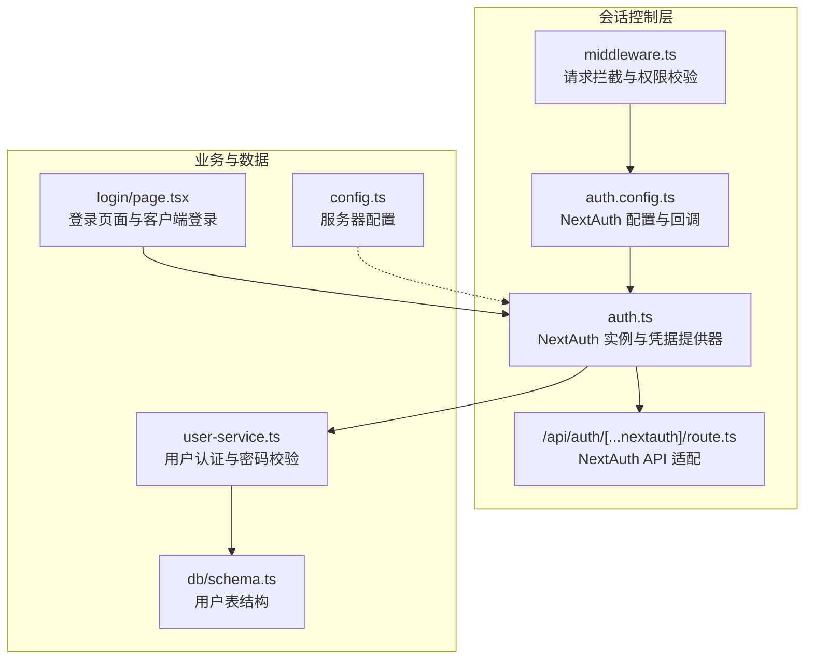
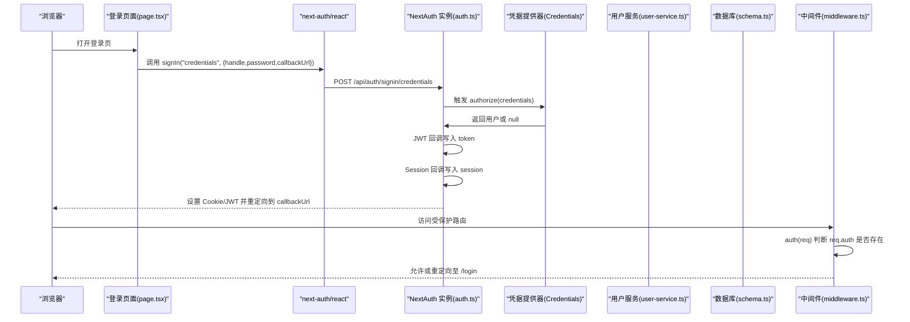
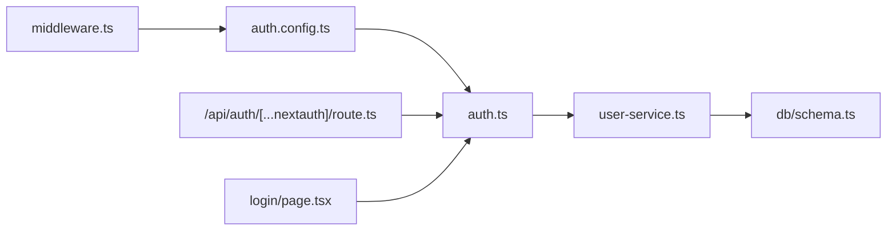
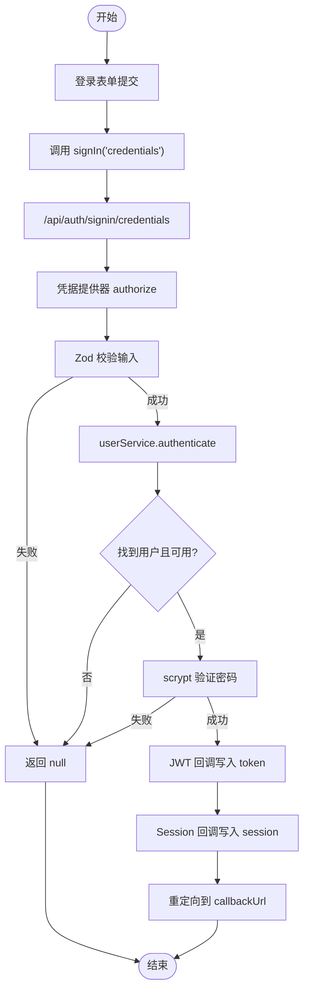

# 会话控制

<cite>
**本文引用的文件**
- [auth.config.ts](file://src/lib/auth.config.ts)
- [auth.ts](file://src/lib/auth.ts)
- [middleware.ts](file://src/middleware.ts)
- [route.ts](file://src/app/api/auth/[...nextauth]/route.ts)
- [user-service.ts](file://src/lib/services/user-service.ts)
- [page.tsx](file://src/app/login/page.tsx)
- [schema.ts](file://src/lib/db/schema.ts)
- [config.ts](file://src/lib/config.ts)
</cite>

## 目录
1. [简介](#简介)
2. [项目结构](#项目结构)
3. [核心组件](#核心组件)
4. [架构总览](#架构总览)
5. [详细组件分析](#详细组件分析)
6. [依赖关系分析](#依赖关系分析)
7. [性能考量](#性能考量)
8. [故障排除指南](#故障排除指南)
9. [结论](#结论)
10. [附录](#附录)

## 简介
本文件系统性梳理 SillyTavern Next 的会话控制系统，围绕 NextAuth 的会话管理机制、JWT 令牌处理与会话回调函数展开，详细说明会话的创建、维护与销毁流程，阐述中间件的会话验证、权限检查与访问控制策略，并给出会话状态管理、令牌刷新与安全注意事项、配置项、性能优化与故障排除建议。目标读者包括前端工程师、后端工程师与运维人员。

## 项目结构
与会话控制直接相关的核心文件组织如下：
- 会话配置与回调：src/lib/auth.config.ts
- NextAuth 实例与凭据提供器：src/lib/auth.ts
- 中间件会话校验：src/middleware.ts
- NextAuth API 路由适配：src/app/api/auth/[...nextauth]/route.ts
- 用户认证与密码校验：src/lib/services/user-service.ts
- 登录页面与客户端登录流程：src/app/login/page.tsx
- 数据库用户模型：src/lib/db/schema.ts
- 服务器配置加载：src/lib/config.ts

图表来源
- [auth.config.ts:1-53](file://src/lib/auth.config.ts#L1-L53)
- [auth.ts:1-59](file://src/lib/auth.ts#L1-L59)
- [middleware.ts:1-35](file://src/middleware.ts#L1-L35)
- [route.ts:1-3](file://src/app/api/auth/[...nextauth]/route.ts#L1-L3)
- [user-service.ts:1-170](file://src/lib/services/user-service.ts#L1-L170)
- [schema.ts:1-240](file://src/lib/db/schema.ts#L1-L240)
- [page.tsx:1-85](file://src/app/login/page.tsx#L1-L85)
- [config.ts:1-184](file://src/lib/config.ts#L1-L184)

章节来源
- [auth.config.ts:1-53](file://src/lib/auth.config.ts#L1-L53)
- [auth.ts:1-59](file://src/lib/auth.ts#L1-L59)
- [middleware.ts:1-35](file://src/middleware.ts#L1-L35)
- [route.ts:1-3](file://src/app/api/auth/[...nextauth]/route.ts#L1-L3)
- [user-service.ts:1-170](file://src/lib/services/user-service.ts#L1-L170)
- [schema.ts:1-240](file://src/lib/db/schema.ts#L1-L240)
- [page.tsx:1-85](file://src/app/login/page.tsx#L1-L85)
- [config.ts:1-184](file://src/lib/config.ts#L1-L184)

## 核心组件
- NextAuth 配置与回调：定义凭据提供器、登录页、JWT 与 Session 回调、授权回调以及会话策略（JWT 策略、最长有效期）。
- NextAuth 实例：整合凭据提供器与自定义 authorize 流程，完成用户认证与令牌发放。
- 中间件：基于 NextAuth 的 auth 高阶函数，统一拦截受保护路由，执行登录态判断与重定向。
- NextAuth API 适配：将 NextAuth 的 handlers 暴露为 /api/auth/* 的 GET/POST。
- 用户服务：负责用户查询、密码校验（scrypt）、返回安全用户对象。
- 登录页面：前端表单收集凭据，调用 next-auth/react 的 signIn 发起认证。
- 数据库模型：用户表包含 id、handle、password、salt、admin、enabled 等字段。
- 服务器配置：提供配置加载、环境变量覆盖与键值读取能力。

章节来源
- [auth.config.ts:5-52](file://src/lib/auth.config.ts#L5-L52)
- [auth.ts:12-58](file://src/lib/auth.ts#L12-L58)
- [middleware.ts:6-30](file://src/middleware.ts#L6-L30)
- [route.ts:1-3](file://src/app/api/auth/[...nextauth]/route.ts#L1-L3)
- [user-service.ts:60-69](file://src/lib/services/user-service.ts#L60-L69)
- [page.tsx:13-30](file://src/app/login/page.tsx#L13-L30)
- [schema.ts:6-16](file://src/lib/db/schema.ts#L6-L16)
- [config.ts:88-117](file://src/lib/config.ts#L88-L117)

## 架构总览
下面的序列图展示了从登录到受保护路由访问的完整会话生命周期。

图表来源
- [page.tsx:13-30](file://src/app/login/page.tsx#L13-L30)
- [auth.ts:21-34](file://src/lib/auth.ts#L21-L34)
- [user-service.ts:64-69](file://src/lib/services/user-service.ts#L64-L69)
- [auth.config.ts:20-46](file://src/lib/auth.config.ts#L20-L46)
- [middleware.ts:8-29](file://src/middleware.ts#L8-L29)

## 详细组件分析

### NextAuth 配置与回调（auth.config.ts）
- 凭据提供器：声明 credentials 提供器，定义 handle 与 password 字段，authorize 在 auth.ts 中实现。
- 登录页映射：signIn 指向 /login。
- JWT 回调：首次登录时将用户 id、handle、admin 写入 token。
- Session 回调：将 token 中的 id、handle、admin 写入 session.user。
- 授权回调：authorized 判断是否已登录、是否处于登录页、是否为 /api/auth 或 /api/health（健康检查）等公开端点。
- 会话策略：strategy 为 jwt，maxAge 为 30 天。

章节来源
- [auth.config.ts:5-52](file://src/lib/auth.config.ts#L5-L52)

### NextAuth 实例与凭据提供器（auth.ts）
- 整合 auth.config，并扩展凭据提供器的 authorize 流程。
- 使用 Zod 校验登录参数，调用 userService.authenticate 进行用户认证。
- authorize 返回包含 id、name、handle、admin 的用户对象，供 JWT 回调写入 token。
- JWT 与 Session 回调与 auth.config 保持一致，确保 token 与 session 一致性。

章节来源
- [auth.ts:12-58](file://src/lib/auth.ts#L12-L58)

### 中间件会话验证（middleware.ts）
- 使用 NextAuth(authConfig) 生成 auth(req) 中间件。
- 白名单路径：/login、/api/auth、/_next、favicon.ico。
- 未登录访问受保护路由时，重定向到 /login 并携带 callbackUrl。
- matcher 限制匹配范围，避免对静态资源与内部资源重复处理。

章节来源
- [middleware.ts:6-34](file://src/middleware.ts#L6-L34)

### NextAuth API 适配（/api/auth/[...nextauth]/route.ts）
- 将 NextAuth 的 handlers 暴露为 /api/auth/* 的 GET/POST，供前端 next-auth/react 使用。

章节来源
- [route.ts:1-3](file://src/app/api/auth/[...nextauth]/route.ts#L1-L3)

### 用户认证与密码校验（user-service.ts）
- authenticate：按 handle 查询用户，检查 enabled，使用 scrypt 验证密码，返回安全用户对象（不含密码与盐）。
- create/update/changePassword：密码采用 scrypt，生成随机 salt 并重新计算 hash。
- toSafeUser：移除敏感字段，保证对外返回的安全性。

章节来源
- [user-service.ts:60-168](file://src/lib/services/user-service.ts#L60-L168)

### 登录页面与客户端登录（login/page.tsx）
- 表单收集 handle 与 password，调用 next-auth/react 的 signIn("credentials", ...)。
- callbackUrl 指向根路径，登录成功后自动跳转。

章节来源
- [page.tsx:13-30](file://src/app/login/page.tsx#L13-L30)

### 数据库模型（db/schema.ts）
- users 表：id、name、handle（唯一）、password、salt、avatar、admin、enabled、createdAt。
- 与用户认证强相关，authenticate 与 create/update/changePassword 均基于此表。

章节来源
- [schema.ts:6-16](file://src/lib/db/schema.ts#L6-L16)

### 服务器配置（config.ts）
- 提供配置加载、环境变量覆盖与键值读取能力，便于在不同部署环境下调整行为（如 CORS、SSO 等）。
- 与会话控制无直接耦合，但可作为运行时环境的补充参考。

章节来源
- [config.ts:88-136](file://src/lib/config.ts#L88-L136)

## 依赖关系分析
- auth.ts 依赖 auth.config.ts 提供配置与回调。
- auth.ts 依赖 user-service.ts 进行用户认证与密码校验。
- user-service.ts 依赖 db/schema.ts 的 users 表进行数据读写。
- middleware.ts 依赖 auth.config.ts 生成 auth(req)，并对受保护路由进行拦截。
- /api/auth/[...nextauth]/route.ts 依赖 auth.ts 暴露的 handlers。
- login/page.tsx 依赖 next-auth/react 的 signIn，间接依赖 auth.ts 的凭据提供器。

图表来源
- [auth.config.ts:1-53](file://src/lib/auth.config.ts#L1-L53)
- [auth.ts:1-59](file://src/lib/auth.ts#L1-L59)
- [user-service.ts:1-170](file://src/lib/services/user-service.ts#L1-L170)
- [schema.ts:1-240](file://src/lib/db/schema.ts#L1-L240)
- [middleware.ts:1-35](file://src/middleware.ts#L1-L35)
- [route.ts:1-3](file://src/app/api/auth/[...nextauth]/route.ts#L1-L3)
- [page.tsx:1-85](file://src/app/login/page.tsx#L1-L85)

章节来源
- [auth.ts:1-59](file://src/lib/auth.ts#L1-L59)
- [user-service.ts:1-170](file://src/lib/services/user-service.ts#L1-L170)
- [schema.ts:1-240](file://src/lib/db/schema.ts#L1-L240)
- [middleware.ts:1-35](file://src/middleware.ts#L1-L35)
- [route.ts:1-3](file://src/app/api/auth/[...nextauth]/route.ts#L1-L3)
- [page.tsx:1-85](file://src/app/login/page.tsx#L1-L85)

## 性能考量
- 会话策略：采用 JWT 策略，避免服务端存储会话状态，降低服务器压力；maxAge 为 30 天，建议结合实际业务需求评估是否需要更短的会话周期。
- 中间件匹配：middleware 的 matcher 限定在非静态资源与内部资源之外，减少不必要的拦截开销。
- 登录校验：authorize 使用 Zod 校验输入，提前拒绝非法请求，降低后续数据库查询成本。
- 密码校验：scrypt 计算强度较高，建议在高并发场景下关注 CPU 占用，必要时考虑异步化或限流。
- 数据库访问：authenticate 与 create/update 等操作均涉及数据库查询与写入，建议在生产环境启用连接池与索引优化（handle 唯一索引已存在）。

[本节为通用性能建议，不直接分析具体文件，故无章节来源]

## 故障排除指南
- 登录失败
  - 检查 handle/password 是否为空，Zod 校验会拒绝空值。
  - 确认用户存在且 enabled 为真，authenticate 会过滤禁用用户。
  - 确认密码正确，verifyPassword 使用 timingSafeEqual 进行安全比较。
- 无法访问受保护路由
  - 检查中间件是否正确匹配并重定向到 /login。
  - 确认 /api/auth 与 /login 为白名单路径。
  - 确认 /api/health 为公开端点（健康检查）。
- 会话未生效或过期
  - 检查 JWT 回调是否将 id、handle、admin 写入 token。
  - 检查 Session 回调是否将 token 写入 session.user。
  - 检查 maxAge 是否合理，是否需要缩短以提升安全性。
- 数据库问题
  - 确认 users 表的 handle 唯一约束与密码/盐字段存在。
  - 确认 create/update/changePassword 的 scrypt 流程正常。

章节来源
- [auth.ts:21-34](file://src/lib/auth.ts#L21-L34)
- [user-service.ts:64-69](file://src/lib/services/user-service.ts#L64-L69)
- [middleware.ts:12-29](file://src/middleware.ts#L12-L29)
- [auth.config.ts:48-51](file://src/lib/auth.config.ts#L48-L51)
- [schema.ts:6-16](file://src/lib/db/schema.ts#L6-L16)

## 结论
SillyTavern Next 的会话控制以 NextAuth 为核心，采用 JWT 策略与严格的中间件拦截，结合自定义凭据提供器与用户服务，实现了从登录到受保护路由访问的完整闭环。通过明确的回调链路与白名单策略，系统在保证安全性的同时具备良好的可维护性。建议在生产环境中根据业务需求调整会话有效期、引入限流与监控，并持续关注密码校验与数据库访问的性能表现。

[本节为总结性内容，不直接分析具体文件，故无章节来源]

## 附录

### 会话生命周期流程图（代码级）

图表来源
- [auth.ts:21-34](file://src/lib/auth.ts#L21-L34)
- [user-service.ts:64-69](file://src/lib/services/user-service.ts#L64-L69)
- [auth.config.ts:20-37](file://src/lib/auth.config.ts#L20-L37)

### 会话状态管理与令牌刷新
- 状态载体：JWT 令牌保存在客户端（Cookie 或自定义存储，取决于部署方式）。
- 刷新策略：当前配置未显式设置 refreshAge，建议结合 maxAge 与前端轮询策略实现刷新；也可在回调中扩展 token 的刷新逻辑。
- 安全建议：缩短 maxAge、启用 SameSite Cookie、HTTPS 传输、CSRF 防护（若启用）。

章节来源
- [auth.config.ts:48-51](file://src/lib/auth.config.ts#L48-L51)

### 权限检查与访问控制
- 白名单：/login、/api/auth、/_next、favicon.ico。
- 公开端点：/api/health。
- 受保护路由：未登录访问将被重定向至 /login 并携带 callbackUrl。

章节来源
- [middleware.ts:12-29](file://src/middleware.ts#L12-L29)
- [auth.config.ts:38-46](file://src/lib/auth.config.ts#L38-L46)

### 配置选项与最佳实践
- 会话策略：strategy=jwt，maxAge=30*24*60*60。
- 登录页：pages.signIn=/login。
- 授权回调：authorized 控制公开端点与登录态。
- 生产建议：根据合规要求缩短会话有效期；对 /api/health 等健康检查端点保持公开；对敏感接口增加额外校验。

章节来源
- [auth.config.ts:17-51](file://src/lib/auth.config.ts#L17-L51)