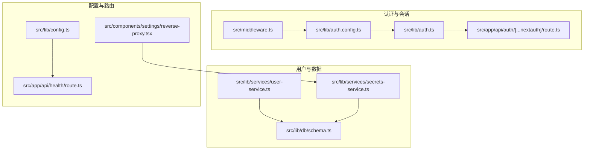
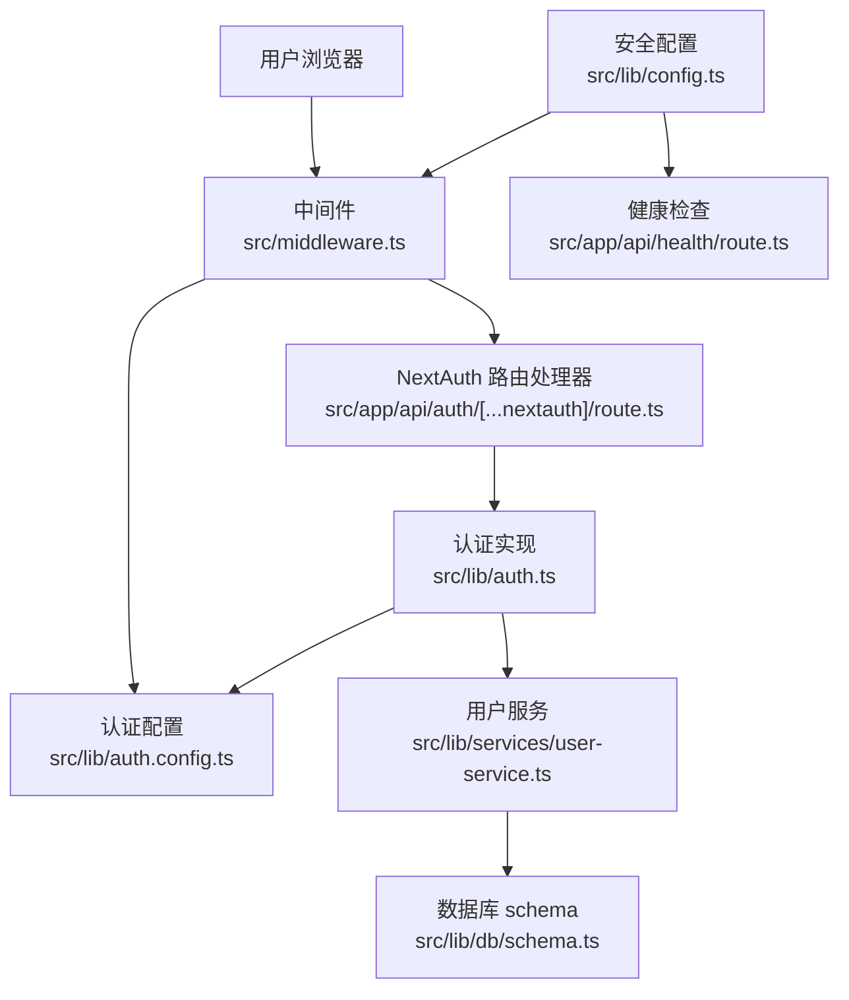
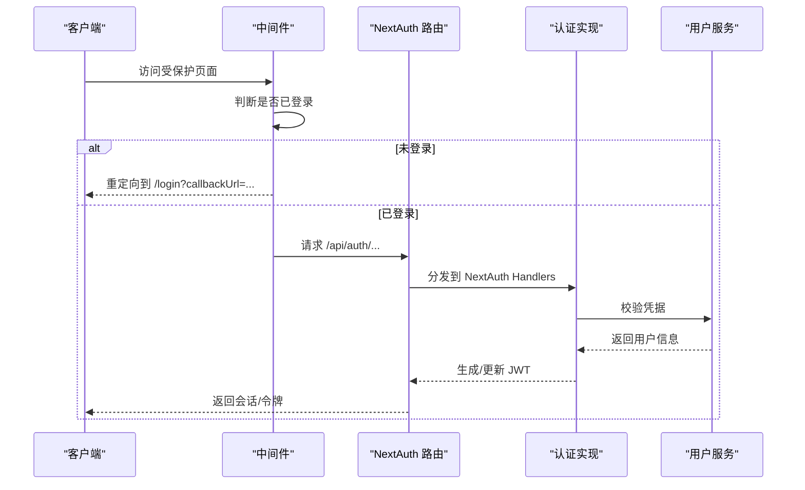
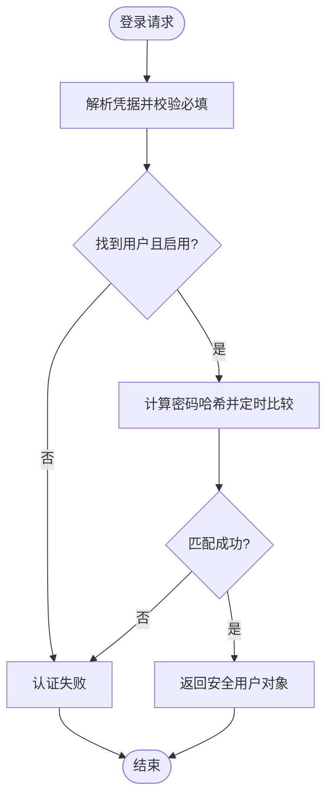
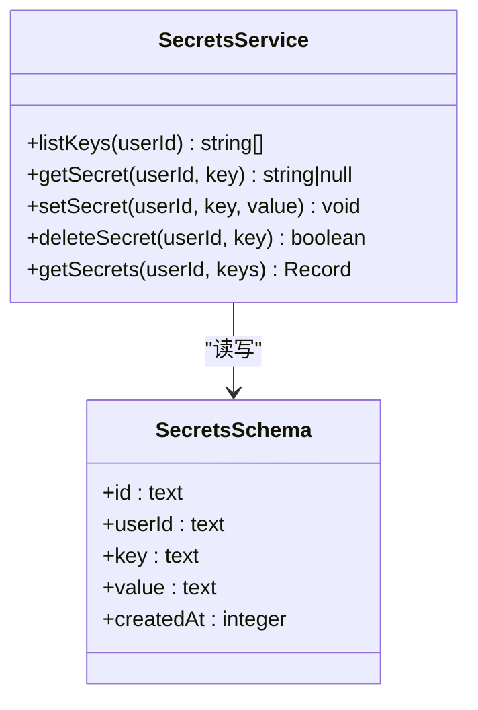
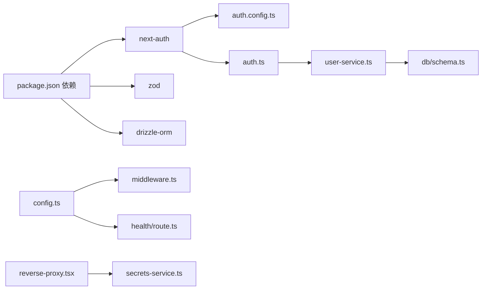

# 安全考虑

<cite>
**本文引用的文件**
- [src/lib/auth.config.ts](file://src/lib/auth.config.ts)
- [src/lib/auth.ts](file://src/lib/auth.ts)
- [src/middleware.ts](file://src/middleware.ts)
- [src/app/api/auth/[...nextauth]/route.ts](file://src/app/api/auth/[...nextauth]/route.ts)
- [src/app/api/health/route.ts](file://src/app/api/health/route.ts)
- [src/lib/config.ts](file://src/lib/config.ts)
- [src/lib/services/user-service.ts](file://src/lib/services/user-service.ts)
- [src/lib/db/schema.ts](file://src/lib/db/schema.ts)
- [src/lib/services/secrets-service.ts](file://src/lib/services/secrets-service.ts)
- [src/components/settings/reverse-proxy.tsx](file://src/components/settings/reverse-proxy.tsx)
- [package.json](file://package.json)
- [next.config.ts](file://next.config.ts)
- [README.md](file://README.md)
</cite>

## 目录
1. [简介](#简介)
2. [项目结构](#项目结构)
3. [核心组件](#核心组件)
4. [架构总览](#架构总览)
5. [详细组件分析](#详细组件分析)
6. [依赖关系分析](#依赖关系分析)
7. [性能考量](#性能考量)
8. [故障排查指南](#故障排查指南)
9. [结论](#结论)
10. [附录](#附录)

## 简介
本文件聚焦 SillyTavern Next 的安全设计与实现，围绕认证与会话、密码加密与数据保护、CSRF/XSS 防护、会话劫持防护、安全配置与安全头、安全审计与监控、安全加固与应急响应等方面进行系统化梳理。文档同时结合代码实现与配置项，给出可操作的安全最佳实践与加固建议。

## 项目结构
与安全相关的关键模块分布如下：
- 认证与会话：NextAuth v5 配置与中间件拦截
- 用户与密码：用户服务、密码哈希与校验
- 数据模型：用户、密钥等敏感数据的数据库结构
- 安全配置：运行时配置项与环境变量覆盖
- API 与路由：受保护的 API、公开健康检查端点
- 反向代理与密钥管理：用户侧 API Key 的隔离存储

图表来源
- [src/lib/auth.config.ts:1-53](file://src/lib/auth.config.ts#L1-L53)
- [src/lib/auth.ts:1-59](file://src/lib/auth.ts#L1-L59)
- [src/middleware.ts:1-35](file://src/middleware.ts#L1-L35)
- [src/app/api/auth/[...nextauth]/route.ts:1-3](file://src/app/api/auth/[...nextauth]/route.ts#L1-L3)
- [src/lib/services/user-service.ts:1-170](file://src/lib/services/user-service.ts#L1-L170)
- [src/lib/db/schema.ts:1-240](file://src/lib/db/schema.ts#L1-L240)
- [src/lib/services/secrets-service.ts:1-116](file://src/lib/services/secrets-service.ts#L1-L116)
- [src/lib/config.ts:1-184](file://src/lib/config.ts#L1-L184)
- [src/app/api/health/route.ts:1-9](file://src/app/api/health/route.ts#L1-L9)
- [src/components/settings/reverse-proxy.tsx:1-106](file://src/components/settings/reverse-proxy.tsx#L1-L106)

章节来源
- [src/lib/auth.config.ts:1-53](file://src/lib/auth.config.ts#L1-L53)
- [src/lib/auth.ts:1-59](file://src/lib/auth.ts#L1-L59)
- [src/middleware.ts:1-35](file://src/middleware.ts#L1-L35)
- [src/app/api/auth/[...nextauth]/route.ts:1-3](file://src/app/api/auth/[...nextauth]/route.ts#L1-L3)
- [src/lib/services/user-service.ts:1-170](file://src/lib/services/user-service.ts#L1-L170)
- [src/lib/db/schema.ts:1-240](file://src/lib/db/schema.ts#L1-L240)
- [src/lib/services/secrets-service.ts:1-116](file://src/lib/services/secrets-service.ts#L1-L116)
- [src/lib/config.ts:1-184](file://src/lib/config.ts#L1-L184)
- [src/app/api/health/route.ts:1-9](file://src/app/api/health/route.ts#L1-L9)
- [src/components/settings/reverse-proxy.tsx:1-106](file://src/components/settings/reverse-proxy.tsx#L1-L106)

## 核心组件
- 认证与会话
  - NextAuth v5 配置与回调：JWT 策略、会话有效期、授权回调、登录页重定向
  - 中间件：统一拦截受保护路径，处理未登录跳转
  - 认证 API 路由：暴露 NextAuth Handlers
- 用户与密码
  - 用户服务：认证、创建、更新、改密、查询
  - 密码哈希：scrypt，盐值随机生成，定时安全比较
  - 数据模型：用户表含密码与盐字段，安全返回时剔除敏感字段
- 数据与密钥
  - 密钥服务：按用户隔离存储 API Key，支持增删改查与批量获取
  - 数据库 schema：用户、密钥、聊天、角色卡等表结构
- 安全配置
  - 运行时配置：安全开关（如 CSRF、CORS Proxy）、白名单、SSO、CORS 参数
  - 环境变量覆盖：键名转换与层级展开，支持布尔/数字/JSON 解析
- 公开端点
  - 健康检查：无需鉴权，供容器编排与监控使用
- 反向代理
  - 用户侧反向代理配置：按提供商标识选择代理，支持密码字段

章节来源
- [src/lib/auth.config.ts:1-53](file://src/lib/auth.config.ts#L1-L53)
- [src/lib/auth.ts:1-59](file://src/lib/auth.ts#L1-L59)
- [src/middleware.ts:1-35](file://src/middleware.ts#L1-L35)
- [src/app/api/auth/[...nextauth]/route.ts:1-3](file://src/app/api/auth/[...nextauth]/route.ts#L1-L3)
- [src/lib/services/user-service.ts:1-170](file://src/lib/services/user-service.ts#L1-L170)
- [src/lib/db/schema.ts:1-240](file://src/lib/db/schema.ts#L1-L240)
- [src/lib/services/secrets-service.ts:1-116](file://src/lib/services/secrets-service.ts#L1-L116)
- [src/lib/config.ts:1-184](file://src/lib/config.ts#L1-L184)
- [src/app/api/health/route.ts:1-9](file://src/app/api/health/route.ts#L1-L9)
- [src/components/settings/reverse-proxy.tsx:1-106](file://src/components/settings/reverse-proxy.tsx#L1-L106)

## 架构总览
下图展示认证与会话、用户与数据、安全配置与公开端点之间的交互关系。

图表来源
- [src/middleware.ts:1-35](file://src/middleware.ts#L1-L35)
- [src/app/api/auth/[...nextauth]/route.ts:1-3](file://src/app/api/auth/[...nextauth]/route.ts#L1-L3)
- [src/lib/auth.config.ts:1-53](file://src/lib/auth.config.ts#L1-L53)
- [src/lib/auth.ts:1-59](file://src/lib/auth.ts#L1-L59)
- [src/lib/services/user-service.ts:1-170](file://src/lib/services/user-service.ts#L1-L170)
- [src/lib/db/schema.ts:1-240](file://src/lib/db/schema.ts#L1-L240)
- [src/lib/config.ts:1-184](file://src/lib/config.ts#L1-L184)
- [src/app/api/health/route.ts:1-9](file://src/app/api/health/route.ts#L1-L9)

## 详细组件分析

### 认证与会话（NextAuth v5）
- JWT 策略与会话有效期：使用 JWT 作为会话策略，并设置最长有效期
- 回调链：jwt/session 回调将用户信息写入 token 与 session；authorized 回调控制访问权限，允许登录页、认证 API、公开健康检查等端点
- 中间件：统一拦截受保护路径，未登录自动跳转至登录页并携带 callbackUrl
- 认证 API：暴露 GET/POST 处理器，对接 NextAuth Handlers

图表来源
- [src/middleware.ts:1-35](file://src/middleware.ts#L1-L35)
- [src/app/api/auth/[...nextauth]/route.ts:1-3](file://src/app/api/auth/[...nextauth]/route.ts#L1-L3)
- [src/lib/auth.ts:1-59](file://src/lib/auth.ts#L1-L59)
- [src/lib/services/user-service.ts:1-170](file://src/lib/services/user-service.ts#L1-L170)

章节来源
- [src/lib/auth.config.ts:1-53](file://src/lib/auth.config.ts#L1-L53)
- [src/lib/auth.ts:1-59](file://src/lib/auth.ts#L1-L59)
- [src/middleware.ts:1-35](file://src/middleware.ts#L1-L35)
- [src/app/api/auth/[...nextauth]/route.ts:1-3](file://src/app/api/auth/[...nextauth]/route.ts#L1-L3)

### 密码加密与数据保护
- 密码哈希：使用 scrypt，固定输出长度 64 字节，十六进制字符串存储
- 盐值：每次创建/更新密码时生成随机 32 字节盐值
- 安全比较：使用定时安全比较函数，避免时序攻击
- 敏感字段剔除：对外返回的用户对象不包含密码与盐字段
- 数据库结构：用户表包含 password 与 salt 字段，确保可验证但不泄露明文

图表来源
- [src/lib/services/user-service.ts:64-69](file://src/lib/services/user-service.ts#L64-L69)
- [src/lib/services/user-service.ts:40-50](file://src/lib/services/user-service.ts#L40-L50)

章节来源
- [src/lib/services/user-service.ts:1-170](file://src/lib/services/user-service.ts#L1-L170)
- [src/lib/db/schema.ts:6-16](file://src/lib/db/schema.ts#L6-L16)

### API 密钥与数据隔离
- 密钥存储：按用户隔离，密钥值入库，不返回明文
- 密钥列表：仅返回 key 名称，不返回值
- 批量获取：按需组合返回
- 反向代理：用户侧可配置代理与密码，便于对接第三方服务

图表来源
- [src/lib/services/secrets-service.ts:1-116](file://src/lib/services/secrets-service.ts#L1-L116)
- [src/lib/db/schema.ts:201-207](file://src/lib/db/schema.ts#L201-L207)

章节来源
- [src/lib/services/secrets-service.ts:1-116](file://src/lib/services/secrets-service.ts#L1-L116)
- [src/lib/db/schema.ts:201-207](file://src/lib/db/schema.ts#L201-L207)
- [src/components/settings/reverse-proxy.tsx:1-106](file://src/components/settings/reverse-proxy.tsx#L1-L106)

### CSRF 保护、XSS 防护与会话劫持防护
- CSRF 保护
  - 配置项：disableCsrf 控制是否禁用 CSRF 保护
  - 建议：默认开启，除非有明确需求关闭
- XSS 阘护
  - Markdown 渲染：前端组件中使用受控渲染，避免直接注入 HTML
  - 输入校验：Zod 对用户输入进行严格校验
- 会话劫持防护
  - JWT 会话：基于签名令牌，配合安全传输与存储
  - 会话有效期：限制最长会话时间
  - 登录页与公开端点：登录页与健康检查无需鉴权，减少令牌暴露面

章节来源
- [src/lib/config.ts:16-18](file://src/lib/config.ts#L16-L18)
- [src/lib/auth.config.ts:48-51](file://src/lib/auth.config.ts#L48-L51)
- [src/app/api/health/route.ts:1-9](file://src/app/api/health/route.ts#L1-L9)

### 安全配置选项与安全头
- 安全配置项
  - enableCorsProxy：是否启用 CORS 代理
  - securityOverride：安全覆盖开关
  - disableCsrf：是否禁用 CSRF 保护
  - whitelistMode/whitelist：访问白名单模式与地址列表
  - basicAuthMode/perUserBasicAuth：基础认证模式与按用户基础认证
  - cors：CORS 开关、origin、methods、headers、credentials、maxAge
  - sso：SSO 开关与可信代理
- 环境变量覆盖
  - 键名转换规则：SILLYTAVERN_<SECTION>_<KEY>，点号转大写下划线
  - 支持布尔/数字/null/JSON 解析
- 安全头与传输安全
  - 建议：生产环境通过反向代理提供 HTTPS，避免明文传输
  - AUTH_SECRET：必须使用强随机密钥，建议通过环境变量注入

章节来源
- [src/lib/config.ts:1-184](file://src/lib/config.ts#L1-L184)
- [README.md:62-74](file://README.md#L62-L74)

### 安全审计、漏洞防护与安全监控
- 健康检查端点：无需鉴权，便于容器编排与监控系统探测
- 日志与错误处理：配置加载阶段的解析与验证错误记录
- 安全审计建议
  - 定期轮换 AUTH_SECRET
  - 限制访问白名单，必要时启用基础认证
  - 启用 HTTPS 与安全传输
  - 审计 API 密钥使用情况，定期清理无效密钥
- 漏洞防护
  - 输入校验与最小权限原则
  - 会话令牌安全存储与传输
  - 限制会话有效期，降低长期暴露风险
- 安全监控
  - 结合容器平台与日志系统，监控异常登录与高频请求
  - 健康检查失败告警

章节来源
- [src/app/api/health/route.ts:1-9](file://src/app/api/health/route.ts#L1-L9)
- [src/lib/config.ts:88-117](file://src/lib/config.ts#L88-L117)
- [README.md:150-156](file://README.md#L150-L156)

### 安全加固指南、威胁分析与应急响应
- 安全加固
  - 强制 HTTPS：通过反向代理提供 TLS 终止
  - 强密码与多因子：鼓励用户启用多因子认证（若扩展支持）
  - 最小权限：按用户隔离 API Key，避免共享密钥
  - 会话安全：缩短会话有效期，启用安全标志位（建议在反向代理层配置）
- 威胁分析
  - 会话劫持：通过 HTTPS 与安全令牌降低风险
  - 强暴力破解：限制登录尝试、启用白名单与基础认证
  - SSRF 与代理滥用：谨慎配置反向代理，限制可访问范围
- 应急响应
  - 密钥泄露：立即删除相关密钥并要求用户重置
  - 账户异常：冻结账户、强制改密、审查登录日志
  - 配置错误：回滚到上一个稳定配置，修复后重启

章节来源
- [src/components/settings/reverse-proxy.tsx:1-106](file://src/components/settings/reverse-proxy.tsx#L1-L106)
- [src/lib/services/secrets-service.ts:1-116](file://src/lib/services/secrets-service.ts#L1-L116)
- [README.md:150-156](file://README.md#L150-L156)

## 依赖关系分析
- 认证链路依赖 NextAuth v5 与 Next.js App Router
- 用户服务依赖数据库 schema 与密码工具
- 安全配置影响中间件与公开端点行为
- 反向代理与密钥服务共同支撑用户侧连接管理

图表来源
- [package.json:18-46](file://package.json#L18-L46)
- [src/lib/auth.config.ts:1-53](file://src/lib/auth.config.ts#L1-L53)
- [src/lib/auth.ts:1-59](file://src/lib/auth.ts#L1-L59)
- [src/lib/services/user-service.ts:1-170](file://src/lib/services/user-service.ts#L1-L170)
- [src/lib/db/schema.ts:1-240](file://src/lib/db/schema.ts#L1-L240)
- [src/lib/config.ts:1-184](file://src/lib/config.ts#L1-L184)
- [src/app/api/health/route.ts:1-9](file://src/app/api/health/route.ts#L1-L9)
- [src/components/settings/reverse-proxy.tsx:1-106](file://src/components/settings/reverse-proxy.tsx#L1-L106)
- [src/lib/services/secrets-service.ts:1-116](file://src/lib/services/secrets-service.ts#L1-L116)

章节来源
- [package.json:18-46](file://package.json#L18-L46)
- [src/lib/config.ts:1-184](file://src/lib/config.ts#L1-L184)

## 性能考量
- 密码哈希：scrypt 成本较高，建议在用户变更密码时触发，避免频繁计算
- 会话大小：JWT 中仅存放必要字段，控制负载大小
- 数据库访问：用户认证与密钥查询走索引列，避免全表扫描
- CORS 与代理：合理配置 CORS 与反向代理，减少跨域与代理失败带来的重试

## 故障排查指南
- 认证失败
  - 检查用户名是否存在且启用
  - 确认密码与盐值匹配
  - 查看中间件是否正确重定向到登录页
- 会话异常
  - 检查 AUTH_SECRET 是否一致
  - 确认会话有效期设置是否过短
- 密钥无法获取
  - 确认用户 ID 与密钥名称正确
  - 检查密钥是否被删除或过期
- 配置问题
  - 检查配置文件与环境变量覆盖是否冲突
  - 验证配置键名转换是否符合规范

章节来源
- [src/lib/services/user-service.ts:64-69](file://src/lib/services/user-service.ts#L64-L69)
- [src/middleware.ts:1-35](file://src/middleware.ts#L1-L35)
- [src/lib/services/secrets-service.ts:19-25](file://src/lib/services/secrets-service.ts#L19-L25)
- [src/lib/config.ts:66-83](file://src/lib/config.ts#L66-L83)

## 结论
SillyTavern Next 在安全方面采用了 NextAuth v5 的 JWT 会话、严格的输入校验、scrypt 密码哈希与定时安全比较、按用户隔离的密钥存储等基础能力。通过可配置的安全开关、白名单与 CORS 策略，以及公开健康检查端点，系统在可用性与安全性之间取得平衡。建议在生产环境中强化传输安全（HTTPS）、最小权限原则与会话安全，并建立持续的安全审计与监控流程。

## 附录
- 环境变量与配置要点
  - AUTH_SECRET：必须强随机，建议通过环境变量注入
  - CONFIG_PATH：可指定配置文件路径，支持 YAML
  - 环境变量键名：SILLYTAVERN_<SECTION>_<KEY>，点号转大写下划线
- 推荐安全实践
  - 强制 HTTPS 与安全传输
  - 最小权限与最小暴露面
  - 定期轮换密钥与会话密钥
  - 启用访问白名单与基础认证
  - 审计与监控异常登录与高频请求

章节来源
- [README.md:62-74](file://README.md#L62-L74)
- [src/lib/config.ts:66-83](file://src/lib/config.ts#L66-L83)
- [src/lib/config.ts:88-117](file://src/lib/config.ts#L88-L117)