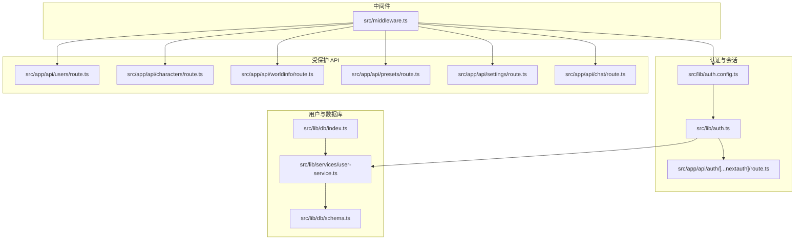
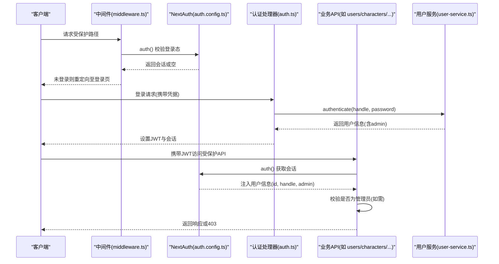
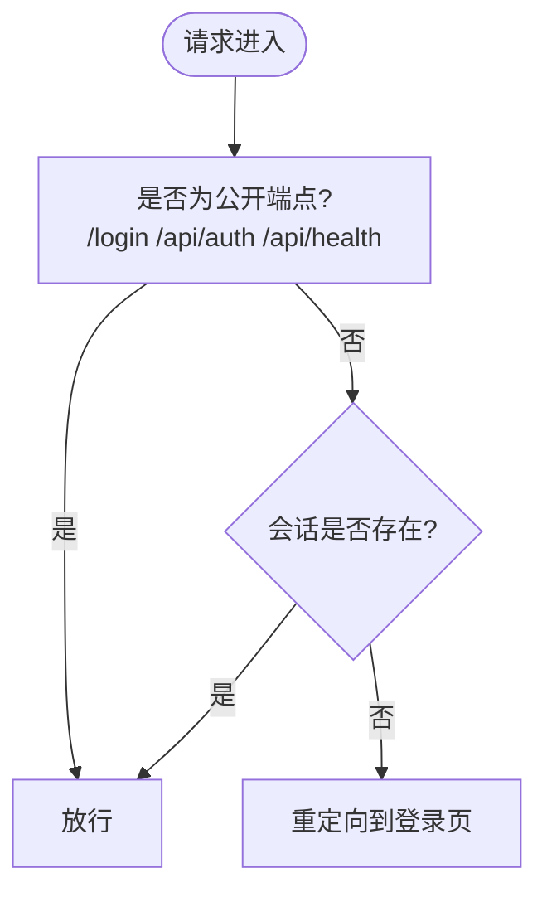
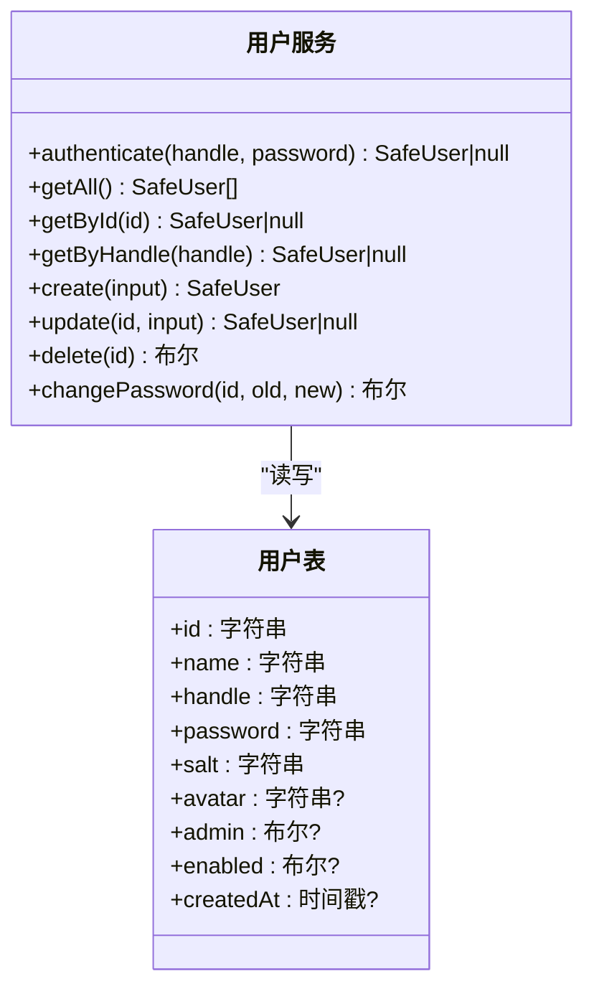
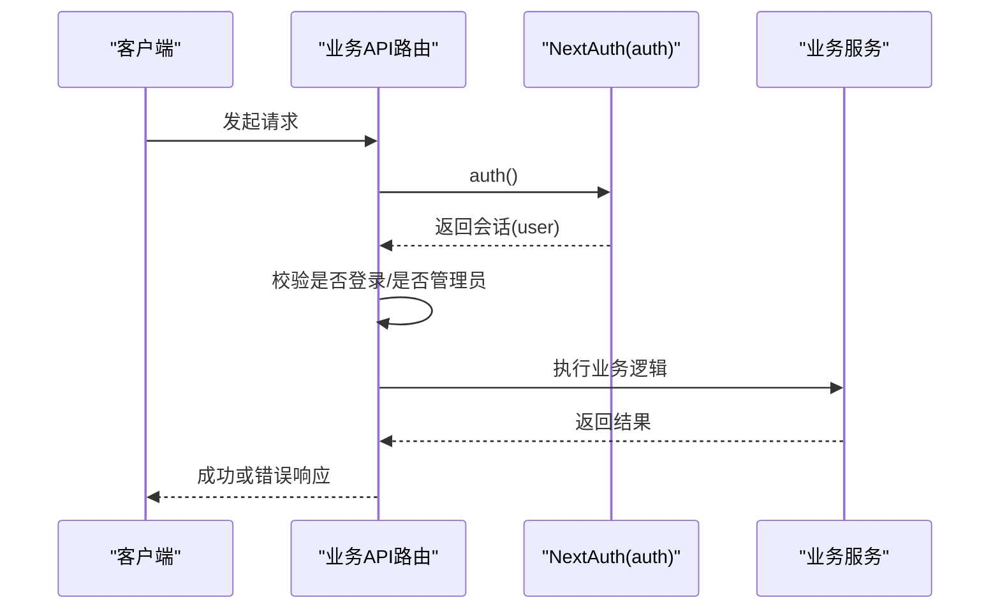
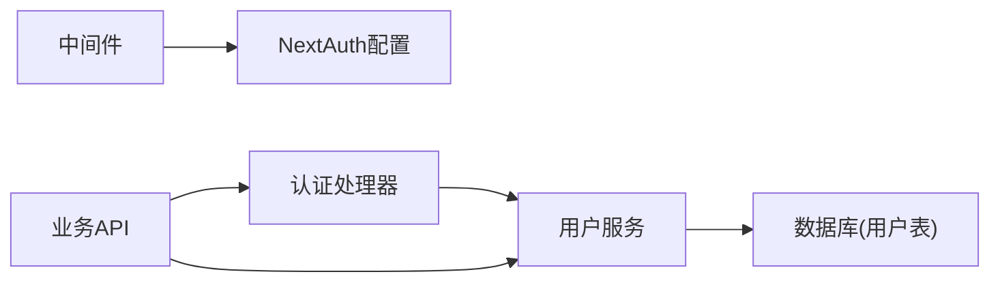

# 权限控制

<cite>
**本文引用的文件**
- [src/lib/auth.ts](file://src/lib/auth.ts)
- [src/lib/auth.config.ts](file://src/lib/auth.config.ts)
- [src/middleware.ts](file://src/middleware.ts)
- [src/app/api/auth/[...nextauth]/route.ts](file://src/app/api/auth/[...nextauth]/route.ts)
- [src/lib/services/user-service.ts](file://src/lib/services/user-service.ts)
- [src/lib/db/schema.ts](file://src/lib/db/schema.ts)
- [src/lib/db/index.ts](file://src/lib/db/index.ts)
- [src/app/api/users/route.ts](file://src/app/api/users/route.ts)
- [src/app/api/characters/route.ts](file://src/app/api/characters/route.ts)
- [src/app/api/worldinfo/route.ts](file://src/app/api/worldinfo/route.ts)
- [src/app/api/presets/route.ts](file://src/app/api/presets/route.ts)
- [src/app/api/settings/route.ts](file://src/app/api/settings/route.ts)
- [src/app/api/chat/route.ts](file://src/app/api/chat/route.ts)
</cite>

## 目录
1. [简介](#简介)
2. [项目结构](#项目结构)
3. [核心组件](#核心组件)
4. [架构总览](#架构总览)
5. [详细组件分析](#详细组件分析)
6. [依赖关系分析](#依赖关系分析)
7. [性能考量](#性能考量)
8. [故障排查指南](#故障排查指南)
9. [结论](#结论)
10. [附录](#附录)

## 简介
本文件面向 SillyTavern Next 的权限控制系统，系统采用基于角色的权限模型（RBAC），通过“管理员”与“普通用户”的二元角色区分，结合 JWT 会话与中间件拦截，实现对前端页面与后端 API 的统一访问控制。文档覆盖以下主题：
- 基于角色的权限管理：管理员与用户权限分配
- 权限验证机制：NextAuth 会话与 JWT 回调
- 访问控制列表与权限回调函数：受保护端点与公开端点
- 中间件权限检查、路由保护与资源访问控制
- 权限配置、权限继承与动态权限管理
- 扩展开发与安全最佳实践

## 项目结构
权限系统涉及的关键目录与文件如下：
- 认证与会话：src/lib/auth.ts、src/lib/auth.config.ts、src/app/api/auth/[...nextauth]/route.ts
- 中间件：src/middleware.ts
- 用户服务与数据库：src/lib/services/user-service.ts、src/lib/db/schema.ts、src/lib/db/index.ts
- 受保护 API：src/app/api/users/route.ts、src/app/api/characters/route.ts、src/app/api/worldinfo/route.ts、src/app/api/presets/route.ts、src/app/api/settings/route.ts、src/app/api/chat/route.ts

图表来源
- [src/lib/auth.config.ts:1-53](file://src/lib/auth.config.ts#L1-L53)
- [src/lib/auth.ts:1-59](file://src/lib/auth.ts#L1-L59)
- [src/app/api/auth/[...nextauth]/route.ts:1-3](file://src/app/api/auth/[...nextauth]/route.ts#L1-L3)
- [src/middleware.ts:1-35](file://src/middleware.ts#L1-L35)
- [src/lib/services/user-service.ts:1-170](file://src/lib/services/user-service.ts#L1-L170)
- [src/lib/db/schema.ts:1-240](file://src/lib/db/schema.ts#L1-L240)
- [src/lib/db/index.ts:1-134](file://src/lib/db/index.ts#L1-L134)
- [src/app/api/users/route.ts:1-37](file://src/app/api/users/route.ts#L1-L37)
- [src/app/api/characters/route.ts:1-42](file://src/app/api/characters/route.ts#L1-L42)
- [src/app/api/worldinfo/route.ts:1-23](file://src/app/api/worldinfo/route.ts#L1-L23)
- [src/app/api/presets/route.ts:1-37](file://src/app/api/presets/route.ts#L1-L37)
- [src/app/api/settings/route.ts:1-109](file://src/app/api/settings/route.ts#L1-L109)
- [src/app/api/chat/route.ts:1-177](file://src/app/api/chat/route.ts#L1-L177)

章节来源
- [src/lib/auth.ts:1-59](file://src/lib/auth.ts#L1-L59)
- [src/lib/auth.config.ts:1-53](file://src/lib/auth.config.ts#L1-L53)
- [src/middleware.ts:1-35](file://src/middleware.ts#L1-L35)
- [src/lib/services/user-service.ts:1-170](file://src/lib/services/user-service.ts#L1-L170)
- [src/lib/db/schema.ts:1-240](file://src/lib/db/schema.ts#L1-L240)
- [src/lib/db/index.ts:1-134](file://src/lib/db/index.ts#L1-L134)
- [src/app/api/users/route.ts:1-37](file://src/app/api/users/route.ts#L1-L37)
- [src/app/api/characters/route.ts:1-42](file://src/app/api/characters/route.ts#L1-L42)
- [src/app/api/worldinfo/route.ts:1-23](file://src/app/api/worldinfo/route.ts#L1-L23)
- [src/app/api/presets/route.ts:1-37](file://src/app/api/presets/route.ts#L1-L37)
- [src/app/api/settings/route.ts:1-109](file://src/app/api/settings/route.ts#L1-L109)
- [src/app/api/chat/route.ts:1-177](file://src/app/api/chat/route.ts#L1-L177)

## 核心组件
- NextAuth 配置与回调：负责 JWT 令牌与会话的生成、传递与校验，以及受保护端点的授权判定。
- 中间件：在请求进入应用前进行登录态判断与重定向，确保非公开端点均需登录。
- 用户服务：提供用户认证、查询、创建、更新、删除与密码变更等能力，并与数据库交互。
- 数据库与模式：定义用户表及外键约束，支持用户启用/禁用、管理员标记等字段。
- 受保护 API：在各业务路由中读取会话并进行权限校验，部分端点仅管理员可用。

章节来源
- [src/lib/auth.config.ts:1-53](file://src/lib/auth.config.ts#L1-L53)
- [src/lib/auth.ts:1-59](file://src/lib/auth.ts#L1-L59)
- [src/middleware.ts:1-35](file://src/middleware.ts#L1-L35)
- [src/lib/services/user-service.ts:1-170](file://src/lib/services/user-service.ts#L1-L170)
- [src/lib/db/schema.ts:1-240](file://src/lib/db/schema.ts#L1-L240)

## 架构总览
下图展示了从浏览器发起请求到后端 API 的权限控制流程，包括中间件拦截、NextAuth 授权回调、JWT 会话注入与业务路由权限校验。

图表来源
- [src/middleware.ts:1-35](file://src/middleware.ts#L1-L35)
- [src/lib/auth.config.ts:1-53](file://src/lib/auth.config.ts#L1-L53)
- [src/lib/auth.ts:1-59](file://src/lib/auth.ts#L1-L59)
- [src/lib/services/user-service.ts:1-170](file://src/lib/services/user-service.ts#L1-L170)
- [src/app/api/users/route.ts:1-37](file://src/app/api/users/route.ts#L1-L37)
- [src/app/api/characters/route.ts:1-42](file://src/app/api/characters/route.ts#L1-L42)

## 详细组件分析

### NextAuth 配置与回调
- 凭据提供器：使用用户名与密码进行登录，authorize 在完整 auth.ts 中实现。
- JWT 回调：首次登录时将用户信息写入 token；后续 session 回调将 token 注入 session。
- authorized 回调：判定是否允许访问当前请求路径，公开端点（登录、认证、健康检查）无需登录。
- 会话策略：JWT，最大有效期配置。

图表来源
- [src/lib/auth.config.ts:38-46](file://src/lib/auth.config.ts#L38-L46)
- [src/middleware.ts:8-30](file://src/middleware.ts#L8-L30)

章节来源
- [src/lib/auth.config.ts:1-53](file://src/lib/auth.config.ts#L1-L53)
- [src/lib/auth.ts:1-59](file://src/lib/auth.ts#L1-L59)
- [src/middleware.ts:1-35](file://src/middleware.ts#L1-L35)

### 中间件权限检查
- 匹配规则：排除静态资源与图标，其余路径均受中间件保护。
- 放行条件：登录页、认证接口、健康检查、静态资源与图标。
- 重定向逻辑：未登录访问受保护路径时，自动携带 callbackUrl 跳转登录页。

章节来源
- [src/middleware.ts:1-35](file://src/middleware.ts#L1-L35)

### 用户服务与数据库
- 用户表结构：包含 id、name、handle、password、salt、avatar、admin、enabled、createdAt 等字段。
- 认证流程：根据 handle 查询用户，校验 enabled 与密码哈希，返回安全用户对象。
- 密码存储：使用 scrypt 与随机盐值，提供密码验证与修改。
- 用户 CRUD：支持创建、更新（可更新管理员标志）、删除与按 id/handle 查询。

图表来源
- [src/lib/db/schema.ts:6-16](file://src/lib/db/schema.ts#L6-L16)
- [src/lib/services/user-service.ts:60-170](file://src/lib/services/user-service.ts#L60-L170)

章节来源
- [src/lib/db/schema.ts:1-240](file://src/lib/db/schema.ts#L1-L240)
- [src/lib/services/user-service.ts:1-170](file://src/lib/services/user-service.ts#L1-L170)
- [src/lib/db/index.ts:1-134](file://src/lib/db/index.ts#L1-L134)

### 受保护 API 的权限校验
- 通用流程：每个 API 路由在处理前调用 auth() 获取会话，校验 user 是否存在；若为管理员端点，则进一步检查 admin 标志。
- 示例端点：
  - 用户管理：GET/POST /api/users 仅管理员可用。
  - 角色卡：GET/POST /api/characters 需要登录。
  - 世界设定：GET/POST /api/worldinfo 需要登录。
  - 预设：GET/POST /api/presets 需要登录。
  - 设置：GET/PUT /api/settings 需要登录。
  - 聊天：POST /api/chat 需要登录。

图表来源
- [src/app/api/users/route.ts:1-37](file://src/app/api/users/route.ts#L1-L37)
- [src/app/api/characters/route.ts:1-42](file://src/app/api/characters/route.ts#L1-L42)
- [src/app/api/worldinfo/route.ts:1-23](file://src/app/api/worldinfo/route.ts#L1-L23)
- [src/app/api/presets/route.ts:1-37](file://src/app/api/presets/route.ts#L1-L37)
- [src/app/api/settings/route.ts:1-109](file://src/app/api/settings/route.ts#L1-L109)
- [src/app/api/chat/route.ts:1-177](file://src/app/api/chat/route.ts#L1-L177)

章节来源
- [src/app/api/users/route.ts:1-37](file://src/app/api/users/route.ts#L1-L37)
- [src/app/api/characters/route.ts:1-42](file://src/app/api/characters/route.ts#L1-L42)
- [src/app/api/worldinfo/route.ts:1-23](file://src/app/api/worldinfo/route.ts#L1-L23)
- [src/app/api/presets/route.ts:1-37](file://src/app/api/presets/route.ts#L1-L37)
- [src/app/api/settings/route.ts:1-109](file://src/app/api/settings/route.ts#L1-L109)
- [src/app/api/chat/route.ts:1-177](file://src/app/api/chat/route.ts#L1-L177)

### 权限配置、继承与动态管理
- 权限配置
  - 管理员字段：用户表包含 admin 字段，用户服务支持更新该字段。
  - 登录态：JWT 中包含 id、handle、admin，业务层通过 session.user.admin 判断管理员。
- 权限继承
  - 当前实现为二元角色（管理员/普通用户），未引入细粒度权限矩阵或角色继承链。
- 动态权限管理
  - 可通过更新用户 admin 标志实现动态提升/降级管理员权限。
  - 会话中的 admin 字段随 JWT 回调注入，后续请求即时生效。

章节来源
- [src/lib/db/schema.ts:6-16](file://src/lib/db/schema.ts#L6-L16)
- [src/lib/services/user-service.ts:124-146](file://src/lib/services/user-service.ts#L124-L146)
- [src/lib/auth.config.ts:20-46](file://src/lib/auth.config.ts#L20-L46)

### 中间件与路由保护
- 中间件匹配：对非静态资源路径统一进行登录态校验。
- 公开端点：登录页、认证接口、健康检查、静态资源与图标。
- 重定向：未登录访问受保护路径时，携带 callbackUrl 跳转登录页。

章节来源
- [src/middleware.ts:1-35](file://src/middleware.ts#L1-L35)

### 认证与会话生命周期
- 登录：凭据经 Zod 校验后交由用户服务认证，成功后写入 JWT 与 session。
- 会话：JWT 回调将 id、handle、admin 注入 token；session 回调将用户信息注入 session。
- 过期：JWT 会话最大有效期配置，到期需重新登录。

章节来源
- [src/lib/auth.ts:12-59](file://src/lib/auth.ts#L12-L59)
- [src/lib/auth.config.ts:17-52](file://src/lib/auth.config.ts#L17-L52)

## 依赖关系分析
- 组件耦合
  - 中间件依赖 NextAuth 配置进行登录态判断。
  - 认证处理器依赖用户服务完成凭据校验与用户信息返回。
  - 业务 API 依赖 NextAuth 提供的会话，并在必要时检查管理员标志。
- 外部依赖
  - NextAuth 作为认证框架，提供凭据提供器、JWT 回调与会话策略。
  - Drizzle ORM 与 SQLite 作为数据持久化层。

图表来源
- [src/middleware.ts:1-35](file://src/middleware.ts#L1-L35)
- [src/lib/auth.ts:1-59](file://src/lib/auth.ts#L1-L59)
- [src/lib/services/user-service.ts:1-170](file://src/lib/services/user-service.ts#L1-L170)
- [src/lib/db/schema.ts:1-240](file://src/lib/db/schema.ts#L1-L240)

章节来源
- [src/middleware.ts:1-35](file://src/middleware.ts#L1-L35)
- [src/lib/auth.ts:1-59](file://src/lib/auth.ts#L1-L59)
- [src/lib/services/user-service.ts:1-170](file://src/lib/services/user-service.ts#L1-L170)
- [src/lib/db/schema.ts:1-240](file://src/lib/db/schema.ts#L1-L240)

## 性能考量
- JWT 会话：减少数据库查询次数，适合高并发场景；但需注意令牌大小与传输开销。
- 中间件匹配：对静态资源与图标放行，降低不必要的会话解析成本。
- 密码哈希：使用 scrypt 并带盐值，具备抗暴力破解能力，但计算成本较高，建议在用户服务层避免重复计算。
- 数据库迁移：启动时幂等迁移与字段补齐，避免频繁迁移导致的冷启动延迟。

## 故障排查指南
- 401 未授权
  - 现象：访问受保护 API 返回 401。
  - 排查：确认已登录且会话有效；检查中间件是否正确重定向至登录页。
- 403 禁止访问
  - 现象：访问管理员端点返回 403。
  - 排查：确认 session.user.admin 是否为真；检查用户 admin 字段是否正确更新。
- 登录失败
  - 现象：凭据正确但无法登录。
  - 排查：确认用户 enabled 为真；检查密码哈希与盐值是否匹配；核对凭据提供器配置。
- 会话未注入
  - 现象：业务层无法获取 user 信息。
  - 排查：确认 JWT 与 session 回调是否正常；检查 NextAuth 配置与认证处理器。

章节来源
- [src/middleware.ts:1-35](file://src/middleware.ts#L1-L35)
- [src/lib/auth.config.ts:17-52](file://src/lib/auth.config.ts#L17-L52)
- [src/lib/services/user-service.ts:64-69](file://src/lib/services/user-service.ts#L64-L69)
- [src/app/api/users/route.ts:8-10](file://src/app/api/users/route.ts#L8-L10)

## 结论
SillyTavern Next 的权限系统以 NextAuth 为核心，结合 JWT 会话与中间件拦截，实现了简洁高效的 RBAC 模型。当前版本采用管理员/普通用户的二元角色，配合公开端点与受保护端点的清晰划分，满足大多数应用场景。未来可在现有基础上扩展为细粒度权限矩阵与角色继承，以支持更复杂的权限需求。

## 附录
- 安全最佳实践
  - 强制 HTTPS 传输，防止会话泄露。
  - 合理设置 JWT 有效期，定期轮换密钥。
  - 对管理员端点进行二次校验，避免误用。
  - 使用输入校验与最小权限原则，限制可更新字段范围。
  - 定期审计日志与异常监控，及时发现异常行为。