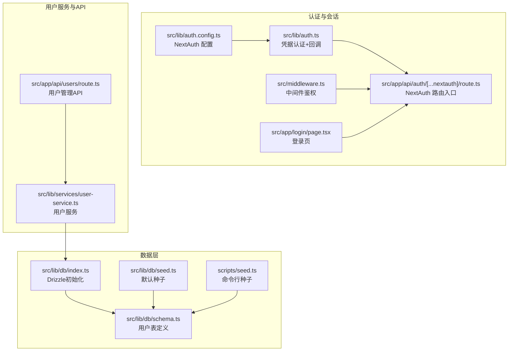
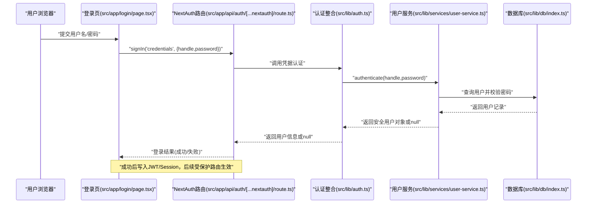
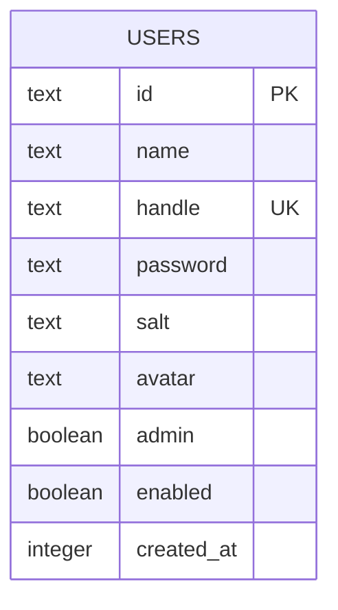
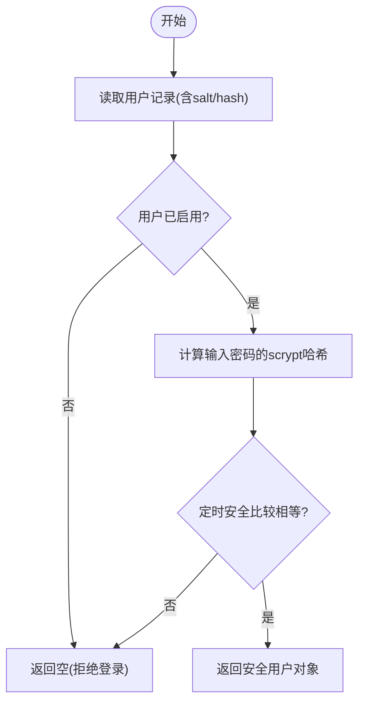
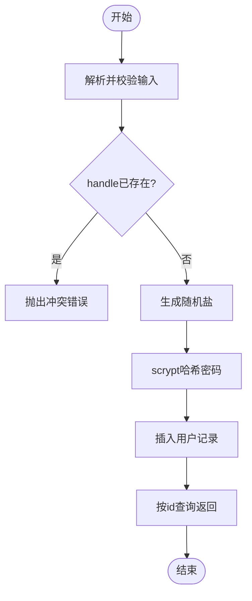
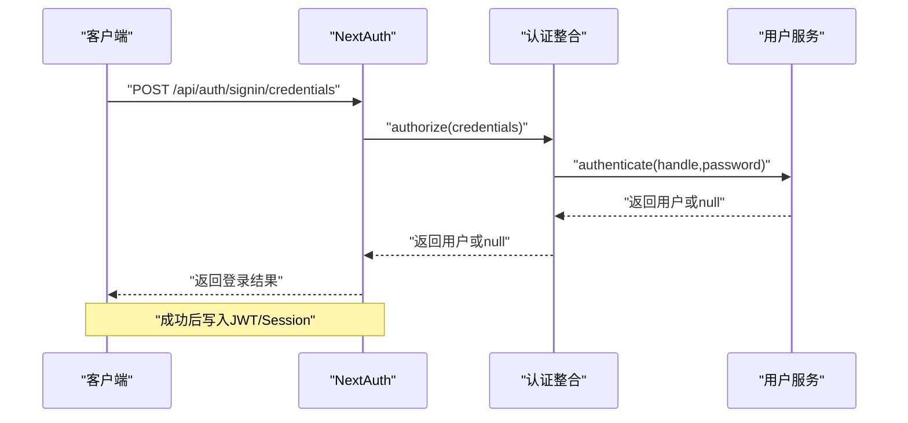
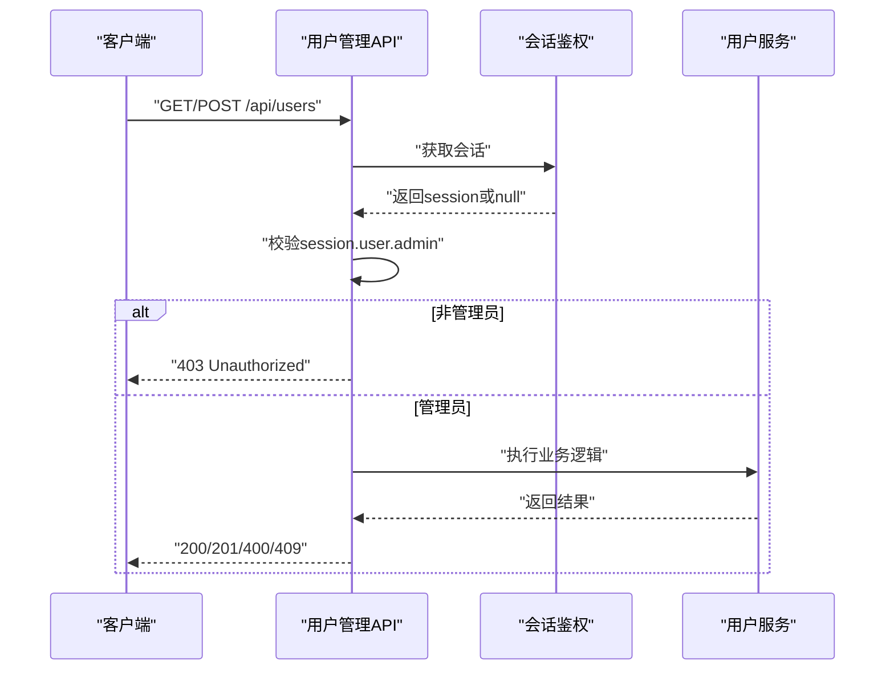
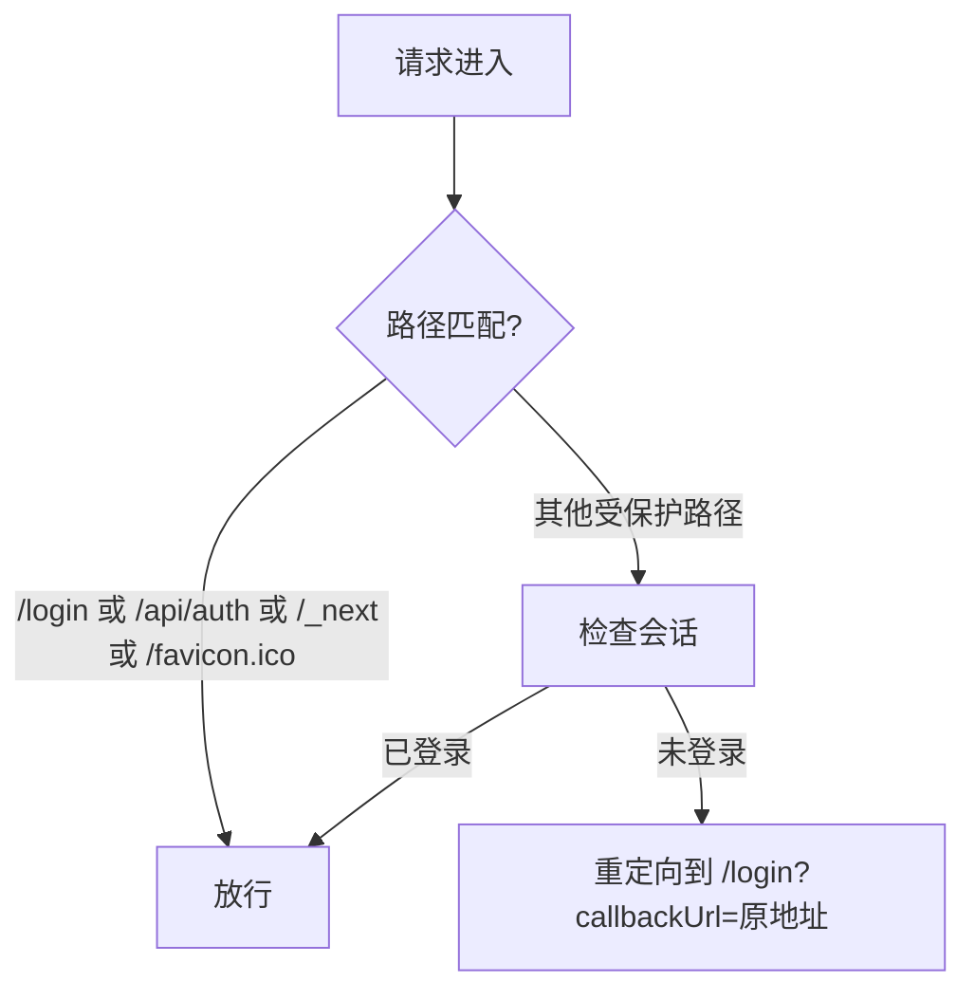
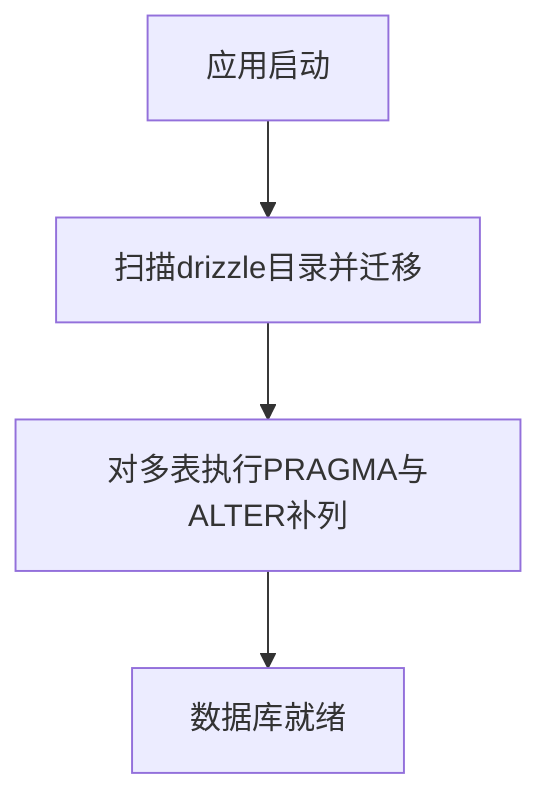
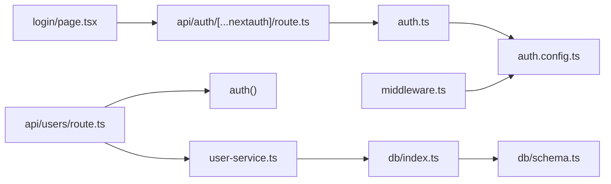

# 用户管理

<cite>
**本文引用的文件**
- [src/lib/auth.ts](file://src/lib/auth.ts)
- [src/lib/auth.config.ts](file://src/lib/auth.config.ts)
- [src/app/api/auth/[...nextauth]/route.ts](file://src/app/api/auth/[...nextauth]/route.ts)
- [src/middleware.ts](file://src/middleware.ts)
- [src/app/login/page.tsx](file://src/app/login/page.tsx)
- [src/lib/services/user-service.ts](file://src/lib/services/user-service.ts)
- [src/app/api/users/route.ts](file://src/app/api/users/route.ts)
- [src/lib/db/schema.ts](file://src/lib/db/schema.ts)
- [src/lib/db/index.ts](file://src/lib/db/index.ts)
- [src/lib/db/seed.ts](file://src/lib/db/seed.ts)
- [scripts/seed.ts](file://scripts/seed.ts)
- [package.json](file://package.json)
</cite>

## 目录
1. [简介](#简介)
2. [项目结构](#项目结构)
3. [核心组件](#核心组件)
4. [架构总览](#架构总览)
5. [详细组件分析](#详细组件分析)
6. [依赖关系分析](#依赖关系分析)
7. [性能考量](#性能考量)
8. [故障排查指南](#故障排查指南)
9. [结论](#结论)
10. [附录](#附录)

## 简介
本文件面向 SillyTavern Next 的用户管理子系统，系统性梳理用户注册、认证、授权与信息服务的实现细节，覆盖数据模型、密码验证、用户状态管理、权限控制、管理员功能与会话管理，并提供增删改查操作规范、验证规则与安全建议，以及最佳实践与常见问题解决方案。

## 项目结构
用户管理相关的关键目录与文件如下：
- 认证与会话
  - NextAuth 配置与回调：[src/lib/auth.config.ts](file://src/lib/auth.config.ts)
  - 凭据认证与回调整合：[src/lib/auth.ts](file://src/lib/auth.ts)
  - NextAuth 路由入口：[src/app/api/auth/[...nextauth]/route.ts](file://src/app/api/auth/[...nextauth]/route.ts)
  - 中间件统一鉴权：[src/middleware.ts](file://src/middleware.ts)
  - 登录页面（客户端触发登录）：[src/app/login/page.tsx](file://src/app/login/page.tsx)
- 用户服务与 API
  - 用户服务（CRUD、密码校验、变更）：[src/lib/services/user-service.ts](file://src/lib/services/user-service.ts)
  - 用户管理 API（仅管理员）：[src/app/api/users/route.ts](file://src/app/api/users/route.ts)
- 数据层
  - 数据库与 Drizzle ORM 初始化：[src/lib/db/index.ts](file://src/lib/db/index.ts)
  - 用户表结构定义：[src/lib/db/schema.ts](file://src/lib/db/schema.ts)
  - 默认种子数据（管理员）：[src/lib/db/seed.ts](file://src/lib/db/seed.ts)
  - 命令行种子脚本：[scripts/seed.ts](file://scripts/seed.ts)
- 依赖
  - 包管理与脚本：[package.json](file://package.json)

**图表来源**
- [src/lib/auth.config.ts:1-52](file://src/lib/auth.config.ts#L1-L52)
- [src/lib/auth.ts:12-58](file://src/lib/auth.ts#L12-L58)
- [src/app/api/auth/[...nextauth]/route.ts:1-3](file://src/app/api/auth/[...nextauth]/route.ts#L1-L3)
- [src/middleware.ts:1-35](file://src/middleware.ts#L1-L35)
- [src/app/login/page.tsx:1-85](file://src/app/login/page.tsx#L1-L85)
- [src/lib/services/user-service.ts:60-169](file://src/lib/services/user-service.ts#L60-L169)
- [src/app/api/users/route.ts:1-37](file://src/app/api/users/route.ts#L1-L37)
- [src/lib/db/index.ts:1-134](file://src/lib/db/index.ts#L1-L134)
- [src/lib/db/schema.ts:6-16](file://src/lib/db/schema.ts#L6-L16)
- [src/lib/db/seed.ts:16-39](file://src/lib/db/seed.ts#L16-L39)
- [scripts/seed.ts:1-27](file://scripts/seed.ts#L1-L27)

**章节来源**
- [src/lib/auth.config.ts:1-52](file://src/lib/auth.config.ts#L1-L52)
- [src/lib/auth.ts:12-58](file://src/lib/auth.ts#L12-L58)
- [src/app/api/auth/[...nextauth]/route.ts:1-3](file://src/app/api/auth/[...nextauth]/route.ts#L1-L3)
- [src/middleware.ts:1-35](file://src/middleware.ts#L1-L35)
- [src/app/login/page.tsx:1-85](file://src/app/login/page.tsx#L1-L85)
- [src/lib/services/user-service.ts:60-169](file://src/lib/services/user-service.ts#L60-L169)
- [src/app/api/users/route.ts:1-37](file://src/app/api/users/route.ts#L1-L37)
- [src/lib/db/index.ts:1-134](file://src/lib/db/index.ts#L1-L134)
- [src/lib/db/schema.ts:6-16](file://src/lib/db/schema.ts#L6-L16)
- [src/lib/db/seed.ts:16-39](file://src/lib/db/seed.ts#L16-L39)
- [scripts/seed.ts:1-27](file://scripts/seed.ts#L1-L27)
- [package.json:1-61](file://package.json#L1-L61)

## 核心组件
- 认证与会话
  - NextAuth 配置：提供凭据认证、JWT 回调、会话策略与受保护路由判定。
  - 凭据认证整合：在认证回调中委托用户服务进行凭据校验，并将用户关键信息写入 JWT 与 Session。
  - NextAuth 路由入口：暴露 /api/auth/* 接口，供前端 next-auth/react 使用。
  - 中间件：统一拦截受保护路径，未登录重定向至登录页。
  - 登录页：使用 next-auth/react 触发凭据认证。
- 用户服务
  - 数据模型：用户表含 id、name、handle、password、salt、avatar、admin、enabled、createdAt。
  - 密码策略：scrypt 哈希，随机盐，定时安全比较；支持修改密码。
  - 用户 CRUD：获取列表、按 id/handle 查询、创建、更新、删除；创建时去重 handle。
  - 权限控制：仅管理员可访问用户管理 API。
- 数据层
  - Drizzle 初始化：WAL 模式、外键约束、自动迁移与字段幂等补齐。
  - 用户表定义：唯一 handle、布尔型 admin/enabled 字段。
  - 种子数据：默认管理员账户（handle: admin, password: admin），仅在不存在时创建。

**章节来源**
- [src/lib/auth.config.ts:5-52](file://src/lib/auth.config.ts#L5-L52)
- [src/lib/auth.ts:7-58](file://src/lib/auth.ts#L7-L58)
- [src/app/api/auth/[...nextauth]/route.ts:1-3](file://src/app/api/auth/[...nextauth]/route.ts#L1-L3)
- [src/middleware.ts:8-30](file://src/middleware.ts#L8-L30)
- [src/app/login/page.tsx:13-30](file://src/app/login/page.tsx#L13-L30)
- [src/lib/services/user-service.ts:27-169](file://src/lib/services/user-service.ts#L27-L169)
- [src/app/api/users/route.ts:5-36](file://src/app/api/users/route.ts#L5-L36)
- [src/lib/db/schema.ts:6-16](file://src/lib/db/schema.ts#L6-L16)
- [src/lib/db/index.ts:16-134](file://src/lib/db/index.ts#L16-L134)
- [src/lib/db/seed.ts:16-39](file://src/lib/db/seed.ts#L16-L39)

## 架构总览
用户管理采用“前端 next-auth/react 发起认证 → NextAuth 处理 → 用户服务校验 → 写入 JWT/Session → 中间件受保护路由”的链路。用户管理 API 仅对管理员开放，内部通过会话中的 admin 标记进行授权判断。

**图表来源**
- [src/app/login/page.tsx:13-30](file://src/app/login/page.tsx#L13-L30)
- [src/app/api/auth/[...nextauth]/route.ts:1-3](file://src/app/api/auth/[...nextauth]/route.ts#L1-L3)
- [src/lib/auth.ts:21-35](file://src/lib/auth.ts#L21-L35)
- [src/lib/services/user-service.ts:64-69](file://src/lib/services/user-service.ts#L64-L69)
- [src/lib/db/index.ts:13-14](file://src/lib/db/index.ts#L13-L14)

## 详细组件分析

### 数据模型与字段
- 用户表 users
  - 主键：id（UUID）
  - 唯一索引：handle
  - 字段：name、handle、password、salt、avatar、admin（布尔）、enabled（布尔）、createdAt
- 设计要点
  - handle 唯一且作为登录标识，便于识别用户。
  - admin/enabled 支持管理员与启用/禁用控制。
  - createdAt 提供审计与统计基础。

**图表来源**
- [src/lib/db/schema.ts:6-16](file://src/lib/db/schema.ts#L6-L16)

**章节来源**
- [src/lib/db/schema.ts:6-16](file://src/lib/db/schema.ts#L6-L16)

### 密码验证与安全
- 哈希算法：scrypt，输出固定长度十六进制字符串。
- 盐值：每次创建/更新密码时生成随机盐，确保相同明文产生不同哈希。
- 校验方式：使用定时安全比较函数，降低时序攻击风险。
- 变更流程：旧密码校验通过后，重新生成盐与哈希并更新数据库。

**图表来源**
- [src/lib/services/user-service.ts:40-50](file://src/lib/services/user-service.ts#L40-L50)
- [src/lib/services/user-service.ts:64-69](file://src/lib/services/user-service.ts#L64-L69)

**章节来源**
- [src/lib/services/user-service.ts:37-50](file://src/lib/services/user-service.ts#L37-L50)
- [src/lib/services/user-service.ts:64-69](file://src/lib/services/user-service.ts#L64-L69)
- [src/lib/services/user-service.ts:159-168](file://src/lib/services/user-service.ts#L159-L168)

### 用户注册流程
- 输入校验：Zod 校验 name、handle、password、admin。
- 去重：按 handle 查询是否存在，存在则抛错。
- 密码处理：生成随机盐，scrypt 哈希，保存 id、name、handle、hash、salt、admin、enabled。
- 返回：返回安全用户对象（不含敏感字段）。

**图表来源**
- [src/lib/services/user-service.ts:8-13](file://src/lib/services/user-service.ts#L8-L13)
- [src/lib/services/user-service.ts:98-119](file://src/lib/services/user-service.ts#L98-L119)

**章节来源**
- [src/lib/services/user-service.ts:8-13](file://src/lib/services/user-service.ts#L8-L13)
- [src/lib/services/user-service.ts:98-119](file://src/lib/services/user-service.ts#L98-L119)

### 用户认证机制
- 凭据认证：前端通过 next-auth/react 提交 handle/password。
- NextAuth 配置：指定凭据字段与登录页。
- 授权回调：委托用户服务 authenticate，成功后将 id、handle、admin 写入 JWT 与 Session。
- 会话策略：JWT 策略，最大有效期配置。

**图表来源**
- [src/lib/auth.ts:21-35](file://src/lib/auth.ts#L21-L35)
- [src/lib/auth.ts:37-56](file://src/lib/auth.ts#L37-L56)
- [src/lib/auth.config.ts:17-52](file://src/lib/auth.config.ts#L17-L52)
- [src/app/api/auth/[...nextauth]/route.ts:1-3](file://src/app/api/auth/[...nextauth]/route.ts#L1-L3)

**章节来源**
- [src/lib/auth.ts:12-58](file://src/lib/auth.ts#L12-L58)
- [src/lib/auth.config.ts:5-52](file://src/lib/auth.config.ts#L5-L52)
- [src/app/api/auth/[...nextauth]/route.ts:1-3](file://src/app/api/auth/[...nextauth]/route.ts#L1-L3)

### 用户信息服务与权限控制
- 管理员接口
  - GET /api/users：仅管理员可访问，返回所有用户（安全对象）。
  - POST /api/users：仅管理员可访问，创建用户（输入经 Zod 校验）。
- 非管理员访问
  - 403 未授权响应。
- 用户服务方法
  - authenticate、getAll、getById、getByHandle、create、update、delete、changePassword。
  - toSafeUser 输出不含敏感字段的对象。

**图表来源**
- [src/app/api/users/route.ts:5-36](file://src/app/api/users/route.ts#L5-L36)
- [src/lib/services/user-service.ts:74-77](file://src/lib/services/user-service.ts#L74-L77)
- [src/lib/services/user-service.ts:124-146](file://src/lib/services/user-service.ts#L124-L146)
- [src/lib/services/user-service.ts:151-154](file://src/lib/services/user-service.ts#L151-L154)

**章节来源**
- [src/app/api/users/route.ts:5-36](file://src/app/api/users/route.ts#L5-L36)
- [src/lib/services/user-service.ts:60-169](file://src/lib/services/user-service.ts#L60-L169)

### 会话管理与中间件
- NextAuth 会话策略：JWT，maxAge 配置。
- 中间件：拦截受保护路径，允许 /login、/api/auth、/_next、/favicon.ico；未登录重定向至 /login 并携带 callbackUrl。
- 页面级受保护：NextAuth authorized 回调结合 pathname 判断，允许 /api/health 公开端点。

**图表来源**
- [src/middleware.ts:8-30](file://src/middleware.ts#L8-L30)
- [src/lib/auth.config.ts:38-46](file://src/lib/auth.config.ts#L38-L46)

**章节来源**
- [src/middleware.ts:1-35](file://src/middleware.ts#L1-L35)
- [src/lib/auth.config.ts:48-52](file://src/lib/auth.config.ts#L48-L52)

### 数据库初始化与迁移
- 初始化：better-sqlite3 连接，开启 WAL 与外键约束。
- 自动迁移：启动时扫描 drizzle 目录并执行迁移（幂等）。
- 字段幂等补齐：针对多张表进行列存在性检查与补充，避免迁移滞后导致 500。

**图表来源**
- [src/lib/db/index.ts:16-134](file://src/lib/db/index.ts#L16-L134)

**章节来源**
- [src/lib/db/index.ts:1-134](file://src/lib/db/index.ts#L1-L134)

### 默认种子与开发环境
- 默认管理员：当数据库中不存在 handle 为 admin 的用户时，创建默认管理员（name: Admin, handle: admin, password: admin），admin=true, enabled=true。
- 命令行脚本：提供独立脚本创建默认管理员，便于首次部署或清理后初始化。

**章节来源**
- [src/lib/db/seed.ts:16-39](file://src/lib/db/seed.ts#L16-L39)
- [scripts/seed.ts:14-26](file://scripts/seed.ts#L14-L26)

## 依赖关系分析
- 组件耦合
  - 认证链路：auth.config.ts ← auth.ts ← api/auth/[...nextauth]/route.ts ← login/page.tsx。
  - 用户管理：api/users/route.ts 依赖 auth() 与 userService；userService 依赖 db/index.ts 与 schema.ts。
  - 中间件：依赖 auth.config.ts 的 auth 工具，统一受保护路由。
- 外部依赖
  - next-auth@^5、zod、drizzle-orm、better-sqlite3。
- 潜在循环依赖
  - 当前结构清晰，无直接循环导入；注意不要在 auth.ts 中引入用户服务以外的 API 层面逻辑。

**图表来源**
- [src/app/login/page.tsx:19-24](file://src/app/login/page.tsx#L19-L24)
- [src/app/api/auth/[...nextauth]/route.ts:1-3](file://src/app/api/auth/[...nextauth]/route.ts#L1-L3)
- [src/lib/auth.ts:12-58](file://src/lib/auth.ts#L12-L58)
- [src/lib/auth.config.ts:5-52](file://src/lib/auth.config.ts#L5-L52)
- [src/app/api/users/route.ts:1-36](file://src/app/api/users/route.ts#L1-L36)
- [src/lib/services/user-service.ts:60-169](file://src/lib/services/user-service.ts#L60-L169)
- [src/lib/db/index.ts:1-134](file://src/lib/db/index.ts#L1-L134)
- [src/lib/db/schema.ts:6-16](file://src/lib/db/schema.ts#L6-L16)
- [src/middleware.ts:6-30](file://src/middleware.ts#L6-L30)

**章节来源**
- [package.json:18-46](file://package.json#L18-L46)

## 性能考量
- 数据库
  - WAL 模式提升并发写入性能；外键约束保证一致性但可能影响写入速度，建议在批量导入时关闭约束并在导入后重建索引。
  - 字段幂等补齐仅在启动时执行，避免频繁 ALTER 影响性能。
- 认证
  - scrypt 哈希成本较高，建议在高并发场景评估会话缓存与负载均衡策略。
  - 使用定时安全比较避免侧信道泄露，但会增加 CPU 开销，属于安全优先设计。
- API
  - 用户列表与创建接口涉及数据库 IO，建议在管理员数量较多时分页或限制返回条数。

[本节为通用指导，无需特定文件来源]

## 故障排查指南
- 登录失败
  - 检查 handle/password 是否为空；确认用户已启用；核对密码哈希与盐是否正确。
  - 查看 NextAuth 日志与网络面板，确认 /api/auth/signin/credentials 请求与响应。
- 无法访问用户管理 API
  - 确认当前会话用户具备 admin=true；检查中间件是否正确重定向至 /login。
- 409 冲突错误（创建用户）
  - handle 已存在，更换唯一 handle 后重试。
- 400 参数错误
  - 检查 name、handle、password、admin 的长度与格式；参考 Zod 校验规则。
- 数据库迁移失败
  - 确认 drizzle 目录存在且迁移 SQL 正确；检查 WAL/SHM 文件权限；必要时清理后重新迁移。
- 默认管理员未创建
  - 确认 seed 逻辑未被跳过；检查数据库中是否已存在 handle=admin 的用户；可使用命令行脚本手动创建。

**章节来源**
- [src/lib/services/user-service.ts:98-102](file://src/lib/services/user-service.ts#L98-L102)
- [src/app/api/users/route.ts:24-27](file://src/app/api/users/route.ts#L24-L27)
- [src/lib/db/seed.ts:16-39](file://src/lib/db/seed.ts#L16-L39)
- [scripts/seed.ts:14-26](file://scripts/seed.ts#L14-L26)
- [src/middleware.ts:22-27](file://src/middleware.ts#L22-L27)

## 结论
SillyTavern Next 的用户管理以 NextAuth 为核心，结合自研用户服务与 Drizzle ORM，实现了从认证、授权到用户数据管理的完整闭环。密码采用 scrypt 哈希与随机盐，具备较好的安全性；管理员权限严格控制在用户管理 API；数据库初始化与迁移保障了部署一致性。建议在生产环境中配合反爬/防爆破策略、会话超时与审计日志进一步强化安全。

[本节为总结性内容，无需特定文件来源]

## 附录

### 用户数据模型字段说明
- id：用户唯一标识（UUID）
- name：用户显示名称
- handle：登录标识（唯一）
- password：密码哈希
- salt：随机盐
- avatar：头像链接
- admin：是否管理员
- enabled：是否启用
- createdAt：创建时间

**章节来源**
- [src/lib/db/schema.ts:6-16](file://src/lib/db/schema.ts#L6-L16)

### 用户管理 API 规范
- GET /api/users
  - 权限：管理员
  - 成功：200，返回用户数组（安全对象）
  - 失败：403
- POST /api/users
  - 权限：管理员
  - 输入：name、handle、password、admin（可选）
  - 成功：201，返回新建用户（安全对象）
  - 失败：400（参数错误）、409（冲突）

**章节来源**
- [src/app/api/users/route.ts:5-36](file://src/app/api/users/route.ts#L5-L36)
- [src/lib/services/user-service.ts:8-13](file://src/lib/services/user-service.ts#L8-L13)

### 安全最佳实践
- 强密码策略：建议在前端与后端同时限制最小长度与复杂度。
- 传输安全：强制 HTTPS，使用安全的 Cookie 属性（Secure、SameSite）。
- 会话安全：缩短 maxAge，启用刷新；避免在客户端存储敏感令牌。
- 速率限制：对登录接口实施速率限制与 IP 黑名单。
- 审计日志：记录登录、创建、更新、删除等关键操作。
- 最小权限：仅授予管理员必要的用户管理能力。

[本节为通用指导，无需特定文件来源]