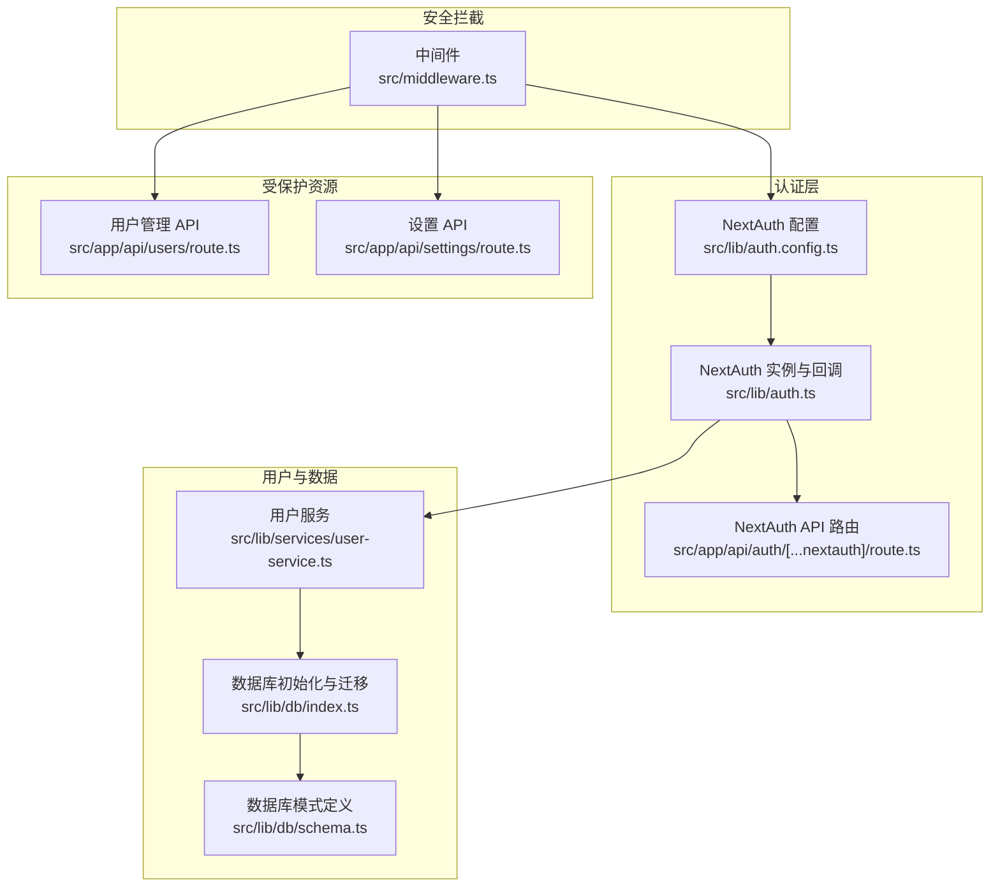
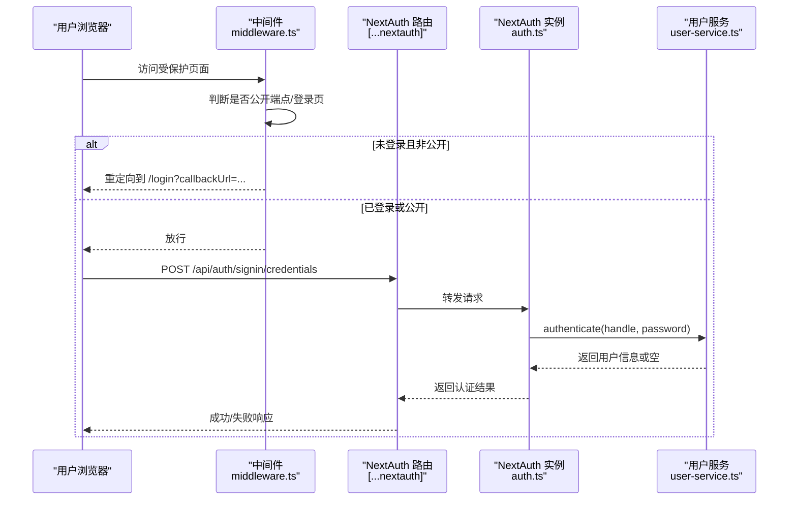
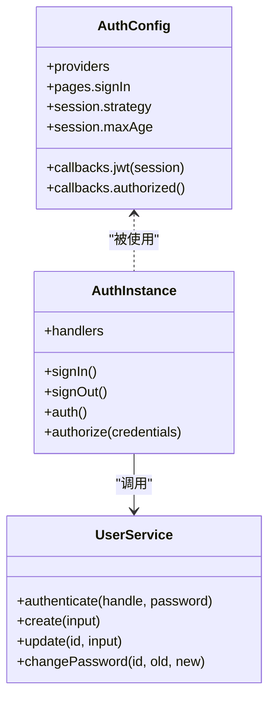
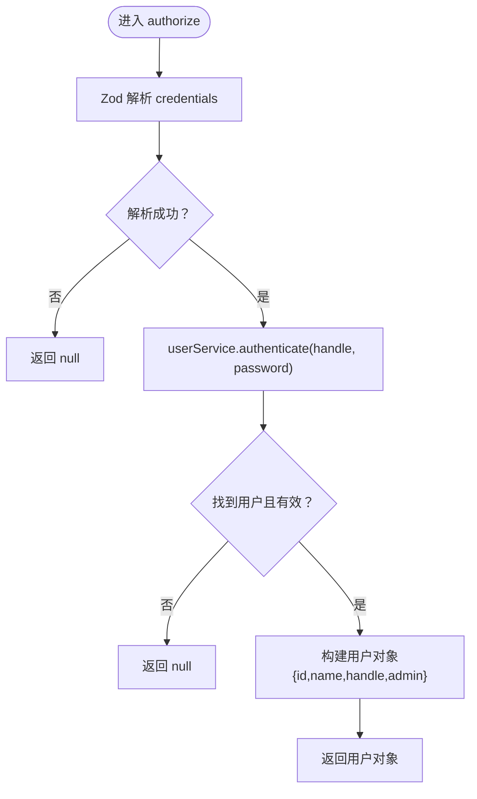
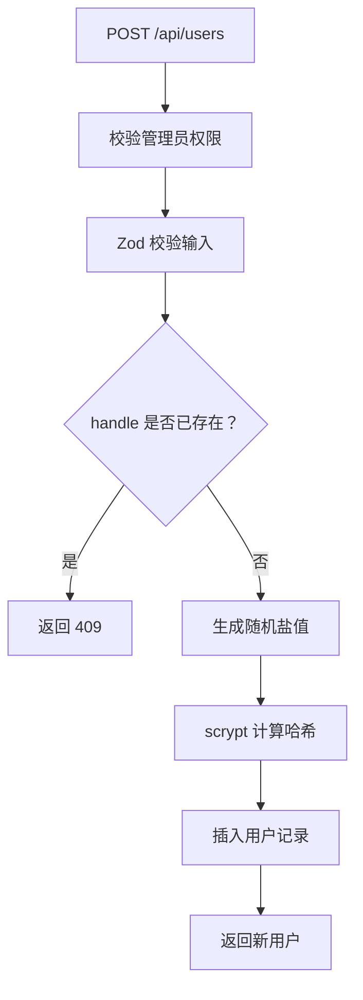
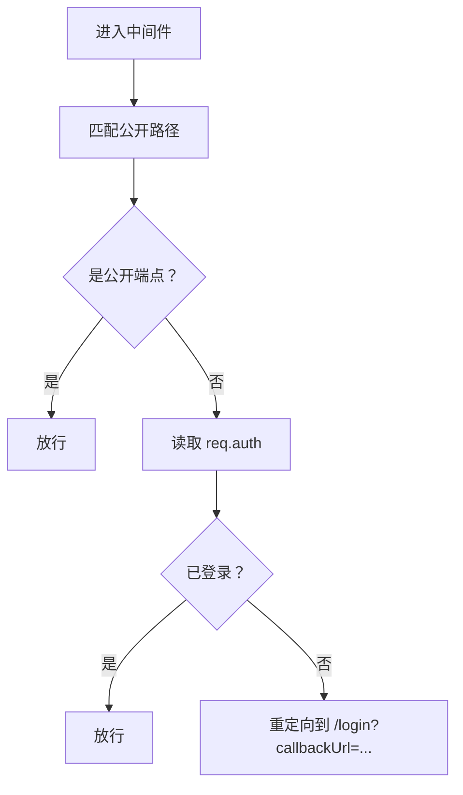
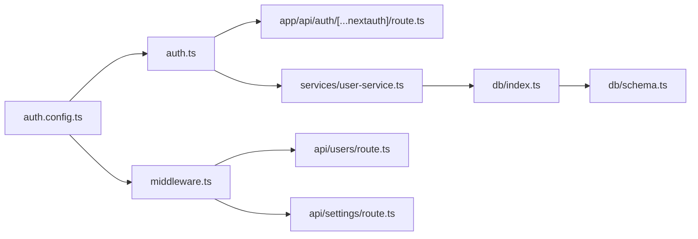

# 认证系统

<cite>
**本文引用的文件**
- [src/lib/auth.ts](file://src/lib/auth.ts)
- [src/lib/auth.config.ts](file://src/lib/auth.config.ts)
- [src/app/api/auth/[...nextauth]/route.ts](file://src/app/api/auth/[...nextauth]/route.ts)
- [src/middleware.ts](file://src/middleware.ts)
- [src/app/login/page.tsx](file://src/app/login/page.tsx)
- [src/lib/services/user-service.ts](file://src/lib/services/user-service.ts)
- [src/lib/db/index.ts](file://src/lib/db/index.ts)
- [src/lib/db/schema.ts](file://src/lib/db/schema.ts)
- [src/app/api/users/route.ts](file://src/app/api/users/route.ts)
- [src/app/api/settings/route.ts](file://src/app/api/settings/route.ts)
</cite>

## 目录
1. [简介](#简介)
2. [项目结构](#项目结构)
3. [核心组件](#核心组件)
4. [架构总览](#架构总览)
5. [详细组件分析](#详细组件分析)
6. [依赖关系分析](#依赖关系分析)
7. [性能考量](#性能考量)
8. [故障排查指南](#故障排查指南)
9. [结论](#结论)
10. [附录](#附录)

## 简介
本文件面向 SillyTavern Next 的认证系统，系统基于 NextAuth v5 实现，采用 Credentials Provider 进行用户名/密码认证，并结合 JWT 会话策略与中间件进行统一的安全拦截。文档覆盖以下主题：
- NextAuth v5 集成与配置
- Credentials Provider 的参数、校验与授权回调
- 用户注册流程与密码验证（哈希、盐值、安全比较）
- 中间件的安全检查、权限控制与访问限制
- 认证状态管理、令牌刷新与安全考虑
- 扩展开发与安全最佳实践

## 项目结构
认证相关的关键文件分布如下：
- NextAuth 配置与入口：src/lib/auth.config.ts、src/lib/auth.ts、src/app/api/auth/[...nextauth]/route.ts
- 中间件：src/middleware.ts
- 登录页面与客户端调用：src/app/login/page.tsx
- 用户服务与数据库：src/lib/services/user-service.ts、src/lib/db/index.ts、src/lib/db/schema.ts
- 权限受限的 API：src/app/api/users/route.ts、src/app/api/settings/route.ts

图表来源
- [src/lib/auth.config.ts:1-53](file://src/lib/auth.config.ts#L1-L53)
- [src/lib/auth.ts:1-59](file://src/lib/auth.ts#L1-L59)
- [src/app/api/auth/[...nextauth]/route.ts:1-3](file://src/app/api/auth/[...nextauth]/route.ts#L1-L3)
- [src/middleware.ts:1-35](file://src/middleware.ts#L1-L35)
- [src/lib/services/user-service.ts:1-170](file://src/lib/services/user-service.ts#L1-L170)
- [src/lib/db/index.ts:1-134](file://src/lib/db/index.ts#L1-L134)
- [src/lib/db/schema.ts:1-240](file://src/lib/db/schema.ts#L1-L240)
- [src/app/api/users/route.ts:1-37](file://src/app/api/users/route.ts#L1-L37)
- [src/app/api/settings/route.ts:1-109](file://src/app/api/settings/route.ts#L1-L109)

章节来源
- [src/lib/auth.config.ts:1-53](file://src/lib/auth.config.ts#L1-L53)
- [src/lib/auth.ts:1-59](file://src/lib/auth.ts#L1-L59)
- [src/app/api/auth/[...nextauth]/route.ts:1-3](file://src/app/api/auth/[...nextauth]/route.ts#L1-L3)
- [src/middleware.ts:1-35](file://src/middleware.ts#L1-L35)
- [src/app/login/page.tsx:1-85](file://src/app/login/page.tsx#L1-L85)
- [src/lib/services/user-service.ts:1-170](file://src/lib/services/user-service.ts#L1-L170)
- [src/lib/db/index.ts:1-134](file://src/lib/db/index.ts#L1-L134)
- [src/lib/db/schema.ts:1-240](file://src/lib/db/schema.ts#L1-L240)
- [src/app/api/users/route.ts:1-37](file://src/app/api/users/route.ts#L1-L37)
- [src/app/api/settings/route.ts:1-109](file://src/app/api/settings/route.ts#L1-L109)

## 核心组件
- NextAuth 配置与回调：集中于 auth.config.ts，定义了 Credentials Provider、JWT 会话策略、登录页重定向以及 authorized 回调用于中间件授权判定。
- NextAuth 实例与 Credentials Provider：在 auth.ts 中导出 handlers，并在 authorize 回调中使用 userService.authenticate 完成用户认证。
- NextAuth API 路由：将 NextAuth 的 GET/POST 请求转发至 handlers。
- 中间件：基于 authConfig 的 auth 包装器，统一拦截未登录访问，处理公开端点与登录页。
- 用户服务：负责用户查询、密码哈希/验证、用户创建与更新。
- 数据库：better-sqlite3 + drizzle-orm，提供用户表与相关迁移。
- 受保护 API：用户管理与设置接口均依赖 auth() 获取会话并进行权限校验。

章节来源
- [src/lib/auth.config.ts:1-53](file://src/lib/auth.config.ts#L1-L53)
- [src/lib/auth.ts:12-58](file://src/lib/auth.ts#L12-L58)
- [src/app/api/auth/[...nextauth]/route.ts:1-3](file://src/app/api/auth/[...nextauth]/route.ts#L1-L3)
- [src/middleware.ts:6-30](file://src/middleware.ts#L6-L30)
- [src/lib/services/user-service.ts:60-168](file://src/lib/services/user-service.ts#L60-L168)
- [src/lib/db/index.ts:1-134](file://src/lib/db/index.ts#L1-L134)
- [src/app/api/users/route.ts:6-14](file://src/app/api/users/route.ts#L6-L14)
- [src/app/api/settings/route.ts:22-50](file://src/app/api/settings/route.ts#L22-L50)

## 架构总览
认证系统采用“配置驱动 + 中间件拦截 + 会话回调”的分层设计：
- 配置层：定义 Provider、会话策略、登录页与授权回调。
- 实例层：在 auth.ts 中组合配置与 Credentials Provider，完成认证与会话扩展。
- 路由层：NextAuth API 路由暴露标准端点。
- 拦截层：中间件统一处理未登录与公开端点。
- 服务层：用户服务封装数据库访问与密码安全逻辑。
- API 层：受保护的业务接口通过 auth() 获取会话并做权限判断。

图表来源
- [src/middleware.ts:8-30](file://src/middleware.ts#L8-L30)
- [src/app/api/auth/[...nextauth]/route.ts:1-3](file://src/app/api/auth/[...nextauth]/route.ts#L1-L3)
- [src/lib/auth.ts:21-36](file://src/lib/auth.ts#L21-L36)
- [src/lib/services/user-service.ts:64-69](file://src/lib/services/user-service.ts#L64-L69)

## 详细组件分析

### NextAuth v5 集成与配置
- 配置来源：auth.config.ts 定义了 Credentials Provider、JWT 会话策略（maxAge）、登录页映射与 authorized 回调。
- 实例来源：auth.ts 在导出 handlers 的同时，重写了 authorize 回调，使用 Zod 校验输入并委托 userService.authenticate 完成认证。
- API 路由：将 NextAuth 的 handlers 暴露为 /api/auth/[...nextauth] 的 GET/POST。

图表来源
- [src/lib/auth.config.ts:5-52](file://src/lib/auth.config.ts#L5-L52)
- [src/lib/auth.ts:12-58](file://src/lib/auth.ts#L12-L58)
- [src/lib/services/user-service.ts:64-69](file://src/lib/services/user-service.ts#L64-L69)

章节来源
- [src/lib/auth.config.ts:1-53](file://src/lib/auth.config.ts#L1-L53)
- [src/lib/auth.ts:12-58](file://src/lib/auth.ts#L12-L58)
- [src/app/api/auth/[...nextauth]/route.ts:1-3](file://src/app/api/auth/[...nextauth]/route.ts#L1-L3)

### Credentials Provider 配置与用户认证
- 凭证字段：handle（文本）、password（密码），用于用户名/密码登录。
- 输入校验：使用 Zod Schema 对 credentials 进行最小长度校验。
- 授权回调：若校验失败或认证失败，返回空；成功时返回包含 id/name/handle/admin 的用户对象，供 JWT 与 Session 回调使用。
- 会话扩展：jwt 与 session 回调将用户信息写入 token 并透传到 session.user。

图表来源
- [src/lib/auth.ts:7-36](file://src/lib/auth.ts#L7-L36)
- [src/lib/services/user-service.ts:64-69](file://src/lib/services/user-service.ts#L64-L69)

章节来源
- [src/lib/auth.ts:7-36](file://src/lib/auth.ts#L7-L36)
- [src/lib/services/user-service.ts:64-69](file://src/lib/services/user-service.ts#L64-L69)

### 用户注册流程与密码验证
- 注册输入校验：createUserSchema 对 name/handle/password/admin 进行范围与格式约束。
- 唯一性检查：按 handle 查询是否存在重复。
- 密码安全：
  - 生成随机盐值（32字节十六进制）。
  - 使用 scrypt（与原版兼容）计算哈希。
  - 存储 id、name、handle、password、salt、admin、enabled。
- 密码验证：verifyPassword 使用 timingSafeEqual 进行常量时间比较。
- 更新与改密：支持可选字段更新与密码重置，重置时重新生成盐值与哈希。

图表来源
- [src/app/api/users/route.ts:16-36](file://src/app/api/users/route.ts#L16-L36)
- [src/lib/services/user-service.ts:98-119](file://src/lib/services/user-service.ts#L98-L119)

章节来源
- [src/lib/services/user-service.ts:8-21](file://src/lib/services/user-service.ts#L8-L21)
- [src/lib/services/user-service.ts:98-119](file://src/lib/services/user-service.ts#L98-L119)
- [src/app/api/users/route.ts:16-36](file://src/app/api/users/route.ts#L16-L36)

### 中间件的安全检查、权限控制与访问限制
- 拦截规则：
  - 公开路径：/login、/api/auth、/_next、favicon.ico。
  - 已登录：放行。
  - 未登录：重定向到 /login 并携带 callbackUrl。
- 授权回调（authorized）：
  - 登录页与 /api/auth 明确放行。
  - Docker/K8s 健康检查端点 /api/health 作为公开端点。
  - 其余路径需已登录才允许访问。

图表来源
- [src/middleware.ts:8-30](file://src/middleware.ts#L8-L30)
- [src/lib/auth.config.ts:38-46](file://src/lib/auth.config.ts#L38-L46)

章节来源
- [src/middleware.ts:1-35](file://src/middleware.ts#L1-L35)
- [src/lib/auth.config.ts:17-46](file://src/lib/auth.config.ts#L17-L46)

### 认证状态管理、令牌刷新与安全考虑
- 会话策略：JWT，maxAge 为 30 天，适合无服务器环境与边缘运行。
- 令牌扩展：jwt 回调在首次登录时写入 id/handle/admin；session 回调将 token 信息透传到 session.user。
- 令牌刷新：NextAuth 默认在访问时根据 maxAge 决定是否续期；Edge 环境下建议配合前端轮询或服务端定时刷新策略。
- 安全要点：
  - 密码使用 scrypt 与随机盐值，验证使用 timingSafeEqual。
  - 会话基于 JWT，避免服务端存储，降低状态耦合。
  - 中间件与 API 层双重校验，确保未登录用户无法访问受保护资源。

章节来源
- [src/lib/auth.config.ts:48-52](file://src/lib/auth.config.ts#L48-L52)
- [src/lib/auth.ts:37-56](file://src/lib/auth.ts#L37-L56)
- [src/lib/services/user-service.ts:40-50](file://src/lib/services/user-service.ts#L40-L50)

### 登录页面与客户端交互
- 登录页：提供 handle 与 password 表单，提交时通过 next-auth/react 的 signIn 方法调用 credentials provider。
- 回调：登录成功后跳转到 callbackUrl（默认根路径）。

章节来源
- [src/app/login/page.tsx:13-30](file://src/app/login/page.tsx#L13-L30)

### 受保护 API 的权限控制
- 用户管理 API：
  - GET /api/users：仅管理员可访问。
  - POST /api/users：仅管理员可访问，创建用户并返回 201。
- 设置 API：
  - GET /api/settings：必须登录，返回用户连接配置（默认值与合并逻辑）。
  - PUT /api/settings：必须登录，保存用户连接配置。

章节来源
- [src/app/api/users/route.ts:6-14](file://src/app/api/users/route.ts#L6-L14)
- [src/app/api/users/route.ts:17-36](file://src/app/api/users/route.ts#L17-L36)
- [src/app/api/settings/route.ts:22-50](file://src/app/api/settings/route.ts#L22-L50)
- [src/app/api/settings/route.ts:55-108](file://src/app/api/settings/route.ts#L55-L108)

## 依赖关系分析
- 组件耦合：
  - auth.ts 依赖 auth.config.ts 与 userService。
  - NextAuth API 路由依赖 auth.ts 的 handlers。
  - 中间件依赖 auth.config.ts 的 auth 包装器。
  - 用户服务依赖数据库（drizzle-orm）与 schema 定义。
  - 受保护 API 依赖 auth() 获取会话并进行权限判断。
- 外部依赖：
  - next-auth（v5）、zod（输入校验）、better-sqlite3 + drizzle-orm（数据库）。

图表来源
- [src/lib/auth.config.ts:1-53](file://src/lib/auth.config.ts#L1-L53)
- [src/lib/auth.ts:1-59](file://src/lib/auth.ts#L1-L59)
- [src/app/api/auth/[...nextauth]/route.ts:1-3](file://src/app/api/auth/[...nextauth]/route.ts#L1-L3)
- [src/middleware.ts:1-35](file://src/middleware.ts#L1-L35)
- [src/lib/services/user-service.ts:1-170](file://src/lib/services/user-service.ts#L1-L170)
- [src/lib/db/index.ts:1-134](file://src/lib/db/index.ts#L1-L134)
- [src/lib/db/schema.ts:1-240](file://src/lib/db/schema.ts#L1-L240)
- [src/app/api/users/route.ts:1-37](file://src/app/api/users/route.ts#L1-L37)
- [src/app/api/settings/route.ts:1-109](file://src/app/api/settings/route.ts#L1-L109)

章节来源
- [src/lib/auth.ts:1-59](file://src/lib/auth.ts#L1-L59)
- [src/lib/services/user-service.ts:1-170](file://src/lib/services/user-service.ts#L1-L170)
- [src/lib/db/schema.ts:6-16](file://src/lib/db/schema.ts#L6-L16)

## 性能考量
- 会话策略：JWT 会话减少服务端状态存储，适合高并发与无服务器部署；但需注意令牌大小与传输开销。
- 数据库访问：用户认证与用户管理均通过 drizzle-orm 访问 SQLite，建议在生产环境使用更健壮的数据库并启用索引。
- 密码哈希：scrypt 计算成本较高，建议在用户注册/改密时异步处理或使用后台任务队列。
- 中间件匹配：matcher 仅拦截非静态资源，避免对静态资源产生不必要的拦截开销。

## 故障排查指南
- 登录失败：
  - 检查 credentials 输入是否满足 Zod 校验（handle/password 非空）。
  - 确认用户存在且 enabled=true，密码正确（timingSafeEqual 会严格比较）。
- 未登录访问受保护页面：
  - 查看中间件是否正确识别公开端点与登录页。
  - 确认 /api/auth 端点可用，且客户端使用 next-auth/react 正确调用。
- 管理员权限错误：
  - 确认 session.user.admin 为真，且 API 路由中已进行权限校验。
- 数据库问题：
  - 确认数据库迁移已执行，表结构与 schema 一致。
  - 检查 handle 唯一性约束与用户状态字段。

章节来源
- [src/lib/auth.ts:21-36](file://src/lib/auth.ts#L21-L36)
- [src/lib/services/user-service.ts:64-69](file://src/lib/services/user-service.ts#L64-L69)
- [src/middleware.ts:12-29](file://src/middleware.ts#L12-L29)
- [src/app/api/users/route.ts:8-10](file://src/app/api/users/route.ts#L8-L10)
- [src/lib/db/index.ts:16-31](file://src/lib/db/index.ts#L16-L31)

## 结论
SillyTavern Next 的认证系统以 NextAuth v5 为核心，结合 Credentials Provider、JWT 会话与中间件拦截，实现了简洁而安全的用户认证与权限控制。通过 Zod 输入校验、scrypt 密码哈希与严格的中间件授权，系统在易用性与安全性之间取得平衡。建议在生产环境中进一步完善数据库性能、令牌刷新策略与审计日志，以满足更高要求的部署场景。

## 附录
- 数据库模式关键字段（用户表）：id、name、handle（唯一）、password、salt、avatar、admin、enabled、createdAt。
- 默认管理员账号：admin/admin（用于初始登录与演示）。

章节来源
- [src/lib/db/schema.ts:6-16](file://src/lib/db/schema.ts#L6-L16)
- [src/app/login/page.tsx:78-80](file://src/app/login/page.tsx#L78-L80)