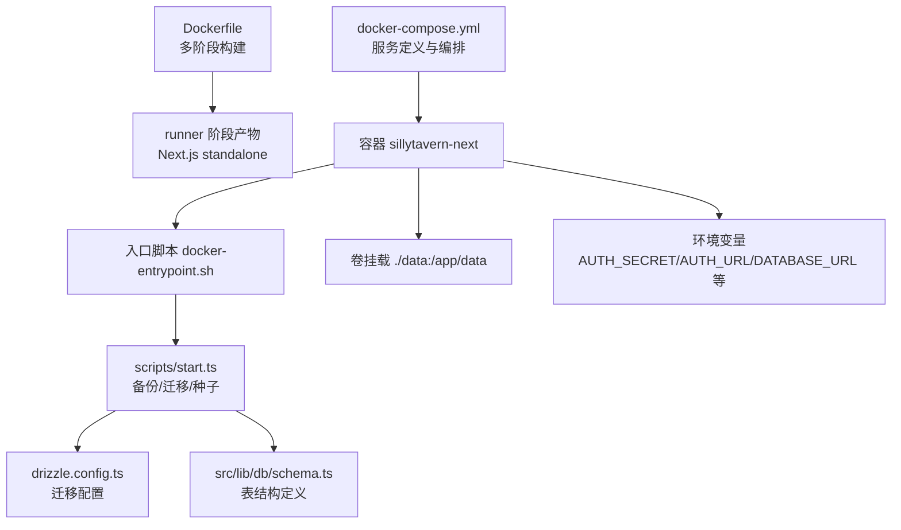
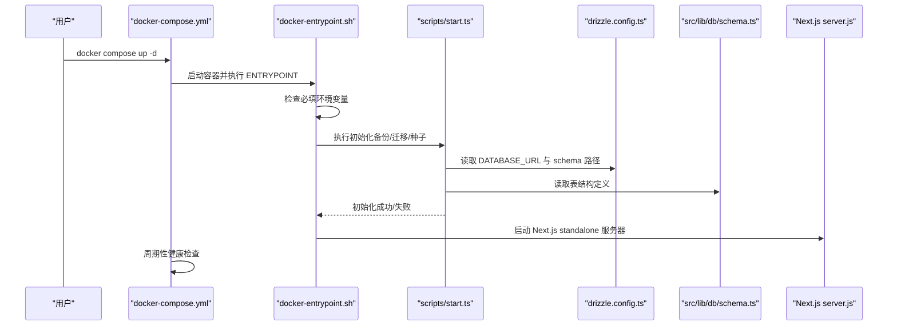
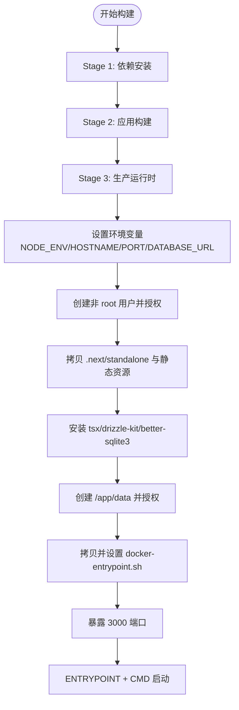
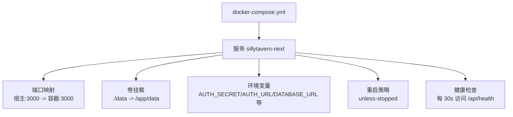
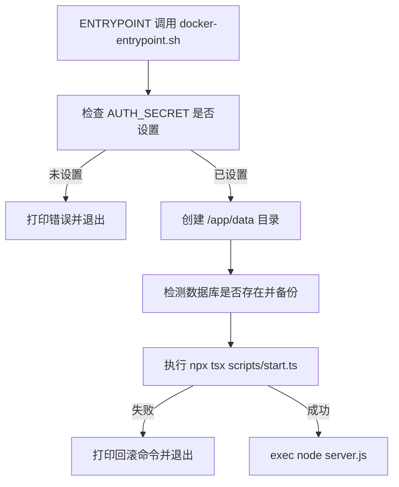
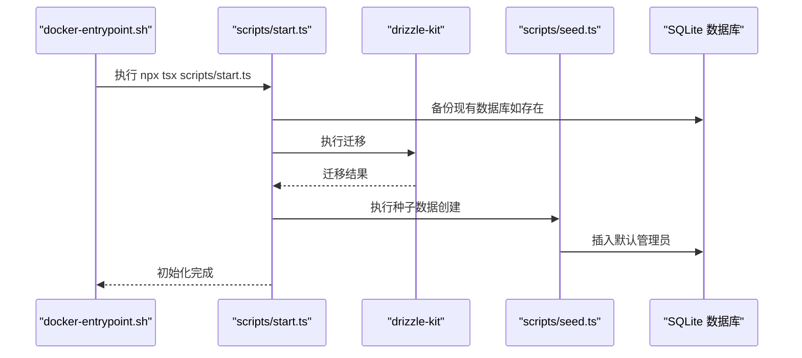
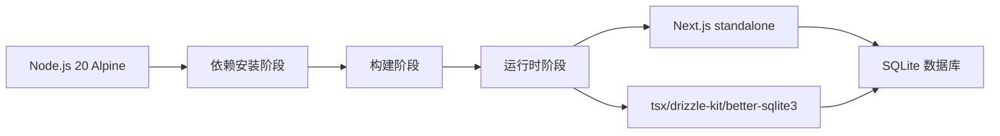

# Docker 容器化部署

<cite>
**本文引用的文件列表**
- [Dockerfile](file://Dockerfile)
- [docker-compose.yml](file://docker-compose.yml)
- [docker-entrypoint.sh](file://docker-entrypoint.sh)
- [.dockerignore](file://.dockerignore)
- [package.json](file://package.json)
- [next.config.ts](file://next.config.ts)
- [tsconfig.json](file://tsconfig.json)
- [README.md](file://README.md)
- [scripts/start.ts](file://scripts/start.ts)
- [scripts/seed.ts](file://scripts/seed.ts)
- [drizzle.config.ts](file://drizzle.config.ts)
- [src/lib/db/schema.ts](file://src/lib/db/schema.ts)
</cite>

## 目录
1. [简介](#简介)
2. [项目结构](#项目结构)
3. [核心组件](#核心组件)
4. [架构总览](#架构总览)
5. [详细组件分析](#详细组件分析)
6. [依赖关系分析](#依赖关系分析)
7. [性能考虑](#性能考虑)
8. [故障排查指南](#故障排查指南)
9. [结论](#结论)
10. [附录](#附录)

## 简介
本文件面向 SillyTavern Next 的 Docker 容器化部署，系统性说明 Dockerfile 构建流程、镜像配置与启动脚本行为，详解 docker-compose.yml 的端口映射、数据卷挂载与环境变量设置，阐述容器健康检查、重启策略与网络配置，并提供完整的部署步骤、环境准备与常见问题解决方案。同时给出容器安全配置、资源限制与性能优化建议，帮助用户在生产环境中稳定运行。

## 项目结构
围绕 Docker 部署的关键文件与职责如下：
- Dockerfile：多阶段构建，包含依赖安装、应用构建与生产运行时三阶段，最终以 Next.js standalone 形式运行。
- docker-compose.yml：定义服务、端口映射、数据卷、环境变量、健康检查与重启策略。
- docker-entrypoint.sh：容器启动引导脚本，负责数据库备份、迁移与种子数据创建，再启动服务。
- .dockerignore：排除构建上下文中不必要的文件，确保镜像精简。
- package.json：脚本与依赖定义，包含数据库迁移、种子数据与一键初始化脚本。
- next.config.ts：Next.js standalone 输出与外部包配置。
- tsconfig.json：TypeScript 编译配置。
- scripts/start.ts：一键初始化逻辑（备份、迁移、种子数据）。
- scripts/seed.ts：创建默认管理员账户。
- drizzle.config.ts：Drizzle ORM 配置，指向 SQLite 数据库路径。
- src/lib/db/schema.ts：数据库表结构定义。



图表来源
- [Dockerfile:1-63](file://Dockerfile#L1-L63)
- [docker-compose.yml:10-37](file://docker-compose.yml#L10-L37)
- [docker-entrypoint.sh:1-70](file://docker-entrypoint.sh#L1-L70)
- [scripts/start.ts:1-96](file://scripts/start.ts#L1-L96)
- [drizzle.config.ts:1-11](file://drizzle.config.ts#L1-L11)
- [src/lib/db/schema.ts:1-240](file://src/lib/db/schema.ts#L1-L240)

章节来源
- [Dockerfile:1-63](file://Dockerfile#L1-L63)
- [docker-compose.yml:1-37](file://docker-compose.yml#L1-L37)
- [docker-entrypoint.sh:1-70](file://docker-entrypoint.sh#L1-L70)
- [.dockerignore:1-49](file://.dockerignore#L1-L49)
- [package.json:1-61](file://package.json#L1-L61)
- [next.config.ts:1-14](file://next.config.ts#L1-L14)
- [tsconfig.json:1-35](file://tsconfig.json#L1-L35)
- [README.md:1-225](file://README.md#L1-L225)

## 核心组件
- 多阶段 Dockerfile：依赖安装（Stage 1）、应用构建（Stage 2）、生产运行时（Stage 3）。运行时以非 root 用户执行，暴露 3000 端口，挂载 /app/data 作为数据卷。
- 启动脚本 docker-entrypoint.sh：检查必填环境变量、自动备份数据库、执行迁移与种子数据、启动 Next.js 服务器。
- docker-compose.yml：定义服务、端口映射、卷挂载、环境变量、健康检查与重启策略。
- 数据库与迁移：使用 SQLite（better-sqlite3）+ Drizzle ORM，迁移文件位于 drizzle/，schema 定义在 src/lib/db/schema.ts。
- Next.js standalone：next.config.ts 配置 output: "standalone"，并声明 serverExternalPackages: ["better-sqlite3"]，确保运行时正确打包外部依赖。

章节来源
- [Dockerfile:1-63](file://Dockerfile#L1-L63)
- [docker-compose.yml:10-37](file://docker-compose.yml#L10-L37)
- [docker-entrypoint.sh:15-69](file://docker-entrypoint.sh#L15-L69)
- [drizzle.config.ts:1-11](file://drizzle.config.ts#L1-L11)
- [src/lib/db/schema.ts:1-240](file://src/lib/db/schema.ts#L1-L240)
- [next.config.ts:3-11](file://next.config.ts#L3-L11)

## 架构总览
容器启动流程从 ENTRYPOINT 调用 docker-entrypoint.sh，该脚本执行数据库备份、迁移与种子数据创建，随后以 CMD 指定的 node server.js 启动 Next.js standalone 服务器。compose 中的健康检查通过访问 /api/health 判断容器健康状态。



图表来源
- [docker-compose.yml:31-36](file://docker-compose.yml#L31-L36)
- [docker-entrypoint.sh:52-69](file://docker-entrypoint.sh#L52-L69)
- [scripts/start.ts:65-96](file://scripts/start.ts#L65-L96)
- [drizzle.config.ts:3-10](file://drizzle.config.ts#L3-L10)
- [src/lib/db/schema.ts:1-240](file://src/lib/db/schema.ts#L1-L240)

## 详细组件分析

### Dockerfile 分析
- 多阶段构建：deps（安装依赖）、builder（构建 Next.js）、runner（运行时）。
- 运行时环境：设置 NODE_ENV=production、NEXT_TELEMETRY_DISABLED=1、HOSTNAME=0.0.0.0、PORT=3000、DATABASE_URL=/app/data/sillytavern.db。
- 安全与权限：创建非 root 用户（nodejs:nextjs），所有拷贝文件与目录均 chown 到该用户。
- Standalone 与外部依赖：拷贝 .next/standalone 与 .next/static，安装 tsx、drizzle-kit、better-sqlite3 以支持运行时迁移与种子。
- 数据卷：/app/data 作为持久化目录，ENTRYPOINT 使用 tini 作为 init 进程。
- CMD：node server.js，配合 next.config.ts 的 standalone 输出。



图表来源
- [Dockerfile:5-62](file://Dockerfile#L5-L62)

章节来源
- [Dockerfile:1-63](file://Dockerfile#L1-L63)

### docker-compose.yml 分析
- 服务定义：sillytavern-next，使用当前目录构建镜像，容器名为 sillytavern-next。
- 端口映射：将宿主机 ${PORT:-3000} 映射到容器 3000 端口。
- 数据卷：将 ./data 挂载到 /app/data，确保 SQLite 数据持久化。
- 环境变量：
  - 必填：AUTH_SECRET（通过 openssl rand -hex 32 生成），AUTH_URL（默认 http://localhost:3000）。
  - 数据库：DATABASE_URL=/app/data/sillytavern.db。
  - 可选：OPENAI_API_KEY、ANTHROPIC_API_KEY、GOOGLE_GENERATIVE_AI_API_KEY。
- 重启策略：unless-stopped。
- 健康检查：每 30s 访问 http://localhost:3000/api/health，超时 5s，重试 3 次，启动期 30s。



图表来源
- [docker-compose.yml:10-37](file://docker-compose.yml#L10-L37)

章节来源
- [docker-compose.yml:1-37](file://docker-compose.yml#L1-L37)

### docker-entrypoint.sh 分析
- 必填环境变量检查：若 AUTH_SECRET 未设置，打印错误并退出。
- 数据目录准备：确保 /app/data 存在。
- 自动备份：若数据库文件存在，则在 /app/data/backups 下创建在线备份（优先 sqlite3 .backup，否则回退 cp），并仅保留最近 5 份。
- 初始化流程：执行 npx tsx /app/scripts/start.ts，包含备份、迁移与种子数据创建；失败时打印回滚命令。
- 启动服务：成功后 exec "$@"，即执行 CMD（node server.js）。



图表来源
- [docker-entrypoint.sh:15-69](file://docker-entrypoint.sh#L15-L69)

章节来源
- [docker-entrypoint.sh:1-70](file://docker-entrypoint.sh#L1-L70)

### 数据库与迁移
- Drizzle 配置：schema 指向 src/lib/db/schema.ts，输出目录 drizzle，方言 sqlite，dbCredentials.url 来自 DATABASE_URL。
- 迁移与种子：scripts/start.ts 负责备份、执行 drizzle-kit migrate、调用 scripts/seed.ts 创建默认管理员。
- 表结构：src/lib/db/schema.ts 定义 users、characters、tags、personas、groups、chats、messages、worldInfo、presets、secrets、settings、instructTemplates、contextTemplates 等表。

```mermaid
erDiagram
USERS {
text id PK
text name
text handle UK
text password
text salt
text avatar
boolean admin
boolean enabled
integer created_at
}
CHARACTERS {
text id PK
text user_id FK
text name
text description
text personality
text scenario
text first_message
text example_dialogue
text creator_notes
text system_prompt
text post_history_instructions
text alternate_greetings
text tags
text creator
text character_version
number talkativeness
boolean fav
text avatar
text extensions
text character_book
text world_info_book_id
text create_date
integer created_at
integer updated_at
}
TAGS {
text id PK
text user_id FK
text name
text color
text color2
integer created_at
}
PERSONAS {
text id PK
text user_id FK
text name
text description
text avatar
boolean is_active
boolean is_default
integer description_position
integer depth
integer depth_role
text lorebook_id
text connections
integer created_at
}
GROUPS {
text id PK
text user_id FK
text name
text members
text disabled_members
text avatar
boolean fav
integer activation_strategy
integer generation_mode
boolean allow_self_responses
text generation_mode_join_prefix
text generation_mode_join_suffix
integer auto_mode_delay
boolean hide_muted_sprites
integer date_last_chat
text chat_metadata
integer created_at
integer updated_at
}
CHATS {
text id PK
text user_id FK
text character_id
text group_id
text title
text metadata
integer created_at
integer updated_at
}
MESSAGES {
text id PK
text chat_id FK
text name
boolean is_user
text content
text role
text swipes
integer swipe_id
text swipe_info
boolean is_system
text force_avatar
text original_avatar
text gen_started
text gen_finished
text bookmark_link
text extra
text send_date
integer created_at
}
WORLD_INFO {
text id PK
text user_id FK
text name
text entries
integer created_at
integer updated_at
}
PRESETS {
text id PK
text user_id FK
text name
text provider
text api_type
text settings
boolean is_default
boolean is_active
integer created_at
integer updated_at
}
SECRETS {
text id PK
text user_id FK
text key
text value
integer created_at
}
SETTINGS {
text id PK
text user_id FK UK
text data
integer updated_at
}
INSTRUCT_TEMPLATES {
text id PK
text user_id FK
text name
text content
integer created_at
}
CONTEXT_TEMPLATES {
text id PK
text user_id FK
text name
text content
integer created_at
}
USERS ||--o{ CHARACTERS : "拥有"
USERS ||--o{ TAGS : "拥有"
USERS ||--o{ PERSONAS : "拥有"
USERS ||--o{ GROUPS : "拥有"
USERS ||--o{ CHATS : "拥有"
USERS ||--o{ SECRETS : "拥有"
USERS ||--o{ SETTINGS : "拥有"
USERS ||--o{ INSTRUCT_TEMPLATES : "拥有"
USERS ||--o{ CONTEXT_TEMPLATES : "拥有"
CHARACTERS ||--o{ MESSAGES : "包含"
GROUPS ||--o{ CHATS : "包含"
```

图表来源
- [src/lib/db/schema.ts:6-240](file://src/lib/db/schema.ts#L6-L240)

章节来源
- [drizzle.config.ts:1-11](file://drizzle.config.ts#L1-L11)
- [scripts/start.ts:65-96](file://scripts/start.ts#L65-L96)
- [scripts/seed.ts:1-28](file://scripts/seed.ts#L1-L28)
- [src/lib/db/schema.ts:1-240](file://src/lib/db/schema.ts#L1-L240)

### 启动脚本与初始化流程
- 入口脚本：docker-entrypoint.sh 在容器启动时执行，确保 AUTH_SECRET 存在，进行数据库备份，然后调用 scripts/start.ts。
- 一键初始化：scripts/start.ts 负责：
  - 确保 data 目录存在。
  - 若数据库存在则备份（含 WAL/SHM），保留最近 5 份。
  - 执行 npx drizzle-kit migrate 应用迁移。
  - 执行 npx tsx scripts/seed.ts 创建默认管理员（handle=admin，password=admin）。
- 种子脚本：scripts/seed.ts 使用 better-sqlite3 连接数据库，若不存在 admin 用户则插入一条管理员记录。



图表来源
- [docker-entrypoint.sh:52-69](file://docker-entrypoint.sh#L52-L69)
- [scripts/start.ts:24-96](file://scripts/start.ts#L24-L96)
- [scripts/seed.ts:12-28](file://scripts/seed.ts#L12-L28)

章节来源
- [docker-entrypoint.sh:1-70](file://docker-entrypoint.sh#L1-L70)
- [scripts/start.ts:1-96](file://scripts/start.ts#L1-L96)
- [scripts/seed.ts:1-28](file://scripts/seed.ts#L1-L28)

## 依赖关系分析
- 构建与运行依赖：
  - Node.js 20 Alpine 作为基础镜像，安装 libc6-compat、python3、make、g++（依赖安装阶段）。
  - 运行时安装 libc6-compat、tini，ENTRYPOINT 使用 tini --。
  - 安装 tsx、drizzle-kit、better-sqlite3，支持运行时迁移与种子。
- Next.js standalone：
  - next.config.ts 设置 output: "standalone"，并声明 serverExternalPackages: ["better-sqlite3"]，确保运行时正确打包外部依赖。
- 数据库与迁移：
  - drizzle.config.ts 指向 schema.ts 与 drizzle 输出目录，dbCredentials.url 来自 DATABASE_URL。
  - scripts/start.ts 通过 child_process.execSync 调用 drizzle-kit migrate 与 tsx scripts/seed.ts。
- 容器编排：
  - docker-compose.yml 定义端口映射、卷挂载、环境变量、健康检查与重启策略。



图表来源
- [Dockerfile:6-48](file://Dockerfile#L6-L48)
- [next.config.ts:4-5](file://next.config.ts#L4-L5)
- [drizzle.config.ts:3-10](file://drizzle.config.ts#L3-L10)

章节来源
- [Dockerfile:1-63](file://Dockerfile#L1-L63)
- [next.config.ts:1-14](file://next.config.ts#L1-L14)
- [drizzle.config.ts:1-11](file://drizzle.config.ts#L1-L11)

## 性能考虑
- 构建优化：
  - 多阶段构建减少最终镜像体积，仅在运行时安装必要工具。
  - 使用 tini 作为 init 进程，避免僵尸进程与信号处理问题。
- 运行时优化：
  - NODE_ENV=production 与 NEXT_TELEMETRY_DISABLED=1 降低运行时开销。
  - Next.js standalone 输出减少运行时依赖，提升启动速度。
- 数据库性能：
  - SQLite 单文件存储，适合单机部署；建议在宿主机使用高性能磁盘，合理配置卷挂载。
  - WAL 模式下迁移时会备份 -wal/-shm 文件，确保一致性。
- 网络与并发：
  - 通过 docker-compose 的端口映射与反向代理（Nginx/Caddy）提供 HTTPS 与负载均衡。
  - 健康检查间隔 30s，可根据实际流量调整。

[本节为通用性能建议，不直接分析具体文件，故无章节来源]

## 故障排查指南
- 启动失败（AUTH_SECRET 未设置）：
  - 现象：容器启动即退出，日志提示 AUTH_SECRET 未设置。
  - 处理：在 .env 中设置 AUTH_SECRET（可用 openssl rand -hex 32 生成），或在 docker-compose.yml 的 environment 中设置。
- 迁移失败：
  - 现象：初始化过程中打印迁移失败与回滚命令。
  - 处理：根据日志中的回滚命令将备份文件复制回数据库文件，再重启容器。
- 数据卷未挂载：
  - 现象：容器重启后数据丢失。
  - 处理：确保 docker-compose.yml 中保留 ./data:/app/data 卷映射。
- 健康检查失败：
  - 现象：容器被频繁重启或状态异常。
  - 处理：检查 /api/health 接口可达性，确认服务正常启动；适当调整健康检查间隔与超时。
- 默认管理员密码：
  - 现象：首次登录默认密码 admin/admin。
  - 处理：登录后立即在设置中修改密码。

章节来源
- [docker-entrypoint.sh:15-20](file://docker-entrypoint.sh#L15-L20)
- [docker-entrypoint.sh:52-66](file://docker-entrypoint.sh#L52-L66)
- [docker-compose.yml:17-19](file://docker-compose.yml#L17-L19)
- [docker-compose.yml:31-36](file://docker-compose.yml#L31-L36)
- [scripts/start.ts:70-83](file://scripts/start.ts#L70-L83)

## 结论
SillyTavern Next 的 Docker 容器化部署通过多阶段构建、非 root 用户运行、standalone 输出与完善的启动脚本，实现了简洁、安全且可维护的生产就绪方案。结合 docker-compose 的端口映射、数据卷挂载、环境变量与健康检查，用户可以快速完成部署与升级。建议在生产环境中启用反向代理、定期备份、监控与日志收集，并根据实际负载调整资源限制与网络配置。

[本节为总结性内容，不直接分析具体文件，故无章节来源]

## 附录

### 部署步骤
- 准备环境变量：复制示例文件并生成 AUTH_SECRET。
- 构建与启动：执行 docker compose up -d。
- 访问服务：浏览器访问 http://localhost:3000，默认账号 admin/admin（首次登录后请立即修改密码）。

章节来源
- [README.md:20-38](file://README.md#L20-L38)
- [docker-compose.yml:4-7](file://docker-compose.yml#L4-L7)

### 环境变量说明
- AUTH_SECRET：NextAuth 签名密钥（必填）。
- AUTH_URL：站点访问 URL（可选，默认 http://localhost:3000）。
- DATABASE_URL：SQLite 数据库路径（可选，默认 /app/data/sillytavern.db）。
- OPENAI_API_KEY / ANTHROPIC_API_KEY / GOOGLE_GENERATIVE_AI_API_KEY：AI 提供商默认 Key（可选）。
- PORT：Docker 端口映射（可选，默认 3000）。

章节来源
- [README.md:62-74](file://README.md#L62-L74)
- [docker-compose.yml:20-30](file://docker-compose.yml#L20-L30)

### 升级与回滚
- 升级流程：拉取最新代码后执行 docker compose up -d --build，容器启动时自动执行备份、迁移与种子数据创建。
- 回滚流程：迁移失败时，根据日志中的回滚命令将最近备份复制回数据库文件后重启。

章节来源
- [README.md:158-198](file://README.md#L158-L198)
- [docker-entrypoint.sh:56-66](file://docker-entrypoint.sh#L56-L66)
- [scripts/start.ts:72-83](file://scripts/start.ts#L72-L83)

### 容器安全配置与资源限制建议
- 安全配置：
  - 使用非 root 用户运行（已在 Dockerfile 中实现）。
  - 限制网络访问，仅开放必要端口。
  - 启用反向代理（Nginx/Caddy）提供 HTTPS 与证书管理。
- 资源限制：
  - 在 docker-compose.yml 中为服务设置 memory、cpu 等限制，防止资源滥用。
  - 将数据卷挂载到高性能磁盘，确保数据库 I/O 性能。
- 日志与监控：
  - 配置容器日志轮转，避免磁盘占用过大。
  - 结合外部监控系统（如 Prometheus/Grafana）观察容器健康状态与性能指标。

[本节为通用建议，不直接分析具体文件，故无章节来源]