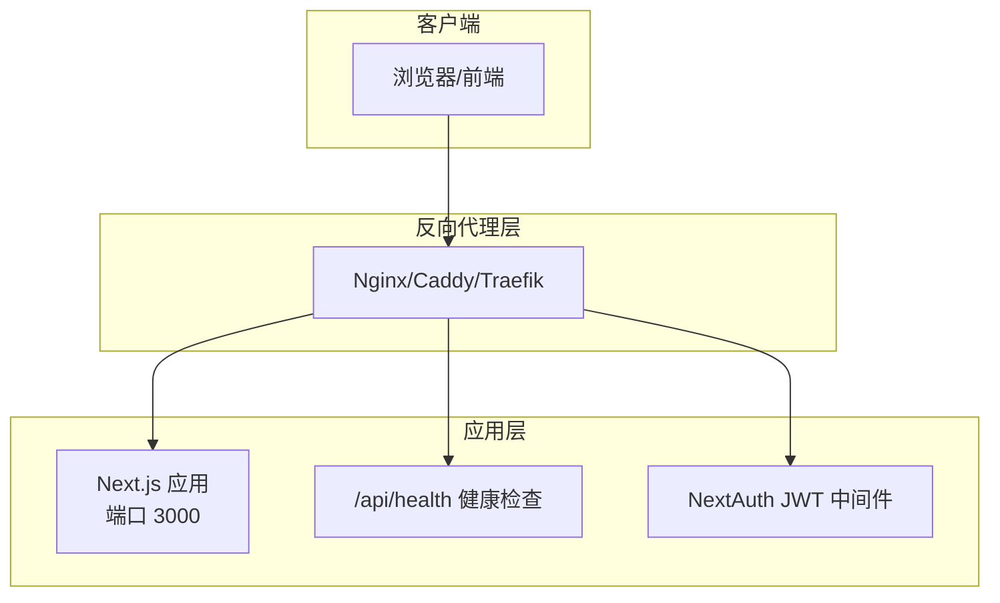
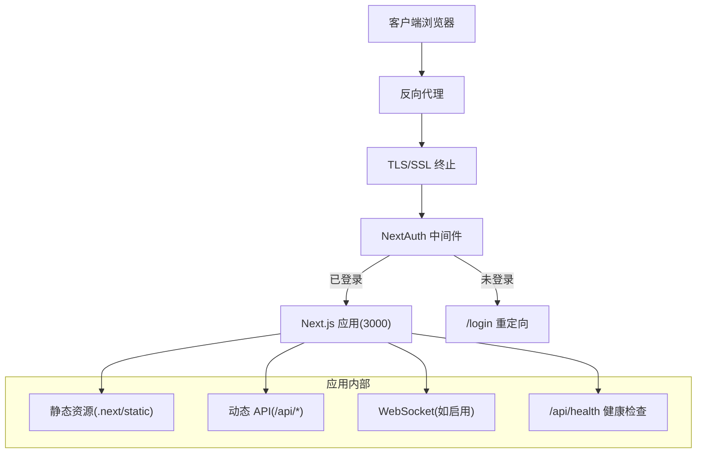
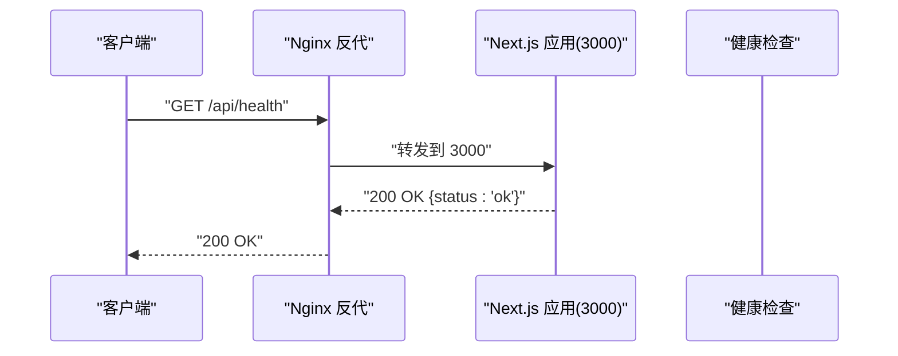
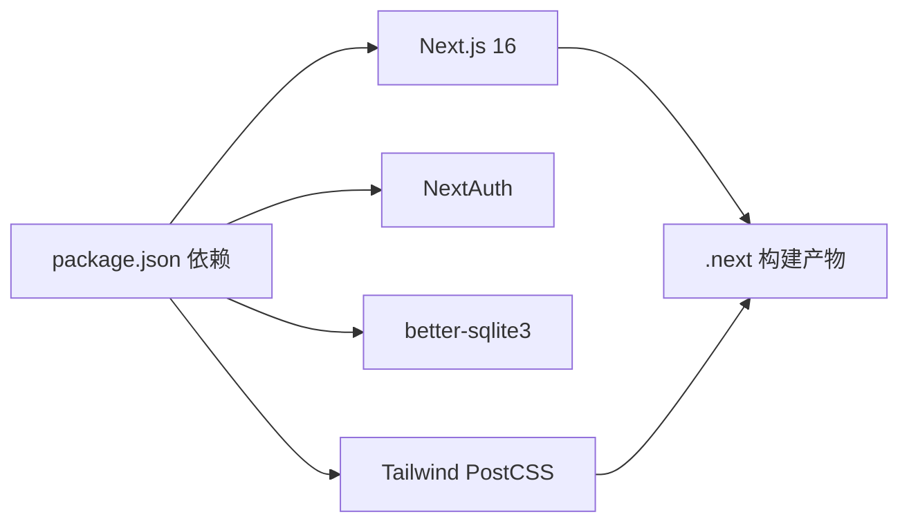

# 反向代理配置

<cite>
**本文引用的文件**
- [package.json](file://package.json)
- [next.config.ts](file://next.config.ts)
- [docker-compose.yml](file://docker-compose.yml)
- [Dockerfile](file://Dockerfile)
- [src/lib/config.ts](file://src/lib/config.ts)
- [src/middleware.ts](file://src/middleware.ts)
- [src/lib/auth.config.ts](file://src/lib/auth.config.ts)
- [src/app/api/health/route.ts](file://src/app/api/health/route.ts)
- [src/app/api/chat/route.ts](file://src/app/api/chat/route.ts)
- [src/components/settings/reverse-proxy.tsx](file://src/components/settings/reverse-proxy.tsx)
- [postcss.config.mjs](file://postcss.config.mjs)
- [tsconfig.json](file://tsconfig.json)
</cite>

## 目录
1. [简介](#简介)
2. [项目结构](#项目结构)
3. [核心组件](#核心组件)
4. [架构总览](#架构总览)
5. [详细组件分析](#详细组件分析)
6. [依赖分析](#依赖分析)
7. [性能考虑](#性能考虑)
8. [故障排查指南](#故障排查指南)
9. [结论](#结论)
10. [附录](#附录)

## 简介
本文件面向 SillyTavern Next 的部署与运维团队，提供在生产环境中通过主流反向代理（Nginx、Caddy、Traefik）进行反向代理、SSL/TLS 终止、域名绑定、HTTPS 强制跳转、WebSocket 代理、静态资源缓存与压缩、负载均衡与健康检查、安全加固与访问控制、以及性能优化的完整实践指南。文档基于仓库中的配置与运行时行为进行提炼，并给出可直接落地的配置要点与最佳实践。

## 项目结构
SillyTavern Next 采用 Next.js 16 应用框架，容器化运行于 3000 端口，支持健康检查端点与多种认证方式。其核心运行参数与暴露端口如下：
- 应用监听端口：3000（容器内）
- 健康检查端点：GET /api/health（无需鉴权）
- 认证与中间件：NextAuth（JWT）、路由中间件强制登录
- 静态资源：由 Next.js 生成并托管，PostCSS 与 Tailwind 配置参与构建

图表来源
- [docker-compose.yml:31-37](file://docker-compose.yml#L31-L37)
- [src/app/api/health/route.ts:1-10](file://src/app/api/health/route.ts#L1-L10)
- [src/middleware.ts:1-35](file://src/middleware.ts#L1-L35)
- [src/lib/auth.config.ts:1-53](file://src/lib/auth.config.ts#L1-L53)

章节来源
- [docker-compose.yml:10-37](file://docker-compose.yml#L10-L37)
- [Dockerfile:25-29](file://Dockerfile#L25-L29)
- [next.config.ts:1-14](file://next.config.ts#L1-L14)

## 核心组件
- 运行时与端口
  - 应用以“独立可执行”模式打包，容器内监听 3000 端口，支持通过环境变量覆盖端口与主机地址。
- 健康检查
  - 提供公开的 /api/health 端点，返回服务状态，便于容器编排与外部监控系统探测。
- 认证与访问控制
  - 使用 NextAuth（JWT）进行会话管理，中间件对除登录、认证与健康检查外的路径进行强制登录拦截。
- 配置体系
  - 支持 YAML 配置文件与环境变量覆盖，涵盖网络、安全、CORS、SSO、AI 默认设置等。
- 反向代理与连接管理
  - 前端提供“反向代理”预设管理界面，允许为不同模型提供商配置代理 URL 与可选密码，便于对接企业级网关或自建代理服务。

章节来源
- [Dockerfile:25-29](file://Dockerfile#L25-L29)
- [src/app/api/health/route.ts:1-10](file://src/app/api/health/route.ts#L1-L10)
- [src/middleware.ts:1-35](file://src/middleware.ts#L1-L35)
- [src/lib/auth.config.ts:1-53](file://src/lib/auth.config.ts#L1-L53)
- [src/lib/config.ts:1-184](file://src/lib/config.ts#L1-L184)
- [src/components/settings/reverse-proxy.tsx:1-107](file://src/components/settings/reverse-proxy.tsx#L1-L107)

## 架构总览
以下图展示反向代理在整体架构中的位置与交互关系，包括 HTTPS 终止、认证放行、静态资源与动态请求分流、以及健康检查与负载均衡。

图表来源
- [src/middleware.ts:8-30](file://src/middleware.ts#L8-L30)
- [src/app/api/health/route.ts:1-10](file://src/app/api/health/route.ts#L1-L10)
- [next.config.ts:4-10](file://next.config.ts#L4-L10)

## 详细组件分析

### Nginx 反向代理配置要点
- 基本代理
  - 将域名请求转发至应用容器的 3000 端口，保持 Host 与 X-Forwarded-* 头以便应用识别真实来源。
- HTTPS 与证书
  - 使用 ACME Let’s Encrypt 或自有证书，开启 TLS v1.2+/TLSv1.3，启用 HSTS（严格传输安全）。
- 强制 HTTPS
  - 在反代层添加 80->443 重定向规则，确保所有流量走 HTTPS。
- 静态资源缓存与压缩
  - 对 .next/static 下的静态资源设置长缓存与 ETag/Last-Modified，启用 gzip/br 压缩。
- 动态请求与 WebSocket
  - 将 /api/* 与 WebSocket 路径（如 /api/chat/stream 或前端实际使用的 ws 路径）升级为 WebSocket，设置超时与缓冲区。
- 健康检查
  - 配置 Nginx upstream 健检，探测 /api/health，结合 fail_timeout 与 max_fails 实现故障转移。
- 安全加固
  - 限制请求体大小、速率限制、IP 白名单、CORS 控制、X-Frame-Options、X-Content-Type-Options、Referrer-Policy 等。

图表来源
- [docker-compose.yml:31-37](file://docker-compose.yml#L31-L37)
- [src/app/api/health/route.ts:1-10](file://src/app/api/health/route.ts#L1-L10)

章节来源
- [docker-compose.yml:31-37](file://docker-compose.yml#L31-L37)
- [src/app/api/health/route.ts:1-10](file://src/app/api/health/route.ts#L1-L10)

### Caddy 反向代理配置要点
- 自动 HTTPS
  - 使用 Caddy 的自动证书颁发与 HTTPS，减少证书管理复杂度。
- 路由与上游
  - 将 /api/* 与静态资源路径映射到 3000 端口，保留 X-Forwarded-* 与真实 IP。
- 压缩与缓存
  - 启用 gzip/deflate/br 压缩，对静态资源设置缓存策略。
- WebSocket
  - 明确升级 WebSocket 协议，设置合适的超时与缓冲。
- 健康检查
  - 使用 Caddy 的健康检查指令探测 /api/health，配合 fail 与 retry 策略。
- 安全
  - 通过 Caddyfile 配置安全头、速率限制、限流与白名单。

章节来源
- [docker-compose.yml:31-37](file://docker-compose.yml#L31-L37)
- [src/app/api/health/route.ts:1-10](file://src/app/api/health/route.ts#L1-L10)

### Traefik 反向代理配置要点
- 服务发现与入口
  - 通过 Docker 标签或静态配置将服务暴露给 Traefik，设置 entrypoints（http/https）。
- 中间件
  - 启用 HTTPS 强制跳转、gzip 压缩、速率限制、IP 白名单、CORS、安全头等中间件。
- 路由规则
  - 为 /api/* 与静态资源设置路由，匹配服务名并转发至 3000 端口。
- 健康检查与故障转移
  - 利用 Traefik 的健康检查与负载均衡，结合 /api/health 实现自动故障转移。
- WebSocket
  - 配置 WebSocket 升级与长连接超时。

章节来源
- [docker-compose.yml:31-37](file://docker-compose.yml#L31-L37)
- [src/app/api/health/route.ts:1-10](file://src/app/api/health/route.ts#L1-L10)

### WebSocket 代理与长连接
- 应用侧
  - Chat API 使用流式文本输出，前端可能通过 WebSocket 或 Server-Sent Events 进行实时交互（具体取决于前端实现）。应用未内置 WebSocket 路由，但具备流式响应能力。
- 反代侧
  - 需要明确升级 WebSocket 协议，设置较长超时时间与大缓冲区，避免代理层中断长连接。
- 建议
  - 在反代层为 /api/chat 或前端实际使用的 ws 路径开启 upgrade，并确保 keepalive 与心跳机制合理配置。

章节来源
- [src/app/api/chat/route.ts:158-170](file://src/app/api/chat/route.ts#L158-L170)

### 静态资源缓存与压缩
- Next.js 生成的静态资源位于 .next/static，应设置长期缓存与强缓存策略，同时启用 gzip/br 压缩。
- 建议
  - 对 .next/static/* 设置 Cache-Control: public,max-age=31536000,immutable；
  - 对 HTML/CSS/JS 开启 br/gzip 压缩，合理设置 ETag/Last-Modified。

章节来源
- [next.config.ts:4-10](file://next.config.ts#L4-L10)
- [postcss.config.mjs:1-8](file://postcss.config.mjs#L1-L8)

### 负载均衡、健康检查与故障转移
- 健康检查端点
  - /api/health 返回 { status: "ok" }，适合用于容器编排与反代的健康检查。
- 负载均衡
  - 在反代层配置多个上游实例（多副本容器），结合健康检查与权重实现故障转移。
- 故障转移
  - 当某个实例连续多次健康检查失败时，自动摘除该节点，直到恢复。

章节来源
- [docker-compose.yml:31-37](file://docker-compose.yml#L31-L37)
- [src/app/api/health/route.ts:1-10](file://src/app/api/health/route.ts#L1-L10)

### 安全配置与访问控制
- 认证与会话
  - NextAuth 使用 JWT，中间件强制登录，/api/auth、/login 与 /api/health 为公开端点。
- CORS 与跨域
  - 通过配置文件与环境变量控制 CORS 行为，谨慎设置允许来源、方法、头与凭据。
- SSO 与可信代理
  - 支持 Authelia/Authentik 等 SSO，可配置可信代理列表以正确解析客户端真实 IP。
- 基础认证与白名单
  - 支持基本认证模式与 IP 白名单，可用于开发或受限环境。
- 反向代理侧
  - 限制请求体大小、速率限制、IP 白名单、安全头、HSTS、CSP 等。

章节来源
- [src/middleware.ts:8-30](file://src/middleware.ts#L8-L30)
- [src/lib/auth.config.ts:17-47](file://src/lib/auth.config.ts#L17-L47)
- [src/lib/config.ts:7-55](file://src/lib/config.ts#L7-L55)

### 反向代理预设与连接管理
- 前端提供“反向代理”预设管理，允许为不同模型提供商配置代理 URL 与可选密码，便于对接企业网关或自建代理服务。
- 建议
  - 在反代层统一处理代理鉴权与超时，确保与前端预设一致。

章节来源
- [src/components/settings/reverse-proxy.tsx:1-107](file://src/components/settings/reverse-proxy.tsx#L1-L107)

## 依赖分析
- 运行时依赖
  - Next.js 16、NextAuth、better-sqlite3、Tailwind PostCSS 等。
- 构建与打包
  - 使用 standalone 输出，PostCSS 与 Tailwind 参与构建流程。
- 容器化
  - Dockerfile 多阶段构建，ENTRYPOINT 使用 tini，暴露 3000 端口，支持健康检查。

图表来源
- [package.json:18-46](file://package.json#L18-L46)
- [postcss.config.mjs:1-8](file://postcss.config.mjs#L1-L8)
- [tsconfig.json:1-35](file://tsconfig.json#L1-L35)

章节来源
- [package.json:18-46](file://package.json#L18-L46)
- [Dockerfile:10-18](file://Dockerfile#L10-L18)
- [Dockerfile:35-38](file://Dockerfile#L35-L38)
- [tsconfig.json:1-35](file://tsconfig.json#L1-L35)

## 性能考虑
- 静态资源
  - 将 .next/static 缓存与压缩策略最大化利用，减少带宽与延迟。
- 流式响应
  - Chat API 使用流式文本输出，反代层需支持长连接与低延迟转发。
- 健康检查与探活
  - 合理设置探活间隔与超时，避免误判与抖动。
- 压缩与缓存
  - 启用 br/gzip，对 HTML/CSS/JS 与图片等资源分别设置缓存策略。
- 资源体积与构建
  - TypeScript 严格模式与 Bundler 解析有助于减小包体与提升构建稳定性。

章节来源
- [src/app/api/chat/route.ts:158-170](file://src/app/api/chat/route.ts#L158-L170)
- [next.config.ts:4-10](file://next.config.ts#L4-L10)
- [postcss.config.mjs:1-8](file://postcss.config.mjs#L1-L8)

## 故障排查指南
- 健康检查失败
  - 检查 /api/health 是否可达，确认反代层是否正确转发至 3000 端口，核对容器日志与探活配置。
- 登录与会话异常
  - 确认 NextAuth JWT 配置、Cookie 策略与反代层的 X-Forwarded-* 头是否正确传递。
- CORS 错误
  - 检查配置文件与环境变量中 CORS 设置，确保允许来源、方法与头正确。
- WebSocket 断开
  - 检查反代层 WebSocket 升级配置、超时与缓冲区设置，确认前端 ws 路径与应用一致。
- 静态资源 404 或缓存问题
  - 确认 .next/static 是否被正确映射与缓存，检查缓存头与压缩配置。

章节来源
- [docker-compose.yml:31-37](file://docker-compose.yml#L31-L37)
- [src/app/api/health/route.ts:1-10](file://src/app/api/health/route.ts#L1-L10)
- [src/middleware.ts:8-30](file://src/middleware.ts#L8-L30)
- [src/lib/auth.config.ts:17-47](file://src/lib/auth.config.ts#L17-L47)
- [src/lib/config.ts:24-33](file://src/lib/config.ts#L24-L33)

## 结论
通过在反向代理层完成 TLS 终止、HTTPS 强制跳转、静态资源缓存与压缩、WebSocket 升级、健康检查与负载均衡，结合应用侧的 NextAuth 与健康检查端点，SillyTavern Next 可以在生产环境中实现高可用、高性能与高安全性的部署。建议根据业务规模选择 Nginx、Caddy 或 Traefik，并结合容器编排平台实现自动扩缩容与故障转移。

## 附录
- 关键端口与路径
  - 应用端口：3000
  - 健康检查：/api/health
  - 认证相关：/api/auth/*、/login
  - 动态 API：/api/*
  - 静态资源：.next/static/*
- 配置参考
  - 环境变量与配置文件：参考配置加载与验证逻辑，确保 CORS、SSO、安全策略与 AI 默认设置正确生效。

章节来源
- [Dockerfile:25-29](file://Dockerfile#L25-L29)
- [src/app/api/health/route.ts:1-10](file://src/app/api/health/route.ts#L1-L10)
- [src/middleware.ts:12-20](file://src/middleware.ts#L12-L20)
- [src/lib/config.ts:66-83](file://src/lib/config.ts#L66-L83)