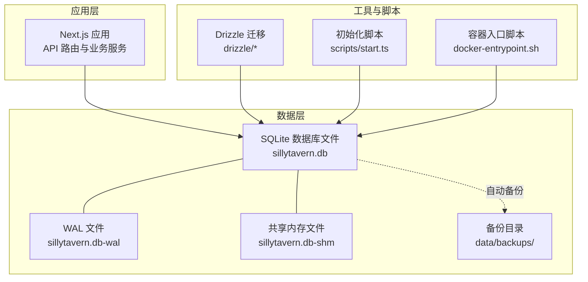
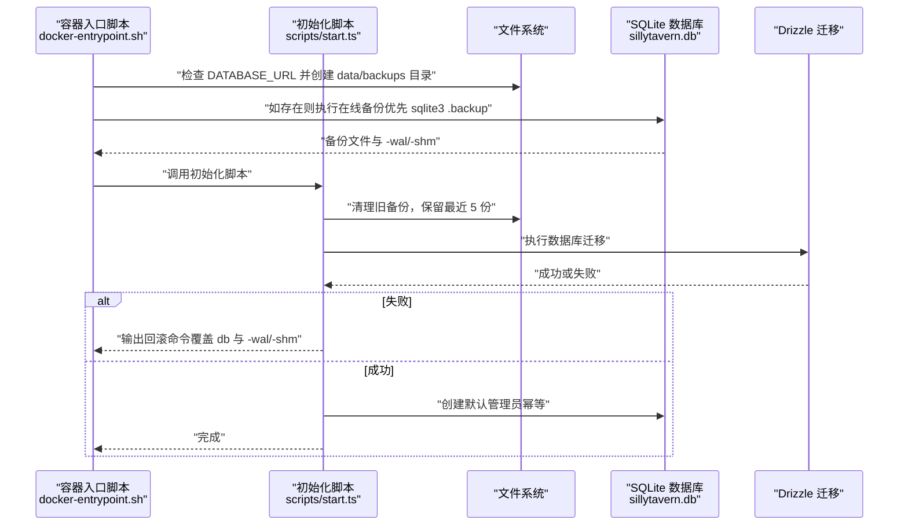
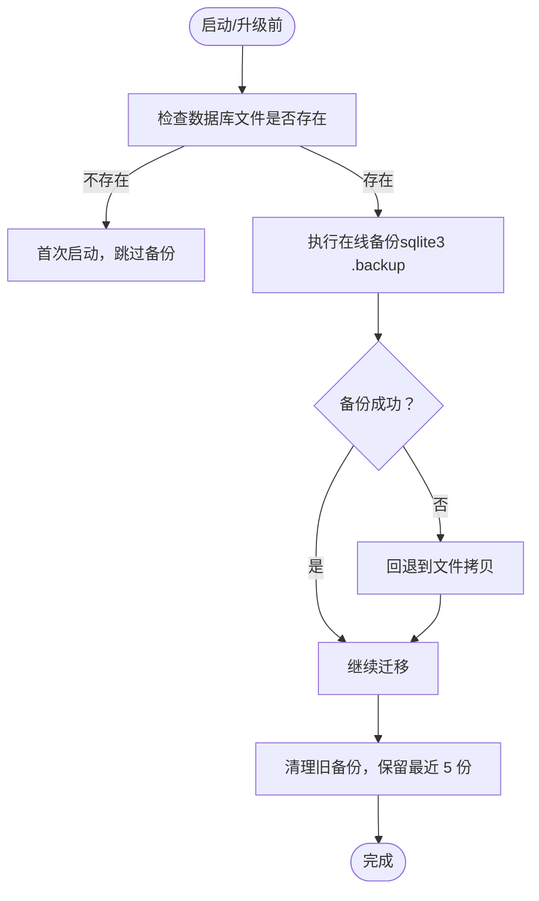
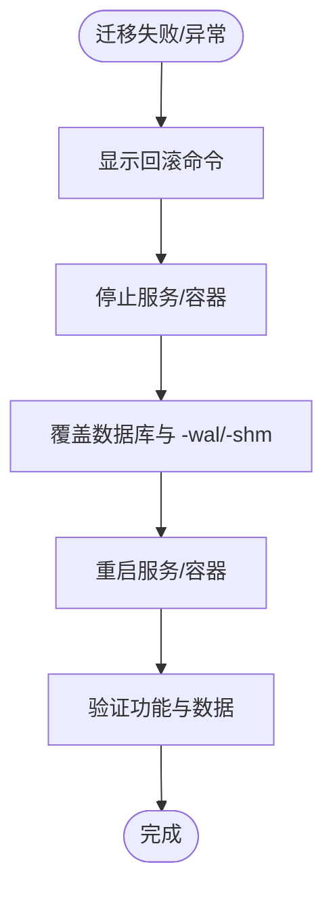
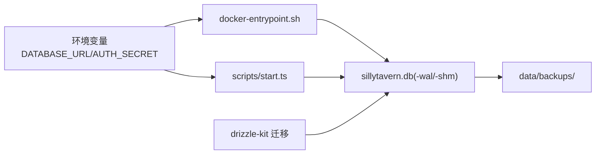

# 备份与恢复

<cite>
**本文引用的文件**
- [package.json](file://package.json)
- [README.md](file://README.md)
- [drizzle.config.ts](file://drizzle.config.ts)
- [docker-entrypoint.sh](file://docker-entrypoint.sh)
- [scripts/start.ts](file://scripts/start.ts)
- [scripts/seed.ts](file://scripts/seed.ts)
- [src/lib/db/schema.ts](file://src/lib/db/schema.ts)
- [src/app/api/characters/import/route.ts](file://src/app/api/characters/import/route.ts)
- [src/app/api/worldinfo/import/route.ts](file://src/app/api/worldinfo/import/route.ts)
</cite>

## 目录
1. [简介](#简介)
2. [项目结构](#项目结构)
3. [核心组件](#核心组件)
4. [架构总览](#架构总览)
5. [详细组件分析](#详细组件分析)
6. [依赖关系分析](#依赖关系分析)
7. [性能考量](#性能考量)
8. [故障排查指南](#故障排查指南)
9. [结论](#结论)
10. [附录](#附录)

## 简介
本文件面向 SillyTavern Next 的运维与开发人员，提供一套完整的“备份与恢复”方案。内容涵盖数据备份策略、备份频率与存储位置配置，SQLite 数据库备份、配置文件备份与用户数据保护，灾难恢复流程、数据完整性验证与恢复测试，以及增量备份、异地备份与自动化备份脚本的实施建议。同时给出备份最佳实践、恢复演练与数据安全策略，帮助在升级、迁移或意外故障时快速、安全地恢复系统。

## 项目结构
SillyTavern Next 使用 SQLite 作为本地单文件数据库，并通过 Drizzle ORM 管理迁移。应用通过环境变量 DATABASE_URL 指定数据库路径，默认位于 data/sillytavern.db。容器部署时，数据卷需挂载到 /app/data，以便持久化存储与备份。

图表来源
- [drizzle.config.ts:1-11](file://drizzle.config.ts#L1-L11)
- [scripts/start.ts:1-96](file://scripts/start.ts#L1-L96)
- [docker-entrypoint.sh:1-70](file://docker-entrypoint.sh#L1-L70)

章节来源
- [README.md:150-204](file://README.md#L150-L204)
- [drizzle.config.ts:1-11](file://drizzle.config.ts#L1-L11)

## 核心组件
- 数据库与迁移
  - 数据库：SQLite 单文件（默认 data/sillytavern.db），配合 WAL 模式提升并发读写性能。
  - 迁移：使用 Drizzle Kit 管理数据库结构演进，迁移脚本在启动阶段自动执行。
- 自动备份与回滚
  - 容器入口脚本与初始化脚本在迁移前自动备份数据库，保留最近 5 份，命名含时间戳。
  - WAL/共享内存文件同步备份，确保一致性。
- 配置与环境
  - DATABASE_URL 控制数据库路径；AUTH_SECRET 为 NextAuth 签名密钥，必须强随机。
- 数据模型
  - 用户、角色卡、聊天、消息、世界书、预设、密钥、设置等核心表，支撑用户数据自治与可移植性。

章节来源
- [README.md:62-74](file://README.md#L62-L74)
- [README.md:160-204](file://README.md#L160-L204)
- [src/lib/db/schema.ts:1-240](file://src/lib/db/schema.ts#L1-L240)

## 架构总览
下图展示启动时的自动备份与迁移流程，以及回滚路径。

图表来源
- [docker-entrypoint.sh:25-66](file://docker-entrypoint.sh#L25-L66)
- [scripts/start.ts:24-96](file://scripts/start.ts#L24-L96)

## 详细组件分析

### 数据库备份策略
- 备份触发时机
  - 容器启动与本地初始化均在迁移前进行备份。
- 备份内容
  - 主库文件：sillytavern.db
  - WAL 文件：sillytavern.db-wal（若存在）
  - 共享内存文件：sillytavern.db-shm（若存在）
- 备份命名与保留
  - 命名包含时间戳，便于检索与回滚。
  - 默认保留最近 5 份，超出按修改时间删除最旧备份。
- 备份方法
  - 优先使用 sqlite3 的 .backup 命令进行在线备份，保证一致性。
  - 若未安装 sqlite3，则回退到文件拷贝（WAL 文件会随 checkpoint 一并备份）。

图表来源
- [docker-entrypoint.sh:35-46](file://docker-entrypoint.sh#L35-L46)
- [scripts/start.ts:26-62](file://scripts/start.ts#L26-L62)

章节来源
- [docker-entrypoint.sh:25-49](file://docker-entrypoint.sh#L25-L49)
- [scripts/start.ts:24-62](file://scripts/start.ts#L24-L62)
- [README.md:199-204](file://README.md#L199-L204)

### 配置文件备份与用户数据保护
- 配置文件
  - .env/.env.local：包含 AUTH_SECRET、DATABASE_URL 等关键配置。
  - 建议将 .env/.env.local 与 data/ 目录分开备份，防止密钥泄露。
- 用户数据保护
  - 用户密码采用盐值与派生算法存储，API Key 存储于 secrets 表并按用户隔离。
  - 角色卡与世界书支持 PNG/JSON 双向导入导出，便于离线备份与迁移。
  - 密钥与敏感设置通过数据库加密隔离，降低泄露风险。

章节来源
- [README.md:62-74](file://README.md#L62-L74)
- [src/lib/db/schema.ts:6-16](file://src/lib/db/schema.ts#L6-L16)
- [src/lib/db/schema.ts:201-207](file://src/lib/db/schema.ts#L201-L207)
- [src/app/api/characters/import/route.ts:1-90](file://src/app/api/characters/import/route.ts#L1-L90)
- [src/app/api/worldinfo/import/route.ts:1-41](file://src/app/api/worldinfo/import/route.ts#L1-L41)

### 灾难恢复流程
- 回滚路径
  - 容器场景：停止容器，复制最新备份到数据库文件与 WAL/共享内存文件，重启容器。
  - 本地开发场景：直接覆盖 data/sillytavern.db 与其 -wal/-shm 文件。
- 恢复验证
  - 启动后检查用户登录、角色卡与聊天记录是否可用。
  - 对比备份时间戳与恢复后数据变更，确认完整性。
- 失败处理
  - 若迁移失败，脚本会输出回滚命令；请严格按命令执行，避免手动拼接路径错误。

图表来源
- [docker-entrypoint.sh:53-66](file://docker-entrypoint.sh#L53-L66)
- [scripts/start.ts:70-83](file://scripts/start.ts#L70-L83)

章节来源
- [README.md:186-198](file://README.md#L186-L198)
- [docker-entrypoint.sh:53-66](file://docker-entrypoint.sh#L53-L66)
- [scripts/start.ts:70-96](file://scripts/start.ts#L70-L96)

### 数据完整性验证与恢复测试
- 完整性验证
  - 备份后检查备份文件大小与时间戳，确认 WAL/共享内存文件同步备份。
  - 恢复后执行基础查询（如列出用户、角色卡、聊天数）验证数据可用性。
- 恢复测试
  - 定期在测试环境中执行“备份 → 迁移 → 回滚”的全流程演练。
  - 测试不同场景：空数据库、部分数据、WAL 文件存在与否。

章节来源
- [scripts/start.ts:38-62](file://scripts/start.ts#L38-L62)
- [docker-entrypoint.sh:37-41](file://docker-entrypoint.sh#L37-L41)

### 增量备份、异地备份与自动化脚本
- 增量备份
  - 当前实现为全量备份（数据库文件与 WAL/共享内存）。若需真正增量，可在应用层导出 JSON（角色卡、世界书、预设等）实现逻辑增量。
- 异地备份
  - 将 data/ 目录整体复制到外部存储（对象存储、NAS 等），并定期校验。
- 自动化脚本
  - 容器入口脚本与初始化脚本已内置自动备份与回滚提示。
  - 可结合系统定时任务（如 cron）实现周期性全量备份与异地同步。

章节来源
- [README.md:160-175](file://README.md#L160-L175)
- [scripts/start.ts:14-16](file://scripts/start.ts#L14-L16)
- [docker-entrypoint.sh:26-28](file://docker-entrypoint.sh#L26-L28)

## 依赖关系分析
- 备份链路依赖
  - DATABASE_URL 决定数据库路径，影响备份与恢复目标。
  - sqlite3 命令用于在线备份，若不可用则回退到文件拷贝。
  - WAL/共享内存文件需与主库文件同步备份，否则恢复可能不一致。
- 迁移与备份耦合
  - 迁移前备份，迁移失败时可快速回滚至上一个稳定版本。
- 配置与安全
  - AUTH_SECRET 必须强随机，建议单独备份与轮换。
  - secrets 表中的 API Key 按用户隔离，建议定期轮换并限制权限。

图表来源
- [drizzle.config.ts:7-9](file://drizzle.config.ts#L7-L9)
- [docker-entrypoint.sh:26-28](file://docker-entrypoint.sh#L26-L28)
- [scripts/start.ts:14-16](file://scripts/start.ts#L14-L16)

章节来源
- [drizzle.config.ts:1-11](file://drizzle.config.ts#L1-L11)
- [README.md:62-74](file://README.md#L62-L74)

## 性能考量
- WAL 模式
  - 提升并发读写性能，但需同步备份 -wal 与 -shm 文件，确保恢复一致性。
- 备份窗口
  - sqlite3 .backup 在线备份几乎无锁，适合生产环境；若回退到文件拷贝，需短暂停机或只读。
- 备份频率
  - 建议在每次重大升级前自动备份；日常可结合业务低峰期进行周期性全量备份。

章节来源
- [README.md:199-204](file://README.md#L199-L204)
- [docker-entrypoint.sh:35-41](file://docker-entrypoint.sh#L35-L41)

## 故障排查指南
- 备份失败
  - 检查 data/backups 权限与磁盘空间；确认 sqlite3 是否可用。
  - 查看容器/初始化脚本输出的回滚命令，按提示执行。
- 迁移失败
  - 根据脚本输出的回滚命令覆盖数据库与 WAL/共享内存文件，然后重启服务。
- 数据不一致
  - 确认备份时 WAL/共享内存文件是否一并备份；必要时重新执行在线备份。
- 密钥丢失
  - AUTH_SECRET 与 API Key 分别存储于 .env 与数据库，需分别恢复。

章节来源
- [docker-entrypoint.sh:53-66](file://docker-entrypoint.sh#L53-L66)
- [scripts/start.ts:70-83](file://scripts/start.ts#L70-L83)
- [README.md:186-198](file://README.md#L186-L198)

## 结论
SillyTavern Next 提供了完善的自动备份与回滚机制，结合 WAL/共享内存文件的同步备份，能够有效保障升级与运行过程中的数据安全。建议在现有基础上增加异地备份与周期性全量备份演练，完善灾难恢复预案，并持续优化备份与恢复流程的自动化与可审计性。

## 附录
- 常用命令与路径
  - 数据库路径：默认 data/sillytavern.db，可通过 DATABASE_URL 修改。
  - 备份目录：data/backups/，默认保留最近 5 份。
  - 初始化与迁移：npm run setup 或容器入口脚本。
- 最佳实践清单
  - 强制启用 WAL 模式并同步备份 -wal/-shm。
  - 将 .env/.env.local 与 data/ 目录分开备份，密钥单独加密存储。
  - 定期进行恢复演练，验证备份文件可用性与数据一致性。
  - 对外提供角色卡与世界书的 JSON 导出，作为逻辑增量备份手段。

章节来源
- [README.md:160-204](file://README.md#L160-L204)
- [package.json:6-16](file://package.json#L6-L16)
- [drizzle.config.ts:7-9](file://drizzle.config.ts#L7-L9)