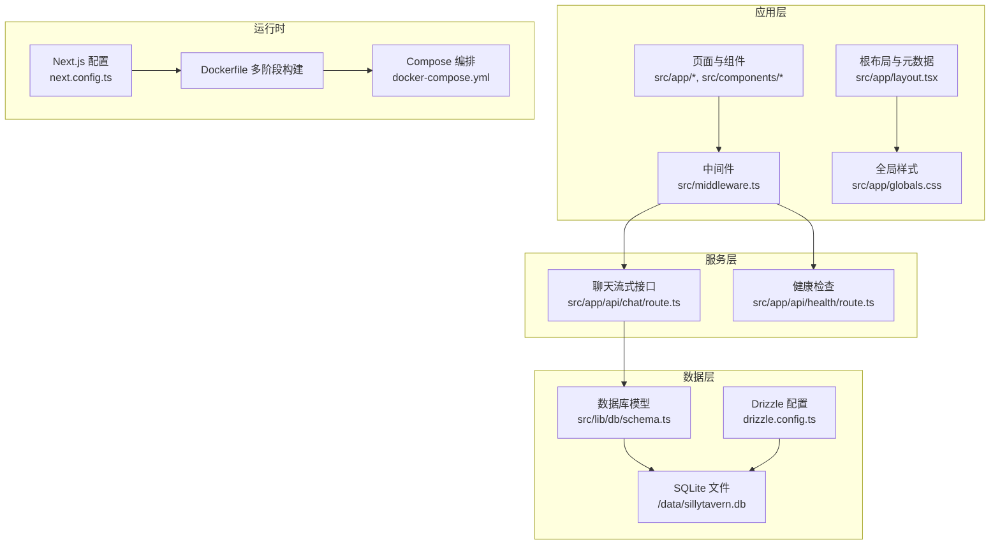
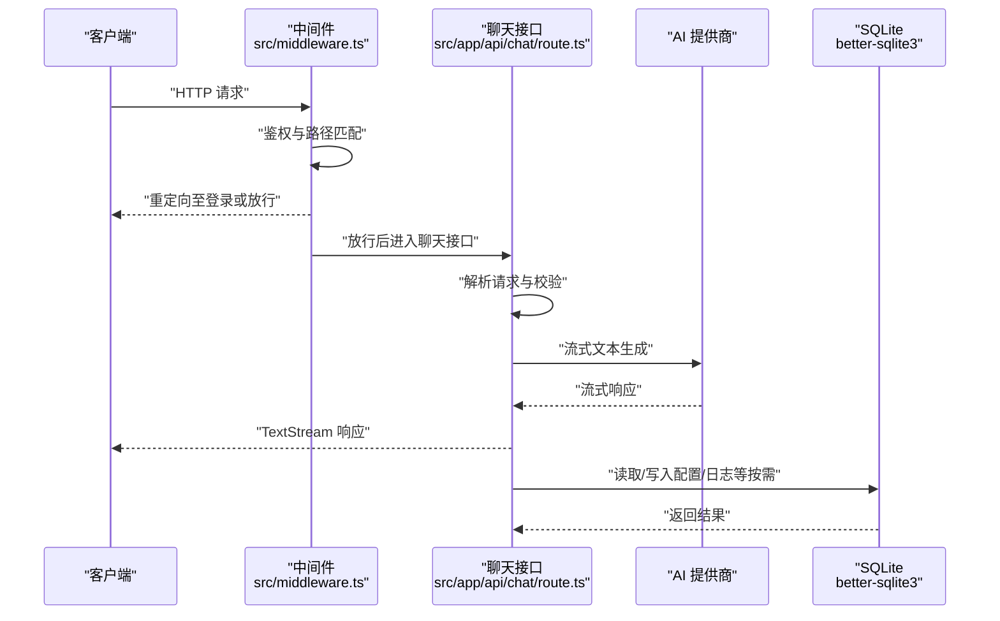
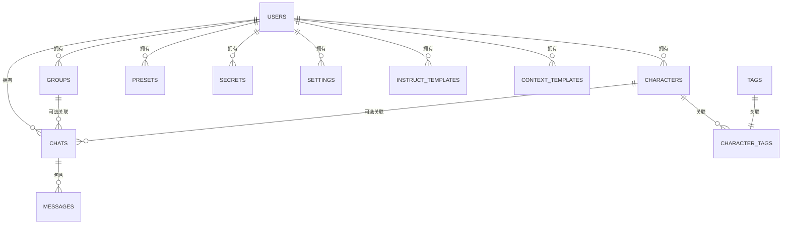
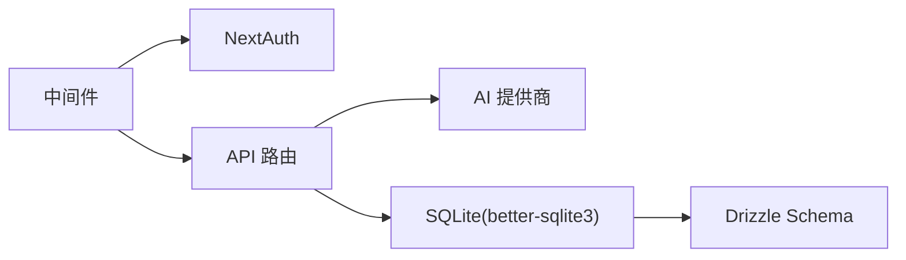

# 性能优化

<cite>
**本文引用的文件**
- [package.json](file://package.json)
- [next.config.ts](file://next.config.ts)
- [drizzle.config.ts](file://drizzle.config.ts)
- [Dockerfile](file://Dockerfile)
- [docker-compose.yml](file://docker-compose.yml)
- [src/lib/config.ts](file://src/lib/config.ts)
- [src/lib/db/schema.ts](file://src/lib/db/schema.ts)
- [src/middleware.ts](file://src/middleware.ts)
- [src/app/layout.tsx](file://src/app/layout.tsx)
- [src/app/globals.css](file://src/app/globals.css)
- [src/lib/utils.ts](file://src/lib/utils.ts)
- [scripts/seed.ts](file://scripts/seed.ts)
- [src/app/api/health/route.ts](file://src/app/api/health/route.ts)
- [src/app/api/chat/route.ts](file://src/app/api/chat/route.ts)
</cite>

## 目录
1. [简介](#简介)
2. [项目结构](#项目结构)
3. [核心组件](#核心组件)
4. [架构总览](#架构总览)
5. [详细组件分析](#详细组件分析)
6. [依赖关系分析](#依赖关系分析)
7. [性能考量](#性能考量)
8. [故障排查指南](#故障排查指南)
9. [结论](#结论)
10. [附录](#附录)

## 简介
本文件面向 SillyTavern Next 的性能优化，聚焦以下方面：
- Next.js 应用性能优化、缓存策略与资源压缩配置
- 数据库性能调优、索引与查询优化
- 容器资源限制、内存管理与并发处理
- CDN 配置、静态资源优化与响应时间优化
- 性能基准测试、瓶颈分析与优化建议

## 项目结构
SillyTavern Next 采用 Next.js 16 应用，结合 Drizzle ORM 使用 SQLite（better-sqlite3）作为数据存储，并通过 Docker 多阶段构建进行生产部署。前端样式基于 TailwindCSS，中间件负责认证拦截，健康检查端点便于容器编排与监控。

**图表来源**
- [src/middleware.ts:1-35](file://src/middleware.ts#L1-L35)
- [src/app/api/chat/route.ts:1-177](file://src/app/api/chat/route.ts#L1-L177)
- [src/app/api/health/route.ts:1-10](file://src/app/api/health/route.ts#L1-L10)
- [src/lib/db/schema.ts:1-240](file://src/lib/db/schema.ts#L1-L240)
- [drizzle.config.ts:1-11](file://drizzle.config.ts#L1-L11)
- [next.config.ts:1-14](file://next.config.ts#L1-L14)
- [Dockerfile:1-63](file://Dockerfile#L1-L63)
- [docker-compose.yml:1-37](file://docker-compose.yml#L1-L37)
- [src/app/layout.tsx:1-24](file://src/app/layout.tsx#L1-L24)
- [src/app/globals.css:1-79](file://src/app/globals.css#L1-L79)

**章节来源**
- [package.json:1-61](file://package.json#L1-L61)
- [next.config.ts:1-14](file://next.config.ts#L1-L14)
- [drizzle.config.ts:1-11](file://drizzle.config.ts#L1-L11)
- [Dockerfile:1-63](file://Dockerfile#L1-L63)
- [docker-compose.yml:1-37](file://docker-compose.yml#L1-L37)
- [src/lib/db/schema.ts:1-240](file://src/lib/db/schema.ts#L1-L240)
- [src/middleware.ts:1-35](file://src/middleware.ts#L1-L35)
- [src/app/api/chat/route.ts:1-177](file://src/app/api/chat/route.ts#L1-L177)
- [src/app/api/health/route.ts:1-10](file://src/app/api/health/route.ts#L1-L10)
- [src/app/layout.tsx:1-24](file://src/app/layout.tsx#L1-L24)
- [src/app/globals.css:1-79](file://src/app/globals.css#L1-L79)

## 核心组件
- Next.js 配置与构建输出
  - 使用独立可执行输出（standalone），减少运行时依赖打包体积，利于容器部署与启动速度。
  - 允许较大的服务器动作请求体（50MB），满足大模型流式传输与复杂提示场景。
  - 将 better-sqlite3 标记为外部包，避免被 Next.js 打包器处理，确保二进制模块在运行时正确加载。
- 数据库与迁移
  - Drizzle ORM + SQLite，schema 定义集中于单文件，便于维护与迁移追踪。
  - 通过 drizzle.config.ts 指定 schema 位置与数据库连接字符串（默认 data 目录下的 SQLite 文件）。
- 中间件与认证
  - NextAuth 集成中间件，对受保护路由进行登录校验，减少无效请求进入业务逻辑。
  - 匹配器排除静态资源与登录相关路径，降低中间件开销。
- 健康检查
  - 无状态、无鉴权的健康检查端点，便于容器编排与外部监控系统探测。
- 聊天流式接口
  - 基于 ai SDK 的流式文本生成，支持多提供商与自定义 API，返回流式响应以缩短首字节时间。
- 容器与编排
  - 多阶段构建，生产镜像仅包含必要运行时与静态资源，减小镜像体积。
  - Compose 健康检查与端口映射，便于部署与运维。

**章节来源**
- [next.config.ts:1-14](file://next.config.ts#L1-L14)
- [drizzle.config.ts:1-11](file://drizzle.config.ts#L1-L11)
- [src/lib/db/schema.ts:1-240](file://src/lib/db/schema.ts#L1-L240)
- [src/middleware.ts:1-35](file://src/middleware.ts#L1-L35)
- [src/app/api/health/route.ts:1-10](file://src/app/api/health/route.ts#L1-L10)
- [src/app/api/chat/route.ts:1-177](file://src/app/api/chat/route.ts#L1-L177)
- [Dockerfile:1-63](file://Dockerfile#L1-L63)
- [docker-compose.yml:1-37](file://docker-compose.yml#L1-L37)

## 架构总览
下图展示从浏览器到数据库的典型请求链路，以及关键性能控制点：

**图表来源**
- [src/middleware.ts:1-35](file://src/middleware.ts#L1-L35)
- [src/app/api/chat/route.ts:1-177](file://src/app/api/chat/route.ts#L1-L177)

## 详细组件分析

### Next.js 应用性能优化
- 构建与输出
  - 独立可执行输出（standalone）：减少冷启动依赖扫描与打包体积，适合容器部署。
  - 外部依赖声明：将 better-sqlite3 标记为外部包，避免打包器尝试转换二进制模块。
- 服务器动作与请求体大小
  - 增大服务器动作请求体上限（50MB），满足大模型请求与长提示场景。
- 资源与样式
  - 全局样式集中管理，TailwindCSS 主题变量统一，有助于减少重复计算与样式抖动。
  - 根布局固定语言与暗色主题，避免不必要的重排与样式回流。

优化建议
- 启用 App Router 的并行数据获取与 Suspense 边界，减少阻塞渲染。
- 对静态资源启用 Next.js 内置的压缩与缓存头，结合 CDN 实现边缘缓存。
- 在生产环境开启 Next.js 的自动图片优化与字体优化，减少首屏阻塞。

**章节来源**
- [next.config.ts:1-14](file://next.config.ts#L1-L14)
- [src/app/layout.tsx:1-24](file://src/app/layout.tsx#L1-L24)
- [src/app/globals.css:1-79](file://src/app/globals.css#L1-L79)

### 缓存策略与资源压缩
- 缓存策略
  - 中间件对静态资源与登录路径放行，减少鉴权开销。
  - 健康检查端点无鉴权，便于反向代理与负载均衡缓存。
- 资源压缩
  - 使用 Next.js 默认的压缩与静态资源优化。
  - 建议在反向代理或 CDN 层启用 Gzip/Brotli 压缩与 HTTP/2 多路复用。
- CDN 配置
  - 将静态资源（public/* 与 .next/static）通过 CDN 分发，缩短边缘节点到用户的距离。
  - 对健康检查与登录相关路径设置短 TTL，其余静态资源设置较长 TTL。

**章节来源**
- [src/middleware.ts:1-35](file://src/middleware.ts#L1-L35)
- [src/app/api/health/route.ts:1-10](file://src/app/api/health/route.ts#L1-L10)
- [Dockerfile:36-38](file://Dockerfile#L36-L38)

### 数据库性能调优、索引与查询优化
- 数据模型概览
  - 用户、角色卡、标签、群组、聊天会话、消息、世界设定、预设、密钥、设置、模板等表，均采用 SQLite + JSON 字段存储扩展数据。
- 索引与查询建议
  - 常用查询键：用户主键、外键（如 chats.user_id、messages.chat_id）、JSON 字段中频繁过滤的键。
  - 建议在以下列上建立索引：users.handle、characters.user_id、chats.user_id、chats.character_id、chats.group_id、messages.chat_id、messages.is_user、messages.role。
  - 对 JSON 字段中的键（如 tags.name、presets.provider/settings）进行查询时，优先考虑将高频过滤字段规范化为独立列，或使用虚拟列+索引。
  - 避免 SELECT *，仅选择必要列，减少 IO 与序列化开销。
- 连接与事务
  - 使用连接池（better-sqlite3 支持多连接）与短事务，减少锁竞争。
  - 对批量写入使用事务包裹，减少 WAL 刷新频率。
- 日志与监控
  - 在开发/测试环境记录慢查询与错误日志，定位热点表与慢查询。

**图表来源**
- [src/lib/db/schema.ts:1-240](file://src/lib/db/schema.ts#L1-L240)

**章节来源**
- [src/lib/db/schema.ts:1-240](file://src/lib/db/schema.ts#L1-L240)

### 容器资源限制、内存管理与并发处理
- 多阶段构建
  - 依赖安装、构建与运行时分离，最终镜像仅包含运行所需文件，显著减小镜像体积与启动时间。
- 运行时用户与权限
  - 使用非 root 用户运行，提升安全性；数据目录挂载到持久化卷，保证重启后数据不丢失。
- 并发与内存
  - 在容器编排中设置 CPU/内存限制，避免突发流量导致 OOM。
  - 结合 Next.js 的并发请求处理能力与 better-sqlite3 的连接池，合理分配工作线程与连接数。
- 健康检查
  - Compose 中的健康检查端点用于探测服务可用性，配合重启策略实现自愈。

**章节来源**
- [Dockerfile:1-63](file://Dockerfile#L1-L63)
- [docker-compose.yml:1-37](file://docker-compose.yml#L1-L37)

### CDN 配置、静态资源优化与响应时间优化
- 静态资源优化
  - 将 public/* 与 .next/static 复制到运行时镜像，结合 CDN 分发，缩短首字节时间。
  - 对 CSS/JS/图片启用压缩与缓存头，减少带宽与 RTT。
- 响应时间优化
  - 中间件放行静态资源与登录路径，减少鉴权判断开销。
  - 健康检查端点无鉴权，便于快速探测服务状态。
- 流式响应
  - 聊天接口返回流式响应，缩短感知延迟，改善用户体验。

**章节来源**
- [Dockerfile:36-38](file://Dockerfile#L36-L38)
- [src/middleware.ts:1-35](file://src/middleware.ts#L1-L35)
- [src/app/api/health/route.ts:1-10](file://src/app/api/health/route.ts#L1-L10)
- [src/app/api/chat/route.ts:1-177](file://src/app/api/chat/route.ts#L1-L177)

### 性能基准测试、瓶颈分析与优化建议
- 基准测试建议
  - 使用 wrk 或 k6 对健康检查、登录、聊天接口进行压力测试，记录 P50/P95/P99 延迟与吞吐。
  - 对比启用/禁用 CDN、Gzip、HTTP/2 的差异，量化收益。
- 瓶颈分析
  - 中间件：确认是否对静态资源与登录路径进行了正确放行，避免不必要的鉴权开销。
  - 数据库：对高频查询建立索引，避免全表扫描；对 JSON 字段查询进行规范化或虚拟列索引。
  - 流式接口：监控上游提供商的响应时间与错误率，设置合理的超时与重试策略。
- 优化建议
  - 引入边缘缓存（CDN）与智能压缩，减少网络往返。
  - 对聊天接口增加速率限制与配额控制，防止滥用。
  - 在容器编排中启用 HPA，根据 CPU/内存与请求延迟动态扩缩容。

[本节为通用指导，不直接分析具体文件]

## 依赖关系分析
- 组件耦合
  - 中间件与认证紧密耦合，确保受保护路由的安全性。
  - 聊天接口依赖 AI 提供商与密钥服务，耦合度较高，建议抽象为可插拔的适配器。
  - 数据层通过 Drizzle ORM 与 schema 解耦，便于迁移与维护。
- 外部依赖
  - better-sqlite3 作为外部包，需在运行时正确加载。
  - Next.js 16 与 ai SDK 提供流式能力，需关注版本兼容性与性能回归。

**图表来源**
- [src/middleware.ts:1-35](file://src/middleware.ts#L1-L35)
- [src/app/api/chat/route.ts:1-177](file://src/app/api/chat/route.ts#L1-L177)
- [src/lib/db/schema.ts:1-240](file://src/lib/db/schema.ts#L1-L240)

**章节来源**
- [src/middleware.ts:1-35](file://src/middleware.ts#L1-L35)
- [src/app/api/chat/route.ts:1-177](file://src/app/api/chat/route.ts#L1-L177)
- [src/lib/db/schema.ts:1-240](file://src/lib/db/schema.ts#L1-L240)

## 性能考量
- 启动与冷启动
  - 独立可执行输出与多阶段构建显著降低启动时间，适合容器编排。
- 运行时内存
  - SQLite 为单机嵌入式数据库，内存占用较低；注意 JSON 字段过大导致的序列化成本。
- 并发与限流
  - 在上游提供商侧设置 QPS 限制，避免触发限流；在应用层增加队列与背压机制。
- 监控与可观测性
  - 健康检查端点用于存活探针；建议增加指标导出与日志聚合，定位性能问题。

[本节为通用指导，不直接分析具体文件]

## 故障排查指南
- 健康检查失败
  - 确认健康检查端点可达且返回 JSON；检查容器日志与端口映射。
- 登录与中间件异常
  - 检查中间件匹配器是否正确放行静态资源与登录路径；确认 NextAuth 配置。
- 数据库连接问题
  - 确认数据目录已挂载且权限正确；检查 SQLite 文件是否存在与可读写。
- 聊天接口错误
  - 检查 API 密钥配置与提供商可用性；查看流式响应是否正常中断或超时。

**章节来源**
- [src/app/api/health/route.ts:1-10](file://src/app/api/health/route.ts#L1-L10)
- [src/middleware.ts:1-35](file://src/middleware.ts#L1-L35)
- [Dockerfile:50-52](file://Dockerfile#L50-L52)
- [scripts/seed.ts:1-28](file://scripts/seed.ts#L1-L28)

## 结论
通过独立可执行输出、多阶段容器构建、中间件放行策略、Drizzle ORM 与 SQLite 的轻量设计，以及流式响应与 CDN 边缘缓存，SillyTavern Next 在保持易部署与低资源占用的同时，具备良好的性能基础。建议进一步完善索引策略、引入边缘缓存与限流、加强监控与基准测试，以应对高并发与复杂场景。

[本节为总结，不直接分析具体文件]

## 附录
- 配置加载与环境变量覆盖
  - 支持从 YAML 配置文件与环境变量加载，键名映射为大写并替换点号为下划线，便于容器编排。
- 默认种子数据
  - 初始化脚本创建默认管理员账户，便于快速验证部署。

**章节来源**
- [src/lib/config.ts:1-184](file://src/lib/config.ts#L1-L184)
- [scripts/seed.ts:1-28](file://scripts/seed.ts#L1-L28)