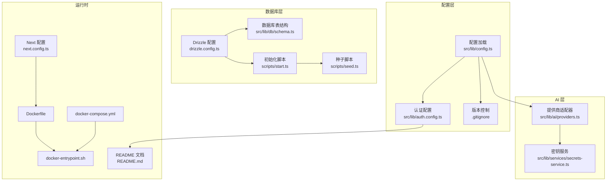
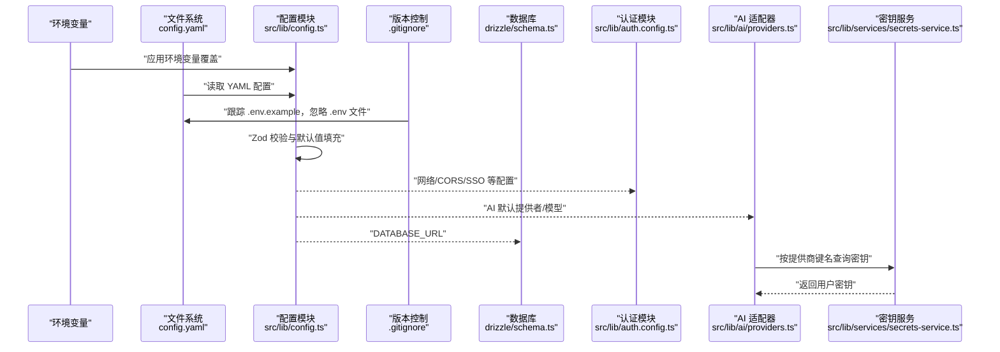
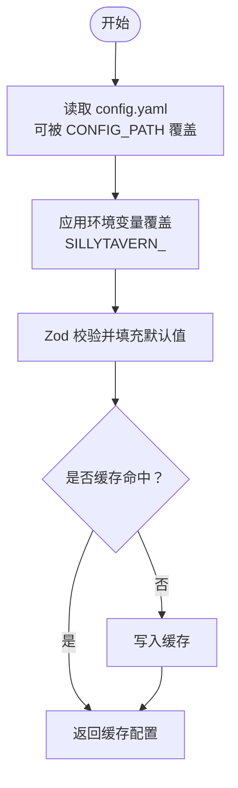
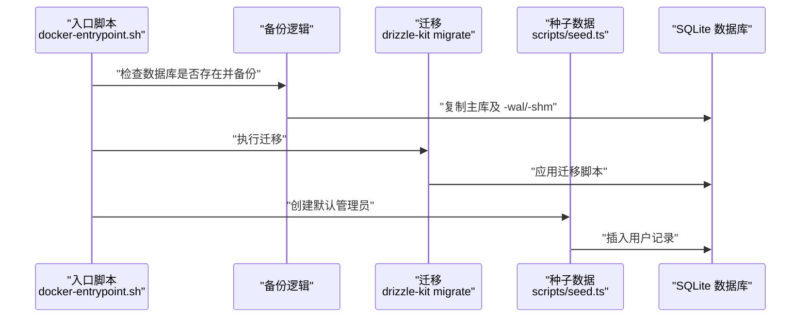
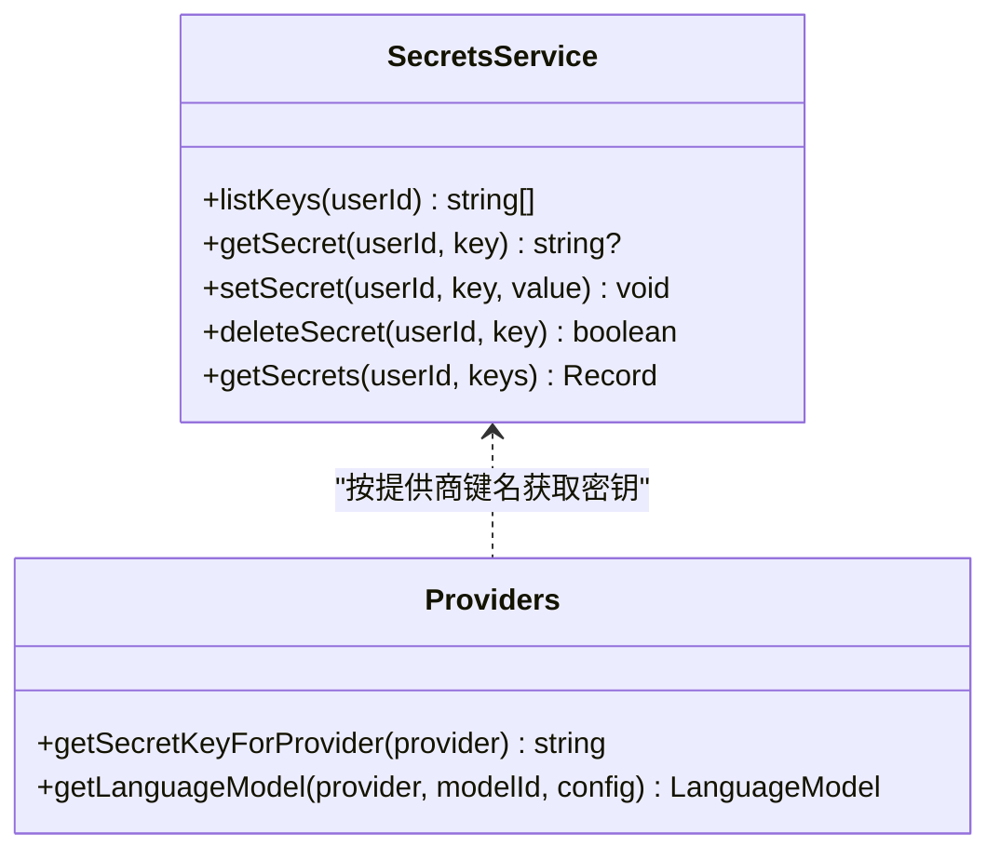
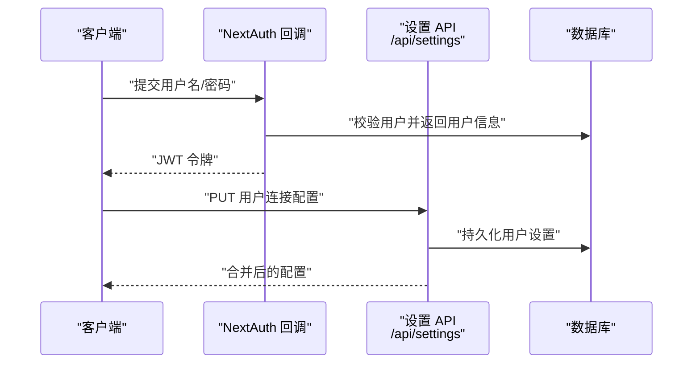
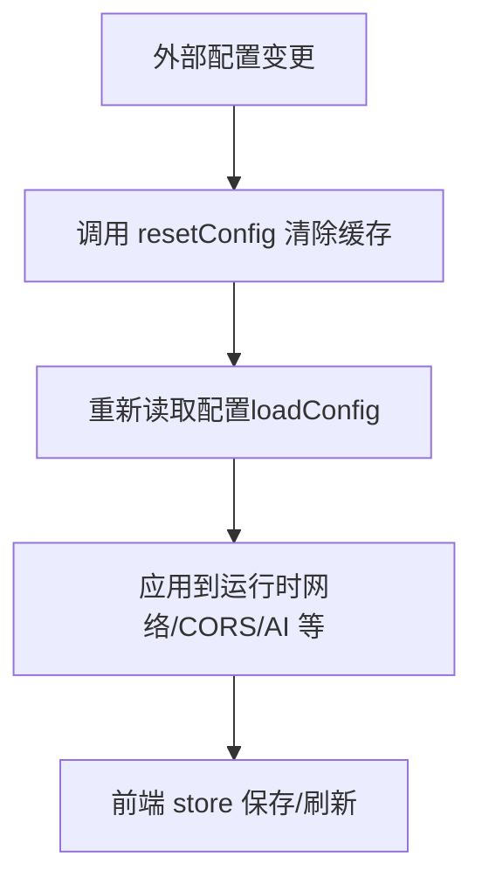
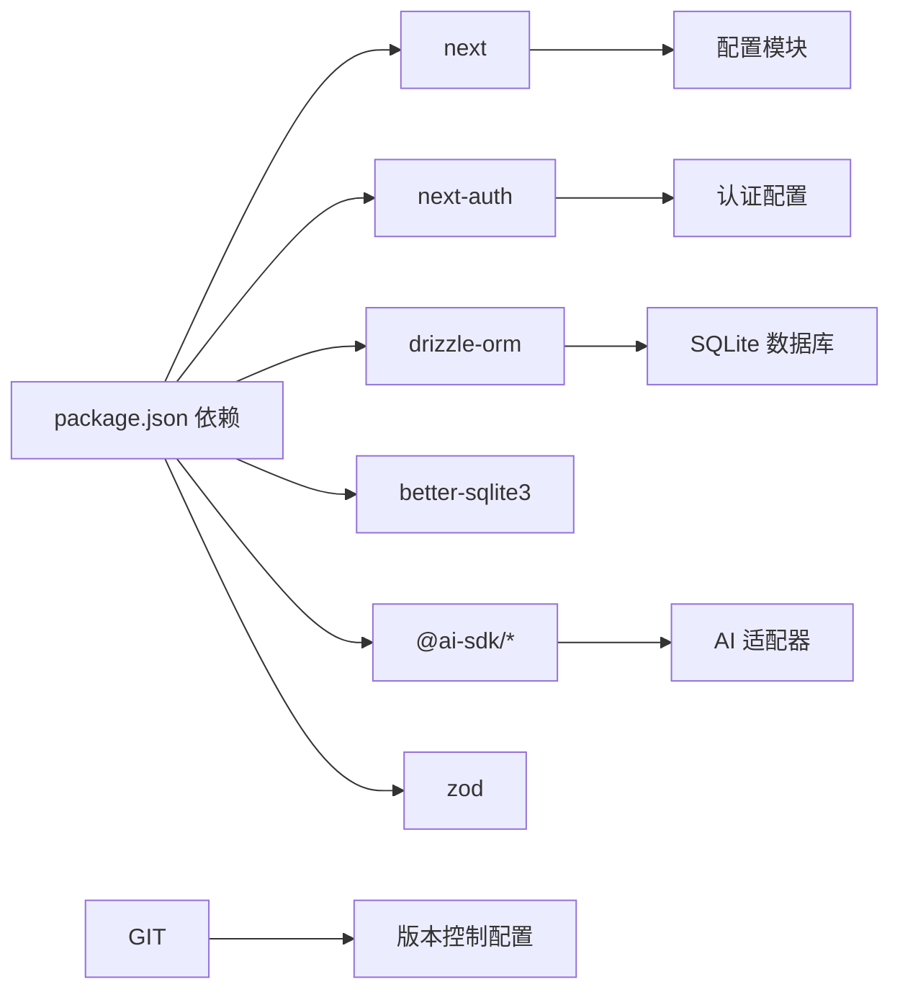

# 环境配置管理

<cite>
**本文引用的文件**
- [package.json](file://package.json)
- [next.config.ts](file://next.config.ts)
- [drizzle.config.ts](file://drizzle.config.ts)
- [src/lib/config.ts](file://src/lib/config.ts)
- [src/lib/auth.config.ts](file://src/lib/auth.config.ts)
- [src/lib/services/secrets-service.ts](file://src/lib/services/secrets-service.ts)
- [src/lib/ai/providers.ts](file://src/lib/ai/providers.ts)
- [src/lib/db/schema.ts](file://src/lib/db/schema.ts)
- [scripts/start.ts](file://scripts/start.ts)
- [scripts/seed.ts](file://scripts/seed.ts)
- [Dockerfile](file://Dockerfile)
- [docker-compose.yml](file://docker-compose.yml)
- [docker-entrypoint.sh](file://docker-entrypoint.sh)
- [.gitignore](file://.gitignore)
- [README.md](file://README.md)
</cite>

## 更新摘要
**所做更改**
- 更新了版本控制配置部分，反映了 .env.example 文件现在被正确跟踪的改进
- 新增了开发环境配置最佳实践章节，详细说明了 .env 文件的使用策略
- 完善了敏感信息管理章节，明确了 .env 文件的安全处理方式
- 更新了配置迁移指南，增加了 .env 文件迁移的具体指导

## 目录
1. [简介](#简介)
2. [项目结构](#项目结构)
3. [核心组件](#核心组件)
4. [架构总览](#架构总览)
5. [详细组件分析](#详细组件分析)
6. [依赖关系分析](#依赖关系分析)
7. [性能考量](#性能考量)
8. [故障排查指南](#故障排查指南)
9. [结论](#结论)
10. [附录](#附录)

## 简介
本文件面向 SillyTavern Next 的环境配置管理，系统性说明以下内容：
- .env 文件与环境变量定义、敏感信息存储与管理
- 开发与生产环境差异、配置优先级与覆盖规则
- 数据库连接配置、AI 服务密钥管理与认证配置
- 配置验证、环境检测与配置热更新机制
- 最佳实践、安全加固与配置迁移指南

**更新** 本次更新重点关注版本控制系统配置的改进，确保 .env.example 文件能够被正确跟踪，同时保持其他环境变量文件的安全性。

## 项目结构
围绕"配置"主题的关键文件分布如下：
- 应用配置加载与校验：src/lib/config.ts
- 认证配置：src/lib/auth.config.ts
- 数据库与迁移：drizzle.config.ts、scripts/start.ts、scripts/seed.ts
- AI 提供商与密钥映射：src/lib/ai/providers.ts、src/lib/services/secrets-service.ts
- 数据库表结构：src/lib/db/schema.ts
- 运行时与容器化：Dockerfile、docker-compose.yml、docker-entrypoint.sh
- Next.js 构建配置：next.config.ts
- 包管理与脚本：package.json
- 版本控制配置：.gitignore

**图表来源**
- [src/lib/config.ts:1-184](file://src/lib/config.ts#L1-L184)
- [src/lib/auth.config.ts:1-53](file://src/lib/auth.config.ts#L1-L53)
- [drizzle.config.ts:1-11](file://drizzle.config.ts#L1-L11)
- [src/lib/db/schema.ts:1-240](file://src/lib/db/schema.ts#L1-L240)
- [scripts/start.ts:1-96](file://scripts/start.ts#L1-L96)
- [scripts/seed.ts:1-28](file://scripts/seed.ts#L1-L28)
- [src/lib/ai/providers.ts:1-174](file://src/lib/ai/providers.ts#L1-L174)
- [src/lib/services/secrets-service.ts:1-116](file://src/lib/services/secrets-service.ts#L1-L116)
- [Dockerfile:1-63](file://Dockerfile#L1-L63)
- [docker-compose.yml:1-37](file://docker-compose.yml#L1-L37)
- [docker-entrypoint.sh:1-70](file://docker-entrypoint.sh#L1-L70)
- [next.config.ts:1-14](file://next.config.ts#L1-L14)
- [.gitignore:33-35](file://.gitignore#L33-L35)
- [README.md:28-47](file://README.md#L28-L47)

**章节来源**
- [src/lib/config.ts:1-184](file://src/lib/config.ts#L1-L184)
- [drizzle.config.ts:1-11](file://drizzle.config.ts#L1-L11)
- [src/lib/db/schema.ts:1-240](file://src/lib/db/schema.ts#L1-L240)
- [src/lib/ai/providers.ts:1-174](file://src/lib/ai/providers.ts#L1-L174)
- [src/lib/services/secrets-service.ts:1-116](file://src/lib/services/secrets-service.ts#L1-L116)
- [scripts/start.ts:1-96](file://scripts/start.ts#L1-L96)
- [scripts/seed.ts:1-28](file://scripts/seed.ts#L1-L28)
- [Dockerfile:1-63](file://Dockerfile#L1-L63)
- [docker-compose.yml:1-37](file://docker-compose.yml#L1-L37)
- [docker-entrypoint.sh:1-70](file://docker-entrypoint.sh#L1-L70)
- [next.config.ts:1-14](file://next.config.ts#L1-L14)
- [.gitignore:33-35](file://.gitignore#L33-L35)
- [README.md:28-47](file://README.md#L28-L47)

## 核心组件
- 配置加载与校验：通过 YAML 文件与环境变量组合，使用 Zod 进行强类型校验与默认值填充；支持点分路径读取与缓存。
- 数据库与迁移：Drizzle 配置基于 DATABASE_URL；启动脚本负责备份、迁移与种子数据。
- AI 提供商与密钥：统一适配多家提供商；密钥通过用户维度存储于数据库，并提供标准键名映射。
- 认证配置：NextAuth 配置，支持 JWT 回调与受保护端点策略。
- 容器化与运行时：Dockerfile 设置默认端口、主机名与数据库路径；compose 定义 .env 注入与健康检查。
- 版本控制配置：.gitignore 正确配置 .env* 文件，确保 .env.example 被跟踪而 .env 文件被忽略。

**更新** 新增了版本控制配置组件，明确了 .env 文件的版本控制策略。

**章节来源**
- [src/lib/config.ts:88-136](file://src/lib/config.ts#L88-L136)
- [drizzle.config.ts:7-10](file://drizzle.config.ts#L7-L10)
- [scripts/start.ts:24-96](file://scripts/start.ts#L24-L96)
- [src/lib/ai/providers.ts:102-150](file://src/lib/ai/providers.ts#L102-L150)
- [src/lib/services/secrets-service.ts:10-65](file://src/lib/services/secrets-service.ts#L10-L65)
- [src/lib/auth.config.ts:5-53](file://src/lib/auth.config.ts#L5-L53)
- [Dockerfile:25-29](file://Dockerfile#L25-L29)
- [docker-compose.yml:20-30](file://docker-compose.yml#L20-L30)
- [.gitignore:33-35](file://.gitignore#L33-L35)

## 架构总览
下图展示配置在系统中的流转与交互：

**图表来源**
- [src/lib/config.ts:88-136](file://src/lib/config.ts#L88-L136)
- [drizzle.config.ts:7-10](file://drizzle.config.ts#L7-L10)
- [src/lib/auth.config.ts:5-53](file://src/lib/auth.config.ts#L5-L53)
- [src/lib/ai/providers.ts:102-150](file://src/lib/ai/providers.ts#L102-L150)
- [src/lib/services/secrets-service.ts:10-65](file://src/lib/services/secrets-service.ts#L10-L65)
- [.gitignore:33-35](file://.gitignore#L33-L35)

## 详细组件分析

### 配置加载与验证（config.yaml 与环境变量）
- 配置来源与优先级
  - 文件：默认读取根目录 config.yaml，可通过 CONFIG_PATH 覆盖。
  - 环境变量：对每个配置键进行"扁平化"转换后读取，如 cors.enabled 对应环境变量名 SILLYTAVERN_CORS_ENABLED。
  - 校验与默认值：使用 Zod schema 校验，失败时回退到空配置的默认值。
  - 缓存：首次加载后缓存，支持 resetConfig 重置。
- 支持的关键域
  - 网络：端口、监听、白名单、基础认证开关。
  - 安全：CORS 代理、安全覆盖、CSRF 关闭。
  - 用户：用户账户开关、每用户基础认证。
  - CORS：启用、origin、methods、headers、credentials、maxAge。
  - SSO：Authelia/Authentik 开关、可信代理列表。
  - AI 默认：默认提供者、默认模型、上下文/响应长度限制。
  - 扩展：扩展功能开关与自动更新。
- 点分路径读取：getConfigValue 支持 a.b.c 形式读取嵌套值。

**图表来源**
- [src/lib/config.ts:88-136](file://src/lib/config.ts#L88-L136)
- [src/lib/config.ts:147-183](file://src/lib/config.ts#L147-L183)

**章节来源**
- [src/lib/config.ts:66-83](file://src/lib/config.ts#L66-L83)
- [src/lib/config.ts:88-117](file://src/lib/config.ts#L88-L117)
- [src/lib/config.ts:123-136](file://src/lib/config.ts#L123-L136)
- [src/lib/config.ts:141-143](file://src/lib/config.ts#L141-L143)

### 数据库连接与迁移（SQLite）
- 连接配置
  - Drizzle 配置使用 DATABASE_URL，若未设置则默认 ./data/sillytavern.db。
  - 容器内默认 DATABASE_URL=/app/data/sillytavern.db。
- 初始化流程
  - 启动前自动备份（保留最近 5 份），支持 WAL/SHM 文件。
  - 执行 drizzle-kit migrate 完成数据库迁移。
  - 幂等创建默认管理员账号（handle=admin/password=admin）。
- 数据持久化
  - Docker 卷映射 /app/data，确保 SQLite 文件持久化。

**图表来源**
- [drizzle.config.ts:7-10](file://drizzle.config.ts#L7-L10)
- [scripts/start.ts:24-96](file://scripts/start.ts#L24-L96)
- [scripts/seed.ts:14-27](file://scripts/seed.ts#L14-L27)
- [docker-entrypoint.sh:25-69](file://docker-entrypoint.sh#L25-L69)

**章节来源**
- [drizzle.config.ts:7-10](file://drizzle.config.ts#L7-L10)
- [scripts/start.ts:24-96](file://scripts/start.ts#L24-L96)
- [scripts/seed.ts:14-27](file://scripts/seed.ts#L14-L27)
- [docker-entrypoint.sh:25-69](file://docker-entrypoint.sh#L25-L69)

### AI 服务密钥管理
- 密钥存储
  - 用户维度存储于 secrets 表，键名与提供商一一对应。
  - 提供标准键名常量，覆盖 24+ 提供商与文本生成类提供商。
- 密钥获取
  - 通过 getSecretKeyForProvider 将提供商映射到标准键名。
  - 由 secretsService 提供 list/get/set/delete/getSecrets 等操作。
- 使用流程
  - 业务侧根据提供商选择对应键名，从数据库读取密钥后构建 ProviderConfig。
  - 通过 getLanguageModel 创建统一的语言模型实例。

**图表来源**
- [src/lib/services/secrets-service.ts:10-65](file://src/lib/services/secrets-service.ts#L10-L65)
- [src/lib/ai/providers.ts:102-150](file://src/lib/ai/providers.ts#L102-L150)

**章节来源**
- [src/lib/services/secrets-service.ts:10-116](file://src/lib/services/secrets-service.ts#L10-L116)
- [src/lib/ai/providers.ts:102-150](file://src/lib/ai/providers.ts#L102-L150)
- [src/lib/db/schema.ts:201-207](file://src/lib/db/schema.ts#L201-L207)

### 认证配置与环境检测
- NextAuth 配置要点
  - 提供凭据认证（用户名/密码），回调中注入用户信息到 JWT。
  - 会话策略为 JWT，有效期 30 天。
  - 授权回调中对公开端点（如 /api/health）放行。
- 环境变量要求
  - compose 中要求设置 AUTH_SECRET（建议使用 openssl rand -hex 32 生成）。
  - 容器入口脚本对 AUTH_SECRET 进行强制检查。
- 端点访问控制
  - 登录页、鉴权 API、健康检查端点无需登录即可访问。
  - 其他受保护端点需登录态。

**图表来源**
- [src/lib/auth.config.ts:5-53](file://src/lib/auth.config.ts#L5-L53)
- [docker-compose.yml:22-24](file://docker-compose.yml#L22-L24)
- [docker-entrypoint.sh:15-20](file://docker-entrypoint.sh#L15-L20)
- [src/app/api/settings/route.ts:55-108](file://src/app/api/settings/route.ts#L55-L108)

**章节来源**
- [src/lib/auth.config.ts:5-53](file://src/lib/auth.config.ts#L5-L53)
- [docker-compose.yml:22-24](file://docker-compose.yml#L22-L24)
- [docker-entrypoint.sh:15-20](file://docker-entrypoint.sh#L15-L20)
- [src/app/api/settings/route.ts:55-108](file://src/app/api/settings/route.ts#L55-L108)

### 配置热更新机制
- 配置缓存与重置
  - 配置模块内部缓存已解析配置；提供 resetConfig 以清除缓存，实现"热更新"。
  - 建议在需要重新加载配置的场景（如外部配置变更）调用 resetConfig 后再次读取。
- 前端持久化配置
  - 连接状态与用户设置通过 /api/settings 持久化，前端 store 在保存成功后刷新状态。

**图表来源**
- [src/lib/config.ts:141-143](file://src/lib/config.ts#L141-L143)
- [src/lib/config.ts:88-117](file://src/lib/config.ts#L88-L117)
- [src/lib/stores/connection-store.ts:173-185](file://src/lib/stores/connection-store.ts#L173-L185)

**章节来源**
- [src/lib/config.ts:141-143](file://src/lib/config.ts#L141-L143)
- [src/lib/stores/connection-store.ts:173-185](file://src/lib/stores/connection-store.ts#L173-L185)

### 版本控制配置与 .env 文件管理
- 版本控制策略
  - .gitignore 正确配置：.env* 会被忽略，但 .env.example 除外。
  - 这确保了示例文件可以被版本跟踪，而实际的 .env 文件不会意外提交。
- .env 文件使用策略
  - 开发环境：使用 .env.local（本地开发）或 .env（Docker 环境）。
  - 生产环境：使用 Docker 环境变量注入，不使用 .env 文件。
- 文件命名约定
  - .env.example：包含所有必要环境变量的示例文件。
  - .env：Docker 环境使用的文件（被 .gitignore 忽略）。
  - .env.local：本地开发环境使用的文件（被 .gitignore 忽略）。

**更新** 新增了版本控制配置章节，详细说明了 .env 文件的版本控制策略和使用约定。

**章节来源**
- [.gitignore:33-35](file://.gitignore#L33-L35)
- [README.md:28-47](file://README.md#L28-L47)

## 依赖关系分析
- 外部依赖与集成
  - Next.js 与 NextAuth：运行时框架与认证。
  - Drizzle ORM 与 better-sqlite3：数据库 ORM 与驱动。
  - AI SDK：统一 OpenAI/Anthropic/Google 等提供商接入。
- 环境变量与配置映射
  - DATABASE_URL：数据库路径（Drizzle 与容器默认）。
  - AUTH_SECRET/AUTH_URL：NextAuth 必填项。
  - OPENAI_API_KEY/ANTHROPIC_API_KEY/GOOGLE_GENERATIVE_AI_API_KEY：可选的默认提供商密钥（推荐在 UI 中按用户配置）。

**图表来源**
- [package.json:18-46](file://package.json#L18-L46)
- [src/lib/config.ts:1-184](file://src/lib/config.ts#L1-L184)
- [src/lib/auth.config.ts:1-53](file://src/lib/auth.config.ts#L1-L53)
- [drizzle.config.ts:1-11](file://drizzle.config.ts#L1-L11)
- [src/lib/ai/providers.ts:1-174](file://src/lib/ai/providers.ts#L1-L174)
- [.gitignore:33-35](file://.gitignore#L33-L35)

**章节来源**
- [package.json:18-46](file://package.json#L18-L46)
- [drizzle.config.ts:1-11](file://drizzle.config.ts#L1-L11)
- [src/lib/ai/providers.ts:1-174](file://src/lib/ai/providers.ts#L1-L174)

## 性能考量
- 配置加载
  - 配置仅在首次加载时解析与校验，后续通过缓存返回，避免重复 IO 与解析开销。
- 数据库迁移
  - 迁移在容器启动阶段执行，避免运行时阻塞；WAL/SHM 文件备份确保一致性。
- AI 请求
  - 通过统一适配器减少重复初始化成本；建议在应用启动时预热常用提供商。
- 版本控制效率
  - 正确的 .gitignore 配置避免了敏感文件的意外提交，提高了版本控制效率。

## 故障排查指南
- 配置解析错误
  - 症状：控制台打印验证错误并回退默认值。
  - 排查：检查 config.yaml 语法与字段类型；确认环境变量命名是否符合"SILLYTAVERN_<KEY>"规范。
- 数据库迁移失败
  - 症状：启动脚本报错并提示回滚方法。
  - 排查：查看迁移日志；确认 DATABASE_URL 指向有效路径；检查权限与磁盘空间。
- 认证失败
  - 症状：登录无响应或 401。
  - 排查：确认 AUTH_SECRET 已设置且 compose/容器环境一致；检查 /api/health 是否可访问。
- 密钥无法读取
  - 症状：AI 请求报错或无响应。
  - 排查：确认用户已在 UI 中保存对应提供商密钥；检查 getSecretKeyForProvider 映射是否正确。
- 版本控制问题
  - 症状：.env.example 未被跟踪或 .env 文件被意外提交。
  - 排查：检查 .gitignore 配置；确认正确的文件命名约定；使用 git status 查看状态。

**更新** 新增了版本控制问题的故障排查指南。

**章节来源**
- [src/lib/config.ts:108-114](file://src/lib/config.ts#L108-L114)
- [scripts/start.ts:67-83](file://scripts/start.ts#L67-L83)
- [docker-entrypoint.sh:15-20](file://docker-entrypoint.sh#L15-L20)
- [src/lib/ai/providers.ts:102-150](file://src/lib/ai/providers.ts#L102-L150)
- [.gitignore:33-35](file://.gitignore#L33-L35)

## 结论
本配置体系通过"文件 + 环境变量"的双轨制实现灵活部署，结合 Zod 校验与缓存提升可靠性；数据库迁移与种子脚本保证初始可用性；密钥服务与统一适配器简化多提供商接入；容器化与健康检查确保生产稳定。**更新** 版本控制配置的改进确保了 .env.example 文件的正确跟踪，同时保护了敏感的 .env 文件不被意外提交。遵循本文最佳实践与安全加固建议，可显著降低运维风险并提升可维护性。

## 附录

### 开发与生产环境差异
- 开发环境
  - 使用 next dev，端口默认 3000；可直接编辑 config.yaml 与 .env。
  - DATABASE_URL 可指向本地相对路径以便快速迭代。
  - 使用 .env.local 进行本地开发配置。
- 生产环境
  - 使用 standalone 构建与容器运行；默认端口、主机名、数据库路径在 Dockerfile 中固定。
  - compose 中必须设置 AUTH_SECRET；可选注入多个提供商密钥。
  - 不使用 .env 文件，通过环境变量注入配置。

**更新** 明确了开发环境中 .env.local 的使用，以及生产环境中不使用 .env 文件的策略。

**章节来源**
- [next.config.ts:3-11](file://next.config.ts#L3-L11)
- [Dockerfile:25-29](file://Dockerfile#L25-L29)
- [docker-compose.yml:20-30](file://docker-compose.yml#L20-L30)
- [README.md:46-48](file://README.md#L46-L48)

### 配置优先级与覆盖规则
- 文件优先级：CONFIG_PATH > ./config.yaml。
- 环境变量覆盖：SILLYTAVERN_<KEY>（点分键名转大写并替换点为下划线）。
- 校验与默认值：Zod safeParse 校验失败时回退默认值。
- 缓存：loadConfig 首次调用后缓存结果，resetConfig 可清空。

**章节来源**
- [src/lib/config.ts:91-117](file://src/lib/config.ts#L91-L117)
- [src/lib/config.ts:73-83](file://src/lib/config.ts#L73-L83)
- [src/lib/config.ts:107-114](file://src/lib/config.ts#L107-L114)
- [src/lib/config.ts:141-143](file://src/lib/config.ts#L141-L143)

### 敏感信息管理
- 密钥存储
  - 使用数据库表 secrets 存储用户密钥，不暴露明文于配置文件。
- 键名映射
  - 通过 SECRET_KEYS 与 getSecretKeyForProvider 统一映射，避免硬编码。
- 认证密钥
  - AUTH_SECRET 必须在部署前设置，建议使用强随机数生成。
- 版本控制安全
  - .env 文件被 .gitignore 忽略，防止敏感信息意外提交。
  - .env.example 文件被跟踪，提供完整的配置示例。

**更新** 新增了版本控制安全措施，明确了敏感信息的保护策略。

**章节来源**
- [src/lib/services/secrets-service.ts:67-116](file://src/lib/services/secrets-service.ts#L67-L116)
- [src/lib/ai/providers.ts:102-150](file://src/lib/ai/providers.ts#L102-L150)
- [docker-compose.yml:22-24](file://docker-compose.yml#L22-L24)
- [.gitignore:33-35](file://.gitignore#L33-L35)

### 配置验证与环境检测
- 配置验证：Zod schema 覆盖所有配置键，缺失或类型不符将触发默认值回退。
- 环境检测：容器入口脚本强制检查 AUTH_SECRET；compose 健康检查端点 /api/health。
- 版本控制检测：通过 .gitignore 确保 .env 文件不被跟踪，.env.example 文件被跟踪。

**更新** 新增了版本控制检测的相关内容。

**章节来源**
- [src/lib/config.ts:107-114](file://src/lib/config.ts#L107-L114)
- [docker-entrypoint.sh:15-20](file://docker-entrypoint.sh#L15-L20)
- [docker-compose.yml:31-37](file://docker-compose.yml#L31-L37)
- [.gitignore:33-35](file://.gitignore#L33-L35)

### 配置热更新机制
- 通过 resetConfig 清除缓存后重新 loadConfig 实现热更新。
- 前端 store 保存用户设置到 /api/settings，保存成功后刷新状态。

**章节来源**
- [src/lib/config.ts:141-143](file://src/lib/config.ts#L141-L143)
- [src/lib/stores/connection-store.ts:173-185](file://src/lib/stores/connection-store.ts#L173-L185)

### 开发环境配置最佳实践
- 使用 .env.local 进行本地开发配置
  - 在本地开发时使用 .env.local 文件，它不会被版本控制系统跟踪。
  - 从 .env.example 复制配置，只修改必要的环境变量。
- 版本控制策略
  - .env.example 文件应该被提交到版本库，提供完整的配置示例。
  - .env 文件不应该被提交到版本库，因为它包含敏感信息。
  - .env.local 文件不应该被提交到版本库，用于本地开发配置。
- 配置文件命名约定
  - .env.example：包含所有必要环境变量的示例文件，用于新开发者参考。
  - .env：Docker 环境使用的文件，包含敏感信息，不应提交到版本库。
  - .env.local：本地开发环境使用的文件，包含敏感信息，不应提交到版本库。

**新增** 完整的开发环境配置最佳实践指南。

**章节来源**
- [README.md:28-47](file://README.md#L28-L47)
- [.gitignore:33-35](file://.gitignore#L33-L35)

### 配置迁移指南
- 从旧版 SillyTavern 迁移
  - 将原 config.yaml 内容迁移至新的 config.yaml（键名与 schema 保持兼容）。
  - 将各提供商密钥迁移到 UI 的"设置/连接"页面，系统会自动映射到标准键名。
  - 确认 DATABASE_URL 指向新路径，执行一次迁移与备份。
- 版本升级
  - 升级前自动备份数据库；如迁移失败，按启动脚本提示回滚至上一个备份。
- .env 文件迁移
  - 从旧项目复制 .env.example 文件到新项目根目录。
  - 根据新项目的依赖关系更新 .env.example 文件中的变量。
  - 在新环境中生成新的 .env 文件，使用强随机密钥替换示例值。

**更新** 新增了 .env 文件迁移的具体指导。

**章节来源**
- [scripts/start.ts:24-96](file://scripts/start.ts#L24-L96)
- [docker-entrypoint.sh:25-69](file://docker-entrypoint.sh#L25-L69)
- [README.md:28-47](file://README.md#L28-L47)

### 安全加固
- 强制设置 AUTH_SECRET，避免默认或弱口令。
- 限制 CORS 与白名单，关闭 CSRF（如确需关闭需评估风险）。
- 使用 HTTPS 与反向代理，避免明文传输。
- 定期轮换密钥，启用最小权限原则。
- 版本控制安全
  - 确保 .env 文件被 .gitignore 忽略。
  - 确保 .env.example 文件被版本控制系统跟踪。
  - 定期检查 git status，确保没有意外提交敏感文件。

**更新** 新增了版本控制安全加固措施。

**章节来源**
- [src/lib/services/secrets-service.ts:67-116](file://src/lib/services/secrets-service.ts#L67-L116)
- [src/lib/ai/providers.ts:102-150](file://src/lib/ai/providers.ts#L102-L150)
- [docker-compose.yml:22-24](file://docker-compose.yml#L22-L24)
- [.gitignore:33-35](file://.gitignore#L33-L35)