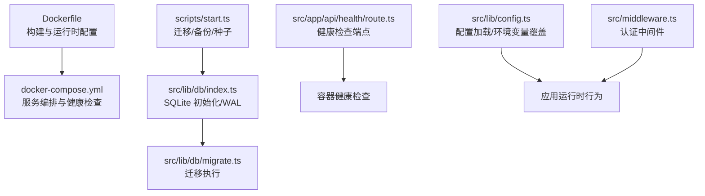
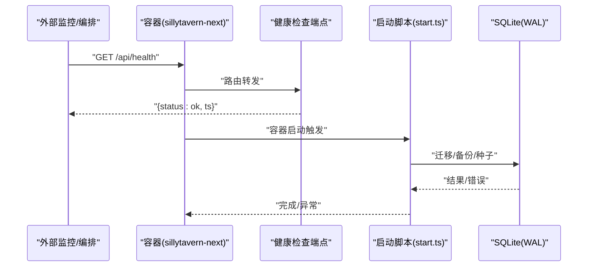
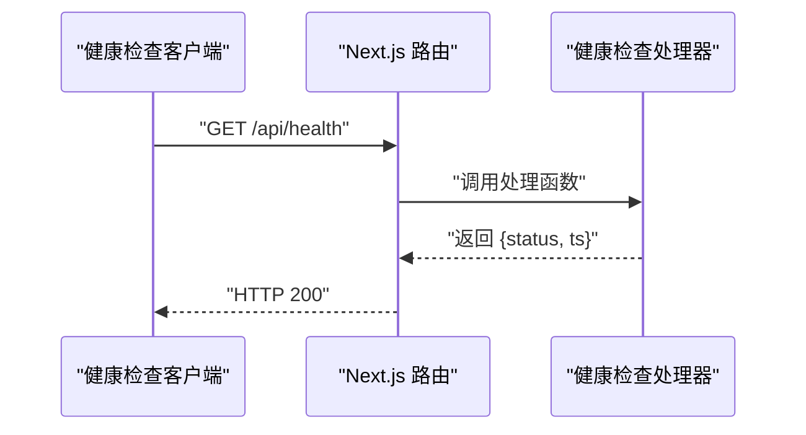
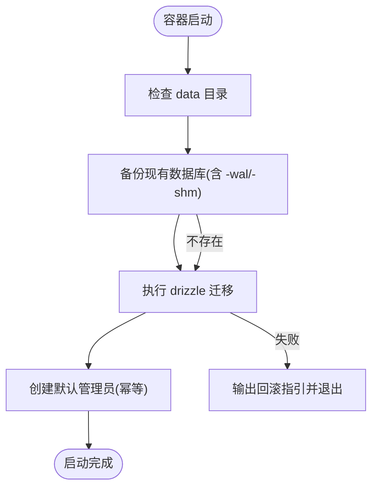
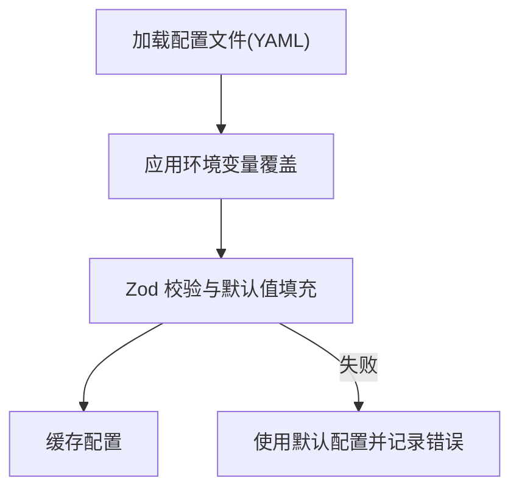
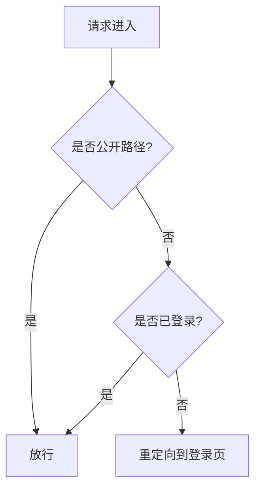
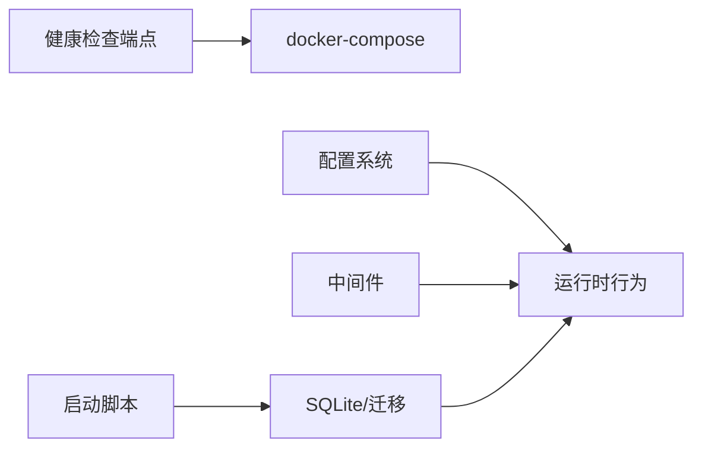

# 监控与日志管理

<cite>
**本文引用的文件**
- [package.json](file://package.json)
- [Dockerfile](file://Dockerfile)
- [docker-compose.yml](file://docker-compose.yml)
- [scripts/start.ts](file://scripts/start.ts)
- [src/lib/config.ts](file://src/lib/config.ts)
- [src/lib/db/index.ts](file://src/lib/db/index.ts)
- [src/lib/db/migrate.ts](file://src/lib/db/migrate.ts)
- [drizzle.config.ts](file://drizzle.config.ts)
- [src/app/api/health/route.ts](file://src/app/api/health/route.ts)
- [src/middleware.ts](file://src/middleware.ts)
- [next-dev.log](file://next-dev.log)
</cite>

## 目录
1. [简介](#简介)
2. [项目结构](#项目结构)
3. [核心组件](#核心组件)
4. [架构总览](#架构总览)
5. [详细组件分析](#详细组件分析)
6. [依赖关系分析](#依赖关系分析)
7. [性能考量](#性能考量)
8. [故障排查指南](#故障排查指南)
9. [结论](#结论)
10. [附录](#附录)

## 简介
本文件面向 SillyTavern Next 的运维与平台工程团队，系统性梳理其监控与日志管理现状与实践建议。内容涵盖：
- 应用日志配置、日志级别与轮转策略
- 容器健康检查与告警配置
- 性能监控、资源使用统计与错误追踪
- 日志聚合、分析工具集成与可视化展示
- 监控最佳实践、故障预警与性能调优建议

当前仓库中未发现内置的日志框架或集中式日志采集配置，但提供了健康检查端点、数据库迁移与 WAL 模式、以及容器编排示例，这些是构建监控体系的重要基础。

## 项目结构
围绕监控与日志的关键文件与职责如下：
- 运行时与容器化
  - Dockerfile：定义生产镜像、非 root 用户、暴露端口、入口脚本与数据卷
  - docker-compose.yml：定义服务、端口映射、环境变量、健康检查
- 启动与初始化
  - scripts/start.ts：数据库迁移、备份、种子数据与回滚指引
- 配置与中间件
  - src/lib/config.ts：配置加载与环境变量覆盖
  - src/middleware.ts：认证中间件与路由匹配
- 数据层
  - src/lib/db/index.ts：SQLite 初始化、WAL 模式、迁移幂等处理
  - src/lib/db/migrate.ts：迁移执行与关闭逻辑
  - drizzle.config.ts：迁移配置
- 健康检查
  - src/app/api/health/route.ts：无鉴权健康检查端点

图表来源
- [Dockerfile:1-63](file://Dockerfile#L1-L63)
- [docker-compose.yml:1-37](file://docker-compose.yml#L1-L37)
- [scripts/start.ts:1-96](file://scripts/start.ts#L1-L96)
- [src/lib/db/index.ts:1-106](file://src/lib/db/index.ts#L1-L106)
- [src/lib/db/migrate.ts:1-33](file://src/lib/db/migrate.ts#L1-L33)
- [src/app/api/health/route.ts:1-9](file://src/app/api/health/route.ts#L1-L9)
- [src/lib/config.ts:1-184](file://src/lib/config.ts#L1-L184)
- [src/middleware.ts:1-35](file://src/middleware.ts#L1-L35)

章节来源
- [Dockerfile:1-63](file://Dockerfile#L1-L63)
- [docker-compose.yml:1-37](file://docker-compose.yml#L1-L37)
- [scripts/start.ts:1-96](file://scripts/start.ts#L1-L96)
- [src/lib/db/index.ts:1-106](file://src/lib/db/index.ts#L1-L106)
- [src/lib/db/migrate.ts:1-33](file://src/lib/db/migrate.ts#L1-L33)
- [src/app/api/health/route.ts:1-9](file://src/app/api/health/route.ts#L1-L9)
- [src/lib/config.ts:1-184](file://src/lib/config.ts#L1-L184)
- [src/middleware.ts:1-35](file://src/middleware.ts#L1-L35)

## 核心组件
- 健康检查端点
  - 无鉴权，返回状态与时间戳，便于容器编排与外部监控系统探测
- 数据库层
  - 使用 SQLite 并启用 WAL 模式，提升并发读写性能；启动时自动迁移并进行列幂等补齐
- 启动流程
  - 容器入口脚本负责迁移、备份与种子数据，失败时提供回滚指引
- 配置系统
  - 支持 YAML 配置文件与环境变量覆盖，验证与默认值填充
- 中间件
  - NextAuth 认证中间件，保护受控路由

章节来源
- [src/app/api/health/route.ts:1-9](file://src/app/api/health/route.ts#L1-L9)
- [src/lib/db/index.ts:1-106](file://src/lib/db/index.ts#L1-L106)
- [scripts/start.ts:1-96](file://scripts/start.ts#L1-L96)
- [src/lib/config.ts:1-184](file://src/lib/config.ts#L1-L184)
- [src/middleware.ts:1-35](file://src/middleware.ts#L1-L35)

## 架构总览
下图展示了容器运行时、健康检查、数据库与启动脚本之间的交互关系。

图表来源
- [docker-compose.yml:31-37](file://docker-compose.yml#L31-L37)
- [src/app/api/health/route.ts:1-9](file://src/app/api/health/route.ts#L1-L9)
- [scripts/start.ts:1-96](file://scripts/start.ts#L1-L96)
- [src/lib/db/index.ts:1-106](file://src/lib/db/index.ts#L1-L106)

## 详细组件分析

### 健康检查与容器监控
- 端点
  - 路径：/api/health
  - 方法：GET
  - 特性：无鉴权，动态响应，返回状态与时间戳
- 容器编排
  - docker-compose 中定义了健康检查指令，周期、超时与重试次数可调
- 建议
  - 结合外部监控系统（如 Prometheus、Grafana、Kubernetes liveness/readiness）对端点进行抓取与告警
  - 将健康检查纳入 SLI/SLO 指标，设置阈值与告警规则

图表来源
- [src/app/api/health/route.ts:1-9](file://src/app/api/health/route.ts#L1-L9)
- [docker-compose.yml:31-37](file://docker-compose.yml#L31-L37)

章节来源
- [src/app/api/health/route.ts:1-9](file://src/app/api/health/route.ts#L1-L9)
- [docker-compose.yml:31-37](file://docker-compose.yml#L31-L37)

### 数据库迁移与启动流程
- 启动脚本职责
  - 确保 data 目录存在
  - 对现有数据库执行备份（含 WAL/SHM 文件），保留最近 N 份
  - 执行 drizzle 迁移，失败时输出回滚指引
  - 创建默认管理员账户（幂等）
- 数据库初始化
  - 使用 better-sqlite3，启用 WAL 模式与外键约束
  - 启动时自动迁移，并对缺失列进行幂等补齐
- 建议
  - 将迁移与备份过程纳入日志采集与告警
  - 在 CI/CD 中预执行迁移，减少容器启动时的阻塞

图表来源
- [scripts/start.ts:1-96](file://scripts/start.ts#L1-L96)
- [src/lib/db/index.ts:1-106](file://src/lib/db/index.ts#L1-L106)
- [src/lib/db/migrate.ts:1-33](file://src/lib/db/migrate.ts#L1-L33)

章节来源
- [scripts/start.ts:1-96](file://scripts/start.ts#L1-L96)
- [src/lib/db/index.ts:1-106](file://src/lib/db/index.ts#L1-L106)
- [src/lib/db/migrate.ts:1-33](file://src/lib/db/migrate.ts#L1-L33)

### 配置系统与环境变量覆盖
- 功能
  - 从 YAML 配置文件加载，支持点分路径访问
  - 将配置键转换为环境变量名并覆盖默认值
  - 使用 Zod 校验并填充默认值，校验失败时记录错误并回退默认值
- 建议
  - 将敏感配置通过环境变量注入，避免明文写入配置文件
  - 在容器编排中集中管理环境变量，结合密钥管理服务

图表来源
- [src/lib/config.ts:1-184](file://src/lib/config.ts#L1-L184)

章节来源
- [src/lib/config.ts:1-184](file://src/lib/config.ts#L1-L184)

### 中间件与安全控制
- NextAuth 中间件
  - 匹配除静态资源与 favicon 外的所有请求
  - 公开路径放行，未登录用户重定向至登录页
- 建议
  - 将认证失败与重定向事件纳入审计日志
  - 结合容器日志与外部 SIEM 进行异常检测

图表来源
- [src/middleware.ts:1-35](file://src/middleware.ts#L1-L35)

章节来源
- [src/middleware.ts:1-35](file://src/middleware.ts#L1-L35)

### 容器镜像与运行时
- 镜像特性
  - 多阶段构建，生产镜像基于 node:20-alpine
  - 设置非 root 用户与 tini 作为 PID 1，暴露端口 3000
  - 数据持久化目录 /app/data，入口脚本负责初始化
- 建议
  - 在容器运行时开启 stdout/stderr 日志采集
  - 使用只读根文件系统与最小权限原则

章节来源
- [Dockerfile:1-63](file://Dockerfile#L1-L63)

## 依赖关系分析
- 组件耦合
  - 健康检查端点与容器编排强耦合，用于存活与就绪探测
  - 启动脚本与数据库层紧密耦合，负责迁移与备份
  - 配置系统贯穿应用运行时，影响网络、安全与 AI 默认设置
- 外部依赖
  - drizzle-orm 与 better-sqlite3 用于 ORM 与 SQLite
  - next-auth 用于认证中间件
- 建议
  - 明确各组件边界，避免跨层直接依赖
  - 引入统一的指标与日志采集层，降低对业务代码侵入

图表来源
- [src/app/api/health/route.ts:1-9](file://src/app/api/health/route.ts#L1-L9)
- [docker-compose.yml:1-37](file://docker-compose.yml#L1-37)
- [scripts/start.ts:1-96](file://scripts/start.ts#L1-L96)
- [src/lib/db/index.ts:1-106](file://src/lib/db/index.ts#L1-L106)
- [src/lib/config.ts:1-184](file://src/lib/config.ts#L1-L184)
- [src/middleware.ts:1-35](file://src/middleware.ts#L1-L35)

章节来源
- [src/app/api/health/route.ts:1-9](file://src/app/api/health/route.ts#L1-L9)
- [docker-compose.yml:1-37](file://docker-compose.yml#L1-L37)
- [scripts/start.ts:1-96](file://scripts/start.ts#L1-L96)
- [src/lib/db/index.ts:1-106](file://src/lib/db/index.ts#L1-L106)
- [src/lib/config.ts:1-184](file://src/lib/config.ts#L1-L184)
- [src/middleware.ts:1-35](file://src/middleware.ts#L1-L35)

## 性能考量
- 数据库性能
  - WAL 模式提升并发读写能力，适合高并发场景
  - 启动时自动迁移与列幂等补齐，避免运行期 500
- 运行时优化
  - 生产镜像禁用 Telemetry，减少额外开销
  - 非 root 用户与 tini 提升容器稳定性
- 建议
  - 结合数据库慢查询日志与指标，识别热点表与索引缺失
  - 在容器层面采集 CPU、内存、磁盘 I/O 指标，建立基线与告警

章节来源
- [src/lib/db/index.ts:1-106](file://src/lib/db/index.ts#L1-L106)
- [Dockerfile:17-28](file://Dockerfile#L17-L28)

## 故障排查指南
- 健康检查失败
  - 检查 /api/health 是否可达，确认容器内进程正常
  - 查看容器日志与启动脚本输出，定位迁移或备份异常
- 数据库问题
  - 确认 /app/data 挂载正确，WAL/SHM 文件完整
  - 若迁移失败，参考启动脚本提供的回滚命令
- 认证与中间件
  - 检查中间件是否正确重定向未登录用户
  - 关注认证失败与会话异常的日志

章节来源
- [src/app/api/health/route.ts:1-9](file://src/app/api/health/route.ts#L1-L9)
- [scripts/start.ts:1-96](file://scripts/start.ts#L1-L96)
- [src/middleware.ts:1-35](file://src/middleware.ts#L1-L35)

## 结论
SillyTavern Next 当前具备健康检查端点、容器化运行与数据库迁移/备份能力，适合作为监控与日志体系的基础设施。建议在此基础上引入统一的日志采集与指标上报、完善告警策略与可视化面板，并持续优化数据库与运行时性能，以满足生产环境的可观测性需求。

## 附录

### 日志配置与轮转策略（建议）
- 日志采集
  - 容器标准输出/错误流采集，结合日志驱动（如 json-file、fluentd、vector、promtail）
- 日志级别
  - 开发：info
  - 生产：warn（仅关键信息），error（错误）
- 日志轮转
  - 基于容器日志驱动的轮转策略（如 json-file 的大小/时间轮转）
  - 或使用外部工具（如 logrotate）对宿主机日志文件进行轮转

### 健康检查与告警配置（建议）
- 健康检查
  - 探针间隔：30s
  - 超时：5s
  - 重试次数：3
  - 启动宽限期：30s
- 告警
  - 健康检查连续失败触发告警
  - 结合 CPU/内存/磁盘/数据库连接数等指标设置阈值

### 性能监控与资源统计（建议）
- 指标
  - 应用：请求速率、P95/P99 延迟、错误率、活动会话数
  - 数据库：查询 QPS、慢查询、锁等待、WAL 文件大小
  - 容器：CPU 使用率、内存使用、磁盘 I/O、文件句柄数
- 工具
  - Prometheus + Grafana
  - OpenTelemetry（可选）

### 错误追踪与可视化（建议）
- 错误追踪
  - 结构化日志 + 采样错误上报（如 Sentry/OpenTelemetry）
- 可视化
  - Grafana 仪表盘：健康度、性能、错误趋势
  - 日志面板：按时间、用户、接口维度检索

### 监控最佳实践
- 分层治理：应用层、数据库层、容器层分别设置独立指标与告警
- 降噪策略：对偶发性错误与临时性波动设置去抖与静默窗口
- 回滚与演练：定期演练迁移回滚与数据库恢复流程