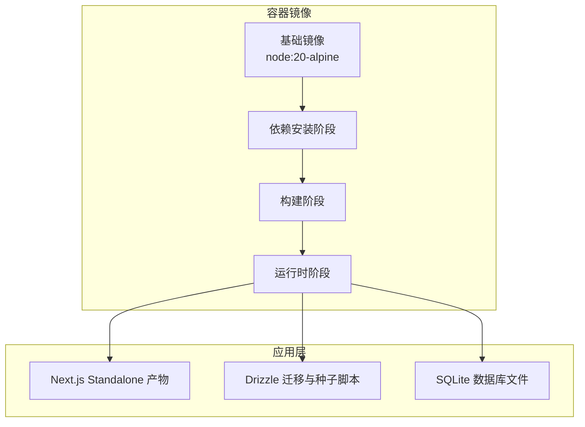
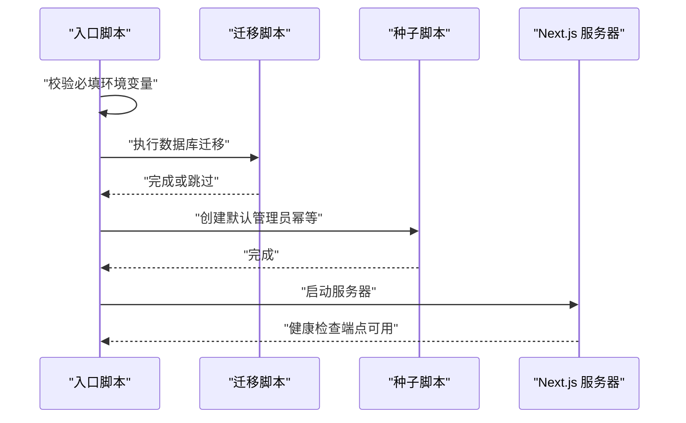
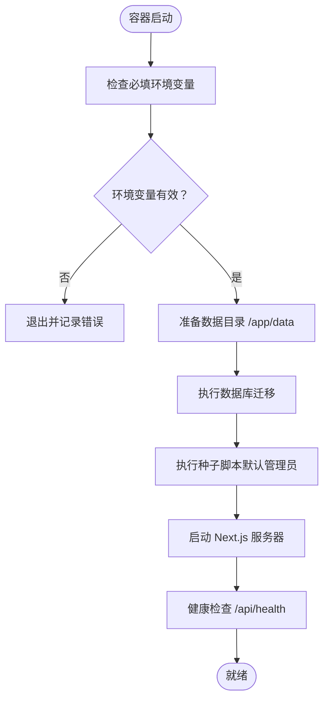
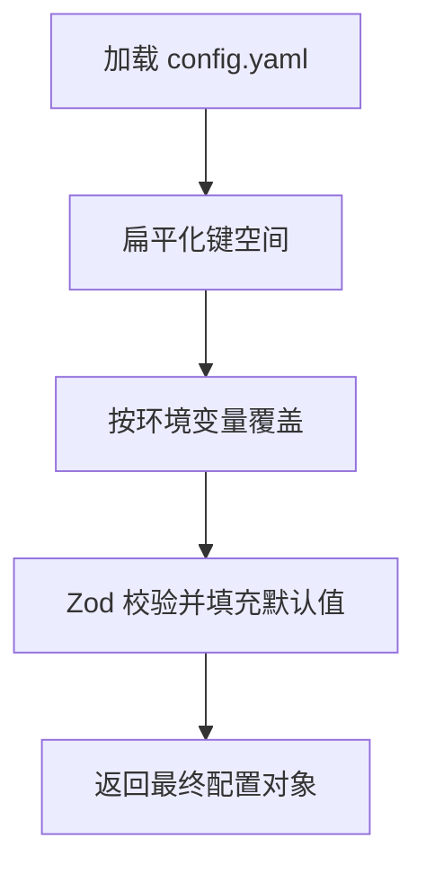
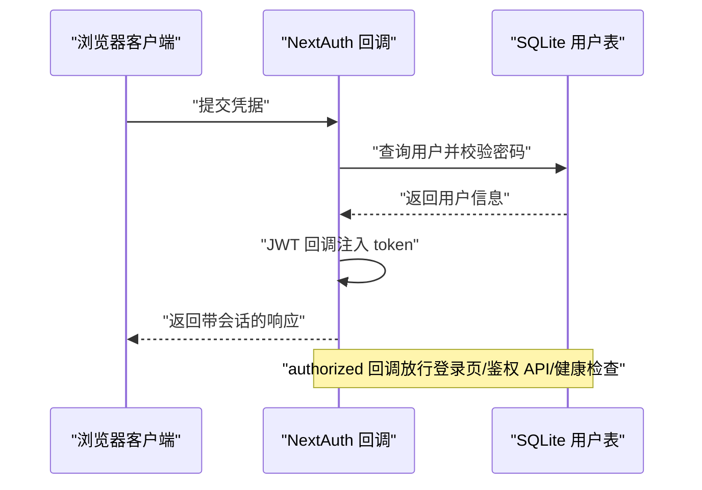
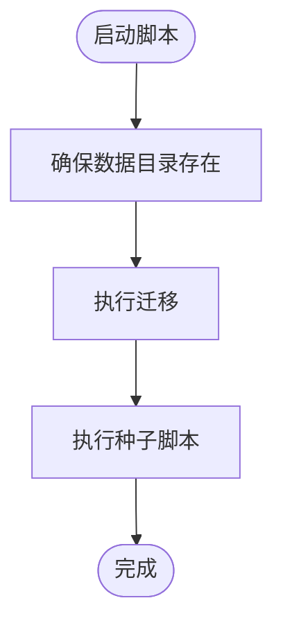
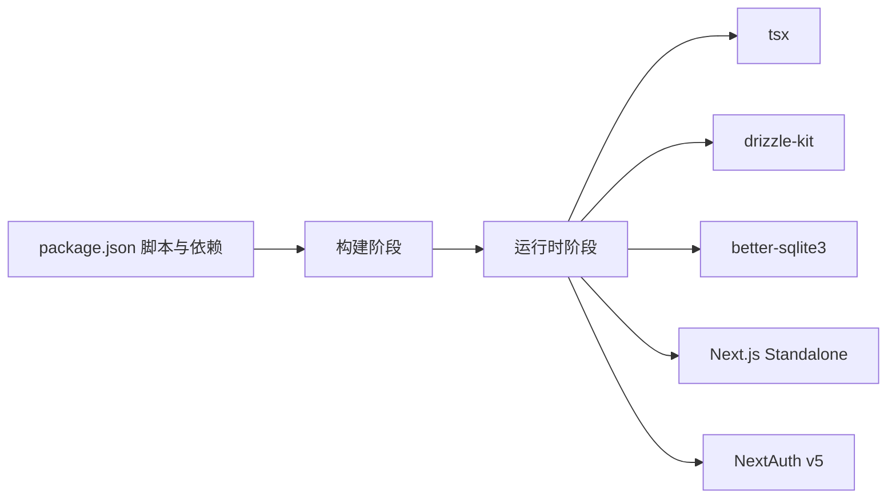

# 部署运维

<cite>
**本文引用的文件**
- [Dockerfile](file://Dockerfile)
- [docker-compose.yml](file://docker-compose.yml)
- [docker-entrypoint.sh](file://docker-entrypoint.sh)
- [package.json](file://package.json)
- [next.config.ts](file://next.config.ts)
- [scripts/start.ts](file://scripts/start.ts)
- [scripts/seed.ts](file://scripts/seed.ts)
- [drizzle.config.ts](file://drizzle.config.ts)
- [src/lib/config.ts](file://src/lib/config.ts)
- [src/lib/auth.config.ts](file://src/lib/auth.config.ts)
- [src/app/api/health/route.ts](file://src/app/api/health/route.ts)
- [README.md](file://README.md)
</cite>

## 目录
1. [简介](#简介)
2. [项目结构](#项目结构)
3. [核心组件](#核心组件)
4. [架构总览](#架构总览)
5. [详细组件分析](#详细组件分析)
6. [依赖关系分析](#依赖关系分析)
7. [性能考虑](#性能考虑)
8. [故障排除指南](#故障排除指南)
9. [结论](#结论)
10. [附录](#附录)

## 简介
本文件面向 SillyTavern Next 的部署与运维团队，提供从容器化部署、反向代理到生产优化的全流程指导；涵盖环境变量、数据卷、安全加固、性能监控、日志管理、备份恢复、版本升级与容量规划，并给出最佳实践与自动化运维建议。

## 项目结构
SillyTavern Next 采用 Next.js 16 + TypeScript + SQLite 的单体应用，结合 Drizzle ORM + better-sqlite3 实现本地数据库持久化；通过多阶段 Docker 构建输出 Standalone 部署产物，配合 docker-compose 快速编排。

图表来源
- [Dockerfile:1-63](file://Dockerfile#L1-L63)
- [next.config.ts:1-14](file://next.config.ts#L1-L14)

章节来源
- [Dockerfile:1-63](file://Dockerfile#L1-L63)
- [next.config.ts:1-14](file://next.config.ts#L1-L14)
- [README.md:150-157](file://README.md#L150-L157)

## 核心组件
- 容器镜像与入口
  - 多阶段构建：依赖安装、应用构建、生产运行时分离，确保镜像最小化与可审计。
  - 运行时环境变量：NODE_ENV、PORT、HOSTNAME、DATABASE_URL 等。
  - 非 root 用户运行，暴露 3000 端口，挂载 /app/data 作为数据卷。
  - 入口脚本负责健康检查前的数据库迁移与默认管理员创建。
- 应用配置
  - Next.js Standalone 输出，serverExternalPackages 包含 better-sqlite3，避免打包问题。
  - 通过 config.yaml 与环境变量组合配置，支持层级键与环境变量覆盖。
- 认证与会话
  - NextAuth v5 Credentials Provider，JWT 回调处理用户信息与授权控制。
  - 公共健康检查端点无需鉴权，便于容器编排与监控。
- 数据与迁移
  - Drizzle 配置指向 DATABASE_URL，迁移与种子脚本在启动时幂等执行。
  - 默认管理员账户在首次启动时创建，后续登录后应立即修改密码。

章节来源
- [Dockerfile:20-63](file://Dockerfile#L20-L63)
- [docker-entrypoint.sh:14-33](file://docker-entrypoint.sh#L14-L33)
- [next.config.ts:3-11](file://next.config.ts#L3-L11)
- [src/lib/config.ts:88-117](file://src/lib/config.ts#L88-L117)
- [src/lib/auth.config.ts:5-52](file://src/lib/auth.config.ts#L5-L52)
- [src/app/api/health/route.ts:1-10](file://src/app/api/health/route.ts#L1-L10)
- [drizzle.config.ts:1-11](file://drizzle.config.ts#L1-L11)
- [scripts/start.ts:24-42](file://scripts/start.ts#L24-L42)
- [scripts/seed.ts:14-27](file://scripts/seed.ts#L14-L27)

## 架构总览
下图展示容器内应用启动流程与关键依赖：

图表来源
- [docker-entrypoint.sh:14-33](file://docker-entrypoint.sh#L14-L33)
- [scripts/start.ts:24-42](file://scripts/start.ts#L24-L42)
- [scripts/seed.ts:14-27](file://scripts/seed.ts#L14-L27)
- [src/app/api/health/route.ts:1-10](file://src/app/api/health/route.ts#L1-L10)

## 详细组件分析

### 容器化与编排
- 镜像构建
  - 多阶段：deps（安装依赖）、builder（构建）、runner（运行时）。
  - 运行时设置 NODE_ENV=production、PORT、HOSTNAME、DATABASE_URL。
  - 非 root 用户 nextjs 运行，暴露 3000 端口，挂载 /app/data。
- 启动流程
  - 入口脚本检查 AUTH_SECRET，准备 /app/data 目录。
  - 执行迁移与种子脚本，失败则退出。
  - 启动 node server.js。
- Compose 编排
  - 映射宿主端口到容器 3000，挂载 ./data 到 /app/data。
  - 健康检查访问 /api/health。
  - 推荐设置 restart: unless-stopped。

图表来源
- [docker-entrypoint.sh:14-33](file://docker-entrypoint.sh#L14-L33)
- [docker-compose.yml:31-37](file://docker-compose.yml#L31-L37)

章节来源
- [Dockerfile:20-63](file://Dockerfile#L20-L63)
- [docker-compose.yml:10-37](file://docker-compose.yml#L10-L37)
- [docker-entrypoint.sh:14-33](file://docker-entrypoint.sh#L14-L33)

### 配置体系（config.yaml 与环境变量）
- 配置来源与覆盖
  - 读取 config.yaml（默认 CONFIG_PATH 或当前工作目录下的 config.yaml）。
  - 通过 keyToEnv 将点分键转换为环境变量名（如 cors.enabled -> SILLYTAVERN_CORS_ENABLED）。
  - 环境变量覆盖配置文件中的对应键，支持布尔、数字、JSON 解析。
- 默认值与验证
  - 使用 Zod Schema 定义网络、安全、CORS、SSO、AI 默认设置、扩展等字段。
  - 未通过验证时使用默认值，保证系统稳定。
- 关键配置项
  - 网络：port、listen、whitelistMode、whitelist、basicAuthMode。
  - 安全：enableCorsProxy、securityOverride、disableCsrf。
  - CORS：enabled、origin、methods、allowedHeaders、exposedHeaders、credentials、maxAge。
  - SSO：autheliaAuth、authentikAuth、trustedProxies。
  - AI 默认：defaultProvider、defaultModel、maxContextTokens、maxResponseTokens。
  - 扩展：enabled、autoUpdate。

图表来源
- [src/lib/config.ts:88-117](file://src/lib/config.ts#L88-L117)
- [src/lib/config.ts:73-83](file://src/lib/config.ts#L73-L83)
- [src/lib/config.ts:172-183](file://src/lib/config.ts#L172-L183)

章节来源
- [src/lib/config.ts:66-83](file://src/lib/config.ts#L66-L83)
- [src/lib/config.ts:107-117](file://src/lib/config.ts#L107-L117)

### 认证与授权（NextAuth v5）
- 提供商与回调
  - Credentials Provider，JWT 回调注入用户 id、handle、admin。
  - authorized 回调控制访问：登录页、鉴权 API、公共健康检查放行。
- 会话策略
  - JWT 会话，maxAge 30 天。
- 安全要点
  - AUTH_SECRET 必须强随机，建议使用 openssl 生成。
  - AUTH_URL 应与反向代理暴露的域名一致，避免跨域问题。

图表来源
- [src/lib/auth.config.ts:5-52](file://src/lib/auth.config.ts#L5-L52)
- [src/app/api/health/route.ts:1-10](file://src/app/api/health/route.ts#L1-L10)

章节来源
- [src/lib/auth.config.ts:5-52](file://src/lib/auth.config.ts#L5-L52)
- [README.md:62-74](file://README.md#L62-L74)

### 数据与迁移（Drizzle + better-sqlite3）
- 配置与路径
  - drizzle.config.ts 指定 schema、输出目录与 SQLite 路径（默认 DATABASE_URL）。
- 启动流程
  - 迁移：npx drizzle-kit migrate（幂等）。
  - 种子：创建默认管理员（若不存在）。
- 数据持久化
  - Docker 卷映射 ./data:/app/data，确保 SQLite 文件持久化。

图表来源
- [scripts/start.ts:17-42](file://scripts/start.ts#L17-L42)
- [scripts/seed.ts:8-27](file://scripts/seed.ts#L8-L27)
- [drizzle.config.ts:7-9](file://drizzle.config.ts#L7-L9)

章节来源
- [drizzle.config.ts:1-11](file://drizzle.config.ts#L1-L11)
- [scripts/start.ts:24-42](file://scripts/start.ts#L24-L42)
- [scripts/seed.ts:14-27](file://scripts/seed.ts#L14-L27)

## 依赖关系分析
- 构建期依赖
  - 依赖安装阶段引入 libc6-compat、python3、make、g++，确保某些原生模块编译。
  - 构建阶段设置 NEXT_TELEMETRY_DISABLED=1，避免 Telemetry 影响。
- 运行期依赖
  - Standalone 输出 + serverExternalPackages 包含 better-sqlite3，避免打包冲突。
  - 运行时安装 tsx、drizzle-kit、better-sqlite3，支持迁移与种子脚本。
- 外部集成
  - NextAuth v5 + Credentials Provider。
  - AI SDK 与多提供商适配（OpenAI、Anthropic、Google 等）。

图表来源
- [package.json:6-17](file://package.json#L6-L17)
- [Dockerfile:47-48](file://Dockerfile#L47-L48)
- [next.config.ts:4-5](file://next.config.ts#L4-L5)

章节来源
- [package.json:18-46](file://package.json#L18-L46)
- [Dockerfile:47-48](file://Dockerfile#L47-L48)
- [next.config.ts:3-11](file://next.config.ts#L3-L11)

## 性能考虑
- 构建与运行
  - 使用多阶段构建减少镜像体积与攻击面。
  - Standalone 输出与 serverExternalPackages 避免原生模块打包问题。
- 数据库
  - SQLite 单文件适合小到中型负载；高并发写入场景建议评估替代方案或分片。
- 网络与会话
  - 合理设置 CORS 与 CSRF；禁用 CSRF 仅限内部网络或受控环境。
  - JWT 会话 maxAge 30 天，注意客户端缓存与令牌泄露风险。
- 监控与日志
  - 健康检查端点 /api/health 便于容器编排与外部监控。
  - 建议接入统一日志收集（stdout/stderr），并开启容器平台日志聚合。

章节来源
- [next.config.ts:4-11](file://next.config.ts#L4-L11)
- [src/lib/auth.config.ts:48-51](file://src/lib/auth.config.ts#L48-L51)
- [src/app/api/health/route.ts:1-10](file://src/app/api/health/route.ts#L1-L10)

## 故障排除指南
- 启动失败（迁移或种子错误）
  - 症状：容器启动即退出或健康检查失败。
  - 排查：查看入口脚本输出与迁移/种子日志；确认 DATABASE_URL 指向正确路径。
- 默认管理员未创建
  - 症状：无法使用默认 admin/admin 登录。
  - 排查：确认种子脚本执行成功；检查 /app/data 下 SQLite 文件权限。
- 认证失败
  - 症状：登录页无法进入或会话无效。
  - 排查：确认 AUTH_SECRET 与 AUTH_URL；核对反向代理是否正确传递 Host/Forwarded 头。
- 健康检查失败
  - 症状：Kubernetes/Compose 健康检查持续失败。
  - 排查：确认 /api/health 可访问；检查容器日志与端口映射。

章节来源
- [docker-entrypoint.sh:24-29](file://docker-entrypoint.sh#L24-L29)
- [scripts/start.ts:35-39](file://scripts/start.ts#L35-L39)
- [docker-compose.yml:31-37](file://docker-compose.yml#L31-L37)

## 结论
SillyTavern Next 通过多阶段 Docker 构建与 Standalone 输出实现轻量、可审计的生产部署；结合 Drizzle 迁移与种子脚本，可在容器启动时完成数据库初始化与默认管理员创建。建议在生产环境中启用反向代理、HTTPS、强随机 AUTH_SECRET，并通过健康检查与日志聚合完善可观测性。

## 附录

### 环境变量清单与用途
- AUTH_SECRET：NextAuth 签名密钥（必填，强随机）。
- AUTH_URL：站点访问 URL（默认 http://localhost:3000）。
- DATABASE_URL：SQLite 数据库路径（默认 /app/data/sillytavern.db）。
- OPENAI_API_KEY / ANTHROPIC_API_KEY / GOOGLE_GENERATIVE_AI_API_KEY：AI 提供商默认 Key（推荐在 UI 中按用户配置）。
- PORT：容器监听端口（默认 3000）。

章节来源
- [docker-compose.yml:20-30](file://docker-compose.yml#L20-L30)
- [README.md:62-74](file://README.md#L62-L74)

### 数据卷与持久化
- 必须挂载 ./data 到 /app/data，确保 SQLite 文件持久化。
- 建议在宿主机上定期备份该目录。

章节来源
- [docker-compose.yml:17-19](file://docker-compose.yml#L17-L19)
- [Dockerfile:59-62](file://Dockerfile#L59-L62)

### 反向代理与安全加固
- 建议前置 Nginx/Caddy 提供 HTTPS 与 TLS 终止。
- 设置 AUTH_URL 与反向代理域名一致，避免跨域与重定向问题。
- 强制修改默认管理员密码，启用用户账户与 per-user 基本认证（如启用）。

章节来源
- [README.md:156-157](file://README.md#L156-L157)
- [src/lib/config.ts:21-22](file://src/lib/config.ts#L21-L22)

### 备份与恢复
- 备份内容：/app/data 下 SQLite 文件与 config.yaml。
- 恢复步骤：停止容器，将备份文件写入 /app/data，启动容器后验证 /api/health 与登录。

章节来源
- [scripts/start.ts:17-21](file://scripts/start.ts#L17-L21)
- [src/app/api/health/route.ts:1-10](file://src/app/api/health/route.ts#L1-L10)

### 版本升级与容量规划
- 升级流程：拉取新镜像或重建镜像，保留数据卷；启动后执行迁移；检查 /api/health 与功能。
- 容量规划：根据 SQLite 文件大小与并发用户数评估磁盘与内存；必要时拆分为独立数据库或采用更高性能存储。

章节来源
- [Dockerfile:17-18](file://Dockerfile#L17-L18)
- [scripts/start.ts:24-30](file://scripts/start.ts#L24-L30)

### 运维自动化建议
- CI/CD：在流水线中执行 npm run build 与 docker build，推送镜像至私有仓库。
- 健康检查：使用 /api/health 作为 readiness/liveness 探针。
- 日志：采集 stdout/stderr，结合容器平台日志聚合与告警。
- 备份：定时任务备份 /app/data，验证恢复流程。

章节来源
- [docker-compose.yml:31-37](file://docker-compose.yml#L31-L37)
- [README.md:123-136](file://README.md#L123-L136)