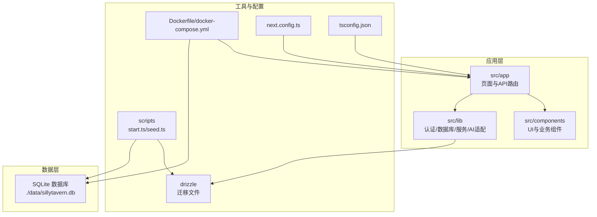
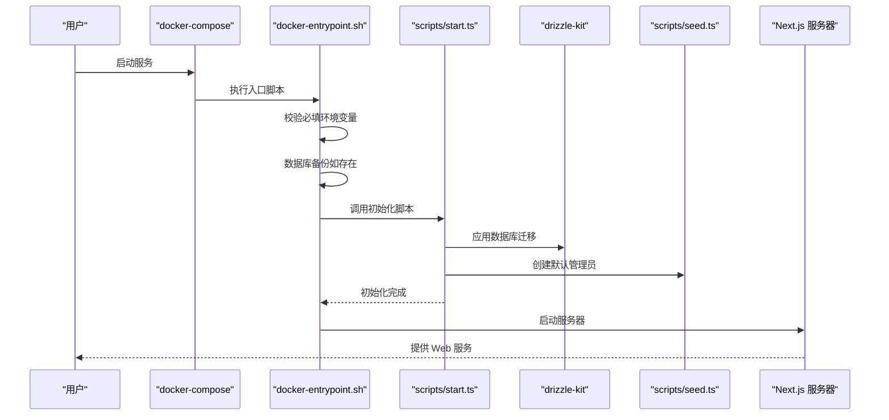
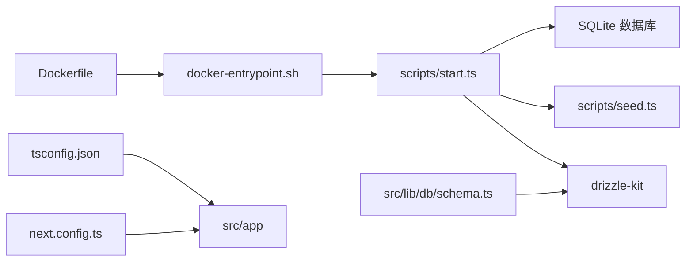

# 快速开始

<cite>
**本文引用的文件**
- [README.md](file://README.md)
- [package.json](file://package.json)
- [Dockerfile](file://Dockerfile)
- [docker-compose.yml](file://docker-compose.yml)
- [docker-entrypoint.sh](file://docker-entrypoint.sh)
- [scripts/start.ts](file://scripts/start.ts)
- [scripts/seed.ts](file://scripts/seed.ts)
- [drizzle.config.ts](file://drizzle.config.ts)
- [src/lib/config.ts](file://src/lib/config.ts)
- [src/lib/auth.config.ts](file://src/lib/auth.config.ts)
- [src/lib/db/schema.ts](file://src/lib/db/schema.ts)
- [next.config.ts](file://next.config.ts)
- [tsconfig.json](file://tsconfig.json)
</cite>

## 目录
1. [简介](#简介)
2. [项目结构](#项目结构)
3. [核心组件](#核心组件)
4. [架构总览](#架构总览)
5. [详细组件分析](#详细组件分析)
6. [依赖关系分析](#依赖关系分析)
7. [性能考虑](#性能考虑)
8. [故障排除指南](#故障排除指南)
9. [结论](#结论)
10. [附录](#附录)

## 简介
本指南面向首次部署 SillyTavern Next 的用户，提供两种部署方式的完整步骤：Docker 一键部署（推荐）与本地开发环境搭建。你将学会如何准备环境变量、一键启动与访问应用、以及如何在本地开发环境下安装依赖、执行初始化脚本并启动开发服务器。同时，文档涵盖关键环境变量说明、默认账号信息与初始密码修改提醒，并提供常见问题与故障排除建议。

## 项目结构
SillyTavern Next 采用 Next.js 16 App Router + TypeScript + SQLite 的技术栈，核心目录与职责概览如下：
- src/app：页面与 API 路由（含认证、角色、聊天、设置、世界书等）
- src/components：React 组件（角色卡、聊天 UI、设置面板等）
- src/lib：认证、数据库 schema/migration、AI Provider 适配、服务层等
- scripts：一键初始化与种子脚本（迁移、备份、创建默认管理员）
- drizzle：数据库迁移文件
- public：静态资源
- docker-compose.yml 与 Dockerfile：容器化部署入口
- next.config.ts：Next.js 构建与输出配置
- tsconfig.json：TypeScript 编译配置

图表来源
- [Dockerfile:1-63](file://Dockerfile#L1-L63)
- [docker-compose.yml:1-37](file://docker-compose.yml#L1-L37)
- [scripts/start.ts:1-96](file://scripts/start.ts#L1-L96)
- [drizzle.config.ts:1-11](file://drizzle.config.ts#L1-L11)
- [src/lib/db/schema.ts:1-240](file://src/lib/db/schema.ts#L1-L240)

章节来源
- [README.md:76-136](file://README.md#L76-L136)
- [next.config.ts:1-14](file://next.config.ts#L1-L14)
- [tsconfig.json:1-35](file://tsconfig.json#L1-L35)

## 核心组件
- Docker 一键部署：通过 docker-compose 启动，自动完成数据库备份、迁移、种子数据创建与服务启动。
- 本地开发：复制示例环境变量文件，安装依赖，执行一键初始化脚本，再启动开发服务器。
- 认证与会话：基于 NextAuth v5 的 Credentials Provider，JWT 会话策略。
- 数据库与迁移：Drizzle ORM + SQLite，迁移文件位于 drizzle 目录，schema 定义在 src/lib/db/schema.ts。
- 初始化流程：入口脚本负责自动备份、迁移、创建默认管理员，最终启动 Next.js 服务器。

章节来源
- [README.md:20-60](file://README.md#L20-L60)
- [package.json:6-17](file://package.json#L6-L17)
- [src/lib/auth.config.ts:1-53](file://src/lib/auth.config.ts#L1-L53)
- [src/lib/db/schema.ts:1-240](file://src/lib/db/schema.ts#L1-L240)

## 架构总览
下图展示了 Docker 一键部署的启动序列：容器启动 → 检查环境变量 → 自动备份 → 迁移与种子 → 启动服务。

图表来源
- [docker-compose.yml:10-37](file://docker-compose.yml#L10-L37)
- [docker-entrypoint.sh:15-69](file://docker-entrypoint.sh#L15-L69)
- [scripts/start.ts:65-96](file://scripts/start.ts#L65-L96)
- [scripts/seed.ts:14-27](file://scripts/seed.ts#L14-L27)

## 详细组件分析

### Docker 一键部署（推荐）
- 环境准备
  - 复制示例环境变量文件并生成强随机密钥，设置 AUTH_SECRET。
  - 可选设置 AUTH_URL、DATABASE_URL、各 AI 提供商默认 Key。
- 一键启动
  - 使用 docker compose up -d 后台启动，容器会自动执行初始化流程。
- 访问方式
  - 默认访问地址为 http://localhost:3000。
- 默认账号与密码
  - 默认管理员账号为 admin/admin，首次登录后请立即修改密码。
- 数据持久化
  - 请确保 ./data:/app/data 卷映射存在，避免数据库丢失。

章节来源
- [README.md:22-38](file://README.md#L22-L38)
- [docker-compose.yml:4-37](file://docker-compose.yml#L4-L37)
- [Dockerfile:29-59](file://Dockerfile#L29-L59)
- [docker-entrypoint.sh:15-69](file://docker-entrypoint.sh#L15-L69)
- [scripts/start.ts:94-96](file://scripts/start.ts#L94-L96)

### 本地开发环境搭建
- 环境变量配置
  - 复制示例文件为 .env.local，至少设置 AUTH_SECRET。
  - 可选设置 AUTH_URL、DATABASE_URL、各 AI 提供商默认 Key。
- 依赖安装
  - 使用 npm install 安装依赖。
- 初始化脚本
  - 执行 npm run setup 或 npx tsx scripts/start.ts，完成数据库迁移与默认管理员创建。
- 启动开发服务器
  - 使用 npm run dev 启动开发服务器，访问 http://localhost:3000。

章节来源
- [README.md:40-58](file://README.md#L40-L58)
- [package.json:6-17](file://package.json#L6-L17)
- [scripts/start.ts:18-96](file://scripts/start.ts#L18-L96)

### 认证与会话（NextAuth v5）
- 登录方式
  - 使用 Credentials Provider，用户名与密码登录。
- 会话策略
  - JWT 会话，有效期 30 天。
- 授权回调
  - 除登录页、认证 API 与健康检查外，其余页面均需登录。
- 配置文件
  - 认证配置位于 src/lib/auth.config.ts。

章节来源
- [src/lib/auth.config.ts:1-53](file://src/lib/auth.config.ts#L1-L53)

### 数据库与迁移（Drizzle ORM + SQLite）
- 数据库路径
  - 默认 DATABASE_URL 为 ./data/sillytavern.db。
- 迁移配置
  - drizzle.config.ts 指定 schema 与输出目录。
- 数据模型
  - schema 定义了用户、角色卡、标签、Persona、群组、聊天、消息、世界书、预设、密钥、设置、Instruct/Context 模板等表。
- 初始化流程
  - scripts/start.ts 负责自动备份、迁移与种子数据创建。

章节来源
- [drizzle.config.ts:1-11](file://drizzle.config.ts#L1-L11)
- [src/lib/db/schema.ts:1-240](file://src/lib/db/schema.ts#L1-L240)
- [scripts/start.ts:24-96](file://scripts/start.ts#L24-L96)

### 初始化脚本与种子数据
- 自动备份
  - 启动前对现有数据库进行备份，保留最近 5 份，含 WAL/SHM 文件。
- 数据库迁移
  - 使用 drizzle-kit migrate 应用迁移。
- 种子数据
  - 若不存在默认管理员，则创建 admin/admin，首次登录后请修改密码。
- 错误处理
  - 迁移失败时打印回滚命令，便于快速恢复。

章节来源
- [scripts/start.ts:24-96](file://scripts/start.ts#L24-L96)
- [scripts/seed.ts:14-27](file://scripts/seed.ts#L14-L27)
- [docker-entrypoint.sh:25-66](file://docker-entrypoint.sh#L25-L66)

### Next.js 构建与输出配置
- Standalone 输出
  - 采用 Next.js standalone 输出，便于容器部署。
- 外部包声明
  - serverExternalPackages 包含 better-sqlite3，避免打包问题。
- 实验特性
  - 启用 server actions 并提升请求体大小限制。

章节来源
- [next.config.ts:1-14](file://next.config.ts#L1-L14)

### TypeScript 配置
- 路径别名
  - 使用 @/* 映射到 src/*。
- 模块解析
  - 使用 bundler 解析，启用 isolatedModules 与严格模式。

章节来源
- [tsconfig.json:1-35](file://tsconfig.json#L1-L35)

## 依赖关系分析
- 组件耦合
  - Dockerfile 与 docker-entrypoint.sh 强耦合，共同完成启动前准备与初始化。
  - scripts/start.ts 依赖 drizzle-kit 与 better-sqlite3，负责迁移与种子。
  - src/lib/db/schema.ts 为 Drizzle 迁移的唯一真相来源。
- 外部依赖
  - Next.js、NextAuth、Drizzle ORM、better-sqlite3、AI SDK 等。
- 可能的循环依赖
  - 当前结构清晰，未发现明显循环依赖。

图表来源
- [Dockerfile:1-63](file://Dockerfile#L1-L63)
- [docker-entrypoint.sh:1-70](file://docker-entrypoint.sh#L1-L70)
- [scripts/start.ts:1-96](file://scripts/start.ts#L1-L96)
- [scripts/seed.ts:1-28](file://scripts/seed.ts#L1-L28)
- [drizzle.config.ts:1-11](file://drizzle.config.ts#L1-L11)
- [src/lib/db/schema.ts:1-240](file://src/lib/db/schema.ts#L1-L240)
- [next.config.ts:1-14](file://next.config.ts#L1-L14)
- [tsconfig.json:1-35](file://tsconfig.json#L1-L35)

## 性能考虑
- 数据库 WAL 模式
  - 自动备份时会同步备份 -wal 与 -shm 文件，确保一致性。
- 备份保留策略
  - 默认保留最近 5 份，超出数量按最后修改时间删除最旧备份。
- 构建输出
  - 使用 standalone 输出减少容器体积，提升启动速度。
- 会话有效期
  - JWT 会话有效期较长，注意安全策略与用户行为。

章节来源
- [scripts/start.ts:40-62](file://scripts/start.ts#L40-L62)
- [docker-entrypoint.sh:35-46](file://docker-entrypoint.sh#L35-L46)
- [next.config.ts:4-11](file://next.config.ts#L4-L11)

## 故障排除指南
- AUTH_SECRET 未设置
  - 症状：容器启动时报错要求设置 AUTH_SECRET。
  - 处理：在 .env 或 docker-compose.yml 中设置 AUTH_SECRET，使用强随机串。
- 数据库迁移失败
  - 症状：初始化失败并打印回滚命令。
  - 处理：根据日志提示执行回滚命令，修复迁移后再重启。
- 数据卷未挂载
  - 症状：容器重启后数据丢失。
  - 处理：确保 ./data:/app/data 卷映射存在且权限正确。
- 默认管理员未创建
  - 症状：无法使用 admin/admin 登录。
  - 处理：确认初始化脚本执行成功，或手动执行种子脚本。
- 初始密码未修改
  - 症状：首次登录后仍使用默认密码。
  - 处理：登录后立即在设置中修改密码。

章节来源
- [docker-entrypoint.sh:15-20](file://docker-entrypoint.sh#L15-L20)
- [scripts/start.ts:70-83](file://scripts/start.ts#L70-L83)
- [README.md:150-156](file://README.md#L150-L156)
- [scripts/seed.ts:14-18](file://scripts/seed.ts#L14-L18)

## 结论
通过本快速开始指南，你可以选择 Docker 一键部署或本地开发两种方式快速运行 SillyTavern Next。Docker 方式适合生产与演示环境，具备自动备份、迁移与种子数据能力；本地开发方式适合二次开发与调试。请务必设置强随机 AUTH_SECRET、挂载数据卷、修改默认管理员密码，并参考故障排除指南解决常见问题。

## 附录

### 环境变量说明
- AUTH_SECRET：NextAuth 签名密钥，生产环境必须使用强随机串。
- AUTH_URL：站点访问 URL，默认 http://localhost:3000。
- DATABASE_URL：SQLite 数据库路径，默认 ./data/sillytavern.db。
- OPENAI_API_KEY / ANTHROPIC_API_KEY / GOOGLE_GENERATIVE_AI_API_KEY：各提供商默认 Key（推荐登录后在 UI 中按用户配置）。
- PORT：Docker 端口映射，默认 3000。

章节来源
- [README.md:62-74](file://README.md#L62-L74)
- [docker-compose.yml:20-30](file://docker-compose.yml#L20-L30)
- [Dockerfile:25-29](file://Dockerfile#L25-L29)