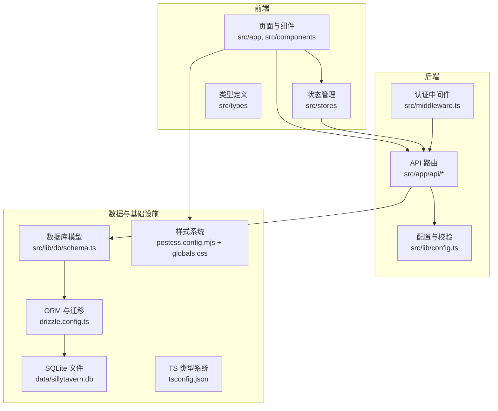
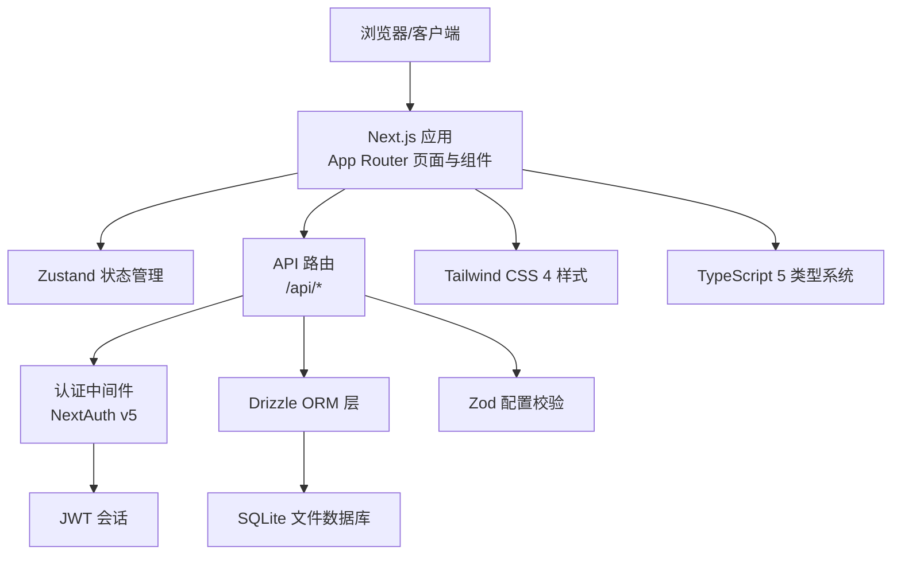
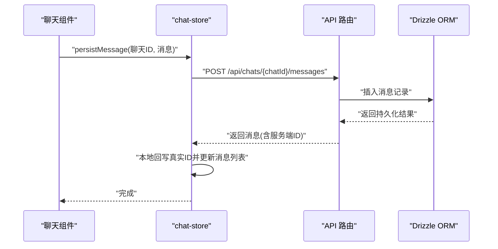
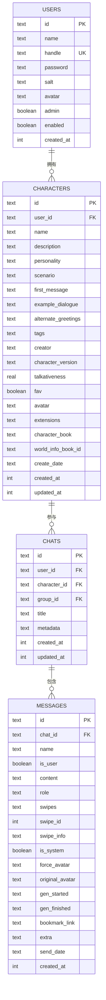
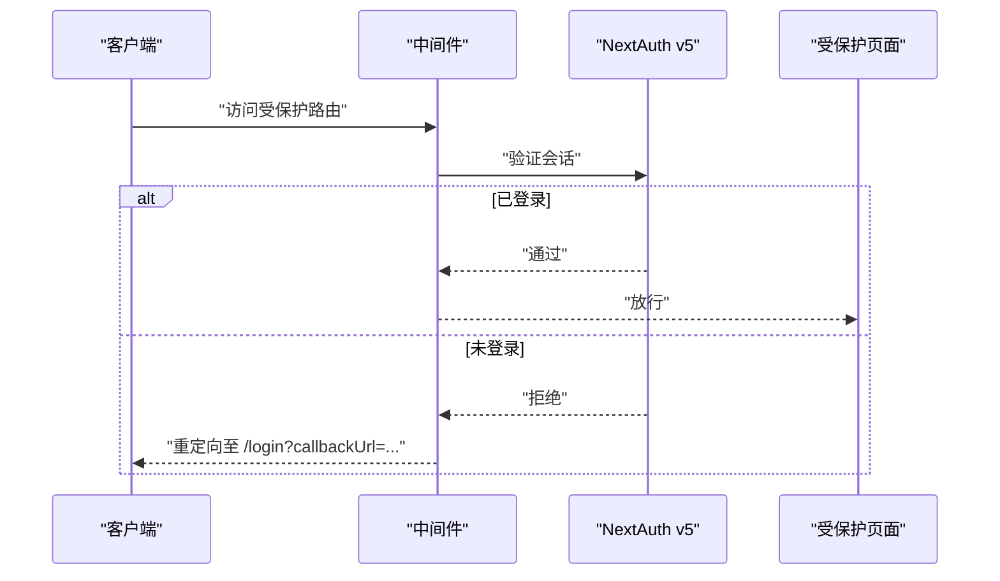
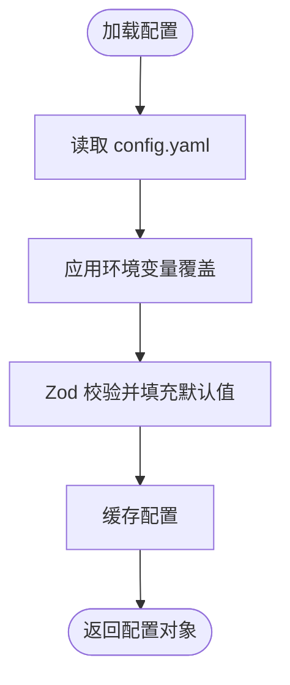
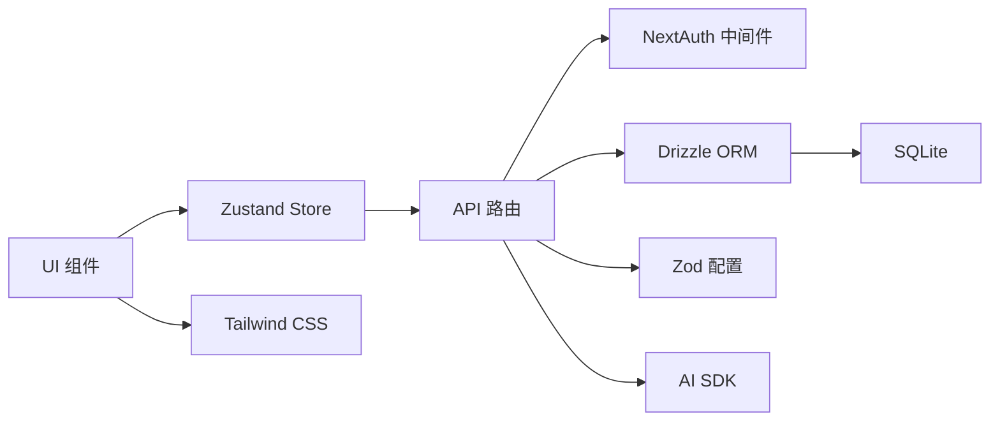

# 技术栈

<cite>
**本文引用的文件**
- [package.json](file://package.json)
- [next.config.ts](file://next.config.ts)
- [tsconfig.json](file://tsconfig.json)
- [drizzle.config.ts](file://drizzle.config.ts)
- [src/lib/auth.config.ts](file://src/lib/auth.config.ts)
- [src/middleware.ts](file://src/middleware.ts)
- [src/lib/config.ts](file://src/lib/config.ts)
- [src/lib/db/schema.ts](file://src/lib/db/schema.ts)
- [src/stores/chat-store.ts](file://src/stores/chat-store.ts)
- [src/app/layout.tsx](file://src/app/layout.tsx)
- [postcss.config.mjs](file://postcss.config.mjs)
- [Dockerfile](file://Dockerfile)
</cite>

## 目录
1. [简介](#简介)
2. [项目结构](#项目结构)
3. [核心组件](#核心组件)
4. [架构总览](#架构总览)
5. [详细组件分析](#详细组件分析)
6. [依赖关系分析](#依赖关系分析)
7. [性能考量](#性能考量)
8. [故障排查指南](#故障排查指南)
9. [结论](#结论)
10. [附录](#附录)

## 简介
本文件系统性梳理 SillyTavern Next 项目的技术选型与架构决策，帮助开发者快速建立对整体技术栈的认知。重点覆盖前端框架（Next.js 16 + React 19）、语言（TypeScript 5）、样式（Tailwind CSS 4）、状态管理（Zustand 5）、数据库（SQLite + better-sqlite3 + Drizzle ORM）、认证（NextAuth v5）、AI SDK（Vercel AI SDK + 多 Provider 适配器）、校验（Zod 4）等。文档通过“高层概览 + 组件剖析 + 依赖关系 + 性能与排障”四段式呈现，既适合初学者快速上手，也便于资深工程师深入理解设计动机与落地细节。

## 项目结构
项目采用基于功能域的组织方式，前端以 Next.js App Router 为核心，按页面与组件分层；后端 API 通过 App Router 的路由约定暴露；数据库层由 Drizzle ORM 管理，配合 SQLite 与 better-sqlite3；认证使用 NextAuth v5；状态管理采用 Zustand；类型与校验分别由 TypeScript 与 Zod 提供；样式体系基于 Tailwind CSS 4。

图表来源
- [src/app/layout.tsx:1-24](file://src/app/layout.tsx#L1-L24)
- [src/stores/chat-store.ts:1-583](file://src/stores/chat-store.ts#L1-L583)
- [src/lib/db/schema.ts:1-240](file://src/lib/db/schema.ts#L1-L240)
- [drizzle.config.ts:1-11](file://drizzle.config.ts#L1-L11)
- [src/lib/config.ts:1-184](file://src/lib/config.ts#L1-L184)
- [src/middleware.ts:1-35](file://src/middleware.ts#L1-L35)
- [postcss.config.mjs:1-8](file://postcss.config.mjs#L1-L8)
- [tsconfig.json:1-35](file://tsconfig.json#L1-L35)

章节来源
- [src/app/layout.tsx:1-24](file://src/app/layout.tsx#L1-L24)
- [src/stores/chat-store.ts:1-583](file://src/stores/chat-store.ts#L1-L583)
- [src/lib/db/schema.ts:1-240](file://src/lib/db/schema.ts#L1-L240)
- [drizzle.config.ts:1-11](file://drizzle.config.ts#L1-L11)
- [src/lib/config.ts:1-184](file://src/lib/config.ts#L1-L184)
- [src/middleware.ts:1-35](file://src/middleware.ts#L1-L35)
- [postcss.config.mjs:1-8](file://postcss.config.mjs#L1-L8)
- [tsconfig.json:1-35](file://tsconfig.json#L1-L35)

## 核心组件
- 前端框架与构建
  - Next.js 16：App Router + Server Actions + Standalone 输出，满足现代 SSR/SSG 与边缘兼容需求。
  - React 19：最新版本，提升渲染性能与并发能力。
  - TypeScript 5：严格类型保障，配合路径别名与增量编译优化开发体验。
- 样式与主题
  - Tailwind CSS 4：原子类驱动，结合 PostCSS 与暗色主题全局配置，统一视觉与交互风格。
- 状态管理
  - Zustand 5：轻量、易用、高性能的状态容器，用于聊天、预设、世界设定等模块化状态。
- 数据库与 ORM
  - SQLite + better-sqlite3：单机部署友好，零运维成本；支持 Docker/容器化部署。
  - Drizzle ORM：类型安全的 SQL DSL，支持迁移与模式定义，兼顾灵活性与可维护性。
- 认证与授权
  - NextAuth v5：Edge 兼容的认证方案，JWT 会话策略，统一的回调与中间件控制。
- AI SDK 与多 Provider 适配
  - Vercel AI SDK + 多 Provider：统一的 AI 对话接口，适配 OpenAI、Anthropic、Google 等多家模型服务。
- 配置与校验
  - Zod 4：强类型配置校验，支持 YAML 配置文件与环境变量覆盖，保证运行期一致性。
- 构建与打包
  - Next.js Standalone 输出 + Docker 多阶段构建，确保生产环境体积小、启动快、可移植。

章节来源
- [package.json:1-61](file://package.json#L1-L61)
- [next.config.ts:1-14](file://next.config.ts#L1-L14)
- [tsconfig.json:1-35](file://tsconfig.json#L1-L35)
- [postcss.config.mjs:1-8](file://postcss.config.mjs#L1-L8)
- [src/lib/db/schema.ts:1-240](file://src/lib/db/schema.ts#L1-L240)
- [drizzle.config.ts:1-11](file://drizzle.config.ts#L1-L11)
- [src/lib/auth.config.ts:1-53](file://src/lib/auth.config.ts#L1-L53)
- [src/middleware.ts:1-35](file://src/middleware.ts#L1-L35)
- [src/lib/config.ts:1-184](file://src/lib/config.ts#L1-L184)
- [src/stores/chat-store.ts:1-583](file://src/stores/chat-store.ts#L1-L583)

## 架构总览
下图展示从前端 UI 到后端 API、数据库与认证的端到端流程，体现各技术栈在系统中的定位与协作方式。

图表来源
- [src/app/layout.tsx:1-24](file://src/app/layout.tsx#L1-L24)
- [src/stores/chat-store.ts:1-583](file://src/stores/chat-store.ts#L1-L583)
- [src/middleware.ts:1-35](file://src/middleware.ts#L1-L35)
- [src/lib/auth.config.ts:1-53](file://src/lib/auth.config.ts#L1-L53)
- [src/lib/db/schema.ts:1-240](file://src/lib/db/schema.ts#L1-L240)
- [drizzle.config.ts:1-11](file://drizzle.config.ts#L1-L11)
- [src/lib/config.ts:1-184](file://src/lib/config.ts#L1-L184)
- [postcss.config.mjs:1-8](file://postcss.config.mjs#L1-L8)
- [tsconfig.json:1-35](file://tsconfig.json#L1-L35)

## 详细组件分析

### 前端框架与构建（Next.js 16 + React 19 + TypeScript 5）
- 选择理由
  - Next.js 16 提供稳定的 App Router 与 Server Actions，利于前后端一体化开发与性能优化。
  - React 19 带来更优的并发渲染与内存表现，适合复杂聊天界面。
  - TypeScript 5 提供更强的类型推导与编译性能，结合路径别名与增量编译提升开发效率。
- 应用场景
  - 页面级路由与布局：如根布局、登录页、聊天页等。
  - 组件化 UI：消息气泡、Markdown 渲染、侧边栏等。
  - 状态与异步：通过 Zustand 管理聊天上下文与消息流。
- 关键配置
  - Standalone 输出与外部包排除，减少运行时体积。
  - 路径别名与 JSX 配置，统一工程入口。

章节来源
- [next.config.ts:1-14](file://next.config.ts#L1-L14)
- [tsconfig.json:1-35](file://tsconfig.json#L1-L35)
- [src/app/layout.tsx:1-24](file://src/app/layout.tsx#L1-L24)

### 样式系统（Tailwind CSS 4）
- 选择理由
  - 原子类驱动，快速搭建一致的 UI 与主题，降低样式冲突。
  - 与 PostCSS 集成，支持暗色主题全局开关与工具函数扩展。
- 应用场景
  - 全局背景与文字颜色、暗色主题根节点配置。
  - 组件内尺寸、间距、颜色与交互态的声明式组合。
- 配置要点
  - PostCSS 插件加载 Tailwind CSS 4。
  - 全局样式引入 KaTeX 等第三方样式资源。

章节来源
- [postcss.config.mjs:1-8](file://postcss.config.mjs#L1-L8)
- [src/app/layout.tsx:1-24](file://src/app/layout.tsx#L1-L24)

### 状态管理（Zustand 5）
- 选择理由
  - 轻量、无样板代码，适合模块化状态（聊天、预设、世界设定）。
  - 支持异步动作与副作用，便于与 API 路由协同。
- 应用场景
  - 聊天状态：当前会话、消息列表、生成状态、分支与书签等。
  - 乐观更新与本地回写：消息 PATCH、删除、移动、推理块编辑等。
- 关键流程
  - 本地状态变更与远程持久化并行推进，失败时可回滚或提示。

图表来源
- [src/stores/chat-store.ts:235-272](file://src/stores/chat-store.ts#L235-L272)
- [src/lib/db/schema.ts:145-168](file://src/lib/db/schema.ts#L145-L168)

章节来源
- [src/stores/chat-store.ts:1-583](file://src/stores/chat-store.ts#L1-L583)

### 数据库与 ORM（SQLite + better-sqlite3 + Drizzle ORM）
- 选择理由
  - SQLite 适合单机与容器化部署，无需额外数据库实例。
  - better-sqlite3 提供高性能原生绑定，适合中小规模数据与高并发写入。
  - Drizzle ORM 提供类型安全的查询与迁移，兼顾灵活性与可维护性。
- 应用场景
  - 用户、角色卡、群组、聊天、消息、世界设定、预设、密钥、设置等表结构。
  - 迁移与模式定义，支持版本演进与数据一致性。
- 关键配置
  - Drizzle 配置指向 SQLite 文件路径，schema 路径与输出目录。

图表来源
- [src/lib/db/schema.ts:1-240](file://src/lib/db/schema.ts#L1-L240)

章节来源
- [drizzle.config.ts:1-11](file://drizzle.config.ts#L1-L11)
- [src/lib/db/schema.ts:1-240](file://src/lib/db/schema.ts#L1-L240)

### 认证与授权（NextAuth v5）
- 选择理由
  - Edge 兼容配置，适配现代运行时与边缘网络。
  - JWT 会话策略，支持自定义回调与中间件拦截。
- 应用场景
  - 登录页与认证回调路由。
  - 中间件统一鉴权：允许公开端点（登录、健康检查等），其余路径强制登录。
  - 会话与令牌回调：注入用户信息与权限标记。
- 关键流程

图表来源
- [src/middleware.ts:1-35](file://src/middleware.ts#L1-L35)
- [src/lib/auth.config.ts:1-53](file://src/lib/auth.config.ts#L1-L53)

章节来源
- [src/middleware.ts:1-35](file://src/middleware.ts#L1-L35)
- [src/lib/auth.config.ts:1-53](file://src/lib/auth.config.ts#L1-L53)

### AI SDK 与多 Provider 适配
- 选择理由
  - Vercel AI SDK 提供统一的流式生成与多 Provider 接口抽象，便于切换与扩展。
  - 适配 OpenAI、Anthropic、Google 等多家模型服务，满足不同场景与合规要求。
- 应用场景
  - 聊天消息生成、推理块处理、文本补全等。
  - 与 Zustand 状态协同，支持流式渲染与中间态更新。
- 集成方式
  - 在 API 路由中调用 AI SDK，将请求转发至具体 Provider，再将响应流式返回给前端。

章节来源
- [package.json:18-46](file://package.json#L18-L46)
- [src/stores/chat-store.ts:1-583](file://src/stores/chat-store.ts#L1-L583)

### 配置与校验（Zod 4）
- 选择理由
  - 强类型配置 Schema，确保配置项的正确性与默认值一致性。
  - 支持 YAML 文件与环境变量覆盖，便于容器化与多环境部署。
- 应用场景
  - 服务器网络、安全、CORS、SSO、AI 默认设置、扩展等配置项。
  - 配置加载、键路径解析、环境变量映射与类型推断。
- 关键流程

图表来源
- [src/lib/config.ts:88-117](file://src/lib/config.ts#L88-L117)

章节来源
- [src/lib/config.ts:1-184](file://src/lib/config.ts#L1-L184)

### 构建与部署（Next.js Standalone + Docker）
- 选择理由
  - Standalone 输出减少运行时依赖，提升启动速度与安全性。
  - Docker 多阶段构建，隔离依赖与产物，便于 CI/CD 与生产部署。
- 应用场景
  - 构建阶段安装依赖与打包；运行阶段仅包含必要文件与数据卷。
  - 数据库文件与迁移脚本随镜像部署，支持首次启动初始化。
- 关键配置
  - 环境变量（端口、主机、数据库 URL）、非 root 用户、数据卷挂载。

章节来源
- [next.config.ts:1-14](file://next.config.ts#L1-L14)
- [Dockerfile:1-63](file://Dockerfile#L1-L63)

## 依赖关系分析
- 组件耦合与内聚
  - UI 与状态管理解耦，通过 API 路由进行数据交换，降低组件间紧耦合。
  - 认证中间件集中处理访问控制，避免在业务路由中重复逻辑。
  - Drizzle ORM 作为数据访问层，向上提供类型安全的查询接口。
- 外部依赖与集成点
  - NextAuth v5 与认证回调、JWT 策略集成。
  - AI SDK 与多家 Provider 的统一抽象接口。
  - Zod 与配置文件/环境变量的强类型绑定。
- 潜在循环依赖
  - 通过分层（UI/Store/API/DB）与明确的导入路径避免循环依赖。

图表来源
- [src/stores/chat-store.ts:1-583](file://src/stores/chat-store.ts#L1-L583)
- [src/middleware.ts:1-35](file://src/middleware.ts#L1-L35)
- [src/lib/db/schema.ts:1-240](file://src/lib/db/schema.ts#L1-L240)
- [src/lib/config.ts:1-184](file://src/lib/config.ts#L1-L184)
- [package.json:18-46](file://package.json#L18-L46)

章节来源
- [package.json:1-61](file://package.json#L1-L61)
- [src/stores/chat-store.ts:1-583](file://src/stores/chat-store.ts#L1-L583)
- [src/middleware.ts:1-35](file://src/middleware.ts#L1-L35)
- [src/lib/db/schema.ts:1-240](file://src/lib/db/schema.ts#L1-L240)
- [src/lib/config.ts:1-184](file://src/lib/config.ts#L1-L184)

## 性能考量
- 前端性能
  - 使用 React 19 与 Next.js 16 的并发渲染与增量静态生成能力，减少首屏等待。
  - Zustand 低开销状态管理，避免不必要的重渲染。
- 数据访问性能
  - SQLite 适合中小规模数据；better-sqlite3 提供高效原生绑定。
  - Drizzle ORM 生成类型安全的查询，减少运行时错误与无效查询。
- 运行时性能
  - Next.js Standalone 输出减少运行时依赖，提升冷启动速度。
  - Docker 多阶段构建与非 root 用户运行，提升安全性与稳定性。
- 开发体验
  - TypeScript 5 与 ESLint 配置，提升代码质量与一致性。

## 故障排查指南
- 认证相关
  - 症状：访问受保护页面被重定向到登录页。
  - 排查：确认中间件是否正确匹配路径；检查会话是否存在；核对回调与页面路由。
- 数据库相关
  - 症状：迁移失败或无法连接数据库。
  - 排查：确认 DATABASE_URL 指向有效路径；检查 Drizzle 配置与 schema 路径；查看迁移日志。
- 配置相关
  - 症状：配置项未生效或类型错误。
  - 排查：检查 YAML 文件语法与键名；核对环境变量覆盖规则；查看 Zod 校验错误输出。
- 构建与部署
  - 症状：Docker 启动报错或无法访问。
  - 排查：确认数据卷挂载与权限；检查环境变量（端口、主机、数据库 URL）；查看容器日志。

章节来源
- [src/middleware.ts:1-35](file://src/middleware.ts#L1-L35)
- [drizzle.config.ts:1-11](file://drizzle.config.ts#L1-L11)
- [src/lib/config.ts:108-114](file://src/lib/config.ts#L108-L114)
- [Dockerfile:25-30](file://Dockerfile#L25-L30)

## 结论
SillyTavern Next 采用现代化、轻量且可扩展的技术栈：以 Next.js 16 + React 19 为基础，结合 TypeScript 5 与 Tailwind CSS 4 构建高质量前端；以 Zustand 5 实现轻量状态管理；以 SQLite + better-sqlite3 + Drizzle ORM 提供类型安全的数据访问；以 NextAuth v5 与 JWT 实现统一认证；以 Vercel AI SDK 与多 Provider 适配满足多样化 AI 生成需求；以 Zod 4 与 YAML/环境变量实现强类型配置。整体架构清晰、边界明确、易于维护与扩展，适合个人与团队在单机与容器化环境中快速迭代与交付。

## 附录
- 快速参考
  - 构建与运行：npm run build、npm run start
  - 数据库：npm run db:migrate、npm run db:seed
  - 初始化：npm run setup、npm run start:fresh
- 常用端点
  - 认证：/api/auth/[...nextauth]
  - 聊天：/api/chats、/api/chats/[id]、/api/chats/[id]/messages
  - 健康检查：/api/health