# 核心特性

<cite>
**本文引用的文件**
- [README.md](file://README.md)
- [package.json](file://package.json)
- [src/lib/config.ts](file://src/lib/config.ts)
- [src/middleware.ts](file://src/middleware.ts)
- [src/lib/db/schema.ts](file://src/lib/db/schema.ts)
- [src/lib/parsers/character-card-parser.ts](file://src/lib/parsers/character-card-parser.ts)
- [src/types/index.ts](file://src/types/index.ts)
- [src/components/chat/chat-area.tsx](file://src/components/chat/chat-area.tsx)
- [src/lib/group-chat/activation.ts](file://src/lib/group-chat/activation.ts)
- [src/lib/services/group-service.ts](file://src/lib/services/group-service.ts)
- [src/hooks/useGroupGeneration.ts](file://src/hooks/useGroupGeneration.ts)
- [src/lib/services/chat-service.ts](file://src/lib/services/chat-service.ts)
- [src/lib/formatting/build-prompt.ts](file://src/lib/formatting/build-prompt.ts)
- [src/lib/services/persona-service.ts](file://src/lib/services/persona-service.ts)
- [src/lib/worldinfo/engine.ts](file://src/lib/worldinfo/engine.ts)
- [src/components/world-info/world-info-settings.tsx](file://src/components/world-info/world-info-settings.tsx)
- [src/components/advanced-formatting/context-column.tsx](file://src/components/advanced-formatting/context-column.tsx)
- [src/components/advanced-formatting/misc-column.tsx](file://src/components/advanced-formatting/misc-column.tsx)
- [src/lib/ai/providers.ts](file://src/lib/ai/providers.ts)
- [src/app/api/connections/models/route.ts](file://src/app/api/connections/models/route.ts)
- [src/types/index.ts](file://src/types/index.ts)
- [src/app/api/chat/route.ts](file://src/app/api/chat/route.ts)
- [src/app/api/connections/test-message/route.ts](file://src/app/api/connections/test-message/route.ts)
- [src/components/chat/chat-area.tsx](file://src/components/chat/chat-area.tsx)
- [scripts/start.ts](file://scripts/start.ts)
</cite>

## 目录
1. [简介](#简介)
2. [项目结构](#项目结构)
3. [核心组件](#核心组件)
4. [架构总览](#架构总览)
5. [详细组件分析](#详细组件分析)
6. [依赖分析](#依赖分析)
7. [性能考量](#性能考量)
8. [故障排查指南](#故障排查指南)
9. [结论](#结论)

## 简介
本项目是基于 Next.js 16 + TypeScript + SQLite 的现代化 SillyTavern 前端重写，强调“单机部署、开箱即用”。其核心目标是为用户提供一套功能完备、可移植、可扩展的 AI 角色扮演与群聊平台，涵盖角色卡系统（兼容 TavernCard V2/V3）、群聊多角色轮换与分支、Persona 身份系统、世界书三级联动与深度词条扫描、高级格式化模板可视化编辑、35+ AI 提供商统一接入、Author’s Note 注入、以及 SQLite 单文件数据自治。

## 项目结构
- 应用层（App Router）：页面与 API 路由集中于 src/app，包含角色、聊天、设置、世界书、预设、连接等子路由。
- 组件层：src/components 下按功能拆分，如角色卡、聊天 UI、群聊面板、世界书编辑器、高级格式化面板等。
- 服务层：src/lib/services/* 提供业务服务，如角色卡解析、群聊、世界书、密钥管理等。
- 引擎与适配：src/lib/worldinfo/engine.ts、src/lib/formatting/build-prompt.ts、src/lib/ai/providers.ts 等。
- 数据层：Drizzle ORM + SQLite，迁移文件位于 drizzle/，schema 定义于 src/lib/db/schema.ts。
- 状态与配置：Zustand 全局状态、Zod 配置加载与校验、NextAuth 认证中间件。

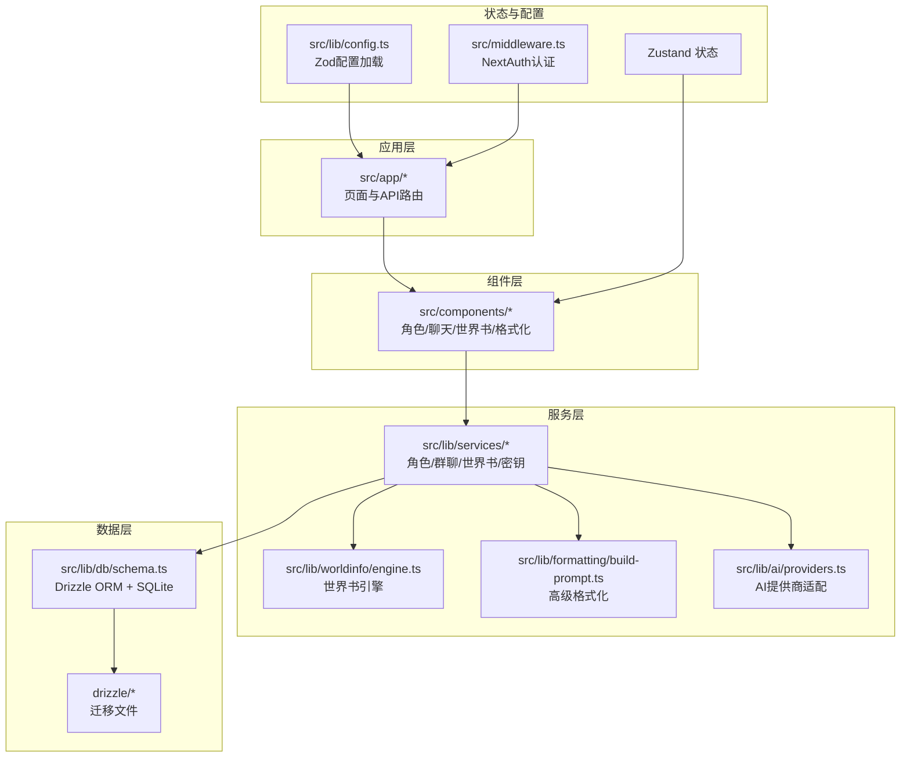

图表来源
- [src/lib/db/schema.ts:18-46](file://src/lib/db/schema.ts#L18-L46)
- [src/lib/worldinfo/engine.ts:1-185](file://src/lib/worldinfo/engine.ts#L1-L185)
- [src/lib/formatting/build-prompt.ts:1-58](file://src/lib/formatting/build-prompt.ts#L1-L58)
- [src/lib/ai/providers.ts:1-174](file://src/lib/ai/providers.ts#L1-L174)
- [src/lib/config.ts:1-184](file://src/lib/config.ts#L1-L184)
- [src/middleware.ts:1-35](file://src/middleware.ts#L1-L35)

章节来源
- [README.md:78-108](file://README.md#L78-L108)
- [src/lib/config.ts:88-117](file://src/lib/config.ts#L88-L117)
- [src/middleware.ts:8-30](file://src/middleware.ts#L8-L30)

## 核心组件
- 角色卡系统（兼容 TavernCard V2/V3）：支持 JSON 与 PNG 双向导入导出，数据库 schema 完全对齐 V2 规范，并扩展 ST 自有字段。
- 群聊功能（多角色轮换、@点名、Swipe 分支、检查点）：自然激活策略、分支与续写、整批重生、自动模式与延迟。
- Persona 系统：用户身份切换、宏变量替换、描述注入位置与深度策略、角色/群组绑定。
- 世界书系统（全局/角色级/聊天级三级联动，深度词条扫描）：选择逻辑、递归控制、Token 预算、位置分桶。
- 高级格式化（Context/Instruct/SysPrompt/Reasoning 模板可视化编辑）：宏替换、全局格式化开关、模板分区。
- 多 AI 提供商支持（OpenAI、Anthropic、Google、OpenRouter、本地 Ollama 等 35+）：统一适配器、模型发现、测试连通性。
- Author's Note 功能：作者注释自动注入提示词，随聊天元数据持久化。
- 数据自治（SQLite 单文件存储）：Drizzle ORM + better-sqlite3，自动备份与迁移，WAL 模式支持。

章节来源
- [README.md:9-18](file://README.md#L9-L18)
- [src/lib/db/schema.ts:18-46](file://src/lib/db/schema.ts#L18-L46)
- [src/lib/parsers/character-card-parser.ts:30-75](file://src/lib/parsers/character-card-parser.ts#L30-L75)
- [src/lib/services/group-service.ts:11-22](file://src/lib/services/group-service.ts#L11-L22)
- [src/lib/group-chat/activation.ts:66-86](file://src/lib/group-chat/activation.ts#L66-L86)
- [src/lib/services/persona-service.ts:106-271](file://src/lib/services/persona-service.ts#L106-L271)
- [src/lib/worldinfo/engine.ts:1-185](file://src/lib/worldinfo/engine.ts#L1-L185)
- [src/components/advanced-formatting/context-column.tsx:1-59](file://src/components/advanced-formatting/context-column.tsx#L1-L59)
- [src/components/advanced-formatting/misc-column.tsx:1-63](file://src/components/advanced-formatting/misc-column.tsx#L1-L63)
- [src/lib/ai/providers.ts:1-174](file://src/lib/ai/providers.ts#L1-L174)
- [src/app/api/connections/models/route.ts:65-101](file://src/app/api/connections/models/route.ts#L65-L101)
- [src/app/api/connections/test-message/route.ts:56-90](file://src/app/api/connections/test-message/route.ts#L56-L90)
- [src/components/chat/chat-area.tsx:1167-1201](file://src/components/chat/chat-area.tsx#L1167-L1201)
- [scripts/start.ts:24-53](file://scripts/start.ts#L24-L53)

## 架构总览
系统围绕“配置 → 认证 → 服务 → 引擎 → 组件 → 数据库”的链路组织，AI 请求通过统一适配器路由至各提供商，世界书与高级格式化在生成前参与提示词构造，群聊与分支在 UI 与服务层协同处理。

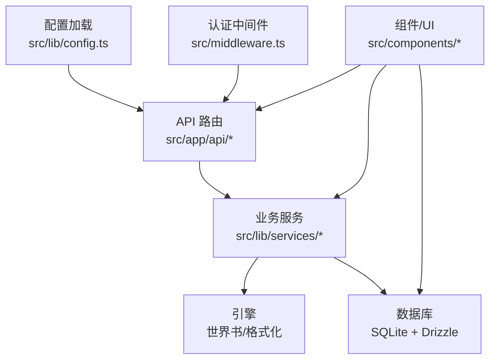

图表来源
- [src/lib/config.ts:88-117](file://src/lib/config.ts#L88-L117)
- [src/middleware.ts:8-30](file://src/middleware.ts#L8-L30)
- [src/app/api/chat/route.ts:1-18](file://src/app/api/chat/route.ts#L1-L18)
- [src/lib/worldinfo/engine.ts:1-185](file://src/lib/worldinfo/engine.ts#L1-L185)
- [src/lib/formatting/build-prompt.ts:1-58](file://src/lib/formatting/build-prompt.ts#L1-L58)
- [src/lib/db/schema.ts:18-46](file://src/lib/db/schema.ts#L18-L46)

## 详细组件分析

### 角色卡系统（兼容 TavernCard V2/V3）
- 核心价值：与社区生态无缝对接，支持 PNG/JSON 双向导入导出，保障角色资产可移植。
- 使用场景：快速迁移历史角色、多人协作共享、批量导入导出。
- 实现原理：
  - 数据库 schema 完全兼容 V2 字段，并扩展 ST 自有字段（如 talkativeness、fav、avatar、extensions、characterBook）。
  - 解析器识别 V2/V3 格式，提取基础字段与扩展字段，支持 character_book 嵌入式世界书。
  - 前端表单与类型对齐，保证编辑体验与后端存储一致性。

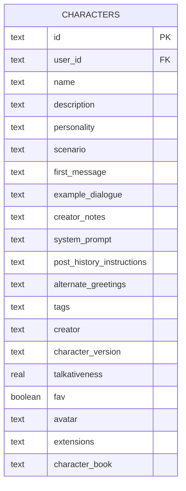

图表来源
- [src/lib/db/schema.ts:18-46](file://src/lib/db/schema.ts#L18-L46)
- [src/lib/parsers/character-card-parser.ts:30-75](file://src/lib/parsers/character-card-parser.ts#L30-L75)
- [src/types/index.ts:214-243](file://src/types/index.ts#L214-L243)

章节来源
- [src/lib/db/schema.ts:18-46](file://src/lib/db/schema.ts#L18-L46)
- [src/lib/parsers/character-card-parser.ts:30-75](file://src/lib/parsers/character-card-parser.ts#L30-L75)
- [src/types/index.ts:214-243](file://src/types/index.ts#L214-L243)

### 群聊功能（多角色轮换、@点名、Swipe 分支、检查点）
- 核心价值：提升多角色叙事的真实感与可控性，支持分支探索与检查点回溯。
- 使用场景：角色扮演剧本推进、多角色对话协调、创意分支实验。
- 实现原理：
  - 自然激活策略：优先 @ 点名，其次按健谈度随机，最后在高健谈者中随机挑选。
  - 分支与续写：普通点击创建新版本（swipe），Shift+点击整批重生；支持自动模式与延迟。
  - 服务与 Hook：group-service 定义输入校验，useGroupGeneration 管理生成流程与消息持久化。

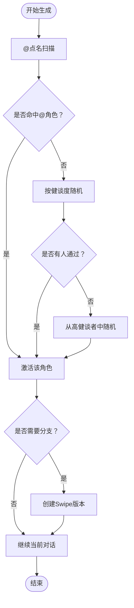

图表来源
- [src/lib/group-chat/activation.ts:66-86](file://src/lib/group-chat/activation.ts#L66-L86)
- [src/hooks/useGroupGeneration.ts:31-65](file://src/hooks/useGroupGeneration.ts#L31-L65)
- [src/lib/services/group-service.ts:11-22](file://src/lib/services/group-service.ts#L11-L22)
- [src/components/chat/chat-area.tsx:790-822](file://src/components/chat/chat-area.tsx#L790-L822)

章节来源
- [src/lib/group-chat/activation.ts:66-86](file://src/lib/group-chat/activation.ts#L66-L86)
- [src/hooks/useGroupGeneration.ts:31-65](file://src/hooks/useGroupGeneration.ts#L31-L65)
- [src/lib/services/group-service.ts:11-22](file://src/lib/services/group-service.ts#L11-L22)
- [src/components/chat/chat-area.tsx:790-822](file://src/components/chat/chat-area.tsx#L790-L822)

### Persona 系统（身份切换与宏替换）
- 核心价值：在不同角色/群组间灵活切换“我方视角”，支持描述注入与深度策略。
- 使用场景：多身份叙事、角色扮演沉浸、个性化提示词注入。
- 实现原理：
  - 存储结构：Persona 表含名称、描述、头像、激活/默认标记、描述注入位置、深度与角色、关联世界书、连接关系等。
  - 解析优先级：聊天锁定 > 角色/群组绑定 > 默认 Persona，确保上下文一致性。
  - 宏替换：高级格式化引擎提供宏上下文（user/char/persona/description 等），在模板中进行替换。

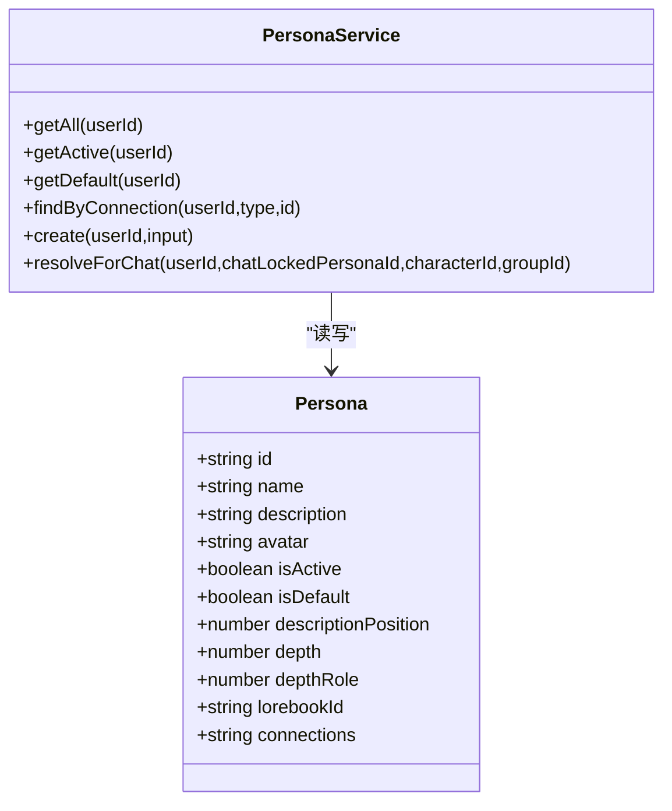

图表来源
- [src/lib/db/schema.ts:76-98](file://src/lib/db/schema.ts#L76-L98)
- [src/lib/services/persona-service.ts:106-271](file://src/lib/services/persona-service.ts#L106-L271)
- [src/lib/formatting/build-prompt.ts:12-53](file://src/lib/formatting/build-prompt.ts#L12-L53)

章节来源
- [src/lib/db/schema.ts:76-98](file://src/lib/db/schema.ts#L76-L98)
- [src/lib/services/persona-service.ts:106-271](file://src/lib/services/persona-service.ts#L106-L271)
- [src/lib/formatting/build-prompt.ts:12-53](file://src/lib/formatting/build-prompt.ts#L12-L53)

### 世界书系统（全局/角色级/聊天级三级联动，深度词条扫描）
- 核心价值：将设定、背景、触发条件与注入位置解耦，实现精准、可控、可预算的设定注入。
- 使用场景：复杂世界观构建、动态设定触发、长对话一致性维护。
- 实现原理：
  - 三级来源：全局（系统级）、角色（character_book/关联 lorebook）、聊天（会话专属）。
  - 引擎：收集词条 → 选择逻辑判定 → 递归扫描（preventRecursion/excludeRecursion/delayUntilRecursion）→ Token 预算估算 → 位置分桶（0-7）。
  - 设置项：扫描深度、最小激活数、分组评分、包含角色名、溢出告警等。

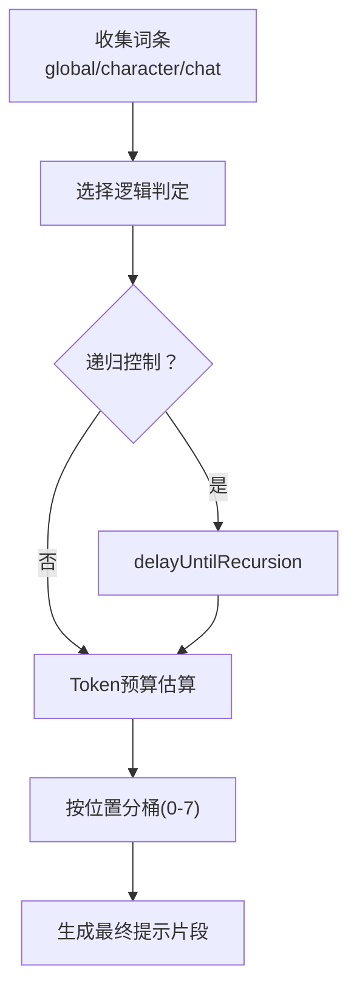

图表来源
- [src/lib/worldinfo/engine.ts:174-185](file://src/lib/worldinfo/engine.ts#L174-L185)
- [src/components/world-info/world-info-settings.tsx:17-115](file://src/components/world-info/world-info-settings.tsx#L17-L115)
- [src/types/index.ts:368-416](file://src/types/index.ts#L368-L416)

章节来源
- [src/lib/worldinfo/engine.ts:1-185](file://src/lib/worldinfo/engine.ts#L1-L185)
- [src/components/world-info/world-info-settings.tsx:17-115](file://src/components/world-info/world-info-settings.tsx#L17-L115)
- [src/types/index.ts:368-416](file://src/types/index.ts#L368-L416)

### 高级格式化（Context/Instruct/SysPrompt/Reasoning 模板可视化编辑）
- 核心价值：将复杂的提示词模板结构化、可视化，降低配置门槛，提升可维护性。
- 使用场景：角色提示词定制、系统提示词模板、推理链模板、全局格式化策略。
- 实现原理：
  - 宏替换：支持 {{user}}/{{char}} 等宏，以及运行时动态宏（lastMessage/lastUserMessage 等）。
  - 模板分区：上下文、指令、系统提示、推理等分区，配合全局格式化开关（如折叠换行、去除多余空格）。
  - 与 AI 引擎集成：在生成前将宏与模板组合为最终提示词。

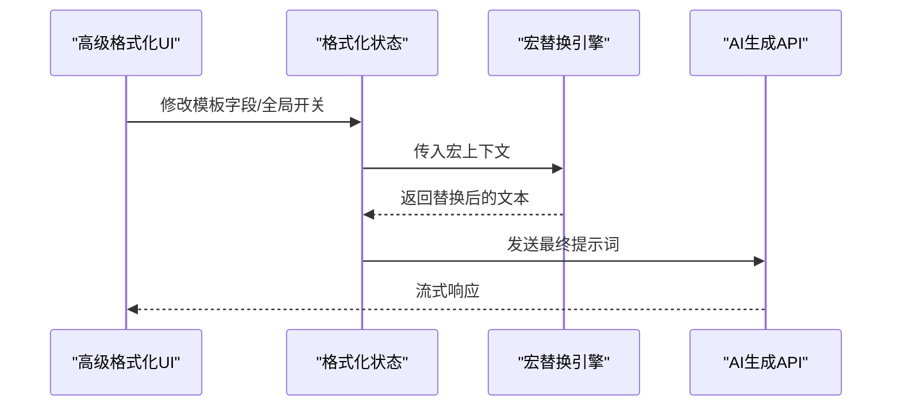

图表来源
- [src/components/advanced-formatting/context-column.tsx:1-59](file://src/components/advanced-formatting/context-column.tsx#L1-L59)
- [src/components/advanced-formatting/misc-column.tsx:1-63](file://src/components/advanced-formatting/misc-column.tsx#L1-L63)
- [src/lib/formatting/build-prompt.ts:12-53](file://src/lib/formatting/build-prompt.ts#L12-L53)
- [src/app/api/chat/route.ts:1-18](file://src/app/api/chat/route.ts#L1-L18)

章节来源
- [src/components/advanced-formatting/context-column.tsx:1-59](file://src/components/advanced-formatting/context-column.tsx#L1-L59)
- [src/components/advanced-formatting/misc-column.tsx:1-63](file://src/components/advanced-formatting/misc-column.tsx#L1-L63)
- [src/lib/formatting/build-prompt.ts:12-53](file://src/lib/formatting/build-prompt.ts#L12-L53)
- [src/app/api/chat/route.ts:1-18](file://src/app/api/chat/route.ts#L1-L18)

### 多 AI 提供商支持（OpenAI、Anthropic、Google、OpenRouter、本地 Ollama 等 35+）
- 核心价值：统一适配器屏蔽差异，支持云端与本地模型，简化切换与运维。
- 使用场景：多模型对比、成本优化、隐私模型部署、边缘计算。
- 实现原理：
  - 适配器：根据提供商选择对应 SDK，统一返回 LanguageModel；OpenAI 兼容提供商通过 baseURL 映射。
  - 模型发现：部分提供商（如 Google、Ollama）通过远程接口拉取可用模型列表。
  - 测试连通性：提供测试消息接口，验证密钥与网关连通性。
  - 类型与默认模型：统一 AIProvider 类型与 DEFAULT_MODELS 映射。

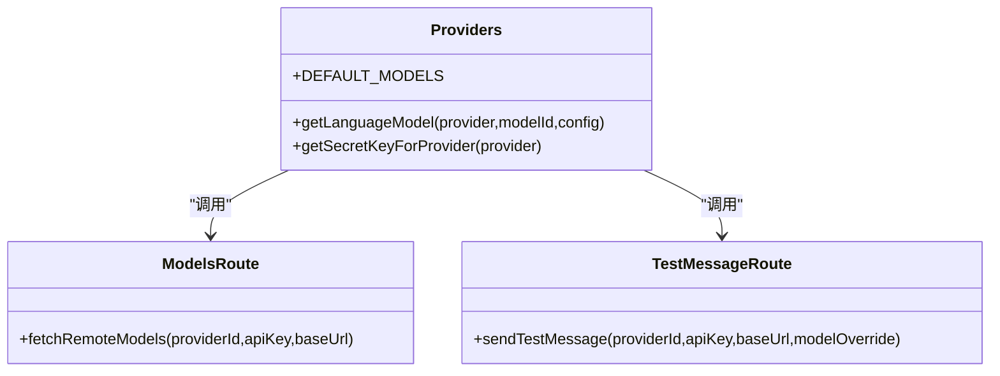

图表来源
- [src/lib/ai/providers.ts:55-97](file://src/lib/ai/providers.ts#L55-L97)
- [src/app/api/connections/models/route.ts:65-101](file://src/app/api/connections/models/route.ts#L65-L101)
- [src/app/api/connections/test-message/route.ts:56-90](file://src/app/api/connections/test-message/route.ts#L56-L90)
- [src/types/index.ts:1-55](file://src/types/index.ts#L1-L55)

章节来源
- [src/lib/ai/providers.ts:1-174](file://src/lib/ai/providers.ts#L1-L174)
- [src/app/api/connections/models/route.ts:65-101](file://src/app/api/connections/models/route.ts#L65-L101)
- [src/app/api/connections/test-message/route.ts:56-90](file://src/app/api/connections/test-message/route.ts#L56-L90)
- [src/types/index.ts:1-55](file://src/types/index.ts#L1-L55)

### Author's Note 功能（作者注释自动注入提示词）
- 核心价值：在不破坏角色设定的前提下，临时或持续地注入作者意图，增强可控性。
- 使用场景：剧情引导、规则补充、调试与测试。
- 实现原理：
  - UI：聊天区域顶部提供输入框，支持本地编辑与 PATCH 接口持久化。
  - 集成：在生成前将 note_prompt 注入到提示词中，与世界书、Persona 等共同作用。

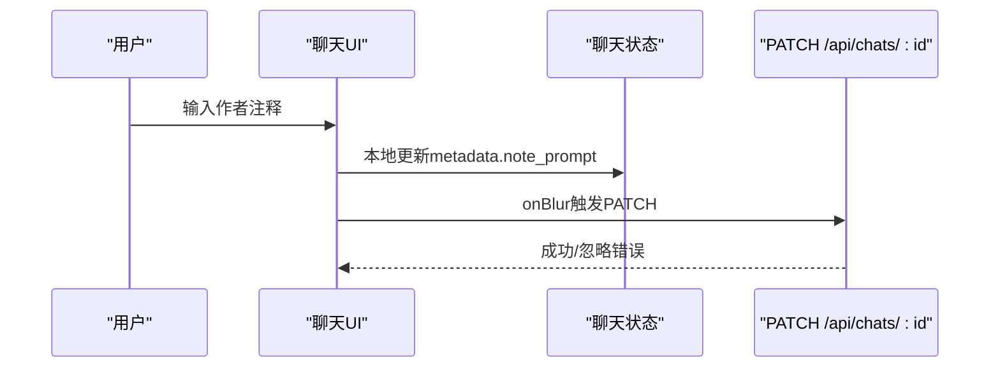

图表来源
- [src/components/chat/chat-area.tsx:1167-1201](file://src/components/chat/chat-area.tsx#L1167-L1201)
- [src/app/api/chats/[id]/route.ts](file://src/app/api/chats/[id]/route.ts#L1-L200)

章节来源
- [src/components/chat/chat-area.tsx:1167-1201](file://src/components/chat/chat-area.tsx#L1167-L1201)

### 数据自治（SQLite 单文件存储）
- 核心价值：无需外部依赖，便于备份、迁移与离线部署。
- 使用场景：个人使用、私有化部署、容器化与 CI/CD。
- 实现原理：
  - Drizzle ORM + better-sqlite3，迁移文件位于 drizzle/，启动时自动备份与迁移。
  - WAL 模式下同时备份 -wal 与 -shm 文件，保留最近 5 份自动备份。

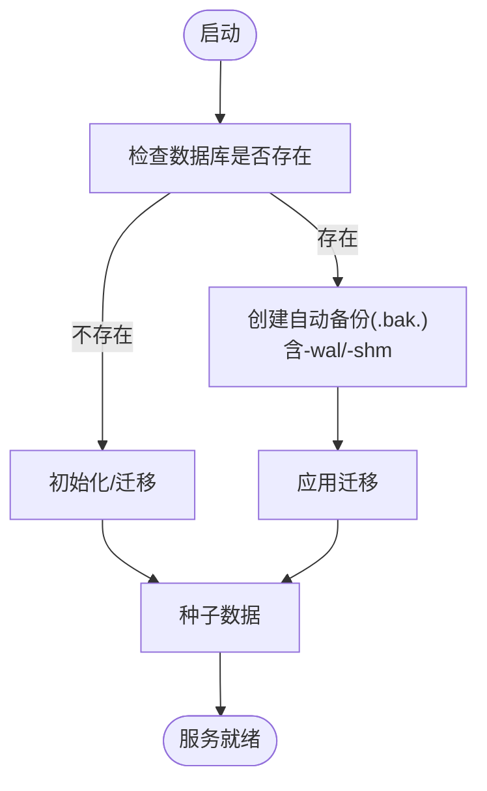

图表来源
- [scripts/start.ts:24-53](file://scripts/start.ts#L24-L53)
- [src/lib/db/schema.ts:18-46](file://src/lib/db/schema.ts#L18-L46)

章节来源
- [scripts/start.ts:24-53](file://scripts/start.ts#L24-L53)
- [src/lib/db/schema.ts:18-46](file://src/lib/db/schema.ts#L18-L46)

## 依赖分析
- 外部依赖：Next.js 16、React 19、TypeScript 5、Tailwind CSS 4、Zustand 5、better-sqlite3、Drizzle ORM、NextAuth v5、Vercel AI SDK。
- AI SDK：@ai-sdk/* 提供商包与 ai SDK 统一流式生成接口。
- 配置与校验：Zod schema 校验 config.yaml，支持环境变量覆盖。
- 认证：NextAuth 中间件保护受控路由，公开路径白名单。

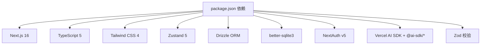

图表来源
- [package.json:18-46](file://package.json#L18-L46)
- [src/lib/config.ts:88-117](file://src/lib/config.ts#L88-L117)
- [src/middleware.ts:8-30](file://src/middleware.ts#L8-L30)

章节来源
- [package.json:18-46](file://package.json#L18-L46)
- [src/lib/config.ts:88-117](file://src/lib/config.ts#L88-L117)
- [src/middleware.ts:8-30](file://src/middleware.ts#L8-L30)

## 性能考量
- 世界书扫描深度与最小激活数直接影响 Token 预算与生成速度，建议在 4-10 之间权衡。
- 全局格式化选项（折叠换行、去除空格）可减少冗余字符，间接降低 token 消耗。
- 群聊分支与整批重生会增加消息数量与生成次数，注意控制分支层级与并发。
- SQLite WAL 模式提升并发写入性能，结合自动备份策略保障数据安全。

## 故障排查指南
- 认证问题：确认 NextAuth 配置与中间件生效，未登录将被重定向至登录页。
- 配置问题：检查 config.yaml 与环境变量覆盖，Zod 校验失败将回退默认值。
- 数据库问题：启动前自动备份，迁移失败可按日志提示回滚到最近备份。
- AI 连接问题：使用“测试消息”接口验证提供商 URL、密钥与网络连通性。
- 群聊分支异常：检查激活策略与 @ 点名大小写与角色名匹配情况。

章节来源
- [src/middleware.ts:8-30](file://src/middleware.ts#L8-L30)
- [src/lib/config.ts:88-117](file://src/lib/config.ts#L88-L117)
- [scripts/start.ts:24-53](file://scripts/start.ts#L24-L53)
- [src/app/api/connections/test-message/route.ts:56-90](file://src/app/api/connections/test-message/route.ts#L56-L90)

## 结论
SillyTavern Next 通过模块化设计与统一适配器，将角色卡、群聊、Persona、世界书、高级格式化、多提供商与数据自治整合为一套可移植、可扩展且易于维护的平台。其核心价值在于：在保证生态兼容的同时，提供更直观的可视化编辑与更强的可控性，满足从个人到私有化部署的多样化需求。