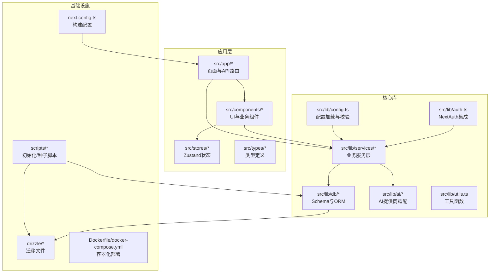
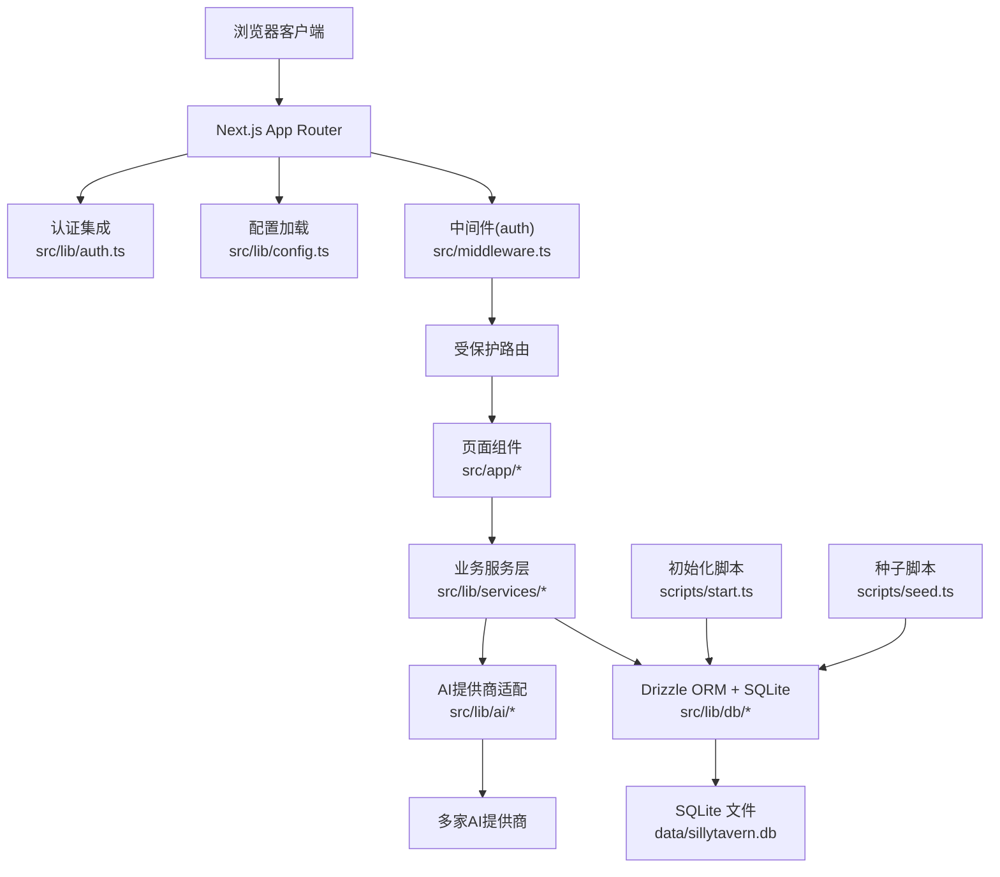
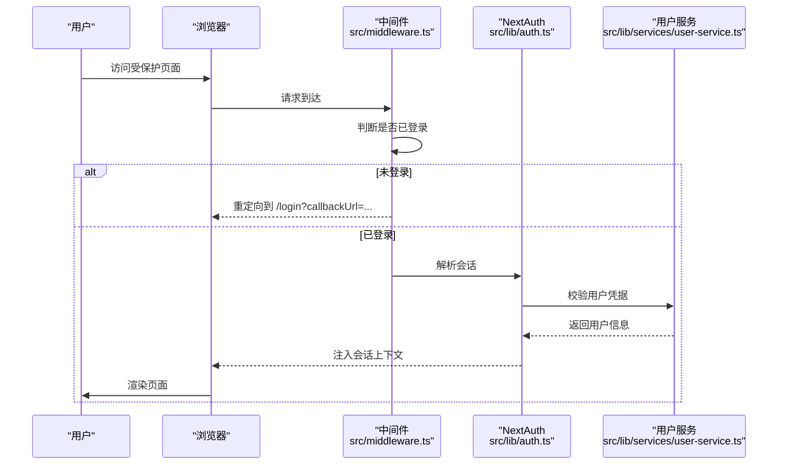
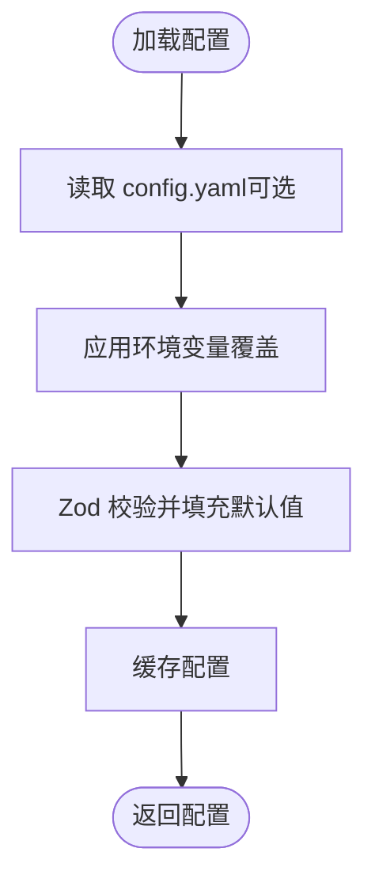
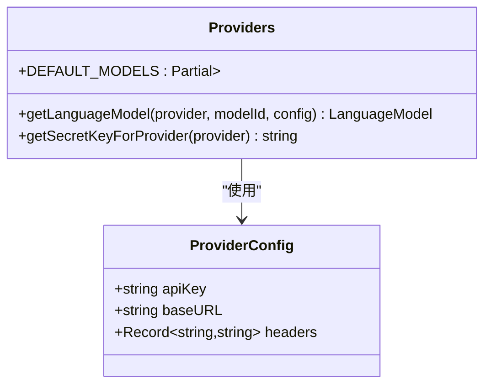
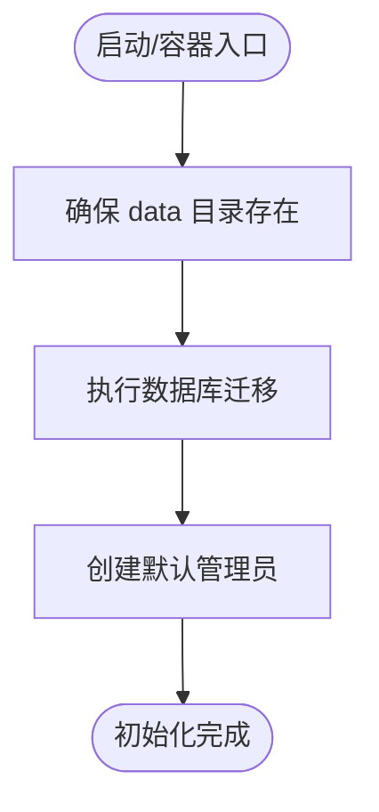

# 项目介绍

<cite>
**本文引用的文件**
- [README.md](file://README.md)
- [package.json](file://package.json)
- [src/lib/config.ts](file://src/lib/config.ts)
- [src/app/layout.tsx](file://src/app/layout.tsx)
- [drizzle.config.ts](file://drizzle.config.ts)
- [src/lib/db/schema.ts](file://src/lib/db/schema.ts)
- [src/lib/auth.ts](file://src/lib/auth.ts)
- [src/middleware.ts](file://src/middleware.ts)
- [scripts/start.ts](file://scripts/start.ts)
- [scripts/seed.ts](file://scripts/seed.ts)
- [src/lib/services/user-service.ts](file://src/lib/services/user-service.ts)
- [src/lib/ai/providers.ts](file://src/lib/ai/providers.ts)
- [next.config.ts](file://next.config.ts)
</cite>

## 目录
1. [引言](#引言)
2. [项目结构](#项目结构)
3. [核心组件](#核心组件)
4. [架构总览](#架构总览)
5. [详细组件分析](#详细组件分析)
6. [依赖关系分析](#依赖关系分析)
7. [性能考量](#性能考量)
8. [故障排查指南](#故障排查指南)
9. [结论](#结论)
10. [附录](#附录)

## 引言
SillyTavern Next 是一个基于现代 Web 技术栈重写的 AI 角色扮演游戏前端应用，目标是“单机部署、开箱即用”。它继承了原版 SillyTavern 的核心能力（角色卡、群聊、Persona、世界书、高级格式化、多 AI 提供商等），并通过 Next.js 16 + TypeScript + SQLite 的现代化技术栈进行重构，带来更强的安全性、可维护性和易用性。

本项目的独特价值在于：
- 单机自包含：使用 SQLite 作为唯一持久化介质，无需外部数据库服务，适合个人或小规模私有部署。
- 开箱即用：提供一键初始化脚本与 Docker Compose 支持，首次启动自动完成数据库迁移与管理员账户创建。
- 多生态兼容：兼容 TavernCard V2/V3，支持 35+ AI 提供商，包括 OpenAI、Anthropic、Google、OpenRouter、Ollama 等。
- 安全与合规：内置 NextAuth 认证、Zod 校验、强随机密钥要求，配合 AGPL-3.0 协议，确保数据主权与开源合规。

## 项目结构
项目采用 Next.js App Router 的标准目录组织方式，结合 Drizzle ORM 的数据库迁移与 schema 定义，形成清晰的分层结构：
- src/app：页面与 API 路由（App Router）
- src/components：React 组件（按功能域拆分）
- src/lib：核心库（认证、数据库、AI 适配、服务层、工具）
- src/stores：全局状态（Zustand）
- src/types：共享类型定义
- drizzle：数据库迁移文件
- scripts：初始化与种子脚本
- public：静态资源
- 配置文件：next.config.ts、drizzle.config.ts、tsconfig.json、eslint 配置等



图表来源
- [src/app/layout.tsx:1-24](file://src/app/layout.tsx#L1-L24)
- [src/lib/auth.ts:1-59](file://src/lib/auth.ts#L1-L59)
- [src/lib/config.ts:1-184](file://src/lib/config.ts#L1-L184)
- [src/lib/db/schema.ts:1-240](file://src/lib/db/schema.ts#L1-L240)
- [src/lib/ai/providers.ts:1-174](file://src/lib/ai/providers.ts#L1-L174)
- [drizzle.config.ts:1-11](file://drizzle.config.ts#L1-L11)
- [scripts/start.ts:1-43](file://scripts/start.ts#L1-L43)
- [scripts/seed.ts:1-28](file://scripts/seed.ts#L1-L28)
- [next.config.ts:1-14](file://next.config.ts#L1-L14)

章节来源
- [README.md:78-108](file://README.md#L78-L108)
- [package.json:1-61](file://package.json#L1-L61)

## 核心组件
- 认证与会话：基于 NextAuth v5 的凭据认证，统一在中间件中拦截受保护路由，提供 JWT 与 Session 回调。
- 配置系统：支持 YAML 配置文件与环境变量覆盖，使用 Zod 校验并缓存配置，兼容原版 SillyTavern 的键名风格。
- 数据层：Drizzle ORM + SQLite（better-sqlite3），提供完整的角色卡、群聊、消息、世界书、预设、密钥等表结构。
- AI 适配：统一的语言模型接口，支持 35+ 提供商，含 OpenAI 兼容链路与自定义 Base URL 映射。
- 初始化流程：一键迁移 + 种子数据创建管理员账户，支持容器入口与本地开发两种场景。
- 构建与部署：Next.js 16 standalone 输出，serverExternalPackages 排除 better-sqlite3，便于容器打包。

章节来源
- [src/lib/auth.ts:1-59](file://src/lib/auth.ts#L1-L59)
- [src/middleware.ts:1-35](file://src/middleware.ts#L1-L35)
- [src/lib/config.ts:1-184](file://src/lib/config.ts#L1-L184)
- [src/lib/db/schema.ts:1-240](file://src/lib/db/schema.ts#L1-L240)
- [src/lib/ai/providers.ts:1-174](file://src/lib/ai/providers.ts#L1-L174)
- [scripts/start.ts:1-43](file://scripts/start.ts#L1-L43)
- [scripts/seed.ts:1-28](file://scripts/seed.ts#L1-L28)
- [next.config.ts:1-14](file://next.config.ts#L1-L14)

## 架构总览
下面的架构图展示了从浏览器请求到数据库与 AI 提供商的关键交互路径，体现“单机部署、开箱即用”的设计取舍与优势。



图表来源
- [src/middleware.ts:1-35](file://src/middleware.ts#L1-L35)
- [src/lib/services/user-service.ts:1-170](file://src/lib/services/user-service.ts#L1-L170)
- [src/lib/db/schema.ts:1-240](file://src/lib/db/schema.ts#L1-L240)
- [src/lib/ai/providers.ts:1-174](file://src/lib/ai/providers.ts#L1-L174)
- [scripts/start.ts:1-43](file://scripts/start.ts#L1-L43)
- [scripts/seed.ts:1-28](file://scripts/seed.ts#L1-L28)
- [src/lib/config.ts:1-184](file://src/lib/config.ts#L1-L184)
- [src/lib/auth.ts:1-59](file://src/lib/auth.ts#L1-L59)

## 详细组件分析

### 认证与会话（NextAuth + 中间件）
- 凭据认证：通过 Credentials Provider 实现用户名/密码登录，结合 Zod 校验输入，调用用户服务进行认证。
- 会话回调：将用户信息写入 JWT 与 Session，保证页面与 API 能获取当前用户上下文。
- 中间件拦截：对非公开路径进行登录态校验，未登录自动跳转至登录页并携带 callbackUrl。



图表来源
- [src/middleware.ts:1-35](file://src/middleware.ts#L1-L35)
- [src/lib/auth.ts:1-59](file://src/lib/auth.ts#L1-L59)
- [src/lib/services/user-service.ts:1-170](file://src/lib/services/user-service.ts#L1-L170)

章节来源
- [src/lib/auth.ts:1-59](file://src/lib/auth.ts#L1-L59)
- [src/middleware.ts:1-35](file://src/middleware.ts#L1-L35)
- [src/lib/services/user-service.ts:1-170](file://src/lib/services/user-service.ts#L1-L170)

### 配置系统（YAML + 环境变量）
- 支持 config.yaml 与环境变量混合配置，键名与原版 SillyTavern 兼容。
- 使用 Zod 对配置进行严格校验与默认值填充，提供 keyToEnv、getConfigValue 等工具方法。
- 支持嵌套对象扁平化与 JSON 值解析，便于复杂配置的灵活覆盖。



图表来源
- [src/lib/config.ts:1-184](file://src/lib/config.ts#L1-L184)

章节来源
- [src/lib/config.ts:1-184](file://src/lib/config.ts#L1-L184)

### 数据层（Drizzle ORM + SQLite）
- schema 定义覆盖用户、角色卡、标签、Persona、群组、聊天、消息、世界书、预设、密钥、设置、模板等表。
- 使用 better-sqlite3 与 Drizzle ORM，迁移文件位于 drizzle 目录，数据库文件默认在 data/sillytavern.db。
- 通过外键与 JSON 字段实现复杂关系与扩展属性，兼顾兼容性与灵活性。

```mermaid
erDiagram
USERS {
text id PK
text name
text handle UK
text password
text salt
text avatar
boolean admin
boolean enabled
int created_at
}
CHARACTERS {
text id PK
text user_id FK
text name
text description
text alternate_greetings
text tags
text extensions
text character_book
text world_info_book_id
int created_at
int updated_at
}
PERSONAS {
text id PK
text user_id FK
text name
text avatar
boolean is_active
boolean is_default
int description_position
int depth
int depth_role
text connections
int created_at
}
GROUPS {
text id PK
text user_id FK
text name
text members
text disabled_members
boolean fav
int activation_strategy
int generation_mode
boolean allow_self_responses
text generation_mode_join_prefix
text generation_mode_join_suffix
int auto_mode_delay
boolean hide_muted_sprites
int date_last_chat
text chat_metadata
int created_at
int updated_at
}
CHATS {
text id PK
text user_id FK
text character_id FK
text group_id FK
text title
text metadata
int created_at
int updated_at
}
MESSAGES {
text id PK
text chat_id FK
text name
boolean is_user
text content
text role
text swipes
int swipe_id
text swipe_info
boolean is_system
text force_avatar
text original_avatar
text gen_started
text gen_finished
text bookmark_link
text extra
text send_date
int created_at
}
WORLD_INFO {
text id PK
text user_id FK
text name
text entries
int created_at
int updated_at
}
PRESETS {
text id PK
text user_id FK
text name
text provider
text api_type
text settings
boolean is_default
boolean is_active
int created_at
int updated_at
}
SECRETS {
text id PK
text user_id FK
text key
text value
int created_at
}
SETTINGS {
text id PK
text user_id FK UK
text data
int updated_at
}
TAGS {
text id PK
text user_id FK
text name
text color
text color2
int created_at
}
CHARACTER_TAGS {
text id PK
text character_id FK
text tag_id FK
}
INSTRUCT_TEMPLATES {
text id PK
text user_id FK
text name
text content
int created_at
}
CONTEXT_TEMPLATES {
text id PK
text user_id FK
text name
text content
int created_at
}
USERS ||--o{ CHARACTERS : "拥有"
USERS ||--o{ PERSONAS : "拥有"
USERS ||--o{ GROUPS : "拥有"
USERS ||--o{ CHATS : "拥有"
USERS ||--o{ TAGS : "拥有"
USERS ||--o{ SECRETS : "拥有"
USERS ||--o{ SETTINGS : "拥有"
USERS ||--o{ INSTRUCT_TEMPLATES : "拥有"
USERS ||--o{ CONTEXT_TEMPLATES : "拥有"
CHARACTERS ||--o{ CHARACTER_TAGS : "关联"
TAGS ||--|| CHARACTER_TAGS : "关联"
CHARACTERS ||--o{ CHATS : "被聊天"
GROUPS ||--o{ CHATS : "被聊天"
CHATS ||--o{ MESSAGES : "包含"
```

图表来源
- [src/lib/db/schema.ts:1-240](file://src/lib/db/schema.ts#L1-L240)

章节来源
- [src/lib/db/schema.ts:1-240](file://src/lib/db/schema.ts#L1-L240)
- [drizzle.config.ts:1-11](file://drizzle.config.ts#L1-L11)

### AI 提供商适配（统一接口）
- 统一语言模型接口，支持 OpenAI、Anthropic、Google、OpenRouter、Ollama 等 35+ 提供商。
- 提供 Base URL 映射与自定义 Headers，兼容多种 OpenAI 兼容服务。
- 提供默认模型映射与密钥名称映射，便于快速接入与配置。



图表来源
- [src/lib/ai/providers.ts:1-174](file://src/lib/ai/providers.ts#L1-L174)

章节来源
- [src/lib/ai/providers.ts:1-174](file://src/lib/ai/providers.ts#L1-L174)

### 初始化与种子（一键部署）
- start.ts：确保 data 目录存在，执行数据库迁移，再创建默认管理员账户。
- seed.ts：幂等创建管理员（handle=admin/password=admin），使用 scrypt 哈希与随机盐。
- next.config.ts：配置 standalone 输出与 serverExternalPackages，便于容器打包。



图表来源
- [scripts/start.ts:1-43](file://scripts/start.ts#L1-L43)
- [scripts/seed.ts:1-28](file://scripts/seed.ts#L1-L28)
- [next.config.ts:1-14](file://next.config.ts#L1-L14)

章节来源
- [scripts/start.ts:1-43](file://scripts/start.ts#L1-L43)
- [scripts/seed.ts:1-28](file://scripts/seed.ts#L1-L28)
- [next.config.ts:1-14](file://next.config.ts#L1-L14)

## 依赖关系分析
- 框架与语言：Next.js 16 + React 19 + TypeScript 5
- 样式与状态：Tailwind CSS 4 + Zustand 5
- 数据库：SQLite + better-sqlite3 + Drizzle ORM
- 认证：NextAuth v5（Credentials Provider）
- AI SDK：Vercel AI SDK + 多 Provider 适配
- 校验：Zod 4
- 构建：ESLint + TypeScript + PostCSS + Tailwind

章节来源
- [README.md:110-122](file://README.md#L110-L122)
- [package.json:1-61](file://package.json#L1-L61)

## 性能考量
- 单机部署优势：SQLite 本地文件 IO，避免网络延迟；容器化部署减少外部依赖。
- 构建优化：Next.js 16 standalone 输出，serverExternalPackages 排除 better-sqlite3，减小镜像体积。
- 数据访问：Drizzle ORM 提供类型安全与高效查询，合理使用索引与 JSON 字段可提升检索效率。
- AI 调用：统一语言模型接口，按需选择模型与提供商，避免不必要的网络往返。

## 故障排查指南
- 登录失败
  - 检查用户名/密码是否正确，确认用户已被启用。
  - 查看中间件是否正确拦截并重定向到登录页。
- 数据库迁移失败
  - 确认 data 目录权限与可写性。
  - 检查 DATABASE_URL 环境变量是否指向正确的 SQLite 文件路径。
- 初始化脚本异常
  - start.ts 会在迁移失败时继续执行种子脚本，若失败请查看控制台输出。
  - 确保已生成强随机 AUTH_SECRET，并在 .env 或 .env.local 中正确配置。
- 生产部署问题
  - 不要在 Vercel/Netlify 等 Serverless 平台部署，需长期运行容器。
  - 数据卷必须挂载 ./data:/app/data，确保 SQLite 文件持久化。
  - 建议前置 Nginx/Caddy 提供 HTTPS 与反向代理。

章节来源
- [src/middleware.ts:1-35](file://src/middleware.ts#L1-L35)
- [scripts/start.ts:1-43](file://scripts/start.ts#L1-L43)
- [README.md:150-156](file://README.md#L150-L156)

## 结论
SillyTavern Next 通过“Next.js 16 + TypeScript + SQLite”的技术组合，在保持原版功能与生态兼容的同时，显著提升了安全性、可维护性与部署体验。其“单机部署、开箱即用”的设计，使其成为个人或小团队私有化部署 AI 角色扮演游戏的理想选择。对于初学者而言，项目提供了清晰的目录结构、完善的初始化流程与详尽的文档，能够快速上手并扩展功能。

## 附录
- 快速开始（Docker/本地开发）与常用命令详见 README。
- 环境变量与部署注意事项详见 README。
- 贡献指南与许可证详见 README。

章节来源
- [README.md:20-78](file://README.md#L20-L78)
- [README.md:150-178](file://README.md#L150-L178)