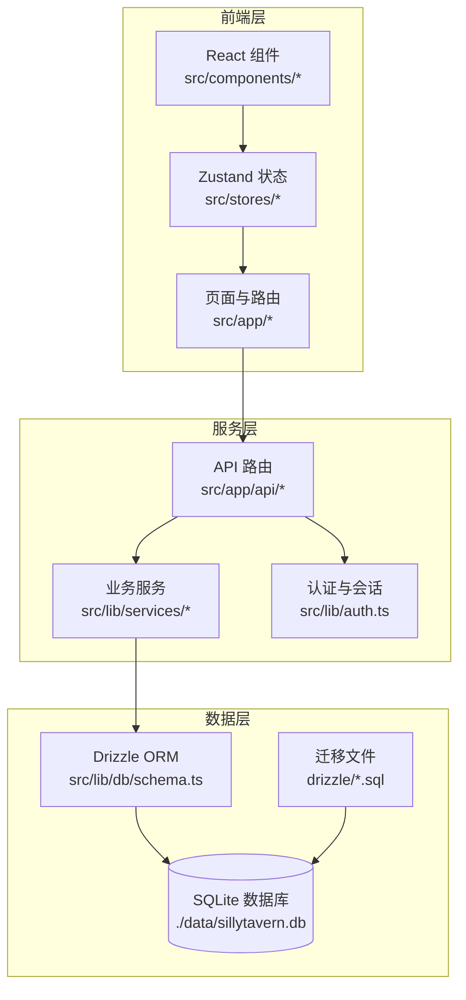
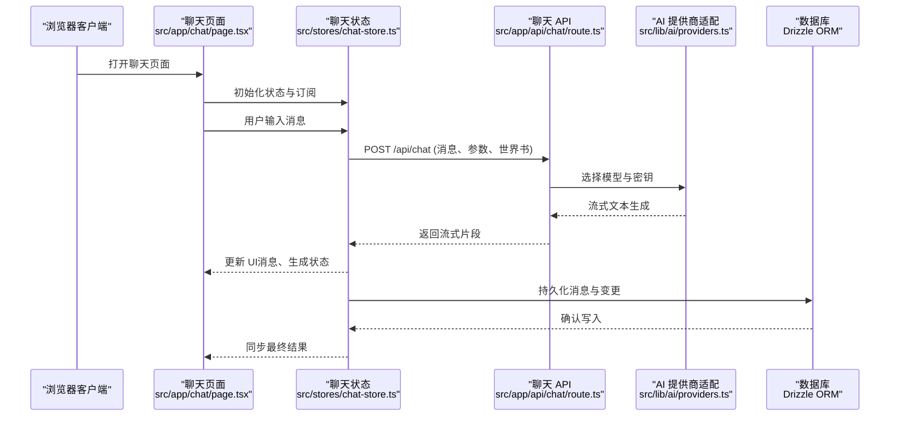
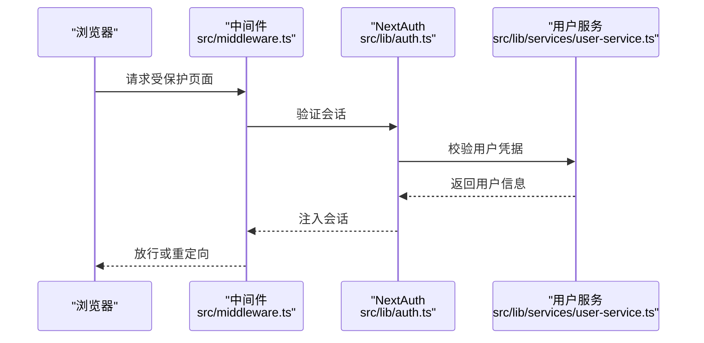
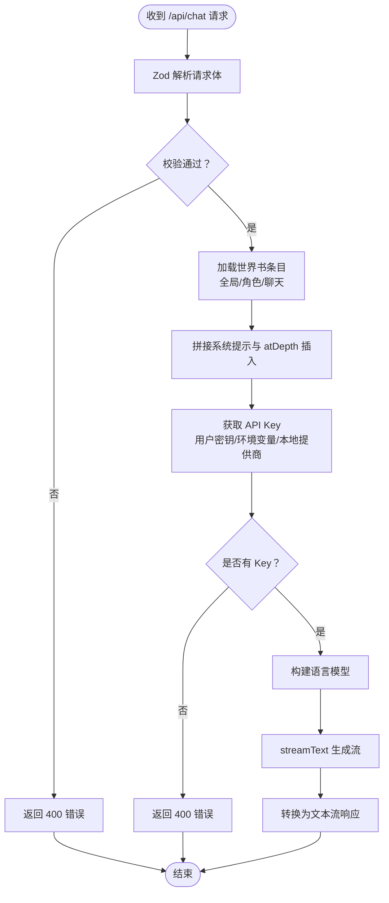
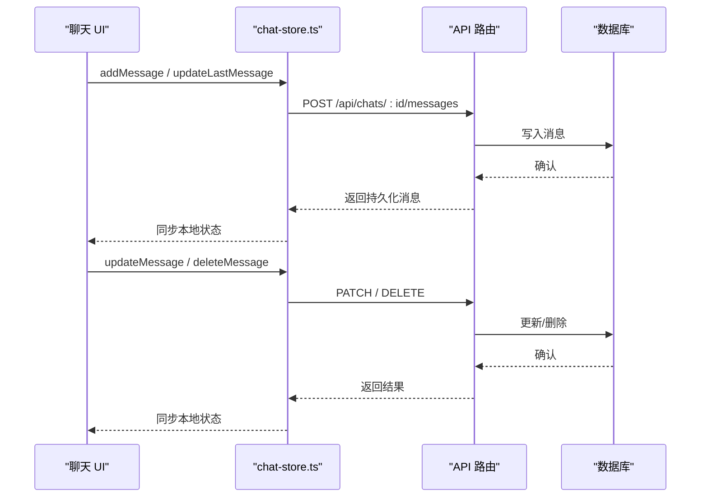
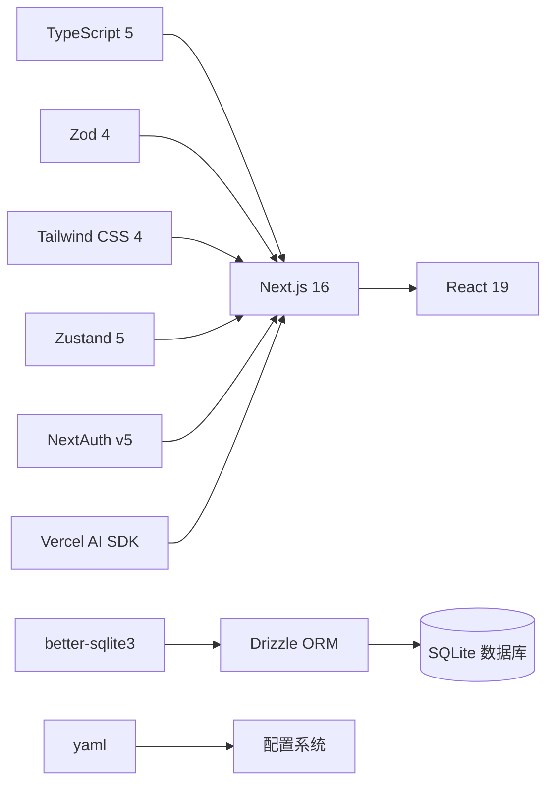

# 项目概述

<cite>
**本文档引用的文件**
- [README.md](file://README.md)
- [package.json](file://package.json)
- [CONTRIBUTING.md](file://CONTRIBUTING.md)
- [src/lib/config.ts](file://src/lib/config.ts)
- [src/app/layout.tsx](file://src/app/layout.tsx)
- [src/lib/auth.ts](file://src/lib/auth.ts)
- [src/lib/db/schema.ts](file://src/lib/db/schema.ts)
- [src/middleware.ts](file://src/middleware.ts)
- [next.config.ts](file://next.config.ts)
- [drizzle.config.ts](file://drizzle.config.ts)
- [src/app/api/chat/route.ts](file://src/app/api/chat/route.ts)
- [src/lib/services/user-service.ts](file://src/lib/services/user-service.ts)
- [src/stores/chat-store.ts](file://src/stores/chat-store.ts)
- [Dockerfile](file://Dockerfile)
</cite>

## 目录
1. [简介](#简介)
2. [项目结构](#项目结构)
3. [核心组件](#核心组件)
4. [架构总览](#架构总览)
5. [详细组件分析](#详细组件分析)
6. [依赖关系分析](#依赖关系分析)
7. [性能考量](#性能考量)
8. [故障排查指南](#故障排查指南)
9. [结论](#结论)
10. [附录](#附录)

## 简介
SillyTavern Next 是一款基于 **Next.js 16 + TypeScript + SQLite** 重构的现代化前端应用，目标是实现单机部署、开箱即用的 AI 角色扮演聊天体验。它兼容原版 SillyTavern 的核心能力，包括角色卡（TavernCard V2/V3）、群聊轮换、Persona 身份切换、世界书联动、高级格式化模板、多 AI 提供商接入（OpenAI、Anthropic、Google、OpenRouter、本地 Ollama 等 35+）、作者注释注入、以及数据自治（SQLite 单文件存储）。项目提供 Docker 一键部署与本地开发两种方式，配合 Drizzle ORM 与 Zod 校验，确保配置与数据的一致性与安全性。

## 项目结构
项目采用 Next.js App Router 的目录组织方式，核心结构如下：
- src/app：页面与 API 路由（App Router）
- src/components：React 组件（按功能模块划分）
- src/hooks：自定义 Hook
- src/lib：核心库（AI 适配、认证、数据库 schema/migration、格式化引擎、服务层、世界书引擎等）
- src/stores：Zustand 全局状态
- src/types：共享 TypeScript 类型
- drizzle：数据库迁移文件
- scripts：工具脚本（seed、setup）
- public：静态资源
- docker-compose.yml、Dockerfile：容器化部署



图表来源
- [src/app/layout.tsx:1-24](file://src/app/layout.tsx#L1-L24)
- [src/lib/db/schema.ts:1-240](file://src/lib/db/schema.ts#L1-L240)
- [src/middleware.ts:1-35](file://src/middleware.ts#L1-L35)
- [drizzle.config.ts:1-11](file://drizzle.config.ts#L1-L11)

章节来源
- [README.md:78-108](file://README.md#L78-L108)
- [package.json:1-61](file://package.json#L1-L61)

## 核心组件
- 认证与会话：基于 NextAuth v5 的凭据认证，支持管理员与普通用户，会话通过 JWT 传递用户信息。
- 数据模型：使用 Drizzle ORM 定义用户、角色卡、标签、Persona、群组、聊天、消息、世界书、预设、密钥、设置、模板等表，完全兼容原格式并扩展。
- API 路由：统一的聊天接口，支持多提供商流式输出、世界书注入、自定义 API 配置、密钥管理与回退策略。
- 全局状态：Zustand 管理聊天上下文、消息列表、生成状态、分支与书签等交互逻辑。
- 配置系统：支持 YAML 配置文件与环境变量覆盖，Zod 校验与默认值填充，便于生产部署。
- 部署与迁移：Docker 多阶段构建，Standalone 输出，Drizzle CLI 管理迁移与种子数据。

章节来源
- [src/lib/auth.ts:1-59](file://src/lib/auth.ts#L1-L59)
- [src/lib/db/schema.ts:1-240](file://src/lib/db/schema.ts#L1-L240)
- [src/app/api/chat/route.ts:1-177](file://src/app/api/chat/route.ts#L1-L177)
- [src/stores/chat-store.ts:1-583](file://src/stores/chat-store.ts#L1-L583)
- [src/lib/config.ts:1-184](file://src/lib/config.ts#L1-L184)
- [Dockerfile:1-63](file://Dockerfile#L1-L63)

## 架构总览
整体架构围绕“前端页面 + API 路由 + 业务服务 + 数据库”的分层设计展开，采用流式响应与状态驱动的交互模式，确保生成过程的实时性与可追溯性。



图表来源
- [src/app/api/chat/route.ts:50-177](file://src/app/api/chat/route.ts#L50-L177)
- [src/stores/chat-store.ts:168-210](file://src/stores/chat-store.ts#L168-L210)
- [src/lib/db/schema.ts:145-168](file://src/lib/db/schema.ts#L145-L168)

## 详细组件分析

### 认证与会话（NextAuth v5）
- 凭据认证：用户名与密码校验，结合 Zod 输入校验与数据库用户查询。
- 令牌与会话：JWT 中携带用户标识、句柄与管理员标记；Session 中透传至前端。
- 中间件保护：全局中间件拦截未登录访问，重定向至登录页并保留回调地址。



图表来源
- [src/middleware.ts:8-30](file://src/middleware.ts#L8-L30)
- [src/lib/auth.ts:12-59](file://src/lib/auth.ts#L12-L59)
- [src/lib/services/user-service.ts:64-69](file://src/lib/services/user-service.ts#L64-L69)

章节来源
- [src/lib/auth.ts:1-59](file://src/lib/auth.ts#L1-L59)
- [src/middleware.ts:1-35](file://src/middleware.ts#L1-L35)
- [src/lib/services/user-service.ts:1-170](file://src/lib/services/user-service.ts#L1-L170)

### 数据模型与迁移（Drizzle ORM + SQLite）
- 表结构覆盖用户、角色卡、标签、Persona、群组、聊天、消息、世界书、预设、密钥、设置、模板等，字段与原格式兼容并扩展。
- 迁移管理：通过 Drizzle Kit 生成与应用迁移，数据库 URL 可通过环境变量配置。
- 数据自治：SQLite 单文件存储，便于备份与迁移，适合单机部署。

```mermaid
erDiagram
USERS {
text id PK
text name
text handle UK
text password
text salt
text avatar
boolean admin
boolean enabled
int created_at
}
CHARACTERS {
text id PK
text user_id FK
text name
text description
text scenario
text first_message
text system_prompt
text tags
text avatar
text extensions
text world_info_book_id
int created_at
int updated_at
}
PERSONAS {
text id PK
text user_id FK
text name
text avatar
boolean is_active
boolean is_default
int description_position
int depth
int depth_role
text lorebook_id
text connections
int created_at
}
GROUPS {
text id PK
text user_id FK
text name
text members
text disabled_members
text avatar
boolean fav
int activation_strategy
int generation_mode
boolean allow_self_responses
text generation_mode_join_prefix
text generation_mode_join_suffix
int auto_mode_delay
boolean hide_muted_sprites
int date_last_chat
text chat_metadata
int created_at
int updated_at
}
CHATS {
text id PK
text user_id FK
text character_id FK
text group_id FK
text title
text metadata
int created_at
int updated_at
}
MESSAGES {
text id PK
text chat_id FK
text name
boolean is_user
text content
text role
text swipes
int swipe_id
text swipe_info
boolean is_system
text force_avatar
text original_avatar
text gen_started
text gen_finished
text bookmark_link
text extra
text send_date
int created_at
}
WORLD_INFO {
text id PK
text user_id FK
text name
text entries
int created_at
int updated_at
}
PRESETS {
text id PK
text user_id FK
text name
text provider
text api_type
text settings
boolean is_default
boolean is_active
int created_at
int updated_at
}
SECRETS {
text id PK
text user_id FK
text key
text value
int created_at
}
SETTINGS {
text id PK
text user_id FK UK
text data
int updated_at
}
TAGS {
text id PK
text user_id FK
text name
text color
text color2
int created_at
}
CHARACTER_TAGS {
text id PK
text character_id FK
text tag_id FK
}
USERS ||--o{ CHARACTERS : "拥有"
USERS ||--o{ PERSONAS : "拥有"
USERS ||--o{ GROUPS : "拥有"
USERS ||--o{ CHATS : "拥有"
USERS ||--o{ SECRETS : "拥有"
USERS ||--o{ SETTINGS : "拥有"
USERS ||--o{ TAGS : "拥有"
CHARACTERS ||--o{ CHARACTER_TAGS : "关联"
TAGS ||--|| CHARACTER_TAGS : "关联"
CHATS ||--o{ MESSAGES : "包含"
CHARACTERS ||--o{ CHATS : "被聊天关联"
GROUPS ||--o{ CHATS : "被聊天关联"
```

图表来源
- [src/lib/db/schema.ts:6-240](file://src/lib/db/schema.ts#L6-L240)

章节来源
- [src/lib/db/schema.ts:1-240](file://src/lib/db/schema.ts#L1-L240)
- [drizzle.config.ts:1-11](file://drizzle.config.ts#L1-L11)

### 聊天 API 与世界书集成
- 请求校验：Zod 对消息、提供商、模型、温度、最大 Token、停止序列、系统提示、世界书参数进行严格校验。
- 世界书注入：根据全局、角色、聊天三级世界书收集词条，拼接至系统提示前后与特定位置，支持 atDepth 插入。
- 密钥管理：优先从用户密钥表读取，其次环境变量回退，本地提供商无需密钥。
- 流式输出：基于 Vercel AI SDK streamText，返回文本流响应。



图表来源
- [src/app/api/chat/route.ts:20-48](file://src/app/api/chat/route.ts#L20-L48)
- [src/app/api/chat/route.ts:76-130](file://src/app/api/chat/route.ts#L76-L130)
- [src/app/api/chat/route.ts:133-151](file://src/app/api/chat/route.ts#L133-L151)
- [src/app/api/chat/route.ts:158-170](file://src/app/api/chat/route.ts#L158-L170)

章节来源
- [src/app/api/chat/route.ts:1-177](file://src/app/api/chat/route.ts#L1-L177)

### 全局状态与消息持久化（Zustand）
- 状态管理：聊天上下文、消息列表、生成状态、角色与群组信息、分支与书签等。
- 消息生命周期：本地乐观更新 + 服务端持久化，支持增量 PATCH、删除、移动、推理块编辑、分支与书签创建。
- 一致性保障：通过并发 PATCH 与本地回写，保证 UI 与数据库一致。



图表来源
- [src/stores/chat-store.ts:236-272](file://src/stores/chat-store.ts#L236-L272)
- [src/stores/chat-store.ts:336-351](file://src/stores/chat-store.ts#L336-L351)
- [src/stores/chat-store.ts:354-366](file://src/stores/chat-store.ts#L354-L366)

章节来源
- [src/stores/chat-store.ts:1-583](file://src/stores/chat-store.ts#L1-L583)

### 配置系统（YAML + 环境变量）
- YAML 配置：与原 SillyTavern config.yaml 兼容，支持网络、安全、用户、CORS、SSO、AI 默认设置、扩展等。
- 环境变量覆盖：keyToEnv 将点分路径转为环境变量名，applyEnvOverrides 应用覆盖。
- Zod 校验：加载配置并填充默认值，错误时回退到默认配置。

章节来源
- [src/lib/config.ts:1-184](file://src/lib/config.ts#L1-L184)

### 部署与运行时（Docker + Standalone）
- 多阶段构建：依赖安装、构建、运行时分离，使用 tini 作为 PID 1。
- Standalone 输出：Next.js 产物与最小依赖打包，配合 Drizzle CLI 与 better-sqlite3。
- 数据持久化：数据卷映射到 /app/data，容器内非 root 用户运行。
- 环境变量：DATABASE_URL、AUTH_SECRET、AUTH_URL、PORT 等。

章节来源
- [Dockerfile:1-63](file://Dockerfile#L1-L63)
- [next.config.ts:1-14](file://next.config.ts#L1-L14)
- [README.md:62-74](file://README.md#L62-L74)

## 依赖关系分析
- 框架与运行时：Next.js 16、React 19、Node.js（Docker 基于 node:20-alpine）。
- 类型与校验：TypeScript 5、Zod 4。
- UI 与样式：Tailwind CSS 4、lucide-react、KaTeX。
- 状态与工具：Zustand 5、class-variance-authority、clsx、tailwind-merge、yaml。
- 数据库：better-sqlite3、Drizzle ORM、Drizzle Kit。
- 认证：NextAuth v5（Credentials Provider）。
- AI SDK：Vercel AI SDK 与多提供商适配器。



图表来源
- [package.json:18-46](file://package.json#L18-L46)
- [src/lib/config.ts:1-184](file://src/lib/config.ts#L1-L184)

章节来源
- [package.json:1-61](file://package.json#L1-L61)

## 性能考量
- 流式响应：聊天接口采用流式文本生成，降低首字节延迟，提升交互体验。
- 本地状态与乐观更新：Zustand 管理消息与分支状态，减少不必要的网络往返。
- 数据库事务与索引：合理使用 Drizzle ORM 的事务与查询优化，避免热点表阻塞。
- 构建与运行时：Docker 多阶段构建与 Standalone 输出，减小镜像体积与启动时间。
- 依赖精简：仅在运行时保留必要依赖，避免开发依赖进入生产环境。

## 故障排查指南
- 认证失败：确认 AUTH_SECRET 是否正确设置，用户是否存在且启用；检查中间件是否正确重定向。
- API Key 问题：确认用户密钥表中是否已配置对应提供商密钥，或环境变量是否正确回退；本地提供商无需密钥。
- 数据库连接：确认 DATABASE_URL 指向正确的 SQLite 文件路径，容器内数据卷已挂载。
- CORS 与跨域：检查配置中的 CORS 设置与环境变量覆盖，确保允许来源与方法正确。
- 部署问题：确认 Docker 构建阶段完成，Standalone 输出存在，且非 root 用户具备读写权限。

章节来源
- [src/middleware.ts:1-35](file://src/middleware.ts#L1-L35)
- [src/app/api/chat/route.ts:133-151](file://src/app/api/chat/route.ts#L133-L151)
- [drizzle.config.ts:7-9](file://drizzle.config.ts#L7-L9)
- [src/lib/config.ts:25-33](file://src/lib/config.ts#L25-L33)
- [Dockerfile:51-55](file://Dockerfile#L51-L55)

## 结论
SillyTavern Next 通过现代前端技术栈与轻量数据库，实现了原版功能的现代化迁移与增强。其单机部署、开箱即用的设计降低了使用门槛，同时保持了强大的扩展性与可维护性。对于初学者，项目提供了清晰的部署与开发指引；对于有经验的开发者，完善的架构、严格的类型与校验体系、以及模块化的组件与服务，都便于进一步定制与演进。

## 附录
- 开源协议：GNU Affero General Public License v3.0（AGPL-3.0），强调通过网络提供服务也需开源。
- 社区贡献：欢迎提交 Issue 与 PR，请遵循贡献指南的工作流、分支命名与提交规范。
- 技术决策背景：采用 Next.js App Router 与 Server Actions、Zustand 状态管理、Drizzle ORM 与 SQLite，兼顾易用性与性能；Docker 化部署满足单机场景需求。

章节来源
- [README.md:162-171](file://README.md#L162-L171)
- [CONTRIBUTING.md:1-130](file://CONTRIBUTING.md#L1-L130)